## Characteristics of a BRDF ##

"The BRDF of nylon viewed in the [Disney BRDF Explorer](http://www.disneyanimation.com/technology/brdf.html)"
The cyan line represents the incoming light direction, the red peanut object is the amount of light reflected in the corresponding direction.

Almost all the informations gathered here come from the reading and interpretation of the great Siggraph 2012 talk about physically based rendering in movie and game production [^1] but I've also practically read the entire documentation about BRDFs from their first formulation by Nicodemus [^2] in 1977!

###So, what's a BRDF?###
As I see it, it's an abstract tool that helps us to describe the macroscopic behavior of a material when photons hit this material. It's a convenient black box, a huge multi-dimensional lookup table (3, 4, or sometimes even 5, 6 dimensions when including spatial variations) that somehow encodes the amount of photons bouncing off the surface in a specific (outgoing) direction when coming from another specific (incoming) direction (and potentially, from another location).

###It comes in many flavours###
A Bidrectional Reflectance Distribution Function or BRDF is only a subset of the phenomena that happen when photons hit a material but there are plenty of other kinds of B**x**DFs:

* The BRDF only deals about reflection, so we're talking about photons coming from outside the material and scattered back to the outside the material as well.
* The BTDF (Transmittance) only deals about transmission of photons coming from outside the material and scattering inside the material (i.e. refraction).

    * Note that the BRDF and BTDF only need to consider the upper or lower hemispheres of directions (which we call $\Omega$, or sometimes $\Omega_+$ and $\Omega_-$ if the distinction is required)

* The BSDF (Scattering) is the general term that encompasses both the BRDF and BTDF. This time, it considers the entire sphere of directions.

    * Anyway, the BSDF, BRDF and BTDF are generally 4-dimensional as they make the (usually correct) assumption that both the incoming and outgoing rays interact with the material at a unique and same location.
    * Also, the BSDF could be viewed as an incorrect term since it not only accounts for scattering but also for the other phenomenon happening to photons when they hit a material: absorption. This is because of absorption that the total integral of the BRDF for any outgoing direction is less than 1.

* The BSSRDF (Surface Scattering Reflectance) is a much larger model that also accounts for different locations for the incoming and outgoing rays. It thus becomes 5- or even 6-dimensional.

    * This is an expensive but really important model when dealing with translucent materials (e.g. skin, marble, wax, milk, even plastic) where light diffuses through the surface to reappear at some other place.
    * For skin rendering, it's an essential model otherwise your character will look dull and plastic, as was the case for a very long time in real-time computer graphics. Fortunately, there are many simplifications that one can use to remove 3 of the 6 original dimensions of the BSSRDF, but it's only recently that real-time methods were devised [^3].

###First, what's the color of a pixel?###
Well, a pixel encodes what the eye or a CCD sensor is sensitive to: it's called *radiance*.

Radiance is the radiant flux of photons per unit area per unit solid angle and is written as $L(x,\omega)$. Its unit is the Watt per square meter per steradian ($W.m^{-2}.sr^{-1}$).

* $x$ is the location where the radiance is evaluated, it's a *3D vector*!
* $\omega$ is the direction in which the radiance is evaluated, it's also a *3D vector* but it's normalized so it can be written as a couple of spherical coordinates $\langle \phi,\theta \rangle$.

The radiant flux of photons &ndash;or simply *flux*&ndash; is basically the amount of photons/energy per amount of time.
And since we're considering a single CCD sensor element or a single photo-receptor in the back of the eye (e.g. [cone](http://en.wikipedia.org/wiki/Cone_cell)):

* We only perceive that flux in a single location, hence the "per square meter". We need the flux flowing through an infinitesimal piece of surface (at least, the area of a rod or a cone, or the area of a single CCD sensor element).
* We only perceive that flux in a single direction, hence the "per steradian". We need the flux flowing through an infinitesimal piece of the whole sphere of directions (or at least the solid angle $d\omega$ covered by the cone or single CCD sensor element as shown in the figure below).

So the radiance is this: the amount of photons per seconds flowing along a ray of solid angle $d\omega$ and reaching a small surface $dA$. And that's what is stored in the pixels of an image.
")

A good source of radiance is one of those HDR cube maps used for Image Based Lighting (IBL): each texel of the cube map represents a piece of the photon flux reaching the point at the center of the cube map. It encodes the entire light field around an object and if you use the cube map well, your object can seamlessly integrate into the real environment where the cube map photograph was taken (thanks to our dear [Paul Debevec](http://www.pauldebevec.com/)) (ever noticed how movies before 1999 had poor CGI? And since his paper on HDR probes, it's a real orgy! :smile:).

But IBL is also very expensive: ideally, you would need to integrate *each texel of the cube map* and dot it with your normal and multiply it by some **special function** to obtain the *perceived* color of your surface in the view direction.

And guess what this special function is?

Well, yes! It's the BRDF and it's used to completely describe the behavior of radiance when it interacts with a material. Any material...

## Mathematically ##

We're going to use $\omega_i$ and $\omega_o$ to denote the incoming and outgoing directions respectively. Each of these 2 directions are encoded in spherical coordinates by a couple of angles $\langle \phi_i,\theta_i \rangle$ and $\langle \phi_o,\theta_o \rangle$.
These only represent generic directions, we don't care if it's a view direction or light direction.

For example, for radiance estimates, the outgoing direction is usually the view direction while the incoming direction is the light direction.
For importance estimates, it's the opposite.

Also note that we use vectors pointing *toward* the view or the light.

###Irradiance###
The integration of radiance arriving at a surface element $dA$, times $n.\omega_i$ yields the irradiance ($W.m^{-2}$):

$$
E_r(x) = \int_\Omega dE_i(x,\omega_i) = \int_\Omega L_i(x,\omega_i) (n.\omega_i) \, d\omega_i~~~~~~~~~\mbox{(1)}
$$

It means that by summing the radiance ($W.m^{-2}.sr^{-1}$) coming from all possible directions, we get rid of the angular component (the $sr^{-1}$
part).

Irradiance is the energy per unit surface (when leaving the surface, the irradiance is then called radiosity, I suppose you've heard of it).
It's not very useful because, as we saw earlier, what we need for our pixels is the radiance.

Intuitively, we can imagine that we need to multiply that quantity by a value that will yield back a radiance.
This mysterious value has the units of *per steradian* ($sr^{-1}$) and it's indeed the BRDF.

###First try###
So, perhaps we could include the BRDF *in front* of the irradiance integral and obtain a radiance like this:

$$
L_r(x,\omega_o) = f_r(x,\omega_o) \int_\Omega L_i(\omega_i) (n.\omega_i) \, d\omega_i
$$

Well, it *can* work for a few cases.
For example, in the case of a perfectly diffuse reflector (Lambert model) then the BRDF is a simple constant $f_r(x,\omega_o) = \frac{\rho(x)}{\pi}$ where $\rho(x)$ is called the diffuse reflectance (or diffuse albedo) of the surface. The division by $\pi$ is here to account for our "per steradian" need and to keep the BRDF from reflecting more light than came in: integration of a unit reflectance $\rho = 1$ over the hemisphere yields $\pi$.

This is okay as long as we don't want to model materials that behave in a more complex manner.
Most materials certainly don't handle incoming radiance uniformly, without accounting for the incoming direction!
They must redistribute radiance in some special and strange ways...

For example:

* Many materials have a *specular peak*: a strong reflection of photons that tend to bounce off the surface almost in the direction perfectly symmetrical to the incoming direction (your average mirror does that).
* Also, many rough materials imply a *Fresnel peak*: a strong reflection of photons that arrive at the surface with glancing angles (fabrics are a good example of Fresnel effect)

That makes us realize the BRDF actually needs to be **inside** the integral and become dependent on the incoming direction $\omega_i$ as well!

###The actual formulation###
When we inject the BRDF into the integral, we obtain a new radiance:

$$
L_r(x,\omega_o) = \int_\Omega f_r(x,\omega_o,\omega_i) L_i(\omega_i) (n.\omega_i) \, d\omega_i~~~~~~~~~\mbox{(2)}
$$

We see that $f_r(x,\omega_o,\omega_i)$ is now dependent on both $\omega_i$ and $\omega_o$ and becomes much more difficult to handle than our simple Lambertian factor from earlier.

Anyway, we now integrate radiance multiplied by the BRDF. We saw from equation (1) that integrating without multiplying by the BRDF yields the irradiance, but when integrating with the multiplication by the BRDF, we obtain radiance so it's perfectly reasonable to assume that the expression of the BRDF is:

$$
f_r(x,\omega_o,\omega_i) = \frac{dL_r(x,\omega_o)}{dE_i(x,\omega_i)}
$$
(which is simply radiance divided by irradiance)

From equation (1) we find that:

$$
dE_i(x,\omega_i) = L_i(x,\omega_i) (n.\omega_i) d\omega_i~~~~~~~~~~~~
$$
(note that we simply removed the integral signs to get this)

We can then finally rewrite the true expression of the BRDF as:

$$
f_r(x,\omega_o,\omega_i) = \frac{dL_r(x,\omega_o)}{L_i(x,\omega_i) (n.\omega_i) d\omega_i}~~~~~~~~~\mbox{(3)}
$$

The BRDF can then be seen as the infinitesimal amount of reflected radiance ($W.m^{-2}.sr^{-1}$) by the infinitesimal amount of incoming **ir**radiance ($W.m^{-2}$) and thus has the final units of $sr^{-1}$.

##Physically##
To be physically plausible, the fundamental characteristics of a real material BRDF are:

* Positivity, any $f_r(x,\omega_o,\omega_i) \ge 0$
* Reciprocity (a.k.a. Helmholtz principle), guaranteeing the BRDF returns the same value if $\omega_o$ and $\omega_i$ are reversed (i.e. view is swapped with light). It means that $f_r(x,\omega_o,\omega_i) = f_r(x,\omega_i,\omega_o)$
* Energy conservation, guaranteeing the total amount of reflected light is less or equal to the amount of incoming light. In other terms: $\forall\omega_o \int_\Omega f_r(x,\omega_o,\omega_i) (n.\omega_i) \, d\omega_i \le 1$

Although positivity and reciprocity are usually quite easy to ensure in physical or analytical BRDF models, energy conservation on the other hand is the most difficult to enforce!

!!! note
    From [^4] we know that $d\omega_i = 4 (h.\omega_o) d\omega_h$ so we can transfer the energy conservation integral into the half-vector domain:
    $\forall\omega_o \int_{\Omega_h} f_r(x,\omega_o,\omega_h) (n.\omega_h) d\omega_h \le \frac{1}{4 (h.\omega_o)}$

!!! note
    I wrote that energy conservation is difficult to enforce but many models represent a single specular highlight near the mirror direction so, instead of testing the integral of the BRDF for all $\omega_o$, it's only necessary to ensure it returns a correct value in the mirror direction, hence reducing the problem to a single integral evaluation. This usually gives us a single value that we can later use as a normalization factor.

## BRDF Models ##
Before we delve into the mysteries of materials modeling, you should get yourself familiar with a very common change in variables introduced by Szymon Rusinkiewicz [^5] in 1998.

The idea is to center the hemisphere of directions about the half vector $h=\frac{\omega_i+\omega_o}{\left \Vert \omega_i+\omega_o \right \|}$ as shown in the figure below:

This may seem daunting at first but it's quite easy to visualize with time: just imagine you're only dealing with the half vector and the incoming light vector:

* The orientation of the half vector $h$ is given by 2 angles $\langle \phi_h,\theta_h \rangle$. These 2 angles tell us how to rotate the original hemisphere aligned on the surface's normal $n$ so that now the normal coincides with the half vector: they define $h$ as the new north pole.
* Finally, the direction of the incoming vector $\omega_i$ is given by 2 more angles $\langle \phi_d,\theta_d \rangle$ defined on the new hemisphere aligned on $h$.

Here's an attempt at a figure showing the change of variables:

We see that the inconvenience of this change is that, as soon as we get away from the normal direction, a part of the new hemisphere stands below the material's surface (represented by the yellow perimeter). It's especially true for grazing angles when $h$ is at 90° off of the $n$ axis: half of the hemisphere stands below the surface!

The main advantage though, is when the materials are isotropic then $\phi_h$ has no significance for the BRDF (all viewing azimuths yield the same value) so we need only account for 3 dimensions instead of 4, thus significantly reducing the amount of data to store!

###BRDF From Actual Materials###

!!! note
    
    The "MERL 100": 100 materials whose BRDFs have been measured and stored for academic research. 50 of these materials are considered "smooth" (e.g. metals and plastics) while the remaining 50 are considered "rough" (e.g. fabrics).

Before writing about analytical and artificial models, let's review the existing physical measurements of BRDF.

There are few existing databases of material BRDFs, we can think of the [MIT CSAIL database](http://people.csail.mit.edu/addy/research/brdf/) containing a few anisotropic BRDF files but mainly, the most interesting database of *isotropic* BRDFs is the [MERL database](http://www.merl.com/brdf/) from Mitsubishi, containing 100 materials with many different characteristics (a.k.a. the "MERL 100").

Source code is provided to read back the BRDF file format. Basically, each BRDF is 33MB and represents 90x90x180 RGB values stored as double precision floating point values (90*90*180*3*sizeof(double) = 34992000 = 33MB).

The 90x90x180 values represent the 3 dimensions of the BRDF table, each dimension being $\theta_h \in [0,\frac{\pi}{2}]$ the half-angle off from the normal to the surface, $\theta_d \in [0,\frac{\pi}{2}]$ and $\phi_d \in [0,\pi]$ the difference angles used to locate the incoming direction.
As discussed earlier, since we're considering *isotropic* materials, there is no need to store values in 4 dimensions and the $\phi_h$ can be safely ignored, thus saving a lot of room!

I wanted to speak of actual materials and especially of the [Disney BRDF Viewer](http://www.disneyanimation.com/technology/brdf.html) first because they introduce a very interesting way of viewing the data present in the MERL BRDF tables.
Indeed, one way of viewing a 3D MERL table is to consider a stack of 180 slices (along $\phi_d$), each slice being 90x90 (along $\theta_d$ and $\theta_h$).

This is what the slices look like when we make $\phi_d$ change from 0 to 90°:

We can immediately notice the most interesting slice is the one at $\phi_d = \frac{\pi}{2}$. We also can assume the other slices are just a warping of this unique, characteristic slice but we'll come back to that later.

Another thing we notice with slices with $\phi_d \ne \frac{\pi}{2}$ are the black texels. Remember the change of variables we discussed earlier? I told you the problem with this change is that part of the tilted hemisphere lies *below* the surface of the material. Well, these black texels represent directions that are below the surface. We see it gets worse for $\phi_d = 0$ where almost half of the table contains invalid directions. And indeed, the MERL database's BRDF contain *a lot* (!!) of invalid data. In fact, 40% of the table is useless, which is a shame for files that each weigh 33MB. Some effort could have been made from the Mitsubishi team to create a compressed format that discards useless angles, saving us a lot of space and bandwidth... Anyway, we're very grateful these guys made their database public in the first place! :smile:

So, from now on we're going to ignore the other slices and only concentrate on the *characteristic slice* at $\phi_d = \frac{\pi}{2}$.

Here is what the "MERL 100" look like when viewing only their characteristic slices:

Now let's have a closer look at one of these slices:

We're going to use these *characteristic slices* and their important areas a lot in the following section that will treat of analytical models.

###Analytical models of BRDF###

There are many (!!) available models:

* [Phong](http://www.cs.northwestern.edu/~ago820/cs395/Papers/Phong_1975.pdf) (1975)
* [Blinn-Phong](http://research.microsoft.com/apps/pubs/default.aspx?id=73852) (1977)
* [Cook-Torrance](http://www.ann.jussieu.fr/~frey/papers/scivi/Cook%20R.L.,%20A%20reflectance%20model%20for%20computer%20graphics.pdf) (1981)
* [Ward](http://radsite.lbl.gov/radiance/papers/sg92/paper.html) (1992)
* [Oren-Nayar](http://www1.cs.columbia.edu/CAVE/publications/pdfs/Oren_SIGGRAPH94.pdf) (1994)
* [Schlick](http://www.cs.virginia.edu/~jdl/bib/appearance/analytic%20models/schlick94b.pdf) (1994)
* [Modified-Phong](http://www.cs.princeton.edu/courses/archive/fall03/cs526/papers/lafortune94.pdf) (Lafortune 1994)
* [Lafortune](http://www.graphics.cornell.edu/pubs/1997/LFTG97.pdf) (1997)
* [Neumann-Neumann](http://sirkan.iit.bme.hu/~szirmay/brdf6.pdf) (1999)
* [Albedo pump-up](http://sirkan.iit.bme.hu/~szirmay/pump3.pdf) (Neumann-Neumann 1999)
* [Ashikhmin-Shirley](http://www.cs.utah.edu/~michael/brdfs/jgtbrdf.pdf) (2000)
* [Kelemen](http://www.hungrycat.hu/microfacet.pdf) (2001)
* [Halfway Vector Disk](http://graphics.stanford.edu/~boulos/papers/brdftog.pdf) (Edwards 2006)
* [GGX](http://www.cs.cornell.edu/~srm/publications/EGSR07-btdf.pdf) (Walter 2007)
* [BRDF](http://www.cs.utah.edu/~premoze/dbrdf Distribution-based) (Ashikmin 2007)
* [Kurt](http://www.siggraph.org/publications/newsletter/volume-44-number-1/an-anisotropic-brdf-model-for-fitting-and-monte-carlo-rendering) (2010)
* etc.

Each one of these models attempts to re-create the various parts of the *characteristic slices* we saw earlier with the MERL database, but none of them successfully covers all the parts of the BRDF correctly.

The general analytical model that is often used by the models listed above is called "microfacet model". It is written like this for isotropic materials:

$$
f_r(x,\omega_o,\omega_i) = \mbox{diffuse} + \mbox{specular} = \mbox{diffuse} + \frac{F(\theta_d)G(\theta_i,\theta_o)D(\theta_h)}{4\cos\theta_i\cos\theta_o}~~~~~~~~~\mbox{(4)}
$$

####Specularity####

This "simple" model makes the assumption a macroscopic surface is composed of many perfectly specular microscopic facets, a certain amount of them having their normal $m$ aligned with $h$, making them good candidates for specular reflection and adding their contribution to the outgoing radiance. This distribution of normals in the microfacets is given by the $D(\theta_h)$ also called *Normal Distribution Function* or **NDF**.

The NDF is here to represent the specularity of the BRDF but also the retro-reflection at glancing angles.
There are many models of NDF, the most well known being the Blinn-Phong model $D_\mathrm{phong}(\theta_r) = \frac{2+n}{2\pi} \cos\theta_h^n$ where n is the specular power of the Phong lobe.

We can also notice the Beckmann distribution $D_\mathrm{beckmann}(\theta_h) = \frac{\exp{\left(-\tan^2(\theta_h)/m^2\right)}}{\pi m^2 \cos^4(\theta_h)}$ where *m* is the Root Mean Square (rms) slope of the surface microfacets (the roughness of the material).

Another interesting model is the Trowbridge-Reitz distribution $D_\mathrm{TR}(\theta_h) = \frac{\alpha_\mathrm{tr}^2}{\pi(\alpha_\mathrm{tr}^2.\cos(\theta_h)^2 + sin(\theta_h)^2)}$

Most models fail to accurately represent specularity due to "short tails" as can be seen in the figure below:

Disney uses an interesting variation of the Trowbridge-Reitz distribution that helps to compensate for the short tail problem:

$$
D_\mathrm{generalizedTR}(\theta_h) = \frac{\alpha_\mathrm{tr}^2}{\pi(\alpha_\mathrm{tr}^2.\cos(\theta_h)^2 + sin(\theta_h)^2)^\gamma}
$$

You can find more interesting comparisons of the various NDF in the [talk](http://blog.selfshadow.com/publications/s2012-shading-course/hoffman/s2012_pbs_physics_math_notes.pdf) by Naty Hoffman.

####Fresnel####

The $F(\theta_d)$ term is called the ["Fresnel Reflectance"](http://en.wikipedia.org/wiki/Fresnel_equations) and models the amount of light that will effectively participate to the specular reflection (the rest of the incoming light entering the surface to participate to the diffuse effect).

Notice that $F(\theta_d)$ depends on $\theta_d$ and not $\theta_h$ as we would normally expect, this is because in the micro-facet model consider the micro-facet's normal to be *aligned* with $h$ and so the Fresnel effect occurs when the view/light direction is offset from the facet's direction. This offset is represented here by $\theta_d$.

Also notice in the graph below we use $\theta_i$ because the graph was taken from Naty Hoffman's talk at a point where he wasn't yet considering the micro-facet model but the macroscopic model where $\theta_i$ is the offset from the macroscopic surface normal $n$.

We immediately notice that:

* The Fresnel reflectance curves don't change much over most of the range, say from 0° (i.e. light/view is orthogonal to the surface) to ~60°, then the reflectance jumps to 1 (i.e. total reflection) at 90° which is quite intuitive since photons arriving at grazing angles have almost no chance of entering the material and almost all of them bounce off the surface. The Fresnel reflectance value when $\theta_d = 0°$ (i.e. when viewing the surface perpendicularly) is called $F_0$ and is often used as the *characteristic specular reflectance* of the material. It's very convenient as it can be represented by a RGB color in [0,1] and we can think of it as the "specular color" of the material.

* Metals usually have a colored specular reflection while dielectric materials (e.g. water, glass, crystals) have a uniform specular and need only luminance encoding.

* Finally, we can notice (actually, I didn't notice that at all, I read it in one of the lectures :smile:) that smooth materials generally have a Fresnel reflectance $F_0 < 0.5$ while rough materials have a $F_0 > 0.5$.

The expressions for the [Fresnel reflectance](http://en.wikipedia.org/wiki/Fresnel_equations#Definitions_and_power_equations) are quite complicated and deal with complex numbers to account for light polarity, but thanks to a simplification by [Schlick](http://www.cs.virginia.edu/~jdl/bib/appearance/analytic%20models/schlick94b.pdf) (in the same paper where he described his BRDF model!), it can be written:

$$
F(\theta_d) = F_0 + (1 - F_0) (1 - \cos \theta_d)^5~~~~~~~~~\mbox{(5)}
$$

The Fresnel reflection *represents the increase in specular reflection as the light and view vectors move apart and predicts that all smooth surfaces will approach 100% specular reflection at grazing incidence*.
This is purely theoretical though, because in reality many materials are not perfectly smooth and don't reflect light exactly as predicted by the Fresnel function, as we can see in the figure below where the theoretical Fresnel reflection is compared to the reflection of 100 MERL materials at grazing incidence:

####Diffuse Part####

The diffuse part of the equation is modeled by diffuse models like [Lambert](http://en.wikipedia.org/wiki/Lambert%27s_cosine_law), [Oren-Nayar](http://www1.cs.columbia.edu/CAVE/publications/pdfs/Oren_SIGGRAPH94.pdf) or [Hanrahan-Krueger](http://www.irisa.fr/prive/kadi/Lopez/p165-hanrahan.pdf):

From the micro facet equation (4), we remember the diffuse part is added to the specular part.
To enforce energy conservation, the diffuse part should also be multiplied by a factor giving the amount of energy that remains after having been specularly reflected. The simplest choice would be to use $1 - F(\theta_d)$, but more complex and accurate models exist.

For example, from [^6] we find that:
$$
F_\mbox{diffuse} = (\frac{n_i}{n_t})^2 (1 - F(\theta_d))
$$

where $n_i$ and $n_t$ are the refraction indices of the incoming and transmitted medium respectively. [^6] explain this factor as a change in the size of the solid angle due to penetration in the medium. Notice that, obviously, if you're considering a transparent medium then the Fresnel factor when exiting the material is multiplied by $(n_t/n_i)^2$ so it counterbalances the factor on entry, rendering the factor useless...

Anyway, since the energy on the way in of a diffuse or translucent material gets weighted by the Fresnel term, it's quite reasonable to assume it should be weighted by another kind of "Fresnel term" on the way out. Except this time, the *Fresnel term* actually is some sort of integration of Fresnel reflectance for all the possible directions contributing to the diffuse scattering effect: (TODO)

!!! note
    We know that only a limited cone of angle $\theta_c = \sin^{-1}(n_i/n_t)$ will contain the rays that can come out of a diffuse medium, above that angle there will be total internal reflection.
    By assuming an isotropic distribution of returning light, we can compute the percentage that will be transmitted and hence considered reflected. This sets an upper bound on the subsurface reflectance of $1 - (n_i/n_t)^2$. For example, for an air-water boundary, the maximum subsurface reflectance is approximately 0.44

We can notice some areas of interest in a typical diffuse material:

* There is this vast, almost uniform, area of colored reflection. This is the actual diffuse color of the material, what we call the diffuse albedo of the surface which is often painted by artists.
* There is a thin vertical band on the right side that represents grazing-reflection. Possibly of another color than the main diffuse part, as is the case with some fabrics.
* At the bottom of this vertical band, when the view and light vectors are colinear, we find the grazing retro-reflection area where light is reflected in the direction of the view.

From the plot of retro-reflective response of the MERL 100, we can see that the surge in retro-reflection essentially comes from the roughness of the material:

This is quite normal because roughness is a measure of disorder of the micro-facets on the surface of the material. If roughness is large it means that there is  potentially a large amount of those micro-facets that will be able to reflect light in the direction it originally came from.

A very interesting fact I learned from Naty Hoffman's [talk](http://blog.selfshadow.com/publications/s2012-shading-course/hoffman/s2012_pbs_physics_math_notes.pdf) is that, because of free electrons, metals completely absorb photons if they are not reflected specularly: metals have (almost) no diffuse components. It can be clearly seen in the characteristic slices of several metals:

Also, we saw that metals have a colored specular component encoded in the $F_0$ Fresnel component, as opposed to dielectric materials which are colorless. This is visible on the specular peak reflecting off a brass sphere:

#### Shadowing / Masking ####
Finishing with the micro facet model, because the landscape of microfacets is not perfectly flat, some of the micro facets will shadow or mask other facets. This is the geometric factor represented by the $G(\theta_i,\theta_o)$ term.

This geometric factor is usually quite hard to get but is essential to the energy-conservation problem otherwise, the micro-facets model can easily output more energy than came in, especially at glancing angles as shown on the figure below:

The top figure shows a very slant view direction. The micro-facets contributing to the lighting in the view direction (regardless of shadowing) are highlighted in red.
In the bottom row, the projection of the surface area in the view direction is represented as the green line.
The bottom left figure shows an incorrect accumulation of the total area of micro facets where shadowing is not accounted for, resulting in a total reflection surface larger than the projected surface which will yield more energy than actually incoming to the surface area.
The bottom right shows correct accumulation of the total area that takes shadowing into account, the resulting area is smaller than the projected surface area and cannot reflect more energy than put in. 

The geometry of the micro-facets landscape of a material influence the entire range of reflectance, it's not clear how to actually "isolate it" as a characteristic of the material like the specular and Fresnel peaks, or the diffuse and retro reflections areas clearly visible on the characteristic slices but we can hopefully retrieve it once we successfully retrieve all the other components...

Anyway, it's not compulsory to be exact as long as the expressions for Fresnel/specular peaks and overall reflectances don't yield infinity terms at certain view/light angles and as long as the integral of the BRDF for any possible view direction doesn't exceed 1.

###So what?###
People have been trying to replicate each part of the characteristic BRDF slice for decades now, isolating this particular feature, ignoring that other one.

It seems to be quite a difficult field of research, but what's the difference between film production and real-time graphics? Can we skip some of the inherent complexities and focus on the important features?

####Importance Sampling####
Modern renderers that make a heavy usage of ray-tracing also require from each of the analytical models that they are easily adapted to importance sampling. That means the renderers need to send rays where they matter &ndash;toward the important parts of the BRDF&ndash; and avoid unimportant parts that would otherwise consume lots of resources and time to bring uninteresting details to the final pixel.

Although importance sampling starts entering the realm of real-time rendering [^7], it's not yet a compulsory feature if we're inventing a new BRDF model.

####Accuracy####
We saw the most important part of a BRDF model is that it must be energy-conservative. Video games have been widely using simple models for years without caring much about energy conservation, but more and more games are betting on photo-realism (Crysis, Call of Duty, Battlefield, etc.) and that's no longer an option.

Honestly, it's my experience that as long as there are not factor 10 errors in the results, we usually accept an image as "photorealistic" as soon as it "*looks right*(tm)".

The most important feature of photorealistic real-time renderings is that elements of an image "*look right*(tm)" each one relative to the other. The absolute accuracy is not indispensable nor desirable. And even if you're the next Einstein of computer graphics, your beautiful ultra-accurate model will be broken by some crazy artist one day or another! :smile:

But that's a good thing! That means we have quite a lot of latitude if we wish to invent a new BRDF model that "*looks right*(tm)" and, above all, offers a lot of flexibility and also renders new materials that were difficult to get right before.

####Speed####
If accuracy is not paramount for the real-time graphics industry, speed on the other hand is non-negotiable!

The cost of a BRDF model is not evaluating the model itself &ndash;especially now that exponentials and tangents don't cost you an eye anymore&ndash; it lies in the fact that we really need to evaluate that model times and times again to get an estimate of the integral of equation (2), that we write here again because we have a poor memory:

$$
L_r(x,\omega_o) = \int_\Omega f_r(x,\omega_o,\omega_i) L_i(\omega_i) (n.\omega_i) \, d\omega_i~~~~~~~~~\mbox{(2)}
$$

If our BRDF model can give us an estimate of the roughness (i.e. glossiness) of our reflections, and if we're using a cube map for IBL lighting then we can use clever pre-filtering of the cube-map to store pre-blurred radiance in the mip-maps of the cube map and thus get a fast estimate of the integral.

* That works well for a perfectly diffuse material that will sample the last 1x1 mip (actually returning the irradiance).
* That works equally well for a perfectly specular material that will sample a single direction from the most details mip (level 0) in the reflected view direction.
* That also works quite well for a perfectly glossy material that will sample the appropriate mip level depending on the solid angle covered by the glossy cosine lobe

We see that, all in all, it works well for simple materials that can interpolate the glossiness (i.e. the specular power of the cosine lobe in the Blinn-Phong model) from perfectly diffuse to perfectly specular.

But that breaks down rapidly if your BRDF consists of multiple lobes and other curious shapes thoses BRDF often take...

So we would need to actually shoot several rays to account for complex materials? It seems expensive... But wait, aren't we already doing that when computing the SSAO? Couldn't we use that to our advantage?

##What can we bring to the table?##

!!! TODO
    Talk about light sources in real time engines.
    Point light source computation from Naty's talk.

###Lafortune lobes###

!!! TODO
    Needs lengthy fitting process with Levenberg-Marquardt and, according to [^8], it's quite unstable when it involves a large number of lobes. I was about to use that model with 6 to 8 RGB lobes but reading all these documents and playing with the Disney BRDF viewer convinced me otherwise.

###d-BRDF###

!!! TODO
    From [http://www.cs.utah.edu/~premoze/dbrdf/dBRDF.pdf](http://www.cs.utah.edu/~premoze/dbrdf/dBRDF.pdf)
    Requires 1 2D texture for distribution and 1 1D texture for "Fresnel", one for distribution and another for Fresnel...

###Using characteristic slices with warping!###
We need to realize the BRDF encompasses EVERYTHING: no need of fresnel or geometric factors: it's all encoded inside!
We want to decompose it into its essential parts, especially separating the diffuse from the specular part so we can keep changing the diffuse model at will.

####Symmetry about the half-angle####
The following figure shows the absolute difference between symmetric $\phi_d$ slices for "red-fabric2", amplified by a factor of 1024:

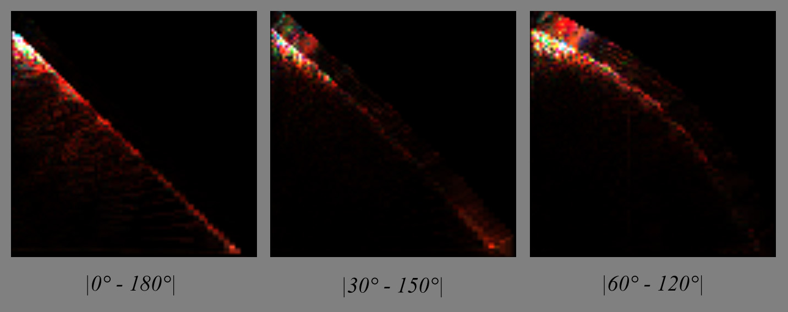

Same here for the steel BRDF, only amplified by 64 this time (it seems like metals have plenty of things going on in the specular zone):

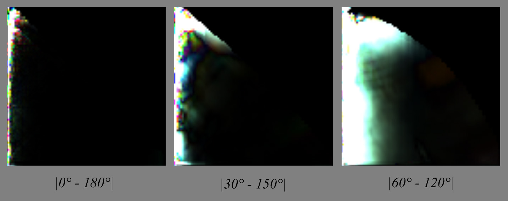

From these we can deduce that, except for very specular materials, there seems to be a symmetry about the half angle vector so I take the responsibility to assume that half of the table is redundant enough to be discarded.

####Warping####
Could we use the characteristic slice at $\phi_d = \frac{\pi}{2}$ and warp it to achieve the "same look" as actual slices?

First, we need to understand what kind of geometric warping is happening:

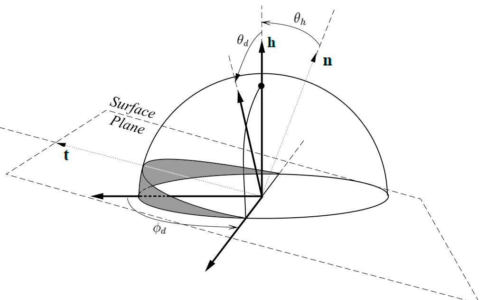

In the figure above, we see that for $\phi_d = \frac{\pi}{2}$, whatever the combination of $\theta_h$ or $\theta_d$, we absolutely cannot get below the surface (i.e. the grey area), that's why the characteristic slice has valid pixels everywhere.

On the other hand, when $\phi_d < \frac{\pi}{2}$, we can notice that some combinations of $\theta_h > 0$ and $\theta_d$ give positions that get below the surface (highlighted in red):

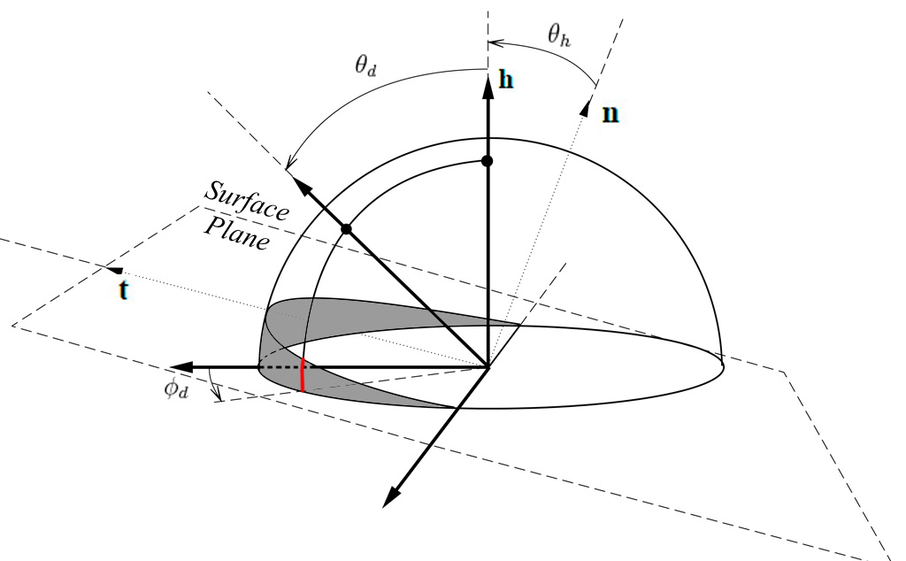

!!! note
    From this, we can decide to discard the second half of the table &ndash;everything where $\phi_d > \frac{\pi}{2}$&ndash; because it seems to correspond to the portion of tilted hemisphere that is *always* above the surface. By the way, it's quite unclear why we lack data (i.e. the black pixels) in the slices of this area. Assuming the isotropic materials were scanned by choosing $\phi_h = 0°$, then perhaps the authors wanted the table to also account for the opposite and mirror image if $\phi_h = 180°$ and so the table is reversible and reciprocity principle is upheld?

Anyway, we can assume the "real data" corresponding to rays actually grazing the surface lie in the [0,90] section.

Now, if we reduce the 3D problem to a 2D one:

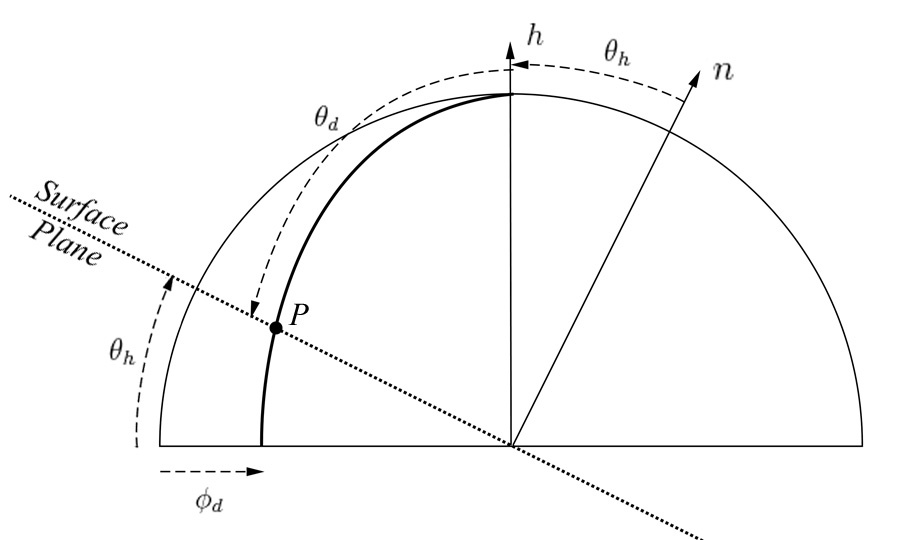

We can write the coordinates of $P(\phi_d,\theta_d)$ along the thick geodesic:
$$
P(\phi_d,\theta_d) = \begin{cases} 
x = \cos\phi_d \sin\theta_d \\\\
y = \cos\theta_d,
\end{cases}
$$

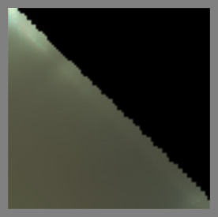

We see that $P(\phi_d,\theta_d)$ intersects the surface if:
$$
\begin{align}\frac{P.y}{P.x} &= \tan\theta_h \\\\
\frac{\cos\theta_d}{\cos\phi_d \sin\theta_d} &= \tan\theta_h \\\\
\tan(\frac{\pi}{2}-\theta_d) &= \cos\phi_d \tan\theta_h \\\\
\tan\theta_d\tan\theta_h &= \sec\phi_d  ~~~~~~~~~\mbox{(5)}\\\\
\end{align}
$$

We notice that when $\phi_d = \frac{\pi}{2}$ then vectors intersect the surface if $\theta_d = \frac{\pi}{2}$ or $\theta_h = \frac{\pi}{2}$ 
(in other words, we can't reach these cases in the characteristic slice).

And when $\phi_d = \pi$ then vectors go below the surface if $\frac{\pi}{2} - \theta_d < \theta_h$, which is the behavior we observe with slices at $\phi_d = 0$ or $\phi_d = \pi$.

For my first warping attempt, since I render the characteristic slice on a $\theta_d$ scanline basis (i.e. I'm filling an image), I tried to simply "collapse" the $\theta_h$ so that:

$$
\theta_{h_\mbox{max}} = \arctan( \frac{\tan( \frac{\pi}{2} - \theta_d )}{\cos\phi_d} )
$$

And:

$$
\theta_{h_\mbox{warped}} = \frac{\theta_h}{\theta_{h_\mbox{max}}}
$$

From the figure below showing the rendered slices, we immediately notice that despite the exact shape of the warping, the condensed lines are totally undesirable:

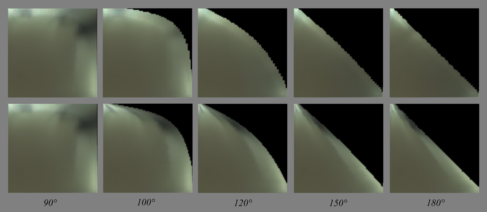

Of course, we would have the same kind of rendering if we had reversed the $\theta_d$ and $\theta_h$.

No, I think the true way of warping this texture is some sort of radial scaling:

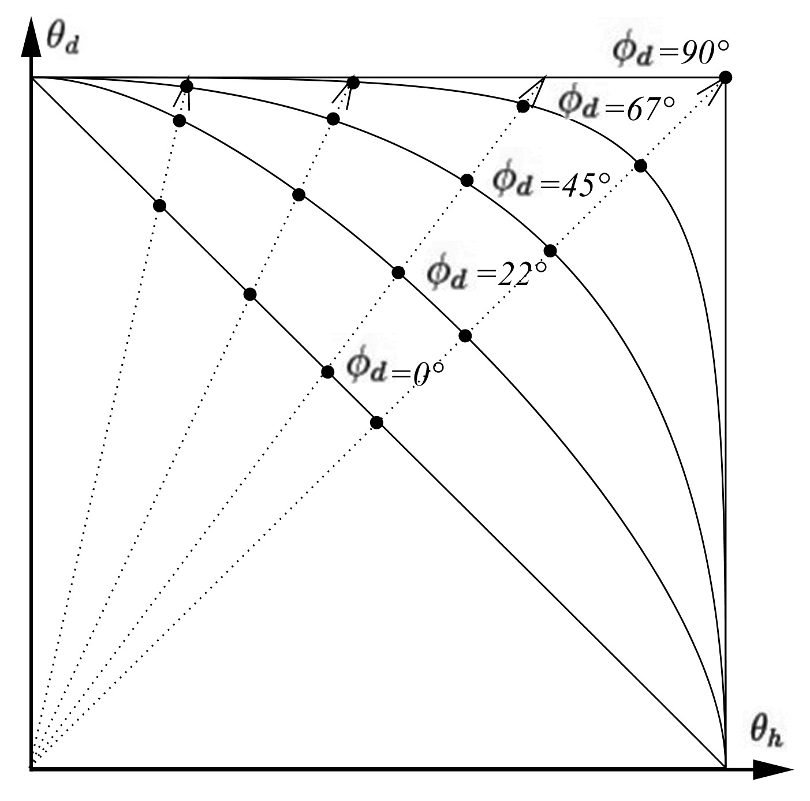

We need to find the intersection of each radial dotted line with the warped horizon whose curve depends on $\phi_d$.

From equation (5) that we recall below, we know the equation of the isoline for any given $\phi_d$:

$$
\tan\theta_d\tan\theta_h = \sec\phi_d  ~~~~~~~~~\mbox{(5)}
$$

The position of a point on any of the dotted lines in $\theta_h / \theta_d$ space can be written:

$$
P = \begin{cases} 
\theta_h \\
k\theta_h
\end{cases}
$$

Where $k$ is the slope of the line. We need to find $I(\theta_h,\theta_d)$, the intersection of the line with the warped horizon curve.

This comes to solving the equation:

$$
\tan(k\theta_h)\tan\theta_h = \sec\phi_d
$$

There is no clear analytical solution to that problem. Instead, I used numerical solving of the equation (using Newton-Raphson) for all possible couples of $k$ and $\phi_d$ and stored the scale factors into a 2D table:

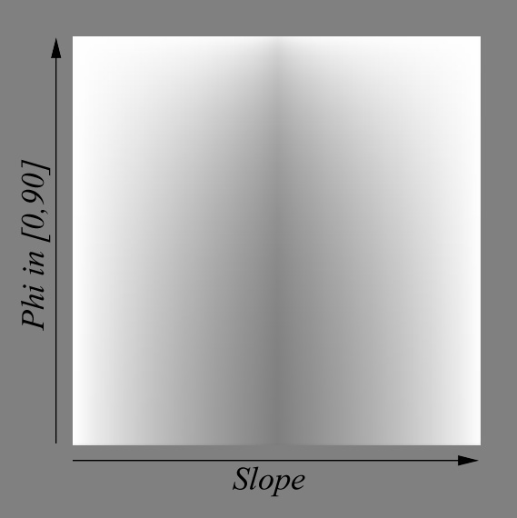

Comparing warping again with the actual BRDF slices, we obtain this which is a bit better:

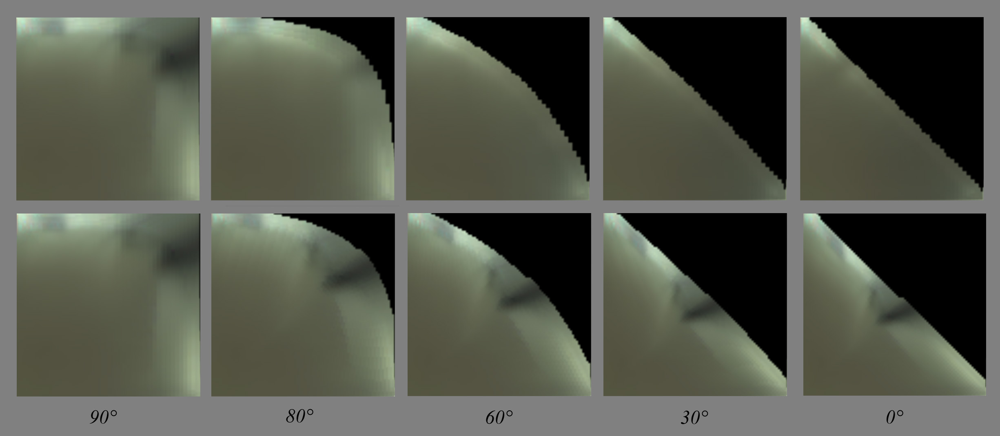

We see that the details in the main slice get warped and folded to match the warped horizon curve. Whereas on the actual slices, these contrasted details tend to disappear as if "sliding under the horizon" (you have to play with the dynamic slider in my little comparison tool to feel that)...

Below you can see 10$\times$ absolute difference between my warped BRDF slices and the actual slices, which is quite large especially near the horizon:
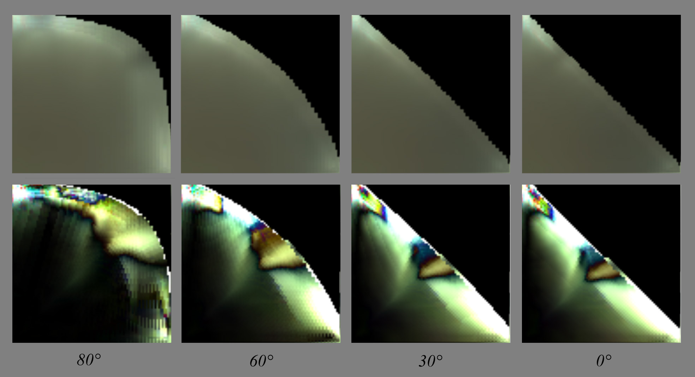

There is a lot of room for improvement here (!!) but for the moment I'll leave it at that and focus on the analysis on the main slice's features. I'll try and come back to the warping later...

##Layered materials model##

!!! TODO
    Many renderers and film companies, be they Arnold, Maxwell, Disney or Pixar, seem to have chosen the way of a model based on layered materials.
    Whatever model we choose, we should handle layers as well (doesn't depend on BRDF model)
    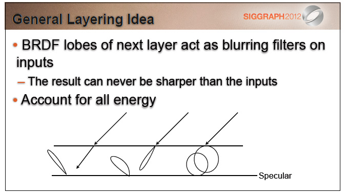
    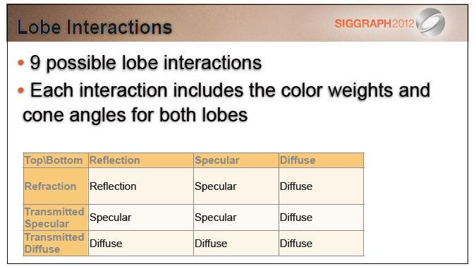

##References##

[^1] ["Practical Physically Based Shading in Film and Game Production"](http://blog.selfshadow.com/publications/s2012-shading-course/) Siggraph 2012 talk.

[^2] ["Geometrical Considerations and Nomenclature for Reflectance"](http://graphics.stanford.edu/courses/cs448-05-winter/papers/nicodemus-brdf-nist.pdf) F.E. Nicodemus et al. (1977)

[^3] ["Screen-Space Perceptual Rendering of Human Skin"](http://www.iryoku.com/sssss/) Jimenez et al. (2009)

[^4] ["Theory for Off-Specular Reflection From Roughened Surfaces"](http://www.opticsinfobase.org/josa/abstract.cfm?uri=josa-57-9-1105) Torrance and Sparrow (1967)

[^5] ["A New Change of Variables for Efficient BRDF Representation"](http://www.cs.princeton.edu/~smr/papers/brdf_change_of_variables/) Szymon Rusinkiewicz (1998)

[^6] ["Reflection from Layered Surfaces due to Subsurface Scattering"](http://www.irisa.fr/prive/kadi/Lopez/p165-hanrahan.pdf) Hanrahan and Krueger (1993)

[^7] ["GPU-Based Importance Sampling"](http://http.developer.nvidia.com/GPUGems3/gpugems3_ch20.html) Colbert et al. GPU Gems 3 (2007)

[^8] ["Distribution-based BRDFs"](http://www.cs.utah.edu/~premoze/dbrdf/dBRDF.pdf) Ashikhmin et al. (2007)

----
##OLD STUFF TO REMOVE##
----
This is where the iso-lines of $\theta_i$ and $\theta_o$ are coming to the rescue!

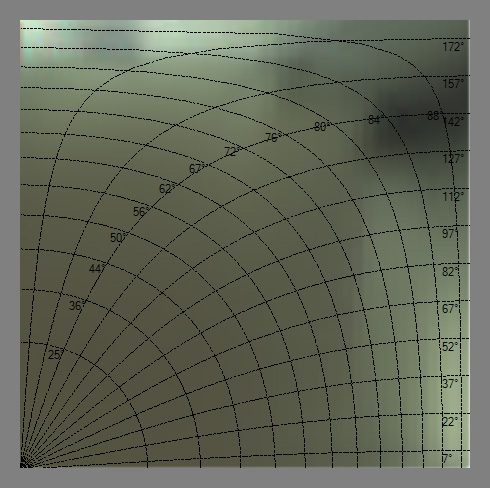

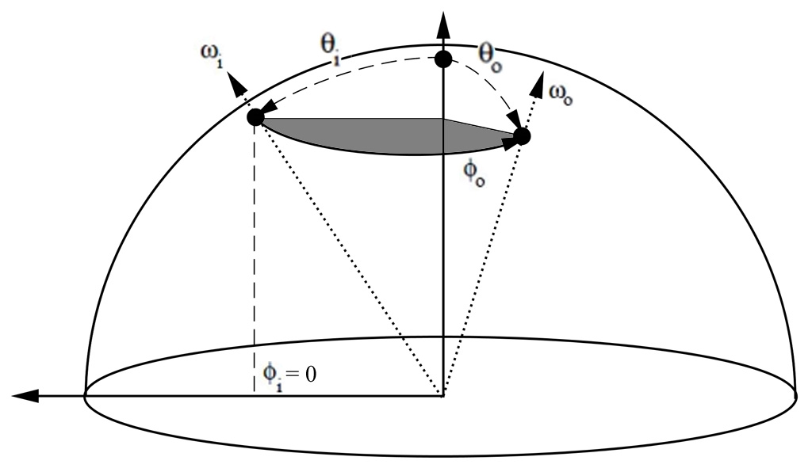 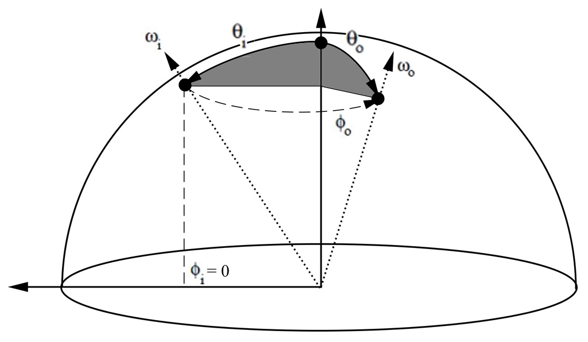

All isolines show $\theta_i = \theta_o \in [0,90]$.

* (left figure) The first set of radial latitudinal isolines (labeled from 25° to 88°) is constructed by keeping $\phi_i = 0$ and making $0 < \phi_o \le 180°$ for a $\theta = \mbox{iso (non linear)}$.

* (right figure) The second set of longitudinal isolines (labeled from 7° to 172°) is constructed by keeping $\phi_i = 0$ and making $0 < \theta \le 180°$ for a $\Phi_o = \mbox{iso}$.

