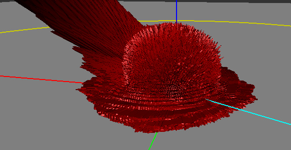
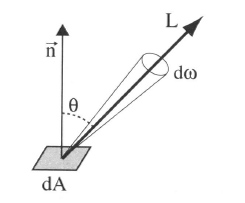
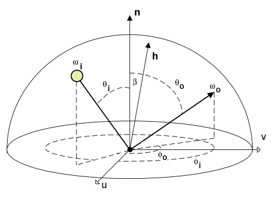
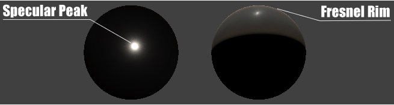

## Definition of the BRDF ##

"The BRDF of nylon viewed in the [Disney BRDF Explorer](http://www.disneyanimation.com/technology/brdf.html)"
The cyan line represents the incoming light direction, the red peanut object is the amount of light reflected in the corresponding direction.

Almost all the informations gathered here come from the reading and interpretation of the great Siggraph 2012 talk about physically based rendering in movie and game production [^1] but I've also practically read the entire documentation about BRDFs from their first formulation by Nicodemus [^2] in 1977!

###So, what's a BRDF?###
As I see it, it's an abstract tool that helps us to describe the macroscopic behavior of a material when photons hit this material. It's a convenient black box, a huge multi-dimensional lookup table (3, 4, or sometimes even 5, 6 dimensions when including spatial variations) that somehow encodes the amount of photons bouncing off the surface in a specific (outgoing) direction when coming from another specific (incoming) direction (and potentially, from another location).

###It comes in many flavours###
A Bidrectional Reflectance Distribution Function or BRDF is only a subset of the phenomena that happen when photons hit a material but there are plenty of other kinds of B**x**DFs:

* The BRDF only deals about reflection, so we're talking about photons coming from outside the material and scattered back to the outside the material as well.
* The BTDF (Transmittance) only deals about transmission of photons coming from outside the material and scattering inside the material (i.e. refraction).

    * Note that the BRDF and BTDF only need to consider the upper or lower hemispheres of directions (which we call $\Omega$, or sometimes $\Omega_+$ and $\Omega_-$ if the distinction is required)

* The BSDF (Scattering) is the general term that encompasses both the BRDF and BTDF. This time, it considers the entire sphere of directions.

    * Anyway, the BSDF, BRDF and BTDF are generally 4-dimensional as they make the (usually correct) assumption that both the incoming and outgoing rays interact with the material at a unique and same location.
    * Also, the BSDF could be viewed as an incorrect term since it not only accounts for scattering but also for the other phenomenon happening to photons when they hit a material: absorption. This is because of absorption that the total integral of the BRDF for any outgoing direction is less than 1.

* The BSSRDF (Surface Scattering Reflectance) is a much larger model that also accounts for different locations for the incoming and outgoing rays. It thus becomes 5- or even 6-dimensional.

    * This is an expensive but really important model when dealing with translucent materials (e.g. skin, marble, wax, milk, even plastic) where light diffuses through the surface to reappear at some other place.
    * For skin rendering, it's an essential model otherwise your character will look dull and plastic, as was the case for a very long time in real-time computer graphics. Fortunately, there are many simplifications that one can use to remove 3 of the 6 original dimensions of the BSSRDF, but it's only recently that real-time methods were devised [^3].

###First, what's the color of a pixel?###
Well, a pixel encodes what the eye or a CCD sensor is sensitive to: it's called *radiance*.

Radiance is the radiant flux of photons per unit area per unit solid angle and is written as $L(x,\omega)$. Its unit is the Watt per square meter per steradian ($W.m^{-2}.sr^{-1}$).

* $x$ is the location where the radiance is evaluated, it's a *3D vector*!
* $\omega$ is the direction in which the radiance is evaluated, it's also a *3D vector* but it's normalized so it can be written as a couple of spherical coordinates $\langle \phi,\theta \rangle$.

The radiant flux of photons &ndash;or simply *flux*&ndash; is basically the amount of photons/energy per amount of time.
And since we're considering a single CCD sensor element or a single photo-receptor in the back of the eye (e.g. [cone](http://en.wikipedia.org/wiki/Cone_cell)):

* We only perceive that flux in a single location, hence the "per square meter". We need the flux flowing through an infinitesimal piece of surface (at least, the area of a rod or a cone, or the area of a single CCD sensor element).
* We only perceive that flux in a single direction, hence the "per steradian". We need the flux flowing through an infinitesimal piece of the whole sphere of directions (or at least the solid angle $d\omega$ covered by the cone or single CCD sensor element as shown in the figure below).

So the radiance is this: the amount of photons per seconds flowing along a ray of solid angle $d\omega$ and reaching a small surface $dA$. And that's what is stored in the pixels of an image.
")

A good source of radiance is one of those HDR cube maps used for Image Based Lighting (IBL): each texel of the cube map represents a piece of the photon flux reaching the point at the center of the cube map. It encodes the entire light field around an object and if you use the cube map well, your object can seamlessly integrate into the real environment where the cube map photograph was taken (thanks to our dear [Paul Debevec](http://www.pauldebevec.com/)) (ever noticed how movies before 1999 had poor CGI? And since his paper on HDR probes, it's a real orgy! :smile:).

But IBL is also very expensive: ideally, you would need to integrate *each texel of the cube map* and dot it with your normal and multiply it by some **special function** to obtain the *perceived* color of your surface in the view direction.

And guess what this special function is?

Well, yes! It's the BRDF and it's used to completely describe the behavior of radiance when it interacts with a material. Any material...

## Mathematically ##

We're going to use $\omega_i$ and $\omega_o$ to denote the incoming and outgoing directions respectively. Each of these 2 directions are encoded in spherical coordinates by a couple of angles $\langle \phi_i,\theta_i \rangle$ and $\langle \phi_o,\theta_o \rangle$.
These only represent generic directions, we don't care if it's a view direction or light direction.

For example, for radiance estimates, the outgoing direction is usually the view direction while the incoming direction is the light direction.
For importance estimates, it's the opposite.

Also note that we use vectors pointing *toward* the view or the light.

###Irradiance###
The integration of radiance arriving at a surface element $dA$, times $n.\omega_i$ yields the irradiance ($W.m^{-2}$):

$$
E_r(x) = \int_\Omega dE_i(x,\omega_i) = \int_\Omega L_i(x,\omega_i) (n.\omega_i) \, d\omega_i~~~~~~~~~\mbox{(1)}
$$

It means that by summing the radiance ($W.m^{-2}.sr^{-1}$) coming from all possible directions, we get rid of the angular component (the $sr^{-1}$
part).

Irradiance is the energy per unit surface (when leaving the surface, the irradiance is then called radiosity, I suppose you've heard of it).
It's not very useful because, as we saw earlier, what we need for our pixels is the radiance.

Intuitively, we can imagine that we need to multiply that quantity by a value that will yield back a radiance.
This mysterious value has the units of *per steradian* ($sr^{-1}$) and it's indeed the BRDF.

###First try###
So, perhaps we could include the BRDF *in front* of the irradiance integral and obtain a radiance like this:

$$
L_r(x,\omega_o) = f_r(x,\omega_o) \int_\Omega L_i(\omega_i) (n.\omega_i) \, d\omega_i
$$

Well, it *can* work for a few cases.
For example, in the case of a perfectly diffuse reflector (Lambert model) then the BRDF is a simple constant $f_r(x,\omega_o) = \frac{\rho(x)}{\pi}$ where $\rho(x)$ is called the diffuse reflectance (or diffuse albedo) of the surface. The division by $\pi$ is here to account for our "per steradian" need and to keep the BRDF from reflecting more light than came in: integration of a unit reflectance $\rho = 1$ over the hemisphere yields $\pi$.

This is okay as long as we don't want to model materials that behave in a more complex manner.
Most materials certainly don't handle incoming radiance uniformly, without accounting for the incoming direction!
They must redistribute radiance in some special and strange ways...

For example:

* Many materials have a *specular peak*: a strong reflection of photons that tend to bounce off the surface almost in the direction perfectly symmetrical to the incoming direction (your average mirror does that).
* Also, many rough materials imply a *Fresnel peak*: a strong reflection of photons that arrive at the surface with glancing angles (fabrics are a good example of Fresnel effect)

That makes us realize the BRDF actually needs to be **inside** the integral and become dependent on the incoming direction $\omega_i$ as well!

###The actual formulation###
When we inject the BRDF into the integral, we obtain a new radiance:

$$
L_r(x,\omega_o) = \int_\Omega f_r(x,\omega_o,\omega_i) L_i(\omega_i) (n.\omega_i) \, d\omega_i~~~~~~~~~\mbox{(2)}
$$

We see that $f_r(x,\omega_o,\omega_i)$ is now dependent on both $\omega_i$ and $\omega_o$ and becomes much more difficult to handle than our simple Lambertian factor from earlier.

Anyway, we now integrate radiance multiplied by the BRDF. We saw from equation (1) that integrating without multiplying by the BRDF yields the irradiance, but when integrating with the multiplication by the BRDF, we obtain radiance so it's perfectly reasonable to assume that the expression of the BRDF is:

$$
f_r(x,\omega_o,\omega_i) = \frac{dL_r(x,\omega_o)}{dE_i(x,\omega_i)}
$$
(which is simply radiance divided by irradiance)

From equation (1) we find that:

$$
dE_i(x,\omega_i) = L_i(x,\omega_i) (n.\omega_i) d\omega_i~~~~~~~~~~~~
$$
(note that we simply removed the integral signs to get this)

We can then finally rewrite the true expression of the BRDF as:

$$
f_r(x,\omega_o,\omega_i) = \frac{dL_r(x,\omega_o)}{L_i(x,\omega_i) (n.\omega_i) d\omega_i}~~~~~~~~~\mbox{(3)}
$$

The BRDF can then be seen as the infinitesimal amount of reflected radiance ($W.m^{-2}.sr^{-1}$) by the infinitesimal amount of incoming **ir**radiance ($W.m^{-2}$) and thus has the final units of $sr^{-1}$.

##Physically##
To be physically plausible, the fundamental characteristics of a real material BRDF are:

* Positivity, any $f_r(x,\omega_o,\omega_i) \ge 0$
* Reciprocity (a.k.a. Helmholtz principle), guaranteeing the BRDF returns the same value if $\omega_o$ and $\omega_i$ are reversed (i.e. view is swapped with light). It means that $f_r(x,\omega_o,\omega_i) = f_r(x,\omega_i,\omega_o)$
* Energy conservation, guaranteeing the total amount of reflected light is less or equal to the amount of incoming light. In other terms: $\forall\omega_o \int_\Omega f_r(x,\omega_o,\omega_i) (n.\omega_i) \, d\omega_i \le 1$

Although positivity and reciprocity are usually quite easy to ensure in physical or analytical BRDF models, energy conservation on the other hand is the most difficult to enforce!

!!! note
    From [^4] we know that $d\omega_i = 4 (h.\omega_o) d\omega_h$ so we can transfer the energy conservation integral into the half-vector domain:
    $\forall\omega_o \int_{\Omega_h} f_r(x,\omega_o,\omega_h) (n.\omega_h) d\omega_h \le \frac{1}{4 (h.\omega_o)}$

!!! note
    I wrote that energy conservation is difficult to enforce but many models represent a single specular highlight near the mirror direction so, instead of testing the integral of the BRDF for all $\omega_o$, it's only necessary to ensure it returns a correct value in the mirror direction, hence reducing the problem to a single integral evaluation. This usually gives us a single value that we can later use as a normalization factor.

## Next

In the next section, we will list and describe several [analytical models](BRDF Models).

	
##References##

[^1]: ["Practical Physically Based Shading in Film and Game Production"](http://blog.selfshadow.com/publications/s2012-shading-course/) Siggraph 2012 talk.

[^2]: ["Geometrical Considerations and Nomenclature for Reflectance"](http://graphics.stanford.edu/courses/cs448-05-winter/papers/nicodemus-brdf-nist.pdf) F.E. Nicodemus et al. (1977)

[^3]: ["Screen-Space Perceptual Rendering of Human Skin"](http://www.iryoku.com/sssss/) Jimenez et al. (2009)

[^4]: ["Theory for Off-Specular Reflection From Roughened Surfaces"](http://www.opticsinfobase.org/josa/abstract.cfm?uri=josa-57-9-1105) Torrance and Sparrow (1967)
