
## What can we bring to the table?

!!! TODO
    Talk about light sources in real time engines.
    Point light source computation from Naty's talk.

###Lafortune lobes###

!!! TODO
    Needs lengthy fitting process with Levenberg-Marquardt and, according to [^1], it's quite unstable when it involves a large number of lobes. I was about to use that model with 6 to 8 RGB lobes but reading all these documents and playing with the Disney BRDF viewer convinced me otherwise.

###d-BRDF###

!!! TODO
    From [https://citeseerx.ist.psu.edu/viewdoc/download?doi=10.1.1.621.5638&rep=rep1&type=pdf](https://citeseerx.ist.psu.edu/viewdoc/download?doi=10.1.1.621.5638&rep=rep1&type=pdf)
    Requires 1 2D texture for distribution and 1 1D texture for "Fresnel", one for distribution and another for Fresnel...

###Using characteristic slices with warping!###
We need to realize the BRDF encompasses *everything*: no need of fresnel or geometric factors: it's all encoded inside!
We want to decompose it into its essential parts, especially separating the diffuse from the specular part so we can keep changing the diffuse model at will.

####Symmetry about the half-angle####
The following figure shows the absolute difference between symmetric $\phi_d$ slices for "red-fabric2", amplified by a factor of 1024:

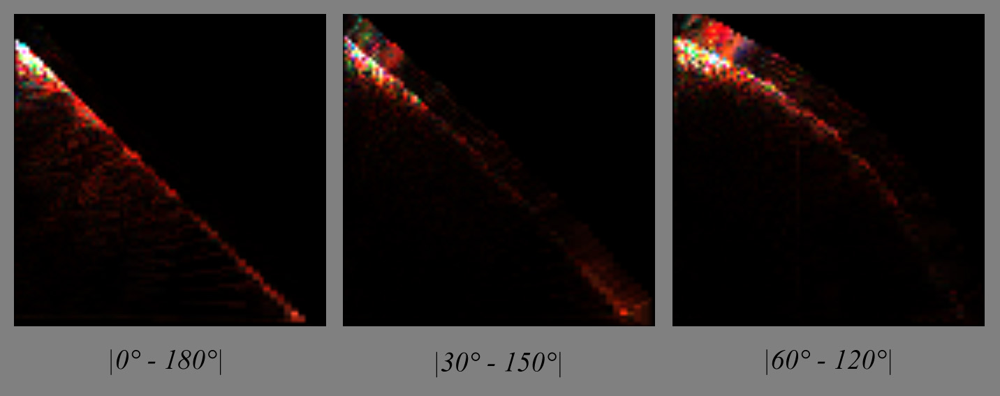

Same here for the steel BRDF, only amplified by 64 this time (it seems like metals have plenty of things going on in the specular zone):

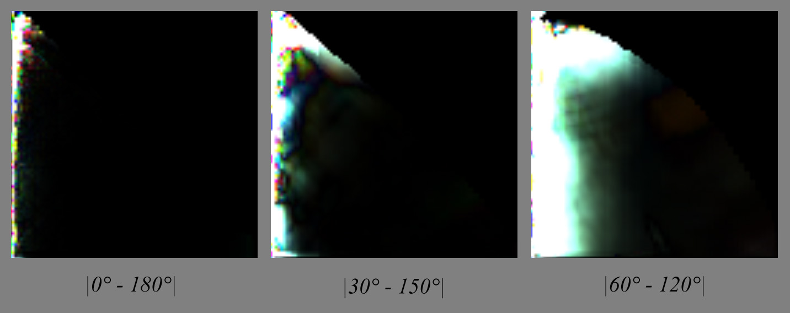

From these we can deduce that, except for very specular materials, there seems to be a symmetry about the half angle vector so I take the responsibility to assume that half of the table is redundant enough to be discarded.

####Warping####
Could we use the characteristic slice at $\phi_d = \frac{\pi}{2}$ and warp it to achieve the "same look" as actual slices?

First, we need to understand what kind of geometric warping is happening:

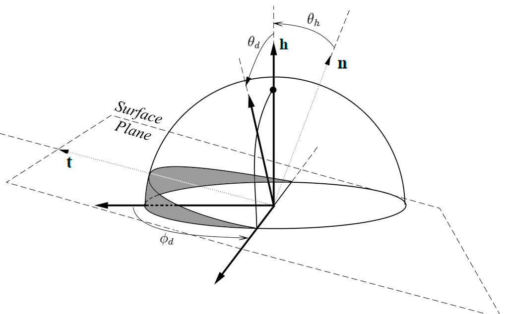

In the figure above, we see that for $\phi_d = \frac{\pi}{2}$, whatever the combination of $\theta_h$ or $\theta_d$, we absolutely cannot get below the surface (i.e. the grey area), that's why the characteristic slice has valid pixels everywhere.

On the other hand, when $\phi_d < \frac{\pi}{2}$, we can notice that some combinations of $\theta_h > 0$ and $\theta_d$ give positions that get below the surface (highlighted in red):

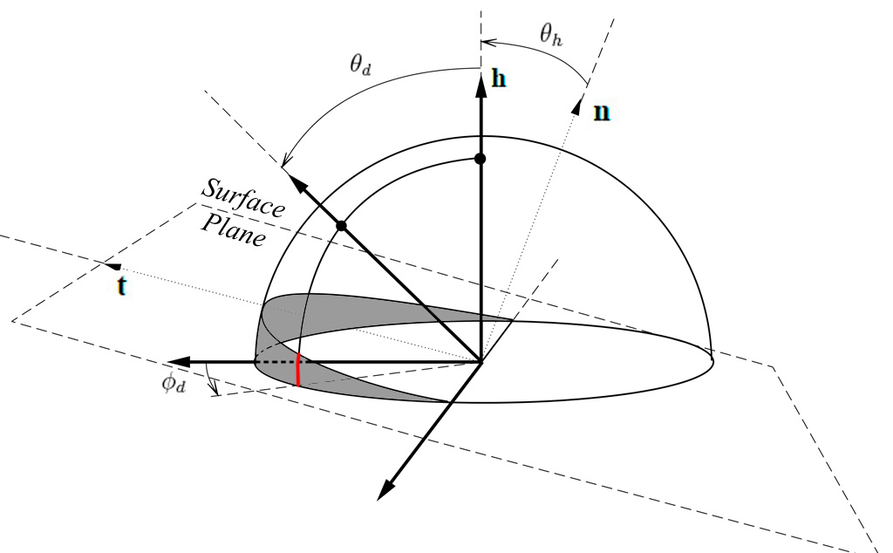

!!! note
    From this, we can decide to discard the second half of the table &ndash;everything where $\phi_d > \frac{\pi}{2}$&ndash; because it seems to correspond to the portion of tilted hemisphere that is *always* above the surface. By the way, it's quite unclear why we lack data (i.e. the black pixels) in the slices of this area. Assuming the isotropic materials were scanned by choosing $\phi_h = 0°$, then perhaps the authors wanted the table to also account for the opposite and mirror image if $\phi_h = 180°$ and so the table is reversible and reciprocity principle is upheld?

Anyway, we can assume the "real data" corresponding to rays actually grazing the surface lie in the [0,90] section.

Now, if we reduce the 3D problem to a 2D one:

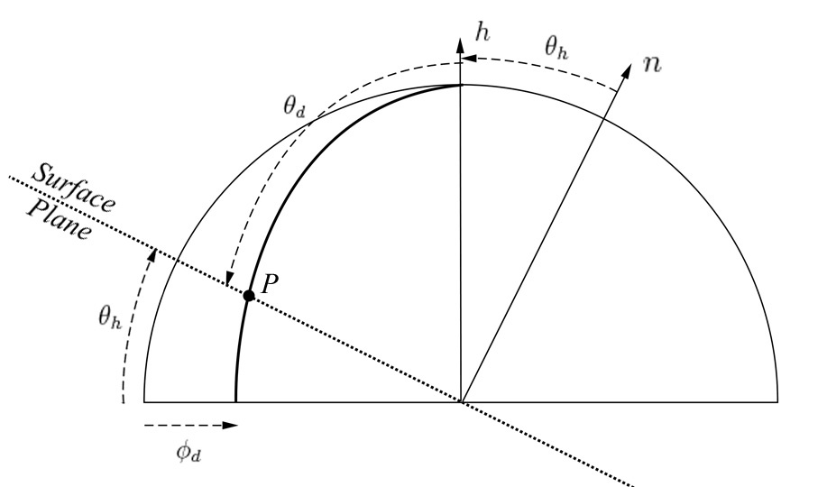

We can write the coordinates of $P(\phi_d,\theta_d)$ along the thick geodesic:

$$
P(\phi_d,\theta_d) = \begin{cases} 
x = \cos\phi_d \sin\theta_d \\\\
y = \cos\theta_d,
\end{cases}
$$

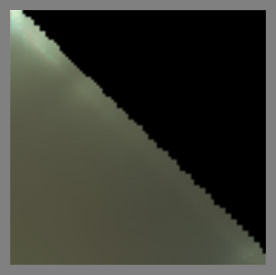

We see that $P(\phi_d,\theta_d)$ intersects the surface if:

$$
\begin{align}\frac{P.y}{P.x} &= \tan\theta_h \\\\
\frac{\cos\theta_d}{\cos\phi_d \sin\theta_d} &= \tan\theta_h \\\\
\tan(\frac{\pi}{2}-\theta_d) &= \cos\phi_d \tan\theta_h \\\\
\tan\theta_d\tan\theta_h &= \sec\phi_d  ~~~~~~~~~\mbox{(5)}\\\\
\end{align}
$$

We notice that when $\phi_d = \frac{\pi}{2}$ then vectors intersect the surface if $\theta_d = \frac{\pi}{2}$ or $\theta_h = \frac{\pi}{2}$ 
(in other words, we can't reach these cases in the characteristic slice).

And when $\phi_d = \pi$ then vectors go below the surface if $\frac{\pi}{2} - \theta_d < \theta_h$, which is the behavior we observe with slices at $\phi_d = 0$ or $\phi_d = \pi$.

For my first warping attempt, since I render the characteristic slice on a $\theta_d$ scanline basis (i.e. I'm filling an image), I tried to simply "collapse" the $\theta_h$ so that:

$$
\theta_{h_\mbox{max}} = \arctan( \frac{\tan( \frac{\pi}{2} - \theta_d )}{\cos\phi_d} )
$$

And:

$$
\theta_{h_\mbox{warped}} = \frac{\theta_h}{\theta_{h_\mbox{max}}}
$$

From the figure below showing the rendered slices, we immediately notice that despite the exact shape of the warping, the condensed lines are totally undesirable:

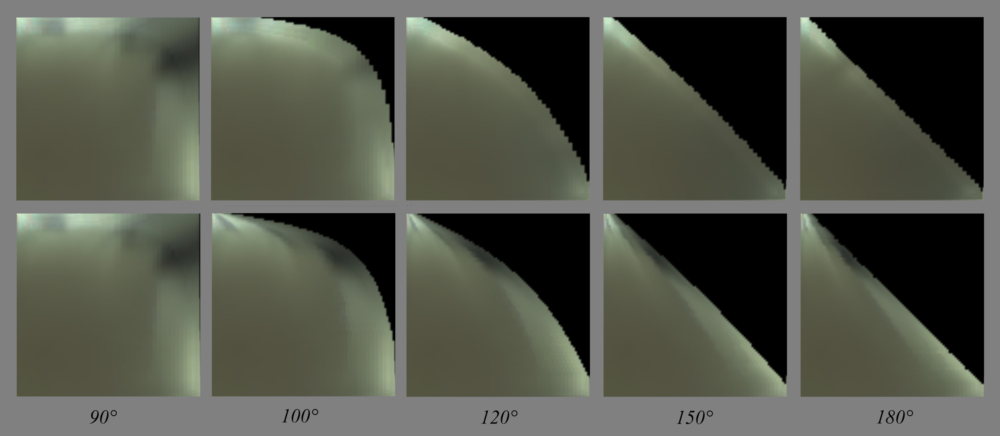

Of course, we would have the same kind of rendering if we had reversed the $\theta_d$ and $\theta_h$.

No, I think the true way of warping this texture is some sort of radial scaling:

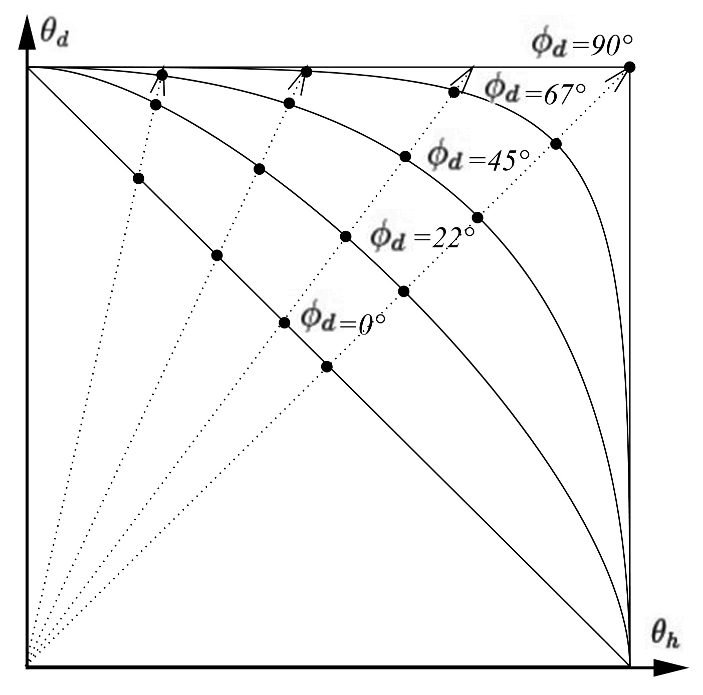

We need to find the intersection of each radial dotted line with the warped horizon whose curve depends on $\phi_d$.

From equation (5) that we recall below, we know the equation of the isoline for any given $\phi_d$:

$$
\tan\theta_d\tan\theta_h = \sec\phi_d  ~~~~~~~~~\mbox{(5)}
$$

The position of a point on any of the dotted lines in $\theta_h / \theta_d$ space can be written:

$$
P = \begin{cases} 
\theta_h \\
k\theta_h
\end{cases}
$$

Where $k$ is the slope of the line. We need to find $I(\theta_h,\theta_d)$, the intersection of the line with the warped horizon curve.

This comes to solving the equation:

$$
\tan(k\theta_h)\tan\theta_h = \sec\phi_d
$$

There is no clear analytical solution to that problem. Instead, I used numerical solving of the equation (using Newton-Raphson) for all possible couples of $k$ and $\phi_d$ and stored the scale factors into a 2D table:

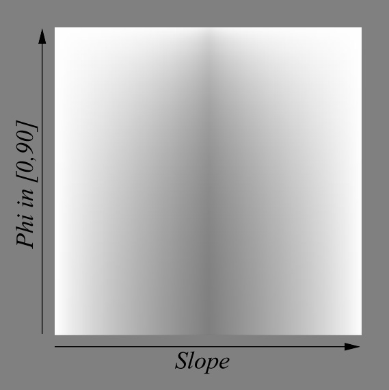

Comparing warping again with the actual BRDF slices, we obtain this which is a bit better:

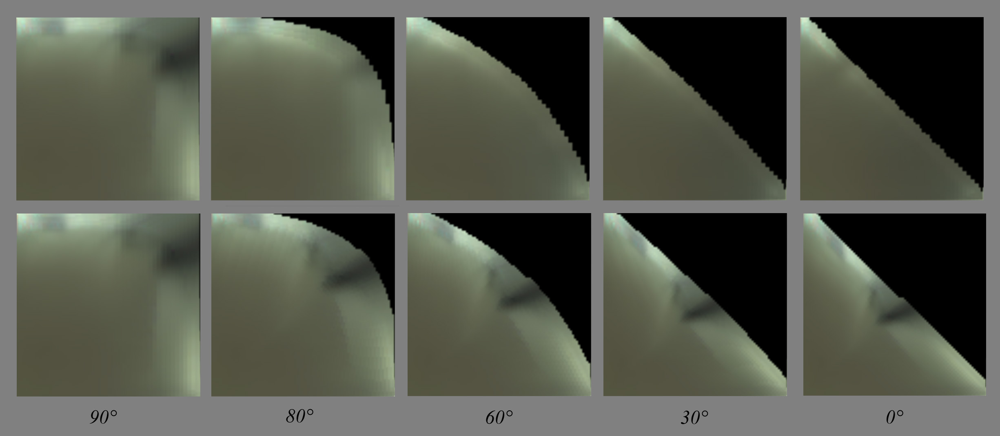

We see that the details in the main slice get warped and folded to match the warped horizon curve. Whereas on the actual slices, these contrasted details tend to disappear as if "sliding under the horizon" (you have to play with the dynamic slider in my little comparison tool to feel that)...

Below you can see 10$\times$ absolute difference between my warped BRDF slices and the actual slices, which is quite large especially near the horizon:
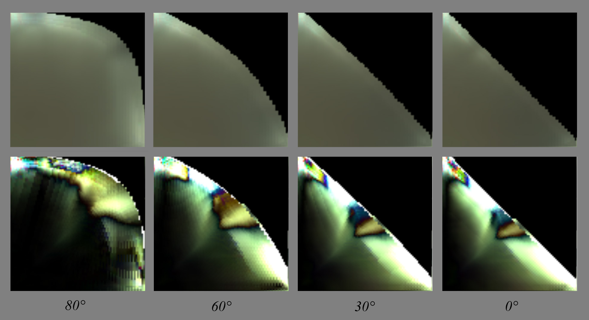

There is a lot of room for improvement here (!!) but for the moment I'll leave it at that and focus on the analysis on the main slice's features. I'll try and come back to the warping later...

##Layered materials model##

!!! TODO
    Many renderers and film companies, be they Arnold, Maxwell, Disney or Pixar, seem to have chosen the way of a model based on layered materials.
    Whatever model we choose, we should handle layers as well (doesn't depend on BRDF model)
    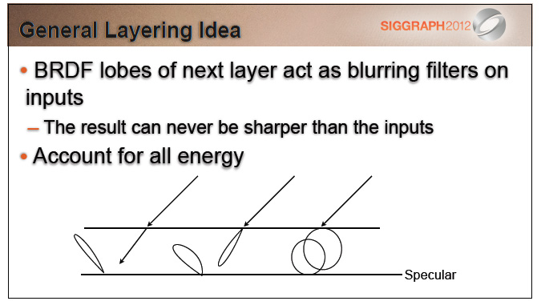
    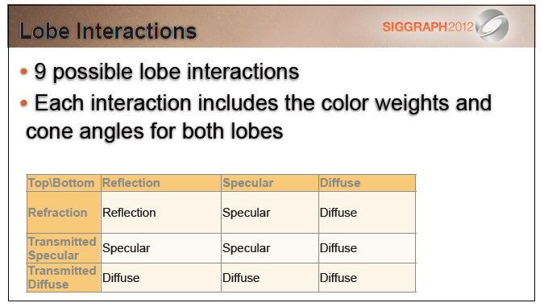

----
##OLD STUFF TO REMOVE##
----
This is where the iso-lines of $\theta_i$ and $\theta_o$ are coming to the rescue!

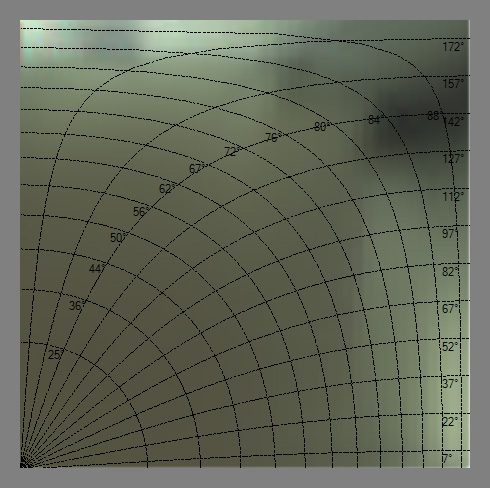

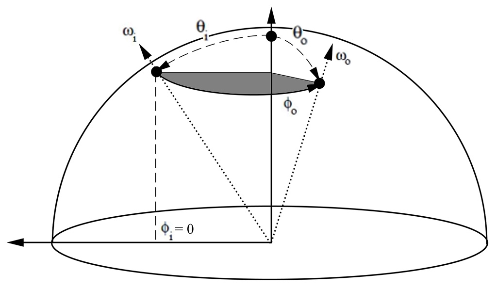 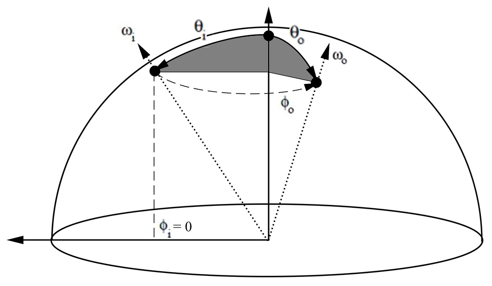

All isolines show $\theta_i = \theta_o \in [0,90]$.

* (left figure) The first set of radial latitudinal isolines (labeled from 25° to 88°) is constructed by keeping $\phi_i = 0$ and making $0 < \phi_o \le 180°$ for a $\theta = \mbox{iso (non linear)}$.

* (right figure) The second set of longitudinal isolines (labeled from 7° to 172°) is constructed by keeping $\phi_i = 0$ and making $0 < \theta \le 180°$ for a $\Phi_o = \mbox{iso}$.

##References##

[^1]: ["Distribution-based BRDFs"](https://citeseerx.ist.psu.edu/viewdoc/download?doi=10.1.1.621.5638&rep=rep1&type=pdf) Ashikhmin et al. (2007)

