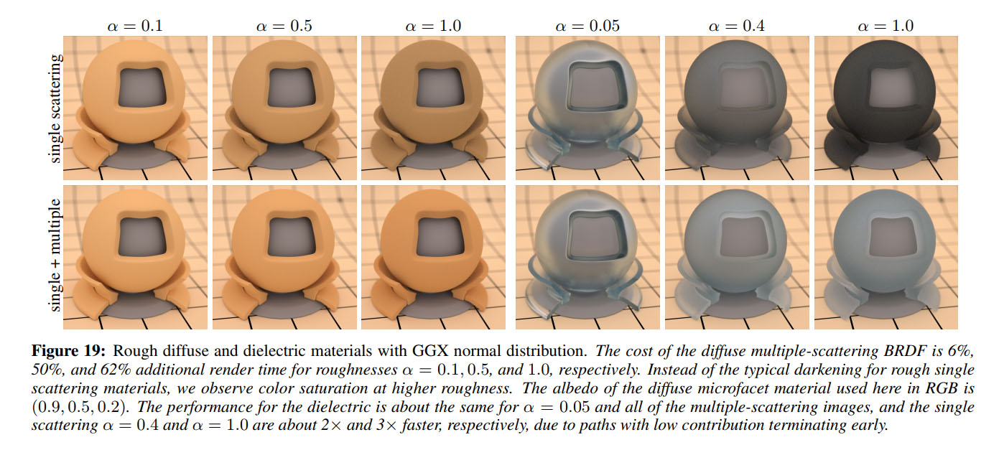
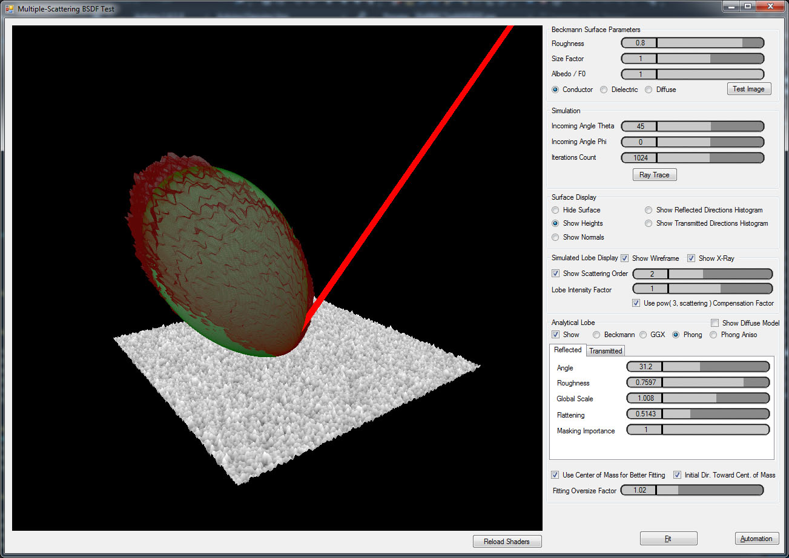
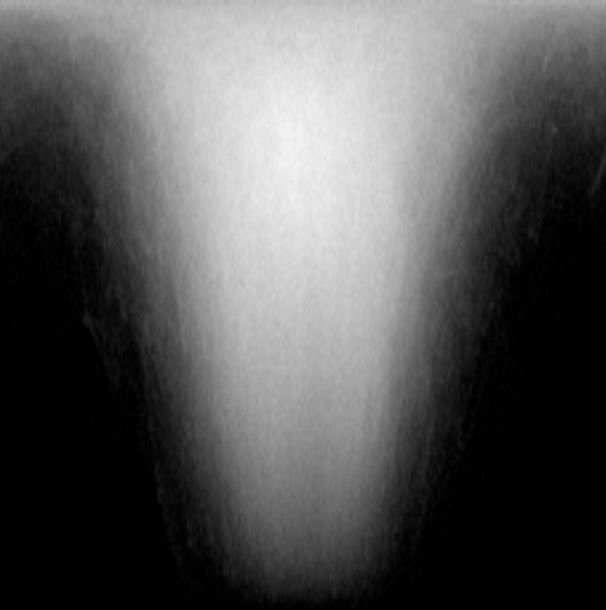
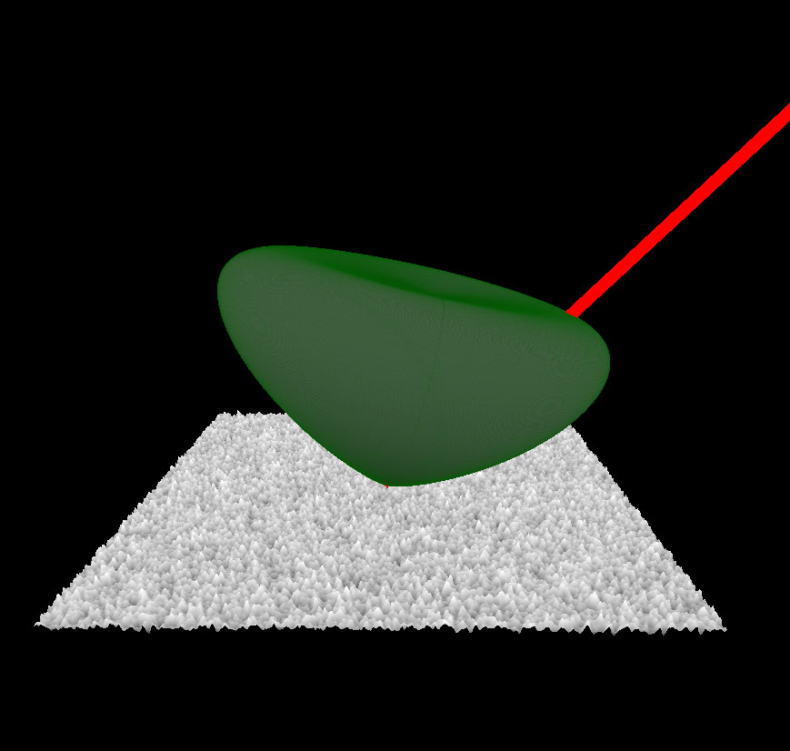
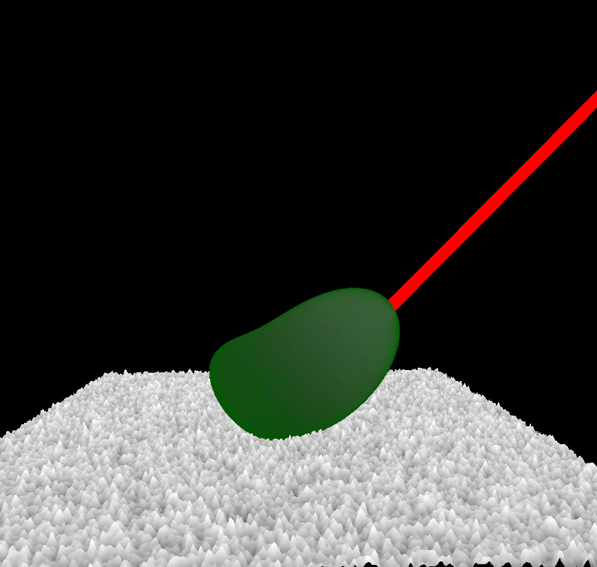
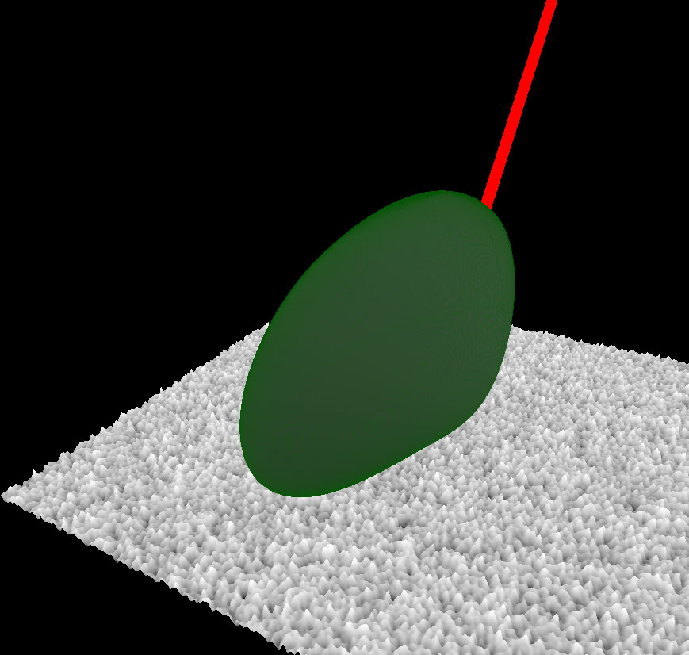
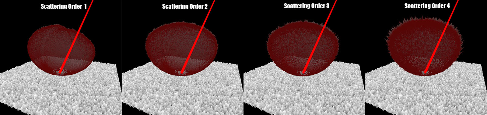
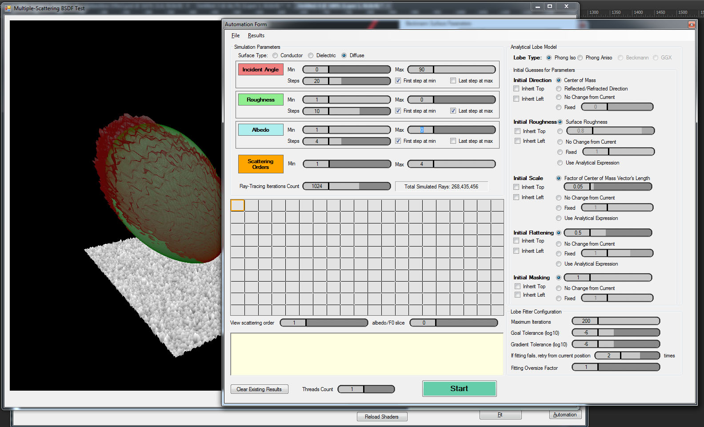
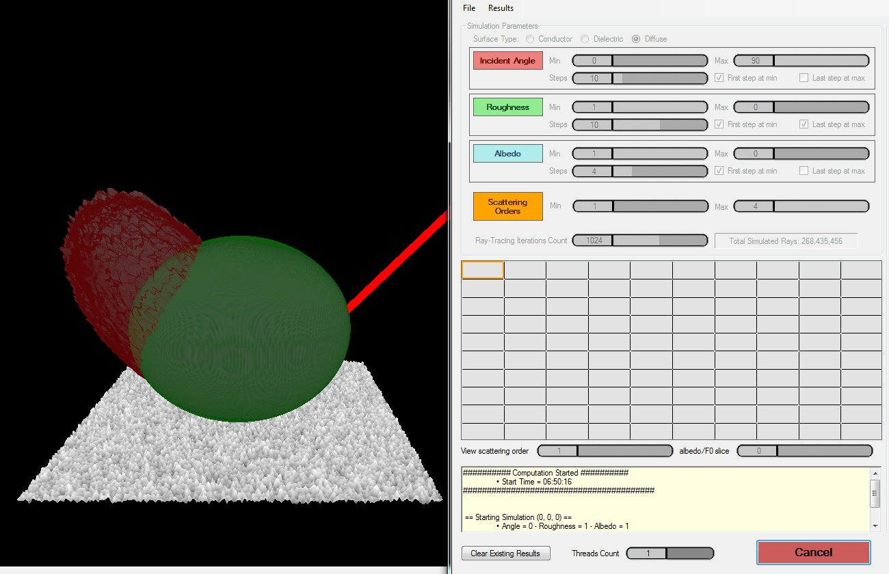

# Multiple-Scattering BRDF

In 2014 and 2015, many groundbreaking papers from Heitz et al. [^1] [^2] [^3] [^4] started to shed a new light (haha) on alternative models to the classical micro-facet model and introduced
 a more general volumetric framework called the "microflakes model" that tried to unify surfacic and volumetric materials into a unique solution (and indeed, in the real world, there is no such distinction between a "surface" and a "volume").

With this new micro-flakes model and adequate phase functions, Heitz et al. began to reflect (haha) on the re-introduction of the energy lost with classical BRDF models because of shadowing and masking.


Indeed, although the shadowing term correctly prevents a micro-surface element to be directly lit by a light source, the masking on the other hand is incorrectly removing lighting that, in the real world, would otherwise be indirectly perceived by reflection.

Suffice it to say that classical BRDF models up until 2014 were *single-scattering* models, while in reality, light bounces of the micro-structures of a surface/volume and is re-injected multiple times, showing a new gain in energy: real-world BRDFs are *multiple-scattering* models.

!!! quote ""
    

	(Source: "Multiple-Scattering Microfacet BSDFs with the Smith Model" [^4])


## Simulation

As soon as I had read the papers from Heitz et al. I immediately got to work to try and be one of the first to get a working MSBRDF model for runtime game use.

My idea was simple:

1. Simulate the probabilistic reflection of many rays of light hitting a rough surface (first the diffuse case, then the metal case, then the general dielectric case with refraction)
2. Analyze the shape of the lobe that reflects off from it
3. Fit a simple analytical lobe model with few free parameters
4. Find an analytical fit of these free parameters
5. Use this analytical fit to express the lobes at runtime for many light bounces
6. Add this quantity to the existing BRDF to obtain additional, multiply-scattered bounces

I was planning on having enough time to write 2 methods: one that uses many rays, the other one implementing the statistical model from Heitz et al. [^4] and also to be able to simulate diffuse, metallic and dielectric surfaces.<br/>
In practice, I only had time to write the brute-force ray-casting method for diffuse, metallic and dielectrics, and do the fitting for the diffuse lobes only.

You can find the latest stage of the project from late 2015, early 2016 as I left it in my [God Complex Repository](https://github.com/Patapom/GodComplex/tree/master/Tests/TestMSBSDF).


### Using Brute Force Ray-Casting

So I went on writing a small test application that would be using Compute Shaders to cast many rays &mdash; actually **500 million rays** &mdash; on a tiny patch of rough micro-surface (the size of the patch is not relevant, only the distribution of micro-facet slopes is important).

!!! quote ""
    

	My little simulator, bombarding 500 million rays on a tiny surface patch and accounting for 4 orders of scattering.


Basically, the algorithm when no refraction is involved goes like this:

1. Create a random ray coming from the user-specified direction (i.e. an incidence angle $\theta$)
2. For each scattering event $S$

	3.1. Shoot the ray across a carefully generated heightfield whose height distribution obeys a Beckmann distribution [^9]

    3.2. If the ray exits the surface, store it in the $S$ order scattering histogram bin and exit

    3.3. Else, reflect the ray across the perfectly specular micro-surface and continue the trace


Here is a view of the resulting histogram bins for the 4th order of scattering over a metallic surface of roughness $\alpha = 0.8$:



Each pixel represents a bin for a directional vector with spherical coordinates $(\theta,\phi)$, the image covers the entire upper hemisphere (or lower hemisphere when we are dealing with refraction).


#### Lobe Model

I went on and implemented several micro-facet lobe models, a model being the [NDF](BRDF%20Models/#specularity) and [masking/shadowing](BRDF%20Models/#shadowing-masking) terms.
The [Fresnel](BRDF%20Models/#fresnel) term is the same one for all the models.

* Beckmann Model, that follows the classical [Beckmann distribution](https://en.wikipedia.org/wiki/Specular_highlight#Beckmann_distribution)

	

* GGX Model, that follows the [GGX distribution](http://www.cs.cornell.edu/~srm/publications/EGSR07-btdf.pdf) described by Walter et al. [^8]

	

* Modified Phong (isotropic and anisotropic), that follows the classical [Phong distribution](https://en.wikipedia.org/wiki/Phong_reflection_model)

	


!!! note
    It is important to understand that these models are purely analytical models of normal distributions and shadowing/masking that were devised to work in the limited framework of the *single-scattering* Cook-Torrance micro-facet model.


#### Customization

The goal of my application was to fit new lobes from simulated, empirical data thus I wasn't shy of adding new alien parameters to these models in order to make the resulting lobes more "bendable" and capable of fitting a larger
 set of shapes that could come out from multiple bounces of light, as can be seen in this image:

!!! quote ""
    

	Multiple orders of scattering on a diffuse surface with roughness $\alpha = 0.8$.
	Lobes are scaled to roughly the same size each time, otherwise their volume collapses to 0 very rapidly.

	We see that the diffuse lobes can be pretty "squashed". We get even worse kinds of shapes when dealing with dielectric materials.

So in addition to the default parameters of these "classical" models:

* The lobe's deviation angle $\theta$, giving its deviation from the macroscopic normal axis $Z$
* The roughness $\alpha$, in [0,1]

I added:

* A "global scale" factor in [0,$\infty$] that is applied to the entire lobe
* An "anisotropic flattening" factor in [-1,1] that allows to squash the lobes along the tangential X & Y axes
* A "masking importance" factor in [0,1] that allows to ignore the influence of the shadowing/masking term entirely.
    It turns out this parameter is not very significant after all.


#### Lobe Fitting

The ray-casting was quite fast (about 1/2 a second per simulation, for 4 scattering orders), now I needed to fit the lobe models with their 5 free parameters.

I revamped the [BFGS](https://en.wikipedia.org/wiki/Broyden%E2%80%93Fletcher%E2%80%93Goldfarb%E2%80%93Shanno_algorithm) implementation I wrote a few years back (it can be found [here](https://github.com/Patapom/GodComplex/tree/master/Packages/MathSolvers)).

This BFGS minimizer is really easy to use: feed it a distance function and a list of free parameters then let it run for a few iterations.<br/>
So in order to make it work with my simulation, I only needed to compute the square difference of each simulated directional bin with my analytical lobe model and let BFGS find the parameter values for which this difference is minimal.

This is a classical minimization problem that has now gained tremendous momentum due to the blooming field of *Machine Learning*.


Anyway, minimization is the most time-consuming part of the application though, as it sometimes takes a hundred iterations to fit a lobe, and that can take quite a while!

That is why I wrote an automation tool to let it work during the night...


#### Automation

I wrote an automation form that allows to configure a "simulation session":

!!! quote ""
    


You need to specify how many sampling directions you need and the parameters of the surface (*i.e.* its roughness, whether it's a metal, a dielectric or a diffuse material, its albedo or $F_0$ fresnel term) and let it run.



It's interactive in the sense you can see what it's doing in real-time, you can pause, stop, restart, redo one specific direction you are not satisfied with, etc.

The resulting lobe parameters for each simulation and each scattering order are dumped into a file for manual exploitation later.


#### Analytical Fit of Diffuse Lobes

Next, I had a lot of fun :rolling_eyes: with Mathematica trying to find a suitable analytical expression that corresponds to my experimental lobes.

Here are the conclusions, straight from 2 years ago (january 2016), I'm not sure my results are accurate or useable:

---

##### Analytical Lobe Expression

The intensity of the lobe in a specific direction is given by:

$$
f(\omega_o,\omega_i,\alpha,\sigma,m) = \sigma \left( \left(1-m\right) + m \left( G(\mu_i, \alpha ) G(\mu_o, \alpha ) \right) \right) N( \mu_i, \alpha )
$$

Where:

* $\sigma$ is the global scale factor
* $m$ is the importance for the masking/shadowing term, which will be later set to 0 as we will see
* $G(\mu,\alpha)$ is the [masking/shadowing term for the Phong model](http://graphicrants.blogspot.fr/2013/08/specular-brdf-reference.html) which is actullay that of Beckmann
* $\mu_i = \boldsymbol{\omega_i} \cdot \boldsymbol{Z}$ is the cosine of the angle between the incoming direction and the macroscopic surface normal
* $\mu_o = \boldsymbol{\omega_o} \cdot \boldsymbol{Z}$ is the cosine of the angle between the outgoing direction and the macroscopic surface normal
* $\alpha$ is the surface roughness

And the Blinn-Phong normal distribution:

$$
N( \mu_i, \alpha ) = \frac{2+\eta(\alpha)}{2\pi} {\mu_i}^{\eta(\alpha)}
$$

with $\eta(\alpha) = 2^{10(1-\alpha)}-1$ defining the exponent based on the surface's roughness $\alpha$ (notice the -1 in the end that allows use to have a 0 exponent to make constant lobes)


!!! warning
    Don't expect the regular Blinn-Phong model for micro-facet models here: I wrote my own to fit my needs in this whole "fitting business"!


After fitting each parameter one after another, I noticed that:

* Incident light angle $\theta$ has no effect on fitted lobe, assuming we ignore the backscattering that is visible at highly grazing angles and that would be better fitted using maybe a GGX lobe that features a nice backscatter property.
* Final masking importance $m$ is 0 after all
* There is only a dependency on albedo $\rho$ for the scale factor (that was expected) and it is proportional to $\rho^2$ for the 2nd order, and to $\rho^3$ for the 3rd order, which was also expected.<br/>
  **NOTE:** We can safely assume there should be a $\rho^N$ dependency for the N-th scattering order...
  

##### Parameters Fitting
 	
Finally, we obtain the following analytical model for 2nd order scattering of a rough diffuse surface:

$$ 
f_2\left( \omega _o, \alpha, \rho \right) = \sigma_2 \left(\rho\right) \frac{2 + \eta\left(\alpha\right)}{2 \pi } \mu^{\eta\left( \alpha \right)} \\\\
\mu = \boldsymbol{\omega_o} \cdot \boldsymbol{Z}
$$

The exponent $\eta\left(\alpha\right)$ is given as a function of surface roughness by:
 
$$
 	\eta\left(\alpha\right) = 2.5958 \alpha - 1.32697 \alpha^2
$$
 	
The *generic* scale factor $\sigma$ used for **all scattering orders** is given by:
 
$$
\sigma \left( \mu, \alpha, \rho \right) = a(\alpha) + b\left( \alpha \right) \mu + c\left( \alpha \right) \mu^2 + d\left( \alpha \right) \mu^3
$$

Where:
$$
	a( \alpha ) =  0.02881326115 - 0.92153748116 \alpha + 6.63272611438 \alpha^2 - 4.595702230 \alpha^3 \\\\
	b( \alpha ) = -0.09663259042 + 7.21414360220 \alpha - 19.7868451171 \alpha^2 + 11.04205888 \alpha^3 \\\\
	c( \alpha ) =  0.10935692546 - 10.7904051575 \alpha + 28.5080366763 \alpha^2 - 15.66525827 \alpha^3 \\\\
	d( \alpha ) = -0.04376425480 + 5.24919600918 \alpha - 13.5827073397 \alpha^2 + 7.348408854 \alpha^3 \\\\
$$

The flattening factor $\sigma_n$ along the main lobe direction $Z$ is given by:

$$ 
 	\sigma_n( \mu, \alpha ) = a( \alpha ) + b( \alpha ) \mu + c( \alpha ) \mu^2 + d( \alpha ) \mu^3
$$

Where:
$$
	a(\alpha) =  0.9136430 - 1.655480 \alpha + 1.39617 \alpha^2 - 0.320331 \alpha^3 \\\\
	b(\alpha) =  0.0447239 + 0.624740 \alpha \\\\
	c(\alpha) = -0.1188440 - 0.973213 \alpha + 0.36902 \alpha^2 \\\\
	d(\alpha) =  0.1325770 + 0.169750 \alpha \\\\
$$
 	
So the world-space intensity of the fitted lobe is finally obtained by multiplying the lobe-space intensity with the scale factor:

$$ 
 	f_w\left( \omega_o, \alpha, \rho \right) = L\left( \mu, \sigma_n( \mu, \alpha ) \right) f_2\left( \omega_o, \alpha, \rho \right)
$$

$$ 	
 	L\left( \mu, \sigma_n \right) = \frac{1}{ \sqrt{ 1 + \mu^2 \left(\frac{1}{ \sigma_n^2 } - 1 \right) } }
$$
 
<!-- Additionally, the fitted lobe roughness \alpha as a function of surface roughness Subscript[\alpha, s] is given by:
 
 	 \alpha(Subscript[\alpha, s])= 1-0.2687 \alpha+0.153596 \alpha^2

DAFUQ? Where does that go? Is this for all alphas???
-->


##### Scale factor for order 2

And the main takeaway here is the global scale factor:

$$
\sigma_2\left( \mu, \alpha, \rho \right) = \rho^2 \sigma( \mu, \alpha, \rho ) 
$$


##### Scale factor for order 3

Identically, using the same generic parameters as order 2 and fitting the scale factor for order 3, we get:

$$
	\sigma_3\left( \mu, \alpha, \rho \right) = \rho^3 * (0.363902052363025 * \sigma( \mu, \alpha, \rho )
$$


##### General rule

Maybe there is a simple general rule to obtain the factor for any scattering order $S$, it would seem the general rule on $\rho^S$ is quite clear but anyway, any scattering order above 3 is completely negligible so I basically stopped there...


##### Example Code

All this seems really complex but we eventually give the new code which ends up being "quite simple":

``` C++
float3	ComputeDiffuseModel( float3 _wsIncomingDirection, float3 _wsOutgoingDirection, float _roughness, float3 _albedo ) {

	// Reorder components
	_wsIncomingDirection = float3( _wsIncomingDirection.x, -_wsIncomingDirection.z, _wsIncomingDirection.y );
	_wsOutgoingDirection = float3( _wsOutgoingDirection.x, -_wsOutgoingDirection.z, _wsOutgoingDirection.y );


	float	cosTheta = saturate( _wsOutgoingDirection.z );

	// Compute lobe scale, exponent and flattening factor based on incoming direction and roughness
	float	mu = saturate( _wsIncomingDirection.z );
	float	mu2 = mu*mu;
	float	mu3 = mu*mu2;

	float	r = _roughness;
	float	r2 = r*r;
	float	r3 = r*r2;

	float4	abcd = float4(	 0.028813261153483097 - 0.9215374811620882 * r + 6.632726114385572  * r2 - 4.5957022306534    * r3,
							-0.09663259042197028  + 7.214143602200921  * r - 19.786845117100626 * r2 + 11.042058883797509 * r3,
							 0.10935692546815767  - 10.790405157520944 * r + 28.50803667636733  * r2 - 15.665258273262731 * r3,
							-0.04376425480146207  + 5.2491960091879    * r - 13.582707339717146 * r2 + 7.348408854602616  * r3
						);

	float	sigma2 = abcd.x + abcd.y * mu + abcd.z * mu2 + abcd.w * mu3;	// 2nd order scattering
	float	sigma3 = 0.363902052363025 * sigma2;							// 3rd order scattering

	// Compute lobe exponent
	float	eta = 2.588380909161985 * r - 1.3549594389004276 * r2;

	// Compute unscaled lobe intensity
	float	intensity = (eta+2) * pow( cosTheta, eta ) / PI;

	// Compute flattening factor
	abcd = float4(	   0.8850557867448499    - 1.2109761138443194 * r + 0.22569832413951335 * r2 + 0.4498256199595464 * r3,
					   0.0856807009397115    + 0.5659031384072539 * r,
					  -0.07707463071513312   - 1.384614678037336  * r + 0.8565888280926491  * r2,
					   0.010423083821992304  + 0.8525591060832015 * r - 0.6844738691665317  * r2
				);

	float	sigma_n = abcd.x + abcd.y * mu + abcd.z * mu2 + abcd.w * mu3;

	float	L = rsqrt( 1.0 + cosTheta*cosTheta * (1.0 / (sigma_n * sigma_n) - 1.0)  );

	// Add albedo-dependency
	return  L * intensity * _albedo * _albedo * (sigma2 + _albedo * sigma3);
}
```

The new code is used like this:

``` C++
	float3	diffuseTerm = (albedo / PI) * LdotN * shadow * lightColor;

	// Add multiple-scattering term
	float	shadowMS = ContrastShadow( shadow, LdotN );	// If not needed, just return "shadow"
	diffuseTerm += (ComputeDiffuseModel( _light, _view, roughness, albedo ) / PI) * shadowMS * lightColor;

```

The ```ContrastShadow()``` should either return "shadow" in the basic case, or you can use the one I describe in the article about [Color Shadows](../ColoredShadows) to give it a little coloring! :smile:


##### Result


### Using Heitz's Probabilistic Technique

Unfortunately, I never had the time to finish this project due to the time constraint of working on the production of *Dishonored 2*.


## Energy Compensation

In 2017, Kulla and Conti [^5] re-introduced a computation devised by Kelemen and Szirmay-Kalos [^6] in 2001.


The case of the rough saturated surfaces is the most interesting for us. It appears in the penumbra region simply because:

* In full shadow, only indirect lighting can be perceived as an almost uniform ambient light (saturated or not)
* In full sun light, the strong direct lighting completely burns the subtle saturation effect and we perceive the surface as white

In the penumbra, on the other hand, we have all the possible transition states between fully burnt-out predominant direct light, down to the fully washed-out ambient indirect light.
Within that small transition zone of the penumbra, the saturation comes in full effect.

!!! note ""
    

    The effect of \frac{\rho}{1-\rho}$ with $\rho=$k * (0.9,0.8,0.3)$ for various values of surface reflectance $k$ and a light intensity of 10.<br/>
	**Top color gradients**: color saturation is enabled. **Bottom color gradients**: color saturation is disabled (*i.e.* regular diffuse lighting model)


The figure above shows the standard diffuse lighting equation:

$$
L_o = L_i \rho_d (\boldsymbol{\omega_i}\cdot\boldsymbol{n})
$$

With $L_i=10$ the incoming radiance, $\boldsymbol{\omega_i}$ the incoming light direction varying from 0 to more than 90° away from the surface normal $\boldsymbol{n}$.

And finally $\rho_d$ the diffuse [BRDF](BRDF) that we tweaked a little to incorporate our saturation term:

* When we use the regular diffuse BRDF $\rho_d = \frac{\rho}{\pi}$ we get the bottom gradients in the above figure.

* But if we use the new saturated term:
$$
\rho_d = \frac{\rho}{2 \pi (1-\rho)}
$$

    Then there is an additional energy term due to the multiply-scattered energy that is added back to the equation as well as a nice color saturation.


## Implementation

In order to have a physically plausible implementation of the color saturation, we need to make sure the saturation term is energy-conservative, meaning that we can't output more energy than we receive.

As we saw earlier, this is clearly the case for values of $\rho > 0.5$ and we had to introduce a $\frac{1}{2}$ factor in the $\rho_d$ diffuse BRDF to avoid that.


### Curve Fitting


[Improved Ambient Occlusion](https://drive.google.com/file/d/1SyagcEVplIm2KkRD3WQYSO9O0Iyi1hfy/view)


### Energy Compensation

Energy compensation term from the [Image Works](http://blog.selfshadow.com/publications/s2017-shading-course/#course_content) [^1] talk at Siggraph 2017:

We write the classical furnace test as:

$$
E(\boldsymbol{\omega_o}) = \int_{\Omega^+} f(\boldsymbol{\omega_o},\boldsymbol{\omega_i}) (\boldsymbol{\omega_i} \cdot \boldsymbol{n}) d\omega_i
$$

Assuming the material has no absorption (*i.e.* perfectly specular), we expect $E(\boldsymbol{\omega_o}) = 1$ whatever the viewing direction, which is clearly almost never the case with BRDF models that consider only single scattering
(this is due to the [shadowing/masking](BRDF/BRDF%20Models/#shadowing-masking) that only removes energy without considering the inter-reflections between micro-facets that add energy back).

Kulla et al. propose to re-introduce the missing energy through a compensation term to get a new BRDF expression:

$$
f_{ms}(\boldsymbol{\omega_o},\boldsymbol{\omega_i}) = \frac{ (1-E(\boldsymbol{\omega_o})) (1-E(\boldsymbol{\omega_i}))}{\pi (1-E_{avg})} \\\\
E_{avg} = \frac{1}{\pi} \int_{\Omega^+} E(\boldsymbol{\omega_i}) (\boldsymbol{\omega_i} \cdot \boldsymbol{n}) d\omega_i
$$


## References

[^1]: Heitz, E. 2014 ["Understanding the Masking-Shadowing Function in Microfacets-based BRDFs "]()
[^2]: Heitz, E. Dupuy, J. Crassin, C. Dachsbacher, C. 2014 ["The SGGX Microflake Distribution"]()
[^3]: Heitz, E. d'Eon, E. 2014 ["Importance Sampling Microfacet-Based BSDFs using the Distribution of Visible Normals"]()
[^4]: Heitz, E. Hanika, J. d'Eon, E. Dachsbacher, C. 2015 ["Multiple-Scattering Microfacet BSDFs with the Smith Model"]()
[^5]: Kulla, C. Conty, A. 2017 ["Revisiting Physically Based Shading at Imageworks"](http://blog.selfshadow.com/publications/s2017-shading-course/imageworks/s2017_pbs_imageworks_slides.pdf)
[^6]: Kelemen, C. Szirmay-Kalos, L. 2001 ["A Microfact Based Coupled Specular-Matte BRDF Model with Importance Sampling"](https://pdfs.semanticscholar.org/658b/a4e43402545e5478ea5b8b2cdea3ebe59675.pdf)
[^7]: d'Eon, E. 2016 ["A Hitchhiker’s Guide to Multiple Scattering"](http://www.eugenedeon.com/hitchhikers)
[^8]: Walter, B. Marschner, S. R. Li, H. Torrance, K. E. 2007 ["Microfacet Models for Refraction through Rough Surfaces"](http://www.cs.cornell.edu/~srm/publications/EGSR07-btdf.pdf)
[^9]: Heitz, E. 2015 ["Generating Procedural Beckmann Surfaces"](https://drive.google.com/file/d/0BzvWIdpUpRx_U1NOUjlINmljQzg/view)
