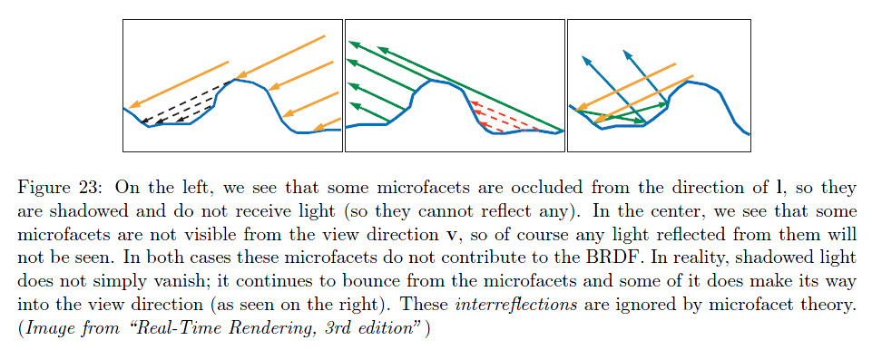
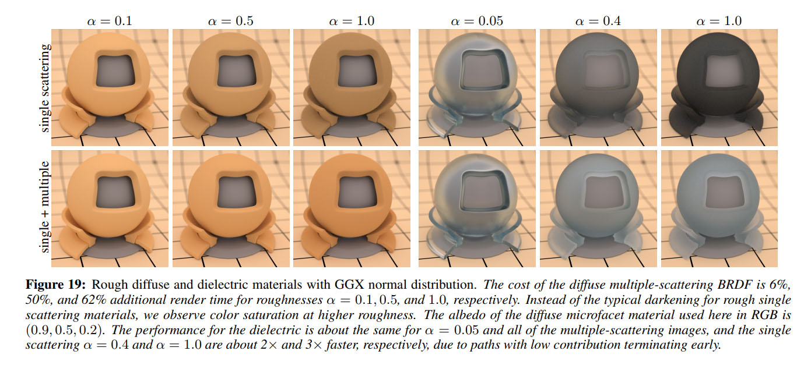

# Multiple-Scattering BRDF

In 2014 and 2015, many groundbreaking papers from Heitz et al. [^1] [^2] [^3] [^4] started to shed a new light (haha) on alternative models to the classical micro-facet model and introduced
 a more general volumetric framework called the "microflakes model" that tried to unify surfacic and volumetric materials into a unique solution (and indeed, in the real world, there is no such distinction between a "surface" and a "volume").

With this new micro-flakes model and adequate phase functions, Heitz et al. began to reflect (haha) on the re-introduction of the energy lost with classical BRDF models because of shadowing and masking.

Indeed, although the shadowing term correctly prevents a micro-surface element to be directly lit by a light source, the masking on the other hand is incorrectly removing lighting that, in the real world, would otherwise be indirectly perceived by reflection.

Suffice it to say that classical BRDF models up until 2014 were *single-scattering* models, while in reality, light bounces of the micro-structures of a surface/volume and is re-injected multiple times, showing a new gain in energy: real-world BRDFs are *multiple-scattering* models.

!!! quote ""
    

	(Source: "Multiple-Scattering Microfacet BSDFs with the Smith Model" [^4])

## Simulation

I first considered the problem with a brute-force solution where I simulated many rays hitting a micro-surface and analyzing the resulting lobes.

I got a somewhat complicated diffuse lobe model expression for multiple-scattering that I give at the end of this section:

**[Multiple-Scattering by Simulation](MSBRDFBruteForce)**

## Energy Compensation

Then, a much more interesting view came up from Kulla and Conty in a talk[^5] at Siggraph 2017 where they formulated a simpler way to retrieve the energy missing from multiple bounces.

It is discussed in this section:

**[Multiple-Scattering by Energy Compensation](MSBRDFEnergyCompensation)**

## References

[^1]: Heitz, E. 2014 ["Understanding the Masking-Shadowing Function in Microfacets-based BRDFs "]()
[^2]: Heitz, E. Dupuy, J. Crassin, C. Dachsbacher, C. 2014 ["The SGGX Microflake Distribution"]()
[^3]: Heitz, E. d'Eon, E. 2014 ["Importance Sampling Microfacet-Based BSDFs using the Distribution of Visible Normals"]()
[^4]: Heitz, E. Hanika, J. d'Eon, E. Dachsbacher, C. 2015 ["Multiple-Scattering Microfacet BSDFs with the Smith Model"]()
[^5]: Kulla, C. Conty, A. 2017 ["Revisiting Physically Based Shading at Imageworks"](http://blog.selfshadow.com/publications/s2017-shading-course/imageworks/s2017_pbs_imageworks_slides.pdf)

