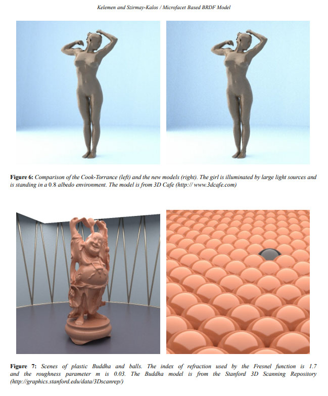
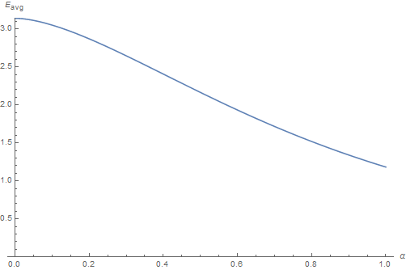
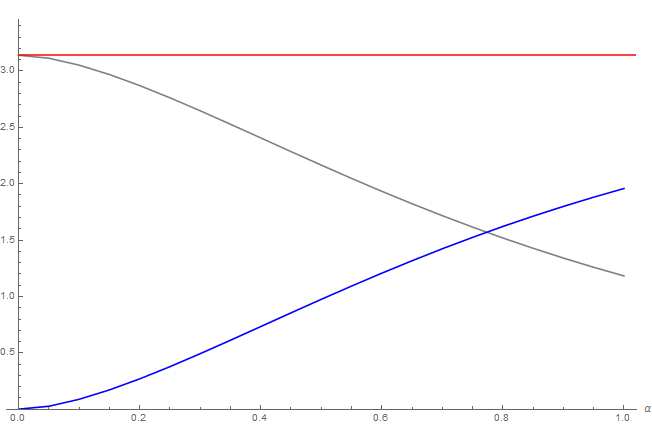
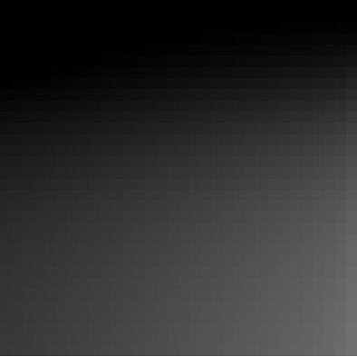
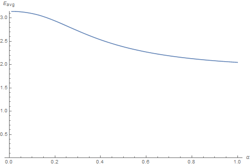
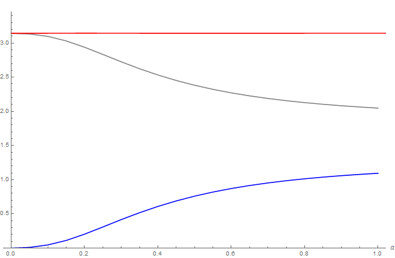
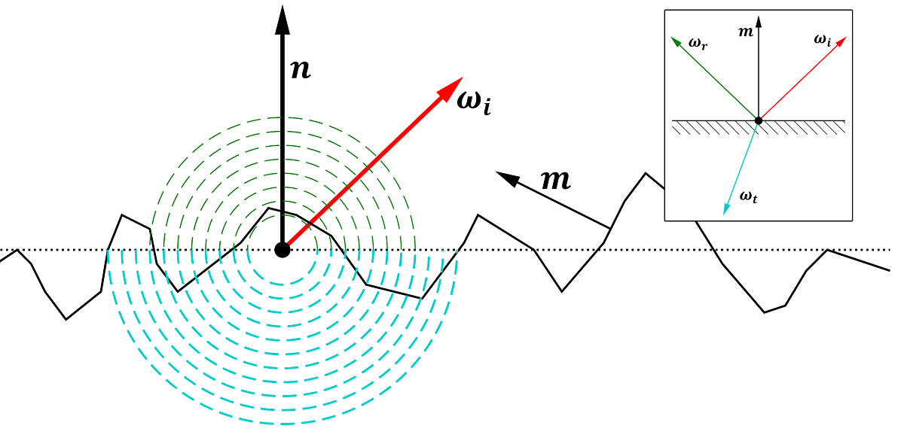
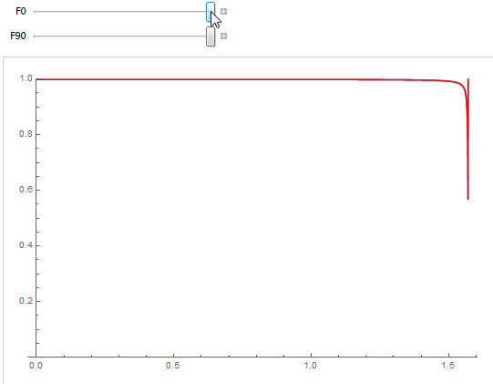
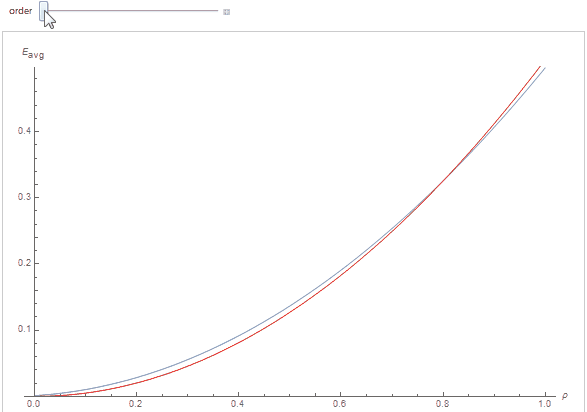


In their 2017 talk [^1] at the now famous [Siggraph's Physically Based Shading in Theory and Practice courses](http://blog.selfshadow.com/publications/s2017-shading-course/),
 Kulla and Conti re-introduced a computation [^2] devised long ago by Kelemen and Szirmay-Kalos in 2001.

## The Original Paper

In section 2.2 of their paper [^2], Kelemen et al. wrote about coupling the matte (*i.e.* diffuse) and specular parts of the BRDF.

They write the complete BRDF as:
$$
f_r(\boldsymbol{\omega_o},\boldsymbol{\omega_i}) = f_{r,spec}(\boldsymbol{\omega_o},\boldsymbol{\omega_i}) + f_{r,diff}(\boldsymbol{\omega_o},\boldsymbol{\omega_i})
$$

And claim that, although $f_{r,diff}(\boldsymbol{\omega_o},\boldsymbol{\omega_i})$ is difficult to estimate due to the many scattering events that occur when light is not specularly reflected but rather diffused through the material,
they can safely wager about the fact that $f_{r,diff}(\boldsymbol{\omega_o},\boldsymbol{\omega_i})$ is:

1. Energy-preserving
2. Symmetrical
3. Somehow, the **complement** (that's the operative word here) of the specular $f_{r,spec}(\boldsymbol{\omega_o},\boldsymbol{\omega_i})$ part


!!! note ""
    

	I remember being very impressed by the images produced by this paper by the time it was published (yes! I'm old!).<br/>
	I believe even now there is a very strong "ground truth" flavor emanating from these images.


### Prototyping the diffuse BRDF

They write the prototype for such an (*isotropic*) BRDF as:

$$
f_{r,diff}(\boldsymbol{\omega_o},\boldsymbol{\omega_i}) = k(\lambda).s.r(\mu_o).r(\mu_i) \tag{1}\label{(1)}
$$

Where:

* $k(\lambda)$ is a wavelength-dependent factor (namely, the surface's reflectance in [0,1] for different wavelengths)
* $s$ is a normalization factor yet to be determined
* $r(\mu)$ is some unknown "appropriate scalar function", yet to be determined too
* $\mu_i$ and $\mu_o$ are the $\boldsymbol{\omega_i}\cdot\boldsymbol{n} = \cos(\theta_i)$ and $\boldsymbol{\omega_o}\cdot\boldsymbol{n} = \cos(\theta_o)$ respectively, $\boldsymbol{n}$ being the surface's normal


### Solving for unknowns

Kelemen et al. continue by writing the albedo (*i.e.* total reflectance for a particular viewing direction) for such a diffuse material:

$$
\begin{align}
a_{diff}(\mu_o) &= \int_{0}^{2\pi} \int_{0}^{\frac{\pi}{2}} f_{r,diff}(\boldsymbol{\omega_o},\boldsymbol{\omega_i}) \mu_i \sin(\theta_i) d\theta_i d\phi_i	\\\\
a_{diff}(\mu_o) &= \int_{0}^{2\pi} \int_{0}^{\frac{\pi}{2}} k(\lambda).s.r(\mu_o) r(\mu_i) \mu_i \sin(\theta_i) d\theta_i d\phi_i	\\\\
a_{diff}(\mu_o) &= k(\lambda).s.r(\mu_o). 2\pi . \int_{0}^{\frac{\pi}{2}} r(\mu_i) \mu_i \sin(\theta_i) d\theta_i \tag{2}\label{(2)}
\end{align}
$$

!!! note
    Nowadays, we call this total reflectance integral the *"white furnace test"* as it simply integrates the BRDF against a unit radiance over the entire hemisphere.<br/>
    The albedo can thus simply be viewed as a measure of *irradiance* against a totally white ambient background and we will now write:
    
    $$
    a_{diff}(\mu_o) = E_{diff}(\mu_o)
    $$
    
    ($E$ being the symbol usually used for the irradiance)


Since $E_{diff}(\mu_o) + E_{spec}(\mu_o) \le 1$, we can conclude that necessarily:
$$
E_{diff}(\mu_o) \le 1-E_{spec}(\mu_o)
$$

Moreover, in the perfectly reflecting case where the total albedo $E_{diff}(\mu_o) + E_{spec}(\mu_o) = 1$ and $k(\lambda)=1$ then strictly:
$$
E_{diff}(\mu_o) = 1-E_{spec}(\mu_o) \tag{3}\label{(3)}
$$

Equation $\eqref{(2)}$ shows that the diffuse albedo is proportional to $r(\mu_o)$ and, symmetrically, $r(\mu_o)$ is thus proportional to $E_{diff}(\mu_o) = 1-E_{spec}(\mu_o)$.

The important takeway remark here is that:

$$
\begin{align}
	r(\mu_o) &\propto 1-E_{spec}(\mu_o) \\\\
	r(\mu_i) &\propto 1-E_{spec}(\mu_i) \\\\
\end{align}
$$

For the perfectly reflecting case, we can thus rewrite equation $\eqref{(1)}$ as:
$$
f_{r,diff}(\boldsymbol{\omega_o},\boldsymbol{\omega_i}) = s.(1-E_{spec}(\mu_o)).(1-E_{spec}(\mu_i))
$$

Substituting $\eqref{(3)}$ and this new BRDF into $\eqref{(2)}$ we get:

$$
\begin{align}
\left[1-E_{spec}(\mu_o)\right] &= s.\left[1-E_{spec}(\mu_o)\right]. 2\pi . \int_{0}^{\frac{\pi}{2}} \left[1-E_{spec}(\mu_i)\right] \mu_i \sin(\theta_i) d\theta_i \\\\
s &= \frac{1}{2\pi \left[ \int_{0}^{\frac{\pi}{2}} \left[1-E_{spec}(\mu_i)\right] \mu_i \sin(\theta_i) d\theta_i \right]} \\\\
s &= \frac{1}{\pi - E_{spec}^{avg} } \\\\
\end{align}
$$

Where the specular albedo averaged over all possible view directions on the hemisphere is represented by:

$$
E_{spec}^{avg} = \int_{\Omega^+} E_{spec}(\mu_i) \mu_i d\omega_i = 2\pi \int_0^1 E_{spec}(\mu_i) \mu_i d\mu_i \tag{4}\label{(4)}
$$

!!! warning
	Notice that in the Kelemen and Kulla notations for $f_{r,diff}(\boldsymbol{\omega_o},\boldsymbol{\omega_i})$, they factorized the $\pi$ out of the denominator
	so they write it as $\pi \left( 1 - E_{spec}^{avg} \right)$ and they have $E_{spec}^{avg} = 2 \int_0^1 E_{spec}(\mu_i) \mu_i d\mu_i$ instead but I find that highly
	disturbing so I didn't follow their example (I like to imagine the $E_{spec}^{avg}$ integral converging to a maximum of $\pi$ instead of obfuscating that fact for
	the sake of a "nicer way of writing the result").
<br/>


Finally we write:
$$
f_{r,diff}(\boldsymbol{\omega_o},\boldsymbol{\omega_i}) = \frac{(1-E_{spec}(\mu_o)).(1-E_{spec}(\mu_i))}{\pi - E_{spec}^{avg}} \tag{5}\label{(5)}
$$


### Proof of concept

Armed with this new expression for the diffuse BRDF, what happens if we integrate against a unit radiance over the entire hemisphere (*i.e.* the white furnace test again)?

$$
\begin{align}
E_{diff}(\mu_o) &= \int_0^{2\pi} \int_0^{\frac{\pi}{2}}  f_{r,diff}(\boldsymbol{\omega_o},\boldsymbol{\omega_i}) \cos(\theta_i) \sin(\theta_i) d\theta_i d\phi	\\\\
E_{diff}(\mu_o) &= \int_0^{2\pi} \int_0^{\frac{\pi}{2}}  \frac{(1-E_{spec}(\mu_o)).(1-E_{spec}(\mu_i))}{\pi - E_{spec}^{avg}} \cos(\theta_i) \sin(\theta_i) d\theta_i d\phi	\\\\
E_{diff}(\mu_o) &= \frac{1-E_{spec}(\mu_o)}{\pi - E_{spec}^{avg}} . \left[ 2\pi. \int_0^{\frac{\pi}{2}} (1-E_{spec}(\mu_i)) \cos(\theta_i) \sin(\theta_i) d\theta_i \right]	\\\\
E_{diff}(\mu_o) &= \frac{1-E_{spec}(\mu_o)}{\pi - E_{spec}^{avg}} . \left[ \pi - E_{spec}^{avg} \right]	\\\\
E_{diff}(\mu_o) &= 1-E_{spec}(\mu_o)	\\\\
\end{align}
$$

We see that $E_{diff}(\mu_o)$ ends up being **the exact complement** of $E_{spec}(\mu_o)$!

So Kelemen et al. already had the key in 2001 but they apparently failed to notice the importance of their result (or did they? :smile:).


## The Revised Usage

After all, isn't that result what we're looking for when looking to compute the multiple-scattering term? Missing energy due to a single-scattering BRDF term that is often too simple?

This is indeed exactly what Kulla et al. very cleverly noticed in their new way of viewing of the problem!

Let $E_{diff}(\mu_o)$ get rewritten as $E_{ms}(\mu_o)$ instead and we get:
$$
E_{ms}(\mu_o) = 1 - E(\mu_o)
$$

With $E_{ms}(\mu_o)$ the irradiance from the multiply-scattered BRDF and $E(\mu_o)$ the irradiance from our classical single-scattered BRDF.

And there you have it:

$$
\begin{align}
E_{ms}(\mu_o) &= 1 - E(\mu_o) \\\\
E_{ms}(\mu_o) &= 1 - \left[ \int_0^{2\pi} \int_0^{\frac{\pi}{2}}  f_r(\boldsymbol{\omega_o},\boldsymbol{\omega_i}) \cos(\theta_i) \sin(\theta_i) d\theta_i d\phi \right]	\\\\
E_{ms}(\mu_o) &= \int_0^{2\pi} \int_0^{\frac{\pi}{2}}  f_{r,ms}(\boldsymbol{\omega_o},\boldsymbol{\omega_i}) \cos(\theta_i) \sin(\theta_i) d\theta_i d\phi	\\\\
\end{align}
$$

And we have our new expression for the (ideally reflecting) multiple-scattering BRDF:
$$
f_{r,ms}(\boldsymbol{\omega_o},\boldsymbol{\omega_i}) = \frac{(1-E(\mu_o)).(1-E(\mu_i))}{\pi - E_{avg}} \tag{6}\label{(6)}
$$


## Applications to existing BRDF models

### GGX Specular Model

We use the (now) very common GGX normal distribution and Smith GGX shadowing/masking term:

$$
\begin{align}
f_r(\boldsymbol{\omega_o}, \boldsymbol{\omega_i}, \alpha) &= F( \boldsymbol{\omega_i} \cdot \boldsymbol{\omega_h}, F_0 ) \\\\
 &* \left[\frac{1}{\boldsymbol{\omega_i} \cdot \boldsymbol{n} + \sqrt{ \alpha^2 + (1-\alpha^2) (\boldsymbol{\omega_i} \cdot \boldsymbol{n})^2} }\right] \\\\
 &* \left[\frac{1}{\boldsymbol{\omega_o} \cdot \boldsymbol{n} + \sqrt{ \alpha^2 + (1-\alpha^2) (\boldsymbol{\omega_o} \cdot \boldsymbol{n})^2} }\right] \\\\
 &* \left[\frac{\alpha^2}{ \pi \left( (\boldsymbol{\omega_h} \cdot \boldsymbol{n})^2 . (\alpha^2 - 1) + 1 \right)^2 }\right] \\\\
\end{align}
$$

With $F_0$ the reflectance at normal incidence, $\alpha \in [0,1]$ the surface roughness and $\boldsymbol{\omega_h}$ the normalized half-vector.

Rewritten in terms of $\mu$ we have:

$$
\begin{align}
f_r( \mu_o, \mu_i, \alpha) &= F( \mu_d, F_0 ) \\\\
 &* \left[ \frac{1}{ \mu_i + \sqrt{ \alpha^2 + (1-\alpha^2) \cdot \mu_i^2 } }\right] \\\\
 &* \left[ \frac{1}{ \mu_o + \sqrt{ \alpha^2 + (1-\alpha^2) \cdot \mu_o^2 } }\right] \\\\
 &* \left[ \frac{\alpha^2}{ \pi \left( \mu_h^2 . (\alpha^2 - 1) + 1 \right)^2 }\right] \\\\
\end{align}
$$

With:

* $\mu_d = \boldsymbol{\omega_i} \cdot \boldsymbol{\omega_h}$ the cosine of the angle between the light and the half vector
* $\mu_h(\mu_o, \mu_i, \phi) = \boldsymbol{\omega_h} \cdot \boldsymbol{n} = \frac{ \mu_o + \mu_i } { \sqrt{ 2 \left( 1 + \mu_o \mu_i + (1-\mu_o^2)(1-\mu_i^2) \cos(\phi) \right) } }$
* $\phi$ the azimutal angle between $\boldsymbol{\omega_o}$ and $\boldsymbol{\omega_i}$.


#### Irradiance Table

With $F_0 = 1 \Rightarrow F( \mu_d, F_0 ) = 1$ at the moment (*i.e.* perfectly reflective case),
 we pre-compute the "complement albedo table" for all possible viewing angle $\mu_o=\cos(\theta_o)$ and all roughness values $\alpha$ for the specular BRDF:

$$
1 - E(\mu_o,\alpha) = 1 - \int_{\Omega^+} f_r(\boldsymbol{\omega_o}, \boldsymbol{\omega_i}, \alpha).(\boldsymbol{\omega_i} \cdot \boldsymbol{n}) d\omega_i
$$

You can see the resulting table below:


!!! warning
    Obviously, don't use this awful image directly but [this 128x128 table](MSBRDF_E128x128.csv) instead! :smile:
	(I provide a 128x128 version although, as noted by Kulla et al., the function is very smooth and a 32x32 texture is more than enough).

	The 1st float is $\mu = \cos(\theta)$ of the incident or outgoing ray direction, the 2nd float is the roughness $\alpha$ and the 3rd float is $E\left( \mu, \alpha \right)$ (caution, not $1-E$!)


#### Average Irradiance

Armed with this table, we can obtain the average irradiance table that only depends on roughness by computing $\eqref{(4)}$:

$$
E_{avg}\left( \alpha \right) = 2\pi \int_0^1 E(\mu_i,\alpha)\mu_i d\mu_i
$$




!!! info
    You can download [this table](MSBRDF_Eavg128.csv) representing the $E_{avg}$ for different values of roughness.<br/>
	The 1st float is the roughness $\alpha$ and the 2nd float is $E_{avg}\left( \alpha \right)$

	Alternatively, you can use the following analytical fit: $E_{avg}(\alpha) = \pi - 0.446898 \cdot \alpha - 5.72019 \cdot \alpha^2 + 6.61848 \cdot \alpha^3 - 2.41727 \cdot \alpha^4$


#### Energy Conservation Check

We quickly check the energy is conserved by ensuring that for all roughness values of $\alpha \in [0,1]$ we have:

$$
\int_{\Omega_+} \left[ \int_{\Omega_+} \left( f_{r,ggx}\left( \boldsymbol{\omega_o}, \boldsymbol{\omega_i}, \alpha \right) + f_{r,ms}\left( \boldsymbol{\omega_o}, \boldsymbol{\omega_i}, \alpha \right) \right)
(\boldsymbol{\omega_i} \cdot \boldsymbol{n}) d\omega_i \right]
(\boldsymbol{\omega_o} \cdot \boldsymbol{n}) d\omega_o = \pi
$$

!!! quote ""
	

	Gray curve is the GGX specular BRDF, blue curve is the "energy compensation BRDF", red curve is their sum that always yield $\pi$, thus ensuring the conservation of energy.

<br/>
We also quickly notice that the multiple scattering BRDF term becomes preponderant over the single scattering term when $\alpha > 0.8$, so for very rough materials where shadowing and masking are playing a major
 role in energy loss.


#### The case of perfectly reflective rough metal

Remembering that we fixed the Fresnel term to be $F( \mu_d, F_0 ) = 1$, the tables we just calculated can only give us the perfectly reflective 100% white metal BRDF case:


!!! todo
	**TODO**


### Oren-Nayar Diffuse Model

We now concentrate on another BRDF, the Oren-Nayar diffuse model.

First introduced in 1992 by Michael Oren and Shree Nayar in the context of machine vision[^3], then published again[^4] in 1994 for CGI this time, this model is similar to the Cook-Torrance micro-facet model
 used for specular reflection as it uses v-cavities to represent the roughness of a surface but this time for the diffuse case (*i.e.* the micro-facets are purely lambertian, not pure mirrors like with the Cook-Torrance model),
 the Lambertian reflectance being only a special configuration of this more general model.

Oren and Nayar also provide an additional inter-reflection term, as a complement to the single scattering BRDF but it is finally not included in their formulation. <br/>
It's this additional term that I propose to provide here using the multiple-scattering integral instead.


In section 4.4 of their paper, we find the expression for the BRDF of a generalized rough diffuse surface that is written as:

$$
\begin{align}
f_r( \theta_o, \phi_o, \theta_i, \phi_i, \sigma) &= \frac{\rho}{\pi} \left[ A + B \cdot max( 0, \cos( \phi_o - \phi_i ) ) \\\\
 \cdot \sin\left( max( \theta_o, \theta_i ) \right) \tan\left( min( \theta_o, \theta_i ) \right) \right] \\\\
 A &= 1 - \frac{\sigma^2}{2\left( \sigma^2 + 0.33 \right)} \\\\
 B &= 0.45 \frac{\sigma^2}{ \sigma^2 + 0.09} \\\\
\end{align}
$$

With $\rho$ the surface reflectance and $\sigma \in [0,\frac{\pi}{2}]$ the standard angle deviation for the micro-facets' slope distribution that represents the roughness of the surface.
Note that $\sigma = 0$ falls back to the standard Lambertian reflection.

You can find below a simple HLSL implementation for the Oren-Nayar diffuse model:

???- "Oren-Nayar Implementation (HLSL)"
	``` C++

		// Simple Oren-Nayar implementation
		//	_normal, unit surface normal
		//	_light, unit vector pointing toward the light
		//	_view, unit vector pointing toward the view
		//	_roughness, Oren-Nayar roughness parameter in [0,PI/2]
		//
		float	BRDF_OrenNayar( in float3 _normal, in float3 _view, in float3 _light, in float _roughness ) {
			float3	n = _normal;
			float3	l = _light;
			float3	v = _view;

			float	LdotN = dot( l, n );
			float	VdotN = dot( v, n );

			// I realize that this doesn't give cosine phi, we need to divide by sqrt( 1-VdotN*VdotN ) * sqrt( 1-LdotN*LdotN )
			//	but I couldn't distinguish any difference from the actual formula so I just left that as it is...
			float	gamma = dot(
								v - n * VdotN,
								l - n * LdotN 
							);
				
			float rough_sq = _roughness * _roughness;
			float A = 1.0 - 0.5 * (rough_sq / (rough_sq + 0.33));	// You can replace 0.33 by 0.57 to simulate the missing inter-reflection term, as specified in footnote of page 22 of the 1992 paper
			float B = 0.45 * (rough_sq / (rough_sq + 0.09));

			// Original formulation
			//	float angle_vn = acos( VdotN );
			//	float angle_ln = acos( LdotN );
			//	float alpha = max( angle_vn, angle_ln );
			//	float beta  = min( angle_vn, angle_ln );
			//	float C = sin(alpha) * tan(beta);

			// Optimized formulation (without tangents, arccos or sines)
			float2	cos_alpha_beta = VdotN < LdotN ? float2( VdotN, LdotN ) : float2( LdotN, VdotN );	// Here we reverse the min/max since cos() is a monotonically decreasing function
			float2	sin_alpha_beta = sqrt( saturate( 1.0 - cos_alpha_beta*cos_alpha_beta ) );			// Saturate to avoid NaN if ever cos_alpha > 1 (it happens with floating-point precision)
			float	C = sin_alpha_beta.x * sin_alpha_beta.y / (1e-6 + cos_alpha_beta.y);

			return A + B * max( 0.0, gamma ) * C;
		}

	```

#### Irradiance Table

Once again, keeping $\rho = 1$ at the moment (i.e. perfectly reflective case), we compute the irradiance table $E(\mu_o,\alpha)$ using the Oren-Nayar BRDF model, with $\sigma = \frac{\pi}{2} * \alpha$ and we obtain the following table:




!!! info
	The function is so smooth that this time I only give a [32x32 table](MSBRDF_OrenNayar_E32x32.csv) with the same formatting as the GGX tables.


#### Average Irradiance

And again, we can obtain the average irradiance table that only depends on roughness:




!!! info
    You can download [this table](MSBRDF_OrenNayar_Eavg32.csv) representing the $E_{avg}$ for different values of roughness.

	Alternatively, you can use the following analytical fit: $E_{avg}(\alpha) = \pi - 7.49231 \cdot \alpha^2 + 11.4409 \cdot \alpha^3 - 5.05903 \cdot \alpha^4$


#### Energy Conservation Check

We quickly check the energy is conserved by ensuring that for all roughness values of $\alpha \in [0,1]$ we have:

$$
\int_{\Omega_+} \left[ \int_{\Omega_+} \left( f_{r,oren-nayar}\left( \boldsymbol{\omega_o}, \boldsymbol{\omega_i}, \alpha \right) + f_{r,ms}\left( \boldsymbol{\omega_o}, \boldsymbol{\omega_i}, \alpha \right) \right)
(\boldsymbol{\omega_i} \cdot \boldsymbol{n}) d\omega_i \right]
(\boldsymbol{\omega_o} \cdot \boldsymbol{n}) d\omega_o = \pi
$$

!!! quote ""
	

	Gray curve is the Oren-Nayar diffuse BRDF, blue curve is the "energy compensation BRDF", red curve is their sum that always yield $\pi$, thus ensuring the conservation of energy.

<br/>


## With varying Specular Fresnel

Up until this point we have made 2 important assumptions regarding the BRDFs we have seen:

* The Fresnel reflectance $F( \mu_d, F_0 ) = 1$ for the GGX BRDF
* The diffuse reflectance $\rho = 1$ for the Oren-Nayar BRDF.

What this means is that the total irradiance that is lost when the light hits the micro-surface multiple times, which is $\pi - E_{avg}$, is entirely redistributed into the multiple-scattering term.


Obviously, all the tiny micro-facets composing the microscopic surface stop being perfect mirrors when the $F_0$ term is not 1 anymore:
 some of the incoming energy gets reflected off the surface (in green), and the remaining energy gets refracted below the surface (in blue).




We are thus looking for a factor $k \in [0,1]$ that will be applied to the multiple scattering BRDF term, the complement of this factor $1 - k$ should be applied to the diffuse part.


!!! note
	I verified that the dielectric and metallic Fresnel expressions almost match for all possible $F_0$ so the provided expression works regardless of the nature of the material.




## With varying Diffuse Albedo

Now focusing on varying the diffuse reflectance $\rho$ for the Oren-Nayar BRDF, once again using my heavy-duty micro-facet ray-tracer to simulate the total irradiance outgoing the micro-surface
 for various values of incident angle, surface roughness and albedo, I performed the white furnace integration for scattering orders from 2 to 6.
 
!!! note
	The white furnace from experimental data differs quite a lot from the one we got from the analytical Oren-Nayar integral I must say.
	(but I think that's to be expected from an approximate model and an empirical simulation?)

By cheating a little and knowing full well I could be expecting a polynomial of the form $f(\rho)=a_n \cdot \rho^n$, with $n$ the scattering order, I obtain a very good fit indeed as can be seen below
 where each curve represents white the furnace integral as a function of surface albedo $\rho$, the red curve is the polynomial fit for the scattering order:




## Integrating Hemispherical Ambient Lighting

Si on a une ambient light sous forme de SH, on a toutes les infos pour toute l'hémisphère. Que ressort-il de la MSBRDF dans ce cas?

!!! todo
	**TODO**

## Integrating Area Lighting

Si on a une area light, on a une certaine couverture de l'angle solide. Que ressort-il de la MSBRDF dans ce cas?

!!! todo
	**TODO**


## References

[^1]: Kulla, C. Conty, A. 2017 ["Revisiting Physically Based Shading at Imageworks"](http://blog.selfshadow.com/publications/s2017-shading-course/imageworks/s2017_pbs_imageworks_slides.pdf)
[^2]: Kelemen, C. Szirmay-Kalos, L. 2001 ["A Microfact Based Coupled Specular-Matte BRDF Model with Importance Sampling"](https://pdfs.semanticscholar.org/658b/a4e43402545e5478ea5b8b2cdea3ebe59675.pdf)
[^3]: Oren, M. Nayar, S. 1992 ["Generalization of the Lambertian Model and Implications for Machine Vision"](http://www1.cs.columbia.edu/CAVE/publications/pdfs/Nayar_IJCV95.pdf)
[^4]: Oren, M. Nayar, S. 1994 ["Generalization of Lambert's Reflectance Model"](http://www1.cs.columbia.edu/CAVE/publications/pdfs/Oren_SIGGRAPH94.pdf)