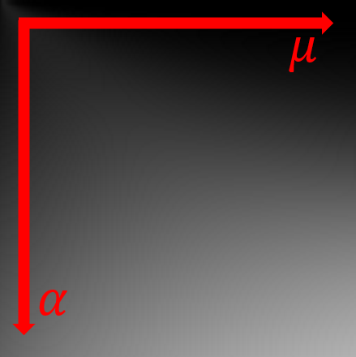
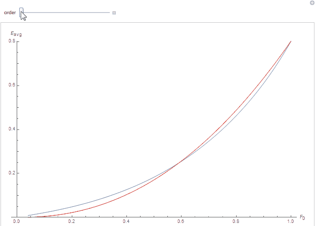

In their 2017 talk [^1] at the now famous [Siggraph's Physically Based Shading in Theory and Practice courses](http://blog.selfshadow.com/publications/s2017-shading-course/),
 Kulla and Conti re-introduced a computation [^2] devised long ago by Kelemen and Szirmay-Kalos in 2001.

## The Original Paper

In section 2.2 of their paper [^2], Kelemen et al. wrote about coupling the matte (*i.e.* diffuse) and specular parts of the BRDF.

They write the complete BRDF as:
$$
f_r(\boldsymbol{\omega_o},\boldsymbol{\omega_i}) = f_{r,spec}(\boldsymbol{\omega_o},\boldsymbol{\omega_i}) + f_{r,diff}(\boldsymbol{\omega_o},\boldsymbol{\omega_i})
$$

And claim that, although $f_{r,diff}(\boldsymbol{\omega_o},\boldsymbol{\omega_i})$ is difficult to estimate due to the many scattering events that occur when light is not specularly reflected but rather diffused through the material,
they can safely wager about the fact that $f_{r,diff}(\boldsymbol{\omega_o},\boldsymbol{\omega_i})$ is:

1. Energy-preserving
2. Symmetrical
3. Somehow, the **complement** (that's the operative word here) of the specular $f_{r,spec}(\boldsymbol{\omega_o},\boldsymbol{\omega_i})$ part


!!! note ""
    

	I remember being very impressed by the images produced by this paper by the time it was published (yes! I'm old!).<br/>
	I believe even now there is a very strong "ground truth" flavor emanating from these images.


### Prototyping the diffuse BRDF

They write the prototype for such an (*isotropic*) BRDF as:

$$
f_{r,diff}(\boldsymbol{\omega_o},\boldsymbol{\omega_i}) = k(\lambda).s.r(\mu_o).r(\mu_i) \tag{1}\label{(1)}
$$

Where:

* $k(\lambda)$ is a wavelength-dependent factor (namely, the surface's reflectance in [0,1] for different wavelengths)
* $s$ is a normalization factor yet to be determined
* $r(\mu)$ is some unknown "appropriate scalar function", yet to be determined too
* $\mu_i$ and $\mu_o$ are the $\boldsymbol{\omega_i}\cdot\boldsymbol{n} = \cos(\theta_i)$ and $\boldsymbol{\omega_o}\cdot\boldsymbol{n} = \cos(\theta_o)$ respectively, $\boldsymbol{n}$ being the surface's normal


### Solving for unknowns

Kelemen et al. continue by writing the albedo (*i.e.* total reflectance for a particular viewing direction) for such a diffuse material:

$$
\begin{align}
a_{diff}(\mu_o) &= \int_{0}^{2\pi} \int_{0}^{\frac{\pi}{2}} f_{r,diff}(\boldsymbol{\omega_o},\boldsymbol{\omega_i}) \mu_i \sin(\theta_i) d\theta_i d\phi_i	\\\\
a_{diff}(\mu_o) &= \int_{0}^{2\pi} \int_{0}^{\frac{\pi}{2}} k(\lambda).s.r(\mu_o) r(\mu_i) \mu_i \sin(\theta_i) d\theta_i d\phi_i	\\\\
a_{diff}(\mu_o) &= k(\lambda).s.r(\mu_o). 2\pi . \int_{0}^{\frac{\pi}{2}} r(\mu_i) \mu_i \sin(\theta_i) d\theta_i \tag{2}\label{(2)}
\end{align}
$$

!!! note
    Nowadays, we call this total reflectance integral the *"white furnace test"* as it simply integrates the BRDF against a unit radiance over the entire hemisphere.<br/>
    The albedo can thus simply be viewed as a measure of *irradiance* against a totally white ambient background and we will now write:
    
    $$
    a_{diff}(\mu_o) = E_{diff}(\mu_o)
    $$
    
    ($E$ being the symbol usually used for the irradiance)


Since $E_{diff}(\mu_o) + E_{spec}(\mu_o) \le 1$, we can conclude that necessarily:
$$
E_{diff}(\mu_o) \le 1-E_{spec}(\mu_o)
$$

Moreover, in the perfectly reflecting case where the total albedo $E_{diff}(\mu_o) + E_{spec}(\mu_o) = 1$ and $k(\lambda)=1$ then strictly:
$$
E_{diff}(\mu_o) = 1-E_{spec}(\mu_o) \tag{3}\label{(3)}
$$

Equation $\eqref{(2)}$ shows that the diffuse albedo is proportional to $r(\mu_o)$ and, symmetrically, $r(\mu_o)$ is thus proportional to $E_{diff}(\mu_o) = 1-E_{spec}(\mu_o)$.

The important takeway remark here is that:

$$
\begin{align}
	r(\mu_o) &\propto 1-E_{spec}(\mu_o) \\\\
	r(\mu_i) &\propto 1-E_{spec}(\mu_i) \\\\
\end{align}
$$

For the perfectly reflecting case, we can thus rewrite equation $\eqref{(1)}$ as:
$$
f_{r,diff}(\boldsymbol{\omega_o},\boldsymbol{\omega_i}) = s.(1-E_{spec}(\mu_o)).(1-E_{spec}(\mu_i))
$$

Substituting $\eqref{(3)}$ and this new BRDF into $\eqref{(2)}$ we get:

$$
\begin{align}
\left[1-E_{spec}(\mu_o)\right] &= s.\left[1-E_{spec}(\mu_o)\right]. 2\pi . \int_{0}^{\frac{\pi}{2}} \left[1-E_{spec}(\mu_i)\right] \mu_i \sin(\theta_i) d\theta_i \\\\
s &= \frac{1}{2\pi \left[ \int_{0}^{\frac{\pi}{2}} \left[1-E_{spec}(\mu_i)\right] \mu_i \sin(\theta_i) d\theta_i \right]} \\\\
s &= \frac{1}{\pi - E_{spec}^{avg} } \\\\
\end{align}
$$

Where the specular albedo averaged over all possible view directions on the hemisphere is represented by:

$$
E_{spec}^{avg} = \int_{\Omega^+} E_{spec}(\mu_i) \mu_i d\omega_i = 2\pi \int_0^1 E_{spec}(\mu_i) \mu_i d\mu_i \tag{4}\label{(4)}
$$

!!! warning
	Notice that in the Kelemen and Kulla notations for $f_{r,diff}(\boldsymbol{\omega_o},\boldsymbol{\omega_i})$, they factorized the $\pi$ out of the denominator
	so they write it as $\pi \left( 1 - E_{spec}^{avg} \right)$ and they have $E_{spec}^{avg} = 2 \int_0^1 E_{spec}(\mu_i) \mu_i d\mu_i$ instead but I find that highly
	disturbing so I didn't follow their example (I like to imagine the $E_{spec}^{avg}$ integral converging to a maximum of $\pi$ instead of obfuscating that fact for
	the sake of a "nicer way of writing the result").
<br/>


Finally we write:
$$
f_{r,diff}(\boldsymbol{\omega_o},\boldsymbol{\omega_i}) = \frac{(1-E_{spec}(\mu_o)).(1-E_{spec}(\mu_i))}{\pi - E_{spec}^{avg}} \tag{5}\label{(5)}
$$


### Proof of concept

Armed with this new expression for the diffuse BRDF, what happens if we integrate against a unit radiance over the entire hemisphere (*i.e.* the white furnace test again)?

$$
\begin{align}
E_{diff}(\mu_o) &= \int_0^{2\pi} \int_0^{\frac{\pi}{2}}  f_{r,diff}(\boldsymbol{\omega_o},\boldsymbol{\omega_i}) \cos(\theta_i) \sin(\theta_i) d\theta_i d\phi	\\\\
E_{diff}(\mu_o) &= \int_0^{2\pi} \int_0^{\frac{\pi}{2}}  \frac{(1-E_{spec}(\mu_o)).(1-E_{spec}(\mu_i))}{\pi - E_{spec}^{avg}} \cos(\theta_i) \sin(\theta_i) d\theta_i d\phi	\\\\
E_{diff}(\mu_o) &= \frac{1-E_{spec}(\mu_o)}{\pi - E_{spec}^{avg}} . \left[ 2\pi. \int_0^{\frac{\pi}{2}} (1-E_{spec}(\mu_i)) \cos(\theta_i) \sin(\theta_i) d\theta_i \right]	\\\\
E_{diff}(\mu_o) &= \frac{1-E_{spec}(\mu_o)}{\pi - E_{spec}^{avg}} . \left[ \pi - E_{spec}^{avg} \right]	\\\\
E_{diff}(\mu_o) &= 1-E_{spec}(\mu_o)	\\\\
\end{align}
$$

We see that $E_{diff}(\mu_o)$ ends up being **the exact complement** of $E_{spec}(\mu_o)$!

So Kelemen et al. already had the key in 2001 but they apparently failed to notice the importance of their result (or did they? :smile:).


## The Revised Usage

After all, isn't that result what we're looking for when looking to compute the multiple-scattering term? Missing energy due to a single-scattering BRDF term that is often too simple?

This is indeed exactly what Kulla et al. very cleverly noticed in their new way of viewing of the problem!

Let $E_{diff}(\mu_o)$ get rewritten as $E_{ms}(\mu_o)$ instead and we get:
$$
E_{ms}(\mu_o) = 1 - E(\mu_o)
$$

With $E_{ms}(\mu_o)$ the irradiance from the multiply-scattered BRDF and $E(\mu_o)$ the irradiance from our classical single-scattered BRDF.

And there you have it:

$$
\begin{align}
E_{ms}(\mu_o) &= 1 - E(\mu_o) \\\\
E_{ms}(\mu_o) &= 1 - \left[ \int_0^{2\pi} \int_0^{\frac{\pi}{2}}  f_r(\boldsymbol{\omega_o},\boldsymbol{\omega_i}) \cos(\theta_i) \sin(\theta_i) d\theta_i d\phi \right]	\\\\
E_{ms}(\mu_o) &= \int_0^{2\pi} \int_0^{\frac{\pi}{2}}  f_{r,ms}(\boldsymbol{\omega_o},\boldsymbol{\omega_i}) \cos(\theta_i) \sin(\theta_i) d\theta_i d\phi	\\\\
\end{align}
$$

And we have our new expression for the (ideally reflecting) multiple-scattering BRDF:
$$
f_{r,ms}(\boldsymbol{\omega_o},\boldsymbol{\omega_i}) = \frac{(1-E(\mu_o)).(1-E(\mu_i))}{\pi - E_{avg}} \tag{6}\label{(6)}
$$


!!! quote ""
    

	White furnace test without and with energy compensation for various values of surface roughness.</br>
	(the background environment intensity is 1 while the scene intensity is 0.9 to make sure there is no overshoot in energy reflection).

	***Top Row:*** The classical single-scattering BRDF clearly fails at restituting the entire energy received by the material<br/>
	***Middle Row:*** The multiple-scattering BRDF term from the energy compensation technique successfully bounces back the entirety of the energy received by the material.<br/>
	***Bottom Row:*** Difference.


## Applications to existing BRDF models

### GGX Specular Model

We use the (now) very common GGX normal distribution and Smith GGX shadowing/masking term:

$$
\begin{align}
f_r(\boldsymbol{\omega_o}, \boldsymbol{\omega_i}, \alpha) &= F( \boldsymbol{\omega_i} \cdot \boldsymbol{\omega_h}, F_0 ) \\\\
 &* \left[\frac{1}{\boldsymbol{\omega_i} \cdot \boldsymbol{n} + \sqrt{ \alpha^2 + (1-\alpha^2) (\boldsymbol{\omega_i} \cdot \boldsymbol{n})^2} }\right] \\\\
 &* \left[\frac{1}{\boldsymbol{\omega_o} \cdot \boldsymbol{n} + \sqrt{ \alpha^2 + (1-\alpha^2) (\boldsymbol{\omega_o} \cdot \boldsymbol{n})^2} }\right] \\\\
 &* \left[\frac{\alpha^2}{ \pi \left( (\boldsymbol{\omega_h} \cdot \boldsymbol{n})^2 . (\alpha^2 - 1) + 1 \right)^2 }\right] \\\\
\end{align}
$$

With $F_0$ the reflectance at normal incidence, $\alpha \in [0,1]$ the surface roughness and $\boldsymbol{\omega_h}$ the normalized half-vector.

Rewritten in terms of $\mu$ we have:

$$
\begin{align}
f_r( \mu_o, \mu_i, \alpha) &= F( \mu_d, F_0 ) \\\\
 &* \left[ \frac{1}{ \mu_i + \sqrt{ \alpha^2 + (1-\alpha^2) \cdot \mu_i^2 } }\right] \\\\
 &* \left[ \frac{1}{ \mu_o + \sqrt{ \alpha^2 + (1-\alpha^2) \cdot \mu_o^2 } }\right] \\\\
 &* \left[ \frac{\alpha^2}{ \pi \left( \mu_h^2 . (\alpha^2 - 1) + 1 \right)^2 }\right] \\\\
\end{align}
$$

With:

* $\mu_d = \boldsymbol{\omega_i} \cdot \boldsymbol{\omega_h}$ the cosine of the angle between the light and the half vector
* $\mu_h(\mu_o, \mu_i, \phi) = \boldsymbol{\omega_h} \cdot \boldsymbol{n} = \frac{ \mu_o + \mu_i } { \sqrt{ 2 \left( 1 + \mu_o \mu_i + (1-\mu_o^2)(1-\mu_i^2) \cos(\phi) \right) } }$
* $\phi$ the azimutal angle between $\boldsymbol{\omega_o}$ and $\boldsymbol{\omega_i}$.


#### Irradiance Table

With $F_0 = 1 \Rightarrow F( \mu_d, F_0 ) = 1$ at the moment (*i.e.* perfectly reflective case),
 we pre-compute the "complement albedo table" for all possible viewing angle $\mu_o=\cos(\theta_o)$ and all roughness values $\alpha$ for the specular BRDF:

$$
1 - E(\mu_o,\alpha) = 1 - \int_{\Omega^+} f_r(\boldsymbol{\omega_o}, \boldsymbol{\omega_i}, \alpha).(\boldsymbol{\omega_i} \cdot \boldsymbol{n}) d\omega_i
$$

You can see the resulting table below:



!!! warning
    Obviously, don't use this awful image directly but [this 128x128 table](MSBRDF_GGX_E128x128.csv) instead! :smile:
	(I provide a 128x128 version although, as noted by Kulla et al., the function is very smooth and a 32x32 texture is more than enough).

	The 1st float is $\mu = \cos(\theta)$ of the incident or outgoing ray direction, the 2nd float is the roughness $\alpha$ and the 3rd float is $E\left( \mu, \alpha \right)$ (caution, not $1-E$!)

	If you're using the *correlated* Smith Shadowing/Masking function instead of the uncorrelated one described by the BRDF equation above, please use [this table](MSBRDF_GGX_G2_E128x128.csv) instead.


#### Average Irradiance

Armed with this table, we can obtain the average irradiance table that only depends on roughness by computing $\eqref{(4)}$:

$$
E_{avg}\left( \alpha \right) = 2\pi \int_0^1 E(\mu_i,\alpha)\mu_i d\mu_i
$$


!!! info
    You can download [this table](MSBRDF_GGX_Eavg128.csv) representing the $E_{avg}$ for different values of roughness.<br/>
	The 1st float is the roughness $\alpha$ and the 2nd float is $E_{avg}\left( \alpha \right)$

	Alternatively, you can use the following analytical fit: $E_{avg}(\alpha) = \pi - 0.446898 \cdot \alpha - 5.72019 \cdot \alpha^2 + 6.61848 \cdot \alpha^3 - 2.41727 \cdot \alpha^4$

	If you're using the *correlated* Smith Shadowing/Masking function instead of the uncorrelated one described by the BRDF equation above, please use [this table](MSBRDF_GGX_G2_Eavg128.csv) instead.


#### Energy Conservation Check

We quickly check the energy is conserved by ensuring that for all roughness values of $\alpha \in [0,1]$ we have:

$$
\int_{\Omega_+} \left[ \int_{\Omega_+} \left( f_{r,ggx}\left( \boldsymbol{\omega_o}, \boldsymbol{\omega_i}, \alpha \right) + f_{r,ms}\left( \boldsymbol{\omega_o}, \boldsymbol{\omega_i}, \alpha \right) \right)
(\boldsymbol{\omega_i} \cdot \boldsymbol{n}) d\omega_i \right]
(\boldsymbol{\omega_o} \cdot \boldsymbol{n}) d\omega_o = \pi
$$

!!! quote ""
	

	Gray curve is the GGX specular BRDF, blue curve is the "energy compensation BRDF", red curve is their sum that always yield $\pi$, thus ensuring the conservation of energy.

<br/>
We also quickly notice that the multiple scattering BRDF term becomes preponderant over the single scattering term when $\alpha > 0.8$, so for very rough materials where shadowing and masking are playing a major
 role in energy loss.


#### The case of perfectly reflective rough metal

Remembering that we fixed the Fresnel term to be $F( \mu_d, F_0 ) = 1$, the tables we just calculated can only give us the perfectly reflective 100% white metal BRDF case:

!!! quote ""
	

	***Top Row:*** The classical single-scattering GGX BRDF shows a loss of energy at high roughness<br/>
	***Middle Row:*** The multiple-scattering BRDF term with the energy compensation technique successfully restores the lost energy.<br/>
	***Bottom Row:*** Difference.


### Oren-Nayar Diffuse Model

We now concentrate on another BRDF, the Oren-Nayar diffuse model.

First introduced in 1992 by Michael Oren and Shree Nayar in the context of machine vision[^3], then published again[^4] in 1994 for CGI this time, this model is similar to the Cook-Torrance micro-facet model
 used for specular reflection as it uses v-cavities to represent the roughness of a surface but this time for the diffuse case (*i.e.* the micro-facets are purely lambertian, not pure mirrors like with the Cook-Torrance model),
 the Lambertian reflectance being only a special configuration of this more general model.

Oren and Nayar also provide an additional inter-reflection term, as a complement to the single scattering BRDF but it is finally not included in their formulation. <br/>
It's this additional term that I propose to provide here using the multiple-scattering integral instead.


In section 4.4 of their paper, we find the expression for the BRDF of a generalized rough diffuse surface that is written as:

$$
\begin{align}
f_r( \theta_o, \phi_o, \theta_i, \phi_i, \sigma) &= \frac{\rho}{\pi} \left[ A + B \cdot max( 0, \cos( \phi_o - \phi_i ) ) \\\\
 \cdot \sin\left( max( \theta_o, \theta_i ) \right) \tan\left( min( \theta_o, \theta_i ) \right) \right] \\\\
 A &= 1 - \frac{\sigma^2}{2\left( \sigma^2 + 0.33 \right)} \\\\
 B &= 0.45 \frac{\sigma^2}{ \sigma^2 + 0.09} \\\\
\end{align}
$$

With $\rho$ the surface reflectance and $\sigma \in [0,\frac{\pi}{2}]$ the standard angle deviation for the micro-facets' slope distribution that represents the roughness of the surface.
Note that $\sigma = 0$ falls back to the standard Lambertian reflection.

You can find below a simple HLSL implementation for the Oren-Nayar diffuse model:

???- "Oren-Nayar Implementation (HLSL)"
	``` C++

		// Simple Oren-Nayar implementation
		//	_normal, unit surface normal
		//	_light, unit vector pointing toward the light
		//	_view, unit vector pointing toward the view
		//	_roughness, Oren-Nayar roughness parameter in [0,PI/2]
		//
		float	BRDF_OrenNayar( in float3 _normal, in float3 _view, in float3 _light, in float _roughness ) {
			float3	n = _normal;
			float3	l = _light;
			float3	v = _view;

			float	LdotN = dot( l, n );
			float	VdotN = dot( v, n );

			float   gamma = dot( v - n * VdotN, l - n * LdotN )
						  / (sqrt( saturate( 1.0 - VdotN*VdotN ) ) * sqrt( saturate( 1.0 - LdotN*LdotN ) ));

			float rough_sq = _roughness * _roughness;
			float A = 1.0 - 0.5 * (rough_sq / (rough_sq + 0.33));	// You can replace 0.33 by 0.57 to simulate the missing inter-reflection term, as specified in footnote of page 22 of the 1992 paper
			float B = 0.45 * (rough_sq / (rough_sq + 0.09));

			// Original formulation
			//	float angle_vn = acos( VdotN );
			//	float angle_ln = acos( LdotN );
			//	float alpha = max( angle_vn, angle_ln );
			//	float beta  = min( angle_vn, angle_ln );
			//	float C = sin(alpha) * tan(beta);

			// Optimized formulation (without tangents, arccos or sines)
			float2	cos_alpha_beta = VdotN < LdotN ? float2( VdotN, LdotN ) : float2( LdotN, VdotN );	// Here we reverse the min/max since cos() is a monotonically decreasing function
			float2	sin_alpha_beta = sqrt( saturate( 1.0 - cos_alpha_beta*cos_alpha_beta ) );			// Saturate to avoid NaN if ever cos_alpha > 1 (it happens with floating-point precision)
			float	C = sin_alpha_beta.x * sin_alpha_beta.y / (1e-6 + cos_alpha_beta.y);

			return A + B * max( 0.0, gamma ) * C;
		}

	```

#### Irradiance Table

Once again, keeping $\rho = 1$ at the moment (i.e. perfectly reflective case), we compute the irradiance table $E(\mu_o,\alpha)$ using the Oren-Nayar BRDF model, with $\sigma = \frac{\pi}{2} * \alpha$ and we obtain the following table:


!!! info
	The function is so smooth that this time I only give a [32x32 table](MSBRDF_OrenNayar_E32x32.csv) with the same formatting as the GGX tables.


#### Average Irradiance

And again, we can obtain the average irradiance table that only depends on roughness:


!!! info
    You can download [this table](MSBRDF_OrenNayar_Eavg32.csv) representing the $E_{avg}$ for different values of roughness.

	Alternatively, you can use the following analytical fit: $E_{avg}(\alpha) = \pi - 7.49231 \cdot \alpha^2 + 11.4409 \cdot \alpha^3 - 5.05903 \cdot \alpha^4$


#### Energy Conservation Check

We quickly check the energy is conserved by ensuring that for all roughness values of $\alpha \in [0,1]$ we have:

$$
\int_{\Omega_+} \left[ \int_{\Omega_+} \left( f_{r,oren-nayar}\left( \boldsymbol{\omega_o}, \boldsymbol{\omega_i}, \alpha \right) + f_{r,ms}\left( \boldsymbol{\omega_o}, \boldsymbol{\omega_i}, \alpha \right) \right)
(\boldsymbol{\omega_i} \cdot \boldsymbol{n}) d\omega_i \right]
(\boldsymbol{\omega_o} \cdot \boldsymbol{n}) d\omega_o = \pi
$$

!!! quote ""
	

	Gray curve is the Oren-Nayar diffuse BRDF, blue curve is the "energy compensation BRDF", red curve is their sum that always yield $\pi$, thus ensuring the conservation of energy.

<br/>


#### The case of perfectly reflective rough diffuse

Remembering that we fixed the diffuse reflectance term to be $\rho = 1$, the tables we just calculated can only give us the perfectly reflective 100% white diffuse BRDF case:

!!! quote ""
	

	***Top Row:*** The classical single-scattering Oren-Nayar BRDF shows a loss of energy at high roughness<br/>
	***Middle Row:*** The multiple-scattering BRDF term with the energy compensation technique successfully restores the lost energy.<br/>
	***Bottom Row:*** Difference.


## Dealing with Varying Reflectances

Up until this point we have made 2 important assumptions regarding the BRDFs we have seen:

* The Fresnel reflectance $F( \mu_d, F_0 ) = 1$ for the GGX BRDF
* The diffuse reflectance $\rho = 1$ for the Oren-Nayar BRDF.

What this means is that the total irradiance that is lost when the light hits the micro-surface multiple times, which is $\pi - E_{avg}$, is entirely redistributed into the multiple-scattering term.

Obviously, with real life materials the light gets more or less transmitted through the surface and continues its path:

* For metals, most of the photons get absorbed, transformed into electrons and they never exit the surface as photons again (or maybe super weakened as infrared? Not sure about that).
* For dielectrics:
	* If the material has a crystaline structure then photons just don't interact with it unless they have sufficient energy to change the orbits of electrons (that's quantum mechanic domain here)
	* For regular materials though (or crystals with impurities), it's a mixture of scattering and absorption events not unlike what happens in a participating medium but here the medium density
	is extremely high and extinction happens very quickly.
	<br/> Nevertheless after many scattering events, the photons adopt a rather isotropic distribution (hence the mainly diffuse aspect of reflected light)
	and some of it may exit the surface again, maybe at the same location it entered the surface (the BRDF hypothesis) but more plausibly at a nearby location (the BSSRDF hypothesis), and possibly even
	through the surface (i.e. translucency)


In order to apply the multiple-scattering part of the BRDF, we need to know how much is actually redistributed in reflection depending on the reflectance associated to the BRDF, be it the Fresnel reflectance
 for the specular BRDFs, or the diffuse reflectance for the diffuse BRDFs.


### Varying the Fresnel Reflectance $F_0$

Obviously, when the $F_0$ term is not 1 anymore then the tiny micro-facets composing the microscopic surface stop being perfect mirrors:
 some of the incoming energy gets reflected off the surface (in green), and the remaining energy gets refracted below the surface (in blue).

!!! quote ""
	

	The macroscopic result of combining many micro-facets gives a certain amount of the incoming energy that gets reflected (in green), and a certain amount gets transmitted (in blue).<br/>
	BRDF models provide a way of estimating the reflected and refracted amounts of energy based on a statistical analysis of the properties of idealized micro-surfaces.<br/>
	**Inset:** The ideal micro-facet mirror configuration, with a perfect reflection direction (in green) and perfect refraction direction (in blue).

<br/>
We are thus looking for a factor $f(F_0) \in [0,1]$ that will be applied to the multiple scattering BRDF term, the complement of this factor $1 - f(F_0)$ times the MSBRDF term should be redistributed
 to the part below the specular interface (*e.g.* the diffuse BRDF).

In order to compute such a factor I used my [heavy-duty micro-facet ray-tracer](../MSBRDFBruteForce) to simulate the total irradiance outgoing the micro-surface
 for various values of incident angle, surface roughness and $F_0$.

!!! note
	I verified that the dielectric and metallic Fresnel expressions almost match for all possible $F_0$ so the provided expression works regardless of the nature of the material,
	as can be seen below where the blue curve is the "Artist-Friendly Metal Fresnel" formulation by Ole Gulbrandsen[^5] and the red curve is the classical dielectric Fresnel formulation
	given by Cook & Torrance[^6].<br/>
	We see the curves almost completely match as long as the grazing angle reflectance $F_{90}=1$. The dielectric formulation is obviously prefered for low values of $F_0 < 0.2$:

	


Then, I performed the white furnace integration for scattering orders from 2 to 6.
So basically what we have is the experimental data that allows us to compute this expression for each scattering order:

$$
E_{avg,order}(F_0) = 
\int_{\Omega_+} \left[ \int_{\Omega_+} f_{r,order}\left( \boldsymbol{\omega_o}, \boldsymbol{\omega_i}, F_0 \right)
(\boldsymbol{\omega_i} \cdot \boldsymbol{n}) d\omega_i \right]
(\boldsymbol{\omega_o} \cdot \boldsymbol{n}) d\omega_o
$$

 
!!! note
	The white furnace from experimental data (in red, rescaled by a factor 2.1 to match) differs quite a lot from the one we got from the analytical GGX integral (in blue).
	Despite the factor 2.1 in amplitude, the shape of the experimental white furnace test is similar to the one from the analytical GGX integral but not quite the same,
	I believe that is expected because I used a Beckmann distribution for the simulation heightfield[^7] and not a Smith distribution.
	
	

	Anyway, we will assume the anaytical formulation behaves in the same manner as the experimental data even though the resulting shapes and amplitudes don't quite match...
	We are essentially interested in the relative relationships between various scattering orders rather than the absolute magnitude of the results.

	In any case, the total energy is conserved and the sum of experimental white furnace tests for each order > 2 (in red) is the exact complement of the single-scattered order 1 (in blue),
	 their sum yielding the constant radiated energy $\pi$ (in green).
	
	

<br/>
For each scattering order, we are looking for a polynomial of the form $a_n(F_0) = A_n \cdot F_0^{n'}$, with $n'$ a variation on the scattering order and $A_n$ an amplitude factor depending on the order.

It's not as easy as with a diffuse BRDF because $F_0$ is not a linear value used by the Fresnel equation but is instead converted into an index of refraction (IOR) given by:

$$
IOR(F_0) = \frac{1+\sqrt{F_0}}{1-\sqrt{F_0}}
$$

And indeed, by using the expression:

$$
a_n(F_0) = A_n \cdot \left(\sqrt{F_0}\right)^{n^2}
$$

We obtain quite a good fit as can be seen below where each curve represents the white furnace integral as a function of specular reflectance $F_0$, the red curve is the polynomial fit for the scattering order:




By cheating a little more, we know the $A_n$ terms should have the form of a decreasing geometric series $A_n = A_1 \cdot \left(\sqrt{\tau}\right)^{n^2}$ where $A_1$ is the initial factor and $\tau < 1$ the
 factor to apply to the specular reflectance so that it matches our experimental data.

After fitting, we indeed obtain the value for $\tau$:

$$
\tau = 0.45549984771950014
$$

We then obtain the following complicated power series that we require to sum to 1:

$$
\sum_{n=2}^{\infty}{ A_1 \cdot \left(\sqrt{\tau}\right)^{n^2}} = 1
$$

It seems such series are special kinds of functions called [Jacobi theta functions](https://en.wikipedia.org/wiki/Theta_function) and especially the Jacobi elliptic $θ_3(z,q)$ function with the specific value $θ_3(0,\sqrt{\tau})$.

Fortunately, with $\sqrt{\tau} < 1$, the series converges and we can write:

$$
\begin{align}
\sum_{n=2}^{\infty}{ A_1 \cdot \sqrt{\tau}^{n^2}} &= 1 \\\\
A_1 \cdot \left( \frac{\theta_3(0,\sqrt{\tau}) - 1}{2} - \sqrt{\tau} \right) &= 1 \\\\
\end{align}
$$

And thus:

$$
\begin{align}
A_1 &= \frac{2}{\theta_3(0,\sqrt{\tau}) - 1 - 2 \sqrt{\tau}} \\\\
A_1 &= 4.193906008161867
\end{align}
$$


We see that we have a somewhat okay fit to the white furnace tests for each order using our newly-fitted function $a_n(\rho) = A_1 \left(\sqrt{\tau F_0}\right)^{n^2}$:


Our remaining issue is to compute the $\theta_3\left(0,\sqrt{\tau F_0}\right)$ function for various values of $F_0$. Fortunately, the theta function is very smooth and can be easily fitted using regular low-order polynomials.


And the final factor to apply to the GGX multiple scattering BRDF is thus simply:

$$
F_{ms}(F_0) = 0.04 \cdot F_0 + 0.66 \cdot F_0^2 + 0.3 \cdot F_0^3
$$

Which gives this pretty uninteresting function that nevertheless makes for a nice saturation in color due to its non-linear nature (blue is the theta function, red is fitting):


!!! quote ""
	

	***From Left to Right:*** Varying values of $F_0$ from 0.04 to $F_{0_{gold}}=\left( 1, 0.765557, 0.336057 \right)$ with constant roughness of 0.5.</br>
	Previous to last image shows no sturation on $F_0$ (i.e. $F_0$ is used directly as a multiplier for the MS term).</br>
	Last image on the right shows amplified difference of the saturated colors obtained with the $F_{ms}(F_0)$ discussed above.
	


### Varying Diffuse Reflectance $\rho$

Identically to Fresnel reflectance,  when the diffuse reflectance term $\rho$ is not 1 anymore then the tiny micro-facets composing the microscopic surface stop being perfect lambert reflectors:
 some of the incoming energy gets reflected off the surface (in green), and the remaining energy gets absorbed by the surface (in blue).


!!! quote ""
	

	Identical to the specular case, the diffuse macro-surface reflects and transmits a certain amount of the energy it receives.<br/>
	**Inset:** The ideal micro-facet lambert reflector configuration, with a perfectly lambertian probability of reflecting the incoming energy (in green) and a simplified absorption model where the energy simply "disappears" (in blue).


This time, my heavy-duty micro-facet ray-tracer used various values of incident angle, surface roughness and *albedo*, and I performed the white furnace integration for scattering orders from 2 to 6.
So basically what we have is the experimental data that allows us to compute this expression for each scattering order:

$$
E_{avg,order}(\rho) = 
\int_{\Omega_+} \left[ \int_{\Omega_+} f_{r,order}\left( \boldsymbol{\omega_o}, \boldsymbol{\omega_i}, \rho \right)
(\boldsymbol{\omega_i} \cdot \boldsymbol{n}) d\omega_i \right]
(\boldsymbol{\omega_o} \cdot \boldsymbol{n}) d\omega_o
$$

!!! note
	Once again, the white furnace from experimental data (in red) differs from the one we got from the analytical Oren-Nayar integral (in blue) by a factor 1.17 and not quite the same shape,
	but I guess that's to be expected from an approximate model and an empirical simulation?
	
	

	Anyway, we will assume once again the anaytical formulation behaves in the same manner as the experimental data even though the resulting shapes and amplitudes don't quite match...


By cheating a little and knowing full well we should expect a polynomial of the form $a_n(\rho) = A_n \cdot \rho^n$, with $n$ the scattering order, we obtain an excellent fit indeed,
 as can be seen below where each curve represents the white furnace integral as a function of surface albedo $\rho$, the red curve is the polynomial fit for the scattering order:


By cheating even more, we know the $A_n$ terms should have the form of a decreasing geometric series $A_n = A_1 \cdot \tau^n$ where $A_1$ is the initial factor and $\tau < 1$ the factor to apply to the diffuse reflectance
so that it matches our experimental data.

After fitting, we first obtain the value for tau:

$$
\tau = 0.28430405702379613
$$

Now we are looking for the global factor $A_1$ so that the sum of all the amplitudes over all the scattering orders to sum to 1 when $\rho=1$:

$$
\sum_{n=2}^{\infty}{a_n(1)} = \sum_{n=2}^{\infty}{A_1 \tau^n} = 1
$$

Since $\tau < 1$ we are dealing with a [well-behaved geometric series](https://en.wikipedia.org/wiki/Geometric_progression#Infinite_geometric_series) that can be simplified into:

$$
\sum_{n=2}^{\infty}{A_1 \tau^n} = A_1 \frac{\tau^2}{1 - \tau} = 1\\\\
A_1 = \frac{1 - \tau}{\tau^2} = 8.854467355133801
$$

We see that we have a nice fit to the white furnace tests for each order using our newly-fitted function $a_n(\rho) = A_1 \left(\tau \rho\right)^n$:


And the final factor to apply to the Oren-Nayar multiple scattering BRDF is thus:

$$
\begin{align}
F_{ms}(\rho) &= \sum_{n=2}^{\infty}{A_1 \hat{\rho}^n} = A_1 \frac{\hat{\rho}^2}{1-\hat{\rho}} \\\\
\hat{\rho} &= \tau \cdot \rho
\end{align}
$$

Which gives this pretty uninteresting function that nevertheless makes for a nice saturation in diffuse color due to its non-linear nature:


!!! quote ""
	

	***From Left to Right:*** Varying values of $\rho$ from 0.2 to 1 with constant roughness of 1.</br>
	Last image on the right shows no sturation on $\rho$ (i.e. $\rho$ is used directly as a multiplier for the MS term instead of using the $F_{ms}(\rho)$ term discussed above).


## Complete Approximate Model

We can finally put together what we saw into an approximate model that should be good enough for real time game engine (maybe not so much for production-grade rendering :smile:).

For a metal, we can easily obtain the specularly reflected radiance as:

$$
dL_r(\boldsymbol{\omega_o}) = \left[ f_{r,spec}(\boldsymbol{\omega_o},\boldsymbol{\omega_i}) + F_{ms,spec}(F_0) \cdot f_{ms,spec}\left( \boldsymbol{\omega_o}, \boldsymbol{\omega_i} \right) \right] \cdot dE_i(\boldsymbol{\omega_i})
$$

Where $dE_i(\boldsymbol{\omega_i}) = L_i(\boldsymbol{\omega_i}) (\boldsymbol{\omega_i} \cdot \boldsymbol{n}) d\omega_i$ is the small irradiance element contributed by the projected solid angle $(\boldsymbol{\omega_i} \cdot \boldsymbol{n}) d\omega_i$.


As for dielectrics, the expression is a little bit more involved:

$$
\begin{align}
dL_r(\boldsymbol{\omega_o})	&= \left[ f_{r,spec}(\boldsymbol{\omega_o},\boldsymbol{\omega_i}) + F_{ms,spec}(F_0) \cdot f_{ms,spec}\left( \boldsymbol{\omega_o}, \boldsymbol{\omega_i} \right) \right] \cdot dE_i(\boldsymbol{\omega_i})	\\\\
							&+ \left[ f_{r,diff}(\boldsymbol{\omega_o},\boldsymbol{\omega_i}) + F_{ms,diff}(\rho) \cdot f_{ms,diff}\left( \boldsymbol{\omega_o}, \boldsymbol{\omega_i} \right) \right] \cdot dE_{i_{diff}}(\boldsymbol{\omega_i}) \\\\
\\\\
dE_{i_{diff}}(\boldsymbol{\omega_i}) &= \kappa( \boldsymbol{\omega_o}, F_0 ) \cdot dE_i(\boldsymbol{\omega_i})
\end{align}
$$

The main issue here is to determine the factor $\kappa( \boldsymbol{\omega_o}, F_0 )$ that gives the ratio of the incoming irradiance that is *not specularly reflected*.

If we remember the assumption originally made by Kelemen in equation $\eqref{(3)}$, we had in the perfectly reflecting case:

$$
E_{diff}( \boldsymbol{\omega_o} ) = 1 - E_{spec}( \boldsymbol{\omega_o} )
$$

We know the diffuse irradiance $E_{diff}$ is bounded by the complement to the specular irradiance $E_{spec}$, *i.e.* the diffusely reflected energy is what's left of the energy that hasn't been specularly reflected.

We can thus choose $\kappa( \boldsymbol{\omega_o}, F_0 ) = E_{diff}( \boldsymbol{\omega_o} )$ as our diffuse factor, all we need to find is the expression for $E_{spec}( \boldsymbol{\omega_o} )$ that we can now fully write as:

$$
\begin{align}
E_{spec}( \boldsymbol{\omega_o} ) &= \int_{\Omega^+} \left[ f_{r,spec}( \boldsymbol{\omega_o}, \boldsymbol{\omega_i} ) + f_{ms,spec}( \boldsymbol{\omega_o}, \boldsymbol{\omega_i} ) \right] (\boldsymbol{\omega_i} \cdot \boldsymbol{n}) d\omega_i	\\\\
\\\\
								  &= \int_{\Omega^+} f_{r,spec}( \boldsymbol{\omega_o}, \boldsymbol{\omega_i} ) (\boldsymbol{\omega_i} \cdot \boldsymbol{n}) d\omega_i \\\\
								  &+ \int_{\Omega^+} F_{ms,spec}(F_0) \cdot \frac{(1-E(\boldsymbol{\omega_o}) (1-E(\boldsymbol{\omega_i}))}{\pi - E_{avg}} (\boldsymbol{\omega_i} \cdot \boldsymbol{n}) d\omega_i	\\\\
\\\\
								  &= \int_{\Omega^+} f_{r,spec}( \boldsymbol{\omega_o}, \boldsymbol{\omega_i} ) (\boldsymbol{\omega_i} \cdot \boldsymbol{n}) d\omega_i \\\\
								  &+ F_{ms,spec}(F_0) \cdot (1-E(\boldsymbol{\omega_o}))	\\\\
\end{align}
$$

With $E(\boldsymbol{\omega_o})$ the precomputed GGX irradiance table we saw earlier.

If we make the (wrong) assumption that:

$$
\begin{align}
\int_{\Omega^+} f_{r,spec}( \boldsymbol{\omega_o}, \boldsymbol{\omega_i} ) (\boldsymbol{\omega_i} \cdot \boldsymbol{n}) d\omega_i &= \int_{\Omega^+} \frac{ F(\theta_d, F_0) \cdot G( \theta_i, \theta_o ) \cdot N( \theta_h ) }{4 \cos(\theta_i) \cos(\theta_o)} (\boldsymbol{\omega_i} \cdot \boldsymbol{n}) d\omega_i	\\\\
 &\approx \left[ \int_{\Omega^+} F(\theta_d, F_0) (\boldsymbol{\omega_i} \cdot \boldsymbol{n}) d\omega_i \right]  \cdot \left[ \int_{\Omega^+} \frac{ F(\theta_d, 1) \cdot G( \theta_i, \theta_o ) \cdot N( \theta_h ) }{4 \cos(\theta_i) \cos(\theta_o)} (\boldsymbol{\omega_i} \cdot \boldsymbol{n}) d\omega_i \right]	\\\\
 &\approx F_{avg}(\theta_o, F_0) \cdot E(\boldsymbol{\omega_o})	\\\\
\end{align}
$$

Then we finally have:

$$
\begin{align}
\kappa( \boldsymbol{\omega_o}, F_0 ) &= 1 - E_{spec}( \boldsymbol{\omega_o} ) \\\\
&\approx 1 - \left[ F_{avg}(\theta_o, F_0) \cdot E(\boldsymbol{\omega_o}) + F_{ms,spec}(F_0) \cdot (1-E(\boldsymbol{\omega_o})) \right]
\end{align}
$$

We can then use the expression for $F_{avg}(\theta_o, F_0)$ given by Kulla & Conty (slide 18) for dielectrics that makes an additional simplification by ignoring the dependance on $\theta_o$:

$$
F_{avg}(\eta) \approx \frac{\eta - 1}{4.08567 + 1.00071 \cdot \eta}, 1 < \eta < 400
$$

Where $\eta = \frac{1+\sqrt{F_0}}{1-\sqrt{F_0}}$ is the relative Index Of Refraction (IOR) of the surface.

We can see that:

* $\kappa( \boldsymbol{\omega_o}, F_0 ) \to 0$ when $F_0 \to 1$, which is the case of metals
* $\kappa( \boldsymbol{\omega_o}, F_0 ) \to 1$ when $F_0 \to 0$, which is the case of dielectrics
* $\kappa( \boldsymbol{\omega_o}, F_0 ) = 1$, for perfectly diffuse surfaces

</br>


!!! quote ""
	

	The full dielectric model with varying values for the specular roughness $\alpha$ and reflectance $F_0$


Here is the code for the full MSBRDF model that you can also find in my [God Complex repository](https://github.com/Patapom/GodComplex/tree/master/Tests/TestMSBRDF) on GitHub.

???- "Full MSBRDF Model Implementation (HLSL)"
	``` C++
		static const bool	_enableMultipleScattering = true;

		// ====== Multiple-scattering BRDF computed from energy compensation ======
		//	_roughness, roughness for the BRDF model (in [0,1])
		//	_tsNormal, unit surface normal vector (in tangent space)
		//	_tsView, unit view vector, pointing toward the camera (in tangent space)
		//	_tsLight, unit light vector, pointing toward the light (in tangent space)
		//	_Eo, the precomputed 2D table of values for various elevations and roughnesses
		//	_Eavg, the precomputed 1D tables of total reflectance for various roughnesses
		//
		float	MSBRDF( float _roughness, float3 _tsNormal, float3 _tsView, float3 _tsLight, Texture2D<float> _Eo, Texture2D<float> _Eavg ) {

			float	mu_o = saturate( dot( _tsView, _tsNormal ) );
			float	mu_i = saturate( dot( _tsLight, _tsNormal ) );
			float	a = _roughness;

			float	E_o = 1.0 - _Eo.SampleLevel( LinearClamp, float2( mu_o, a ), 0.0 );	// 1 - E_o
			float	E_i = 1.0 - _Eo.SampleLevel( LinearClamp, float2( mu_i, a ), 0.0 );	// 1 - E_i
			float	E_avg = _Eavg.SampleLevel( LinearClamp, float2( a, 0.5 ), 0.0 );	// E_avg

			return E_o * E_i / max( 0.001, PI - E_avg );
		}

		// ====== Computes the full dielectric BRDF model ======
		//	_tsNormal, unit surface normal vector (in tangent space)
		//	_tsView, unit view vector, pointing toward the camera (in tangent space)
		//	_tsLight, unit light vector, pointing toward the light (in tangent space)
		//	_roughnessSpecular, roughness for the GGX specular model (in [0,1])
		//	_IOR, surface Index Of Refraction for the GGX specular model (in [1,+oo])
		//	_roughnessDiffuse, roughness for the Oren-Nayar diffuse model (in [0,1])
		//	_albedo, diffuse albedo for the Oren-Nayar diffuse model (in [0,1])
		//
		float3	ComputeBRDF_Full(  float3 _tsNormal, float3 _tsView, float3 _tsLight, float _roughnessSpecular, float3 _IOR, float _roughnessDiffuse, float3 _albedo ) {
			// Compute specular BRDF
			float3	F0 = Fresnel_F0FromIOR( _IOR );
			float3	MSFactor_spec = (_flags & 2) ? F0 * (0.04 + F0 * (0.66 + F0 * 0.3)) : F0;	// From http://patapom.com/blog/BRDF/MSBRDFEnergyCompensation/#varying-the-fresnel-reflectance-f_0f_0
			float3	Favg = FresnelAverage( _IOR );

			float3	BRDF_spec = BRDF_GGX( _tsNormal, _tsView, _tsLight, _roughnessSpecular, _IOR );
			if ( _enableMultipleScattering ) {
				BRDF_spec += MSFactor_spec * MSBRDF( _roughnessSpecular, _tsNormal, _tsView, _tsLight, _tex_GGX_Eo, _tex_GGX_Eavg );	// _tex_GGX_Eo, _tex_GGX_Eavg are precomputed textures with the tables given earlier
			}

			// Compute diffuse contribution
			float3	BRDF_diff = _albedo * BRDF_OrenNayar( _tsNormal, _tsView, _tsLight, _roughnessDiffuse );
			if ( _enableMultipleScattering ) {
				const float	tau = 0.28430405702379613;
				const float	A1 = (1.0 - tau) / pow2( tau );
				float3		rho = tau * _albedo;
				float3		MSFactor_diff = (_flags & 2) ? A1 * pow2( rho ) / (1.0 - rho) : rho;	// From http://patapom.com/blog/BRDF/MSBRDFEnergyCompensation/#varying-diffuse-reflectance-rhorho

				BRDF_diff += MSFactor_diff * MSBRDF( _roughnessDiffuse, _tsNormal, _tsView, _tsLight, _tex_OrenNayar_Eo, _tex_OrenNayar_Eavg );	// _tex_OrenNayar_Eo, _tex_OrenNayar_Eavg are precomputed textures with the tables given earlier
			}

			// Attenuate diffuse contribution
			float	mu_o = saturate( dot( _tsView, _tsNormal ) );
			float	a = _roughnessSpecular;
			float	E_o = _tex_GGX_Eo.SampleLevel( LinearClamp, float2( mu_o, a ), 0.0 );	// Already sampled by MSBRDF earlier, optimize!

			float3	kappa = 1 - (Favg * E_o + MSFactor_spec * (1.0 - E_o));

			return BRDF_spec + kappa * BRDF_diff;
		}

	```


## Discussion

We saw interesting improvements on classical BRDF formulations that can be pretty cheap to evaluate, even for game engines.</br>
Unfortunately, multiple-scattering BRDFs only reveal their true potential when dealing with advanced light sources like area lights or image-based lighting (*i.e.* lights that cover a sufficiently large solid angle),
otherwise the small contribution of the MS term is quite "lost in the wind" and the cost of sampling 3 (even super low resolution) precomputed textures per pixel and per light can rapidly become prohibitive.


That is why we will discuss how the multiple-scattering BRDF can be truly harnessed for a real added benefit in the [2nd part](../MSBRDFEnergyCompensation2) of this series about energy compensation! (coming soon) (hopefully :grinning:)


## References

[^1]: Kulla, C. Conty, A. 2017 ["Revisiting Physically Based Shading at Imageworks"](http://blog.selfshadow.com/publications/s2017-shading-course/imageworks/s2017_pbs_imageworks_slides.pdf)
[^2]: Kelemen, C. Szirmay-Kalos, L. 2001 ["A Microfact Based Coupled Specular-Matte BRDF Model with Importance Sampling"](https://pdfs.semanticscholar.org/658b/a4e43402545e5478ea5b8b2cdea3ebe59675.pdf)
[^3]: Oren, M. Nayar, S. 1992 ["Generalization of the Lambertian Model and Implications for Machine Vision"](http://www1.cs.columbia.edu/CAVE/publications/pdfs/Nayar_IJCV95.pdf)
[^4]: Oren, M. Nayar, S. 1994 ["Generalization of Lambert's Reflectance Model"](http://www1.cs.columbia.edu/CAVE/publications/pdfs/Oren_SIGGRAPH94.pdf)
[^5]: Gulbrandsen, O. 2014 ["Artist Friendly Metallic Fresnel"](http://jcgt.org/published/0003/04/03/paper.pdf)
[^6]: Cook, R. L. Torrance, K. E. 1981 ["A Reflectance Model for Computer Graphics"](http://www.graphics.cornell.edu/~westin/consortium-home/cook-tog.pdf)
[^7]: Heitz, E. 2014 ["Generating Procedural Beckmann Surfaces"](https://drive.google.com/file/d/0BzvWIdpUpRx_U1NOUjlINmljQzg/view)
