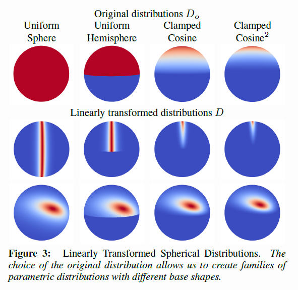
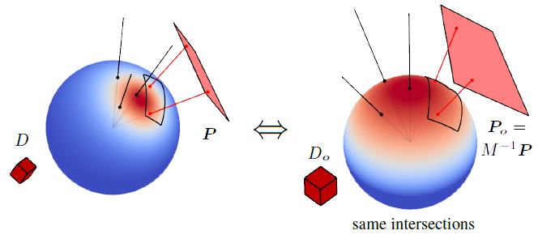

As we saw in the previous part, the energy compensation method can be very efficient at restituting the missing energy from multiple scattering events.

For real time purposes though, 3 texture taps per pixel and per light can be quite expensive, especially if the concerned light source is not covering a large solid angle, in which case the effect of multiple scattering is quite lost
 and isn't really worth the cost.

!!! todo
	Image showing a simple point/directional with and without MS, because I'm not even sure of what I'm writing is actually true! :smile:

This is why we will focus on light sources that cover an extended area, namely:

* The far field environment, encoded as [SH](../SHPortal)
* Area lights, encoded as linearly transformed cosines [^1]

In this section, we will use the fact that the multiple scattering part of the full BRDF only manifests itself in the case of very rough surfaces which means that almost the entire hemisphere of directions above the surface normal
 is involved in the computation of multiply-scattered radiance and we can thus easily make the important assumption that *the overall response of the MSBRDF to a large light source must be low frequency*.

## Far Field Environment

Since we made the assumption that the MSBRDF response to the far field environment is necessarily a low frequency phenomenon, we will only focus our efforts on computing the response of the MSBRDF to a low-frequency encoding of the
 environment: this is why we will ignore cube map representations traditionnally used for (single scattering) specular reflections and directly use the SH representation of these cube maps.

Assuming we have a representation of the far field environment given as a set of spherical harmonic coefficients $L_{lm}$, Ramamoorthi and Hanrahan [^2] showed that a simple 2nd order representation (*i.e.* 9 coefficients)
 is required to properly recover the irradiance (*i.e.* the integral of the environment's radiance over an entire hemisphere).

From these coefficients, we can obtain the band-limited directional value of radiance:

$$
L(\boldsymbol{\omega}) = L_{lm} \cdot Y_{lm}(\boldsymbol{\omega}) ~~~~~ l \in [0,N], m \in [-l,+l]
$$

Where $N$ is the SH order.

We compute the response of the MSBRDF to the environment by writing:

$$
\begin{align}
L(\boldsymbol{\omega_o}) &= \int_{\Omega_+} L(\boldsymbol{\omega_i}) f_{ms}\left( \boldsymbol{\omega_o}, \boldsymbol{\omega_i}, \alpha \right) \left( \boldsymbol{\omega_i} \cdot \boldsymbol{n} \right) d\omega_i \\\\
						 &= \int_{\Omega_+} \left( L_{lm} \cdot Y_{lm}(\boldsymbol{\omega_i}) \right) \cdot f_{ms}\left( \boldsymbol{\omega_o}, \boldsymbol{\omega_i}, \alpha \right) \left( \boldsymbol{\omega_i} \cdot \boldsymbol{n} \right) d\omega_i
\end{align}
$$

We first notice that this can be easily split into $N^2$ integral expressions for each index of $l, m$:

$$
L_{lm}(\boldsymbol{\omega_o}) = L_{lm} \cdot \int_{\Omega_+} Y_{lm}(\boldsymbol{\omega_i}) f_{ms}\left( \boldsymbol{\omega_o}, \boldsymbol{\omega_i}, \alpha \right) \left( \boldsymbol{\omega_i} \cdot \boldsymbol{n} \right) d\omega_i
$$

Now, if we use the energy compensation formulation in the integral, complete with the roughness value $\alpha$, we get:

$$
\begin{align}
L_{lm}(\boldsymbol{\omega_o}) &= L_{lm} \cdot \int_{\Omega_+} Y_{lm}(\boldsymbol{\omega_i}) \frac{(1-E(\boldsymbol{\omega_o}, \alpha)).(1-E(\boldsymbol{\omega_i}, \alpha))}{\pi - E_{avg}( \alpha )} \left( \boldsymbol{\omega_i} \cdot \boldsymbol{n} \right) d\omega_i \\\\
							  &= \frac{1 - E(\boldsymbol{\omega_o}, \alpha)}{\pi - E_{avg}( \alpha )} \cdot L_{lm} \cdot \int_{\Omega_+} Y_{lm}(\boldsymbol{\omega_i}) \left( 1 - E(\boldsymbol{\omega_i}, \alpha)) \right) \left( \boldsymbol{\omega_i} \cdot \boldsymbol{n} \right) d\omega_i \\\\
							  &= \frac{1 - E(\boldsymbol{\omega_o}, \alpha)}{\pi - E_{avg}( \alpha )} \cdot L_{lm} \cdot E_{lm}( \alpha ) \\\\
\end{align}
$$

We see that the result is quite simple and is nicely split into 3 distinct parts:

* $\frac{1 - E(\boldsymbol{\omega_o}, \alpha)}{\pi - E_{avg}( \alpha )}$ has already been covered in part 1 and gives the view-dependent part of the equation 
 
* $L_{lm}$ are the environment-dependent SH coefficients (think diffuse environment probes here) 
 
* $E_{lm}( \alpha ) = \int_{\Omega_+} Y_{lm}(\boldsymbol{\omega_i}) \left( 1 - E(\boldsymbol{\omega_i}, \alpha)) \right) \left( \boldsymbol{\omega_i} \cdot \boldsymbol{n} \right) d\omega_i$
 is certainly the most interesting part of all as it represents the encoding in SH of the MSBRDF response.
 We see that it's both view- and environment-agnostic and can thus be precomputed *once per type of BRDF* (*i.e.* one for GGX, one for Oren-Nayar, etc.) but there is still a dependence on the roughness coefficient $\alpha$ that needs to be worked out.

 
 

!!! todo
	Do the coefficients interpolate well with $\alpha$ or do they fluctuate like the demonic beasts they are?
	Give the SH coefficients for GGX / Oren

!!! todo
	Show the "ground truth" (i.e. many environment rays) against a single SH estimate...

## Area Lights

In the paper "Real-Time Polygonal-Light Shading with Linearly Transformed Cosines" [^1], Heitz et al. introduced an important tool to represent easily integrable and highly-configurable linear distribution transformations.

The main idea is to transport difficult integration situations involving an arbitrary distribution $D(\boldsymbol{\omega})$ into a canonical domain where the new *original* distribution $D_o(\boldsymbol{\omega_o})$ is easily characterized. 
 The paper specially focuses on the clamped cosine distribution $D_o(\boldsymbol{\omega_o}) = \frac{1}{\pi} max( 0, z ),   ~~ \boldsymbol{\omega_o}=(x,y,z)$.

!!! quote ""
	

	The source area light polygon P is the domain where the arbitrary distribution $D(\boldsymbol{\omega})$ should initialy be integrated. 
	Instead, the transformed polygon $P_o$ is integrated with the simpler canonical original distribution $D_o(\boldsymbol{\omega_o})$

The linearly transformed distribution has the nice property that the integration over polygons doesn't change:

$$
\int_{P} D(\boldsymbol{\omega}) d\omega = \int_{P_o} D_o(\boldsymbol{\omega_o}) d\omega_o
$$

And thus, we can write the classical lighting equation as:

$$
\begin{align}
	L(\boldsymbol{\omega_v}) &= \int_{P} L(\boldsymbol{\omega_l}) f_r( \boldsymbol{\omega_v}, \boldsymbol{\omega_l} ) (\boldsymbol{\omega_l} \cdot \boldsymbol{n}) d\omega_l \\\\
	&\approx \int_{P} L(\boldsymbol{\omega_l}) D(\boldsymbol{\omega_l}) d\omega_l \\\\
	&\approx \int_{P_o} L(\boldsymbol{\omega_o}) D_o(\boldsymbol{\omega_o}) d\omega_o
\end{align}
$$

Here, $\boldsymbol{\omega_v}$ and $\boldsymbol{\omega_l}$ respectively replace the vectors $\boldsymbol{\omega_o}$ and $\boldsymbol{\omega_i}$ used everywhere else in this dossier
 due to the choice of the $o$ subscript used by Heitz et al. to denote the canonical basis.

Next, if we make the assumption that the radiance $L(\boldsymbol{\omega})$ is constant over the entire area light then we can write:

$$
\int_{P_o} L(\boldsymbol{\omega_o}) D_o(\boldsymbol{\omega_o}) d\omega_o = L \cdot \int_{P_o} D_o(\boldsymbol{\omega_o}) d\omega_o = L \cdot E(\boldsymbol{P_o}) \\\\
$$

Where $E(\boldsymbol{P_o})$ is the irradiance over the area of polygon $\boldsymbol{P_o}$.
Such irradiance has a closed form solution as given by Baum et al. [^3] and grows linearly in time with the amount of edges of the polygon.

Basically then, all that is required is to transform the vertices of the area light polygon $\boldsymbol{P}$ into the canonical domain using a pre-computed transform $M$ so that $\boldsymbol{P_o} = M^{-1} \boldsymbol{P}$, then use the analytical expression for the irradiance.

The essential work of this technique resides in *finding the proper value of the transform matrix* $M$ *depending on our BRDF*.
Heitz et al. provide the [source code](https://eheitzresearch.wordpress.com/415-2/) they used to fit the GGX BRDF for various values of elevation $\cos(\theta_o)$ and surface roughness $\alpha$ that they stored into 2 textures
 (because the matrix $M$ is described by 5 values).

What this means for us is that, similarly, we will have to pre-compute such matrices for our MSBRDF (which should be pretty accurate due to their low-frequency nature at high roughness)...

!!! todo
	**Fit GGX / Oren MSBRDF**

!!! todo
	Show the "ground truth" (i.e. many environment rays) against a single precomputed estimate...

## Simulation de Clear-Coated Diffuse Surface

!!! todo
	**TODO**
	Pour voir si mon approximation tient la route...

## References

[^1]: Heitz, E. Dupuy, J. Hill, S. Neubelt, D. 2016 ["Real-Time Polygonal-Light Shading with Linearly Transformed Cosines"](https://eheitzresearch.wordpress.com/415-2/)
[^2]: Ramamoorthi, R. Hanrahan, P. 2001 ["On the relationship between radiance and irradiance: determining the illumination from images of a convex Lambertian object"](https://cseweb.ucsd.edu/~ravir/papers/invlamb/josa.pdf) 
[^3]: Baum, D. R. Rushmeier, H. E. Winget, J. M. 1989 ["Improving radiosity solutions through the use of analytically determined form-factors "](http://citeseerx.ist.psu.edu/viewdoc/summary?doi=10.1.1.466.963) 

