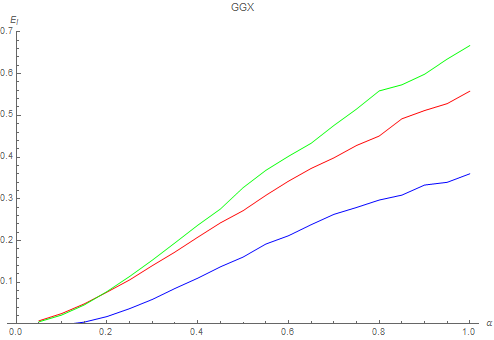
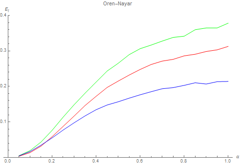

As we saw in the previous part, the energy compensation method can be very efficient at restituting the missing energy from multiple scattering events.

For real time purposes though, 3 texture taps per pixel and per light can be quite expensive, especially if the concerned light source is not covering a large solid angle, in which case the effect of multiple scattering is quite lost
 and isn't really worth the cost.

!!! todo
	Image showing a simple point/directional with and without MS, because I'm not even sure of what I'm writing is actually true! :smile:

This is why we will focus on light sources that cover an extended area, namely:

* The far field environment, encoded as [Spherical Harmonics](../SHPortal)
* Area lights, encoded as linearly transformed cosines [^1]


In this section, we will use the fact that the multiple scattering part of the full BRDF only manifests itself in the case of very rough surfaces which means that almost the entire hemisphere of directions above the surface normal
 is involved in the computation of multiply-scattered radiance and we can thus easily make the important assumption that *the overall response of the MSBRDF to a large light source must be low frequency*.


## Preliminary Remark

Before tackling the actual lighting problems, just a quick remark on the irradiance tables discussed in part 1: they might seem like a costly additional texture to add to the rendering pipeline
 but it's important to realize that these textures are probably already present in your PBR renderer! :smile:

Indeed, Brian Karis introduced a now well-known split-sum approximation to the lighting equation for image-based lighting in his 2013 Siggraph presentation[^2]:

[comment]: <> (\frac{1}{N}\sum_{k=1}^N \frac{ L_i(\boldsymbol{l_k}) f(\boldsymbol{l_k},\boldsymbol{v}) \cos( \theta_{\boldsymbol{l_k}} ) } { p_k(\boldsymbol{l_k},\boldsymbol{v}) } )
[comment]: <> ( \approx \color{#08A}{ \left( \sum_{k=1}^N L_i(\boldsymbol{l_k} \right) } \cdot \color{#F80}{ \left( \sum_{k=1}^N \frac{ f(\boldsymbol{l_k},\boldsymbol{v}) \cos( \theta_{\boldsymbol{l_k}} ) }{ p_k(\boldsymbol{l_k},\boldsymbol{v}) } \right) } )

$$
\int_{\Omega^+} L_i(\boldsymbol{ \omega_i }) f( \boldsymbol{ \omega_o }, \boldsymbol{ \omega_i }, F_0 ) (\boldsymbol{ \omega_i } \cdot \boldsymbol{n}) d\omega_i
 \approx \color{#08A}{ \left( \int_{\Omega^+} L_i(\boldsymbol{ \omega_i }) d\omega_i \right) }
  \cdot \color{#F80}{ \left( \int_{\Omega^+} f( \boldsymbol{ \omega_o }, \boldsymbol{ \omega_i }, F_0 ) (\boldsymbol{ \omega_i } \cdot \boldsymbol{n}) d\omega_i \right) }
$$

The first term (teal) of the right expression represents the pre-convolved environment map, while the second term (orange) represents the pre-integrated BRDF.


Karis assumes the BRDF is based on the microfacet model:

$$
f( \boldsymbol{\omega_o}, \boldsymbol{\omega_i}, F_0 ) = \frac{ F(\boldsymbol{\omega_h} \cdot \boldsymbol{\omega_o}, F_0 ) G( \boldsymbol{\omega_o}, \boldsymbol{\omega_i}, \boldsymbol{n} ) D( \boldsymbol{n} \cdot \boldsymbol{\omega_h} )}{4 (\boldsymbol{n} \cdot \boldsymbol{\omega_i}) (\boldsymbol{n} \cdot \boldsymbol{\omega_o})}
$$

He further assumes the Fresnel term is Schlick's simplified model:

$$
F( \boldsymbol{\omega_h} \cdot \boldsymbol{\omega_o}, F_0 ) = F_0 + (1-F_0) \cdot (1 - \boldsymbol{\omega_h} \cdot \boldsymbol{\omega_o})^5
$$

That allows us to rewrite the orange BRDF integral as:

$$
\begin{align}
\color{#F80}{ \int_{\Omega^+} f( \boldsymbol{ \omega_o }, \boldsymbol{ \omega_i }, F_0 ) (\boldsymbol{ \omega_i } \cdot \boldsymbol{n}) d\omega_i }
&= F_0 \cdot \color{#080}{ \left( \int_{\Omega^+} f( \boldsymbol{ \omega_o }, \boldsymbol{ \omega_i }, 1 ) (\boldsymbol{ \omega_i } \cdot \boldsymbol{n}) d\omega_i \right) } \\\\
&+ (1 - F_0) \cdot \left( \int_{\Omega^+} (1 - \boldsymbol{\omega_h} \cdot \boldsymbol{\omega_o})^5 \cdot f( \boldsymbol{ \omega_o }, \boldsymbol{ \omega_i }, 1 ) (\boldsymbol{ \omega_i } \cdot \boldsymbol{n}) d\omega_i \right)
\end{align}
$$

We see that the integral in green is exactly the irradiance table described in part 1 and if you implemented Karis's method then there's a strong chance you're already sampling this table, although only in the direction of the light.

The multiple-scattering energy compensation method really just requires an additional sample of that table in the view direction... No big deal.


## Far Field Environment

Since we made the assumption that the MSBRDF response to the far field environment is necessarily a low frequency phenomenon, we will only focus our efforts on computing the response of the MSBRDF to a low-frequency encoding of the
 environment: this is why we will ignore cube map representations traditionnally used for (single scattering) specular reflections and directly use the SH representation of these cube maps.

Assuming we have a representation of the far field environment given as a set of spherical harmonic coefficients $L_{lm}$, Ramamoorthi and Hanrahan [^3] showed that a simple 2nd order representation (*i.e.* 9 coefficients)
 is enough to properly recover the irradiance (*i.e.* the integral of the environment's radiance over an entire hemisphere).

From these coefficients, we can obtain the band-limited directional value of radiance:

$$
L(\boldsymbol{\omega}) = L_{lm} \cdot Y_{lm}(\boldsymbol{\omega}), ~~~~~ l \in [0,N], ~ m \in [-l,+l]
$$

Where $N$ is the SH order.


We compute the response of the MSBRDF to the environment by writing:

$$
\begin{align}
L(\boldsymbol{\omega_o}) &= \int_{\Omega_+} L(\boldsymbol{\omega_i}) f_{ms}\left( \boldsymbol{\omega_o}, \boldsymbol{\omega_i}, \alpha \right) \left( \boldsymbol{\omega_i} \cdot \boldsymbol{n} \right) d\omega_i \\\\
						 &= \int_{\Omega_+} \left( L_{lm} \cdot Y_{lm}(\boldsymbol{\omega_i}) \right) \cdot f_{ms}\left( \boldsymbol{\omega_o}, \boldsymbol{\omega_i}, \alpha \right) \left( \boldsymbol{\omega_i} \cdot \boldsymbol{n} \right) d\omega_i
\end{align}
$$

We first notice that this can be easily split into $N^2$ integral expressions for each index of $l, m$:

$$
L_{lm}(\boldsymbol{\omega_o}) = L_{lm} \cdot \int_{\Omega_+} Y_{lm}(\boldsymbol{\omega_i}) f_{ms}\left( \boldsymbol{\omega_o}, \boldsymbol{\omega_i}, \alpha \right) \left( \boldsymbol{\omega_i} \cdot \boldsymbol{n} \right) d\omega_i
$$


Now, if we use the energy compensation formulation in the integral, complete with the roughness value $\alpha$, we get:

$$
\begin{align}
L_{lm}(\boldsymbol{\omega_o}) &= L_{lm} \cdot \int_{\Omega_+} Y_{lm}(\boldsymbol{\omega_i}) \frac{(1-E(\boldsymbol{\omega_o}, \alpha)).(1-E(\boldsymbol{\omega_i}, \alpha))}{\pi - E_{avg}( \alpha )} \left( \boldsymbol{\omega_i} \cdot \boldsymbol{n} \right) d\omega_i \\\\
							  &= \frac{1 - E(\boldsymbol{\omega_o}, \alpha)}{\pi - E_{avg}( \alpha )} \cdot L_{lm} \cdot \int_{\Omega_+} Y_{lm}(\boldsymbol{\omega_i}) \left( 1 - E(\boldsymbol{\omega_i}, \alpha)) \right) \left( \boldsymbol{\omega_i} \cdot \boldsymbol{n} \right) d\omega_i \\\\
							  &= \frac{1 - E(\boldsymbol{\omega_o}, \alpha)}{\pi - E_{avg}( \alpha )} \cdot L_{lm} \cdot E_{lm}( \boldsymbol{n}, \alpha ) \\\\
\end{align}
$$

We see that the result is quite simple and is nicely split into 3 distinct parts:

* $\frac{1 - E(\boldsymbol{\omega_o}, \alpha)}{\pi - E_{avg}( \alpha )}$ has already been covered in part 1 and gives the view-dependent part of the equation</br>
</br>
* $L_{lm}$ are the environment-dependent SH coefficients (think diffuse environment probes here)</br>
</br>
* $E_{lm}( \boldsymbol{n}, \alpha ) = \int_{\Omega_+} Y_{lm}(\boldsymbol{\omega_i}) \left( 1 - E(\boldsymbol{\omega_i}, \alpha)) \right) \left( \boldsymbol{\omega_i} \cdot \boldsymbol{n} \right) d\omega_i$
 is certainly the most interesting part of all as it represents the encoding in SH of the MSBRDF response.
 We see that it's both view- and environment-agnostic and can thus be precomputed *once per type of BRDF* (*i.e.* one for GGX, one for Oren-Nayar, etc.)
  but there is still a dependence on the surface normal orientation $\boldsymbol{n}$ and the roughness coefficient $\alpha$ that needs to be worked out.


### Simplification

First, we begin by noticing that due to the isotropic nature of the MSBRDF, the MSBRDF is radially symmetric thus only the [Zonal Harmonics](../SHPortal/#estimating-the-lambertian-brdf-sh-coefficients) coefficients should be non zero.
This allows us to rewrite:

$$
E_l( \boldsymbol{n}, \alpha ) = \int_{\Omega_+} Y_{l0}(\boldsymbol{\omega_i}) \left( 1 - E(\boldsymbol{\omega_i}, \alpha)) \right) \left( \boldsymbol{\omega_i} \cdot \boldsymbol{n} \right) d\omega_i
$$

Furthermore, we could decide to either:

* Perform the integral over all possible values of $\boldsymbol{n}$ (much too expensive!),
* Perform the integral in a single direction $\boldsymbol{n} = (0,0,1)$ and rotate the environment light's $L_{lm}$ coefficients to align them on the surface normal (better but still expensive to rotate the SH),
* Or simply perform the integral in a single direction $\boldsymbol{n} = (0,0,1)$ and rotate the ZH coefficients to align them on the surface normal.

The 3rd option is obviously much cheaper since ZH coefficients can easily be rotated into any direction to obtain a full set of SH coefficients, as given by Sloan [^5]:

$$
E_{lm}( \boldsymbol{n}, \alpha ) = \sqrt{\frac{4\pi}{2l+1}} E_l( \alpha ) Y_{lm}( \boldsymbol{n} )
$$


You can find the code for the ZH rotation below:

??? "Implementation of order 2 ZH coefficients rotation in any direction (HLSL)"
	``` C++

	// Computes the Ylm coefficients in the requested direction
	//
	void	Ylm( float3 _direction, out float _SH[9] ) {
		const float	c0 = 0.28209479177387814347403972578039;	// 1/2 sqrt(1/pi)
		const float	c1 = 0.48860251190291992158638462283835;	// 1/2 sqrt(3/pi)
		const float	c2 = 1.09254843059207907054338570580270;	// 1/2 sqrt(15/pi)
		const float	c3 = 0.31539156525252000603089369029571;	// 1/4 sqrt(5/pi)

		float	x = _direction.x;
		float	y = _direction.y;
		float	z = _direction.z;

		_SH[0] = c0;
		_SH[1] = c1*y;
		_SH[2] = c1*z;
		_SH[3] = c1*x;
		_SH[4] = c2*x*y;
		_SH[5] = c2*y*z;
		_SH[6] = c3*(3.0*z*z - 1.0);
		_SH[7] = c2*x*z;
		_SH[8] = 0.5*c2*(x*x - y*y);
	}

	// Rotate ZH cosine lobe into specific direction
	void	RotateZH( float3 _A, float3 _wsDirection, out float _SH[9] ) {
		_A *= float3( 3.5449077018110320545963349666823, 2.0466534158929769769591032497785, 1.5853309190424044053380115060481 );	// Multiply by sqrt( 4 * PI / (2*l+1) ) as by eq. 26 in "On the relationship between radiance and irradiance" by Ramamoorthi

		Ylm( _wsDirection, _SH );
		_SH[0] *= _A.x;
		_SH[1] *= _A.y;
		_SH[2] *= _A.y;
		_SH[3] *= _A.y;
		_SH[4] *= _A.z;
		_SH[5] *= _A.z;
		_SH[6] *= _A.z;
		_SH[7] *= _A.z;
		_SH[8] *= _A.z;
	}

	```


So overall, we only need to precompute the ZH coefficients for various roughness values for all our BRDFs:

$$
E_{l}( \alpha ) = 2\pi \int_{0}^{\frac{\pi}{2}} Y_{l0}( \theta_i, 0 ) \left( 1 - E(\cos(\theta_i), \alpha)) \right) \cos(\theta_i) \sin( \theta_i ) d\theta_i
$$


Below we see the appearance of each of the 3 ZH coefficients $E_0( \alpha )$, $E_1( \alpha )$ and $E_2( \alpha )$ in red, green and blue respectively for the GGX and Oren-Nayar MSBRDFs:



</br>




### Fitting

We find a very close fit for the GGX coefficients:

$$
\begin{align}
	E_{0_{GGX}}(\alpha) &= -0.01792303243636725 \cdot \alpha^{\frac{1}{2}} + 1.0561278339405598 \cdot \alpha^{\frac{3}{2}} - 0.4865495717038784 \cdot \alpha^{\frac{5}{2}} \\\\
	E_{1_{GGX}}(\alpha) &= -0.06127443169094851 \cdot \alpha^{\frac{1}{2}} + 1.3380225947779523 \cdot \alpha^{\frac{3}{2}} - 0.6195823982255909 \cdot \alpha^{\frac{5}{2}} \\\\
	E_{2_{GGX}}(\alpha) &= -0.10732852337149004 \cdot \alpha^{\frac{1}{2}} + 0.8686198207608287 \cdot \alpha^{\frac{3}{2}} - 0.3980009298364805 \cdot \alpha^{\frac{5}{2}} \\\\
\end{align}
$$

As well as for the Oren-Nayar coefficients:

$$
\begin{align}
	E_{0_{oren}}(\alpha) &= -0.0919559140506979 \cdot \alpha^{\frac{1}{2}} + 1.467037714315657 \cdot \alpha^{\frac{3}{2}} - 1.673544888379740 \cdot \alpha^{\frac{5}{2}} + 0.607800523815945 \cdot \alpha^{\frac{7}{2}} \\\\
	E_{1_{oren}}(\alpha) &= -0.1136684128860008 \cdot \alpha^{\frac{1}{2}} + 1.901273744271233 \cdot \alpha^{\frac{3}{2}} - 2.322322430339633 \cdot \alpha^{\frac{5}{2}} + 0.909815621695672 \cdot \alpha^{\frac{7}{2}} \\\\
	E_{2_{oren}}(\alpha) &= -0.0412482175221291 \cdot \alpha^{\frac{1}{2}} + 1.093354950053632 \cdot \alpha^{\frac{3}{2}} - 1.417191923789875 \cdot \alpha^{\frac{5}{2}} + 0.581084435989362 \cdot \alpha^{\frac{7}{2}} \\\\
\end{align}
$$


### Validation

Here is the comparison for the GGX BRDF with the IOR for gold:

!!! quote ""

	

	Comparison of "ground truth" against simplified spherical harmonics environment, for various values of roughness from 0.25 to 1. Only the multiple-scattering component is shown.</br>
	**Top Row:** Ground truth sampling of the GGX MSBRDF.</br>
	**Middle Row:** A single sample of the GGX MSBRDF is used as well as a 2nd order SH representation of the environment (*i.e.* 9 coefficients).</br>
	**Bottom Row:** Difference between the two, amplified 4x.</br>


And the comparison for the Oren-Nayar BRDF with a blue reflectance:

!!! quote ""

	

	Comparison of "ground truth" against simplified spherical harmonics environment, for various values of roughness from 0.25 to 1. Only the multiple-scattering component is shown.</br>
	**Top Row:** Ground truth sampling of the Oren-Nayar MSBRDF.</br>
	**Middle Row:** A single sample of the Oren-Nayar MSBRDF is used as well as a 2nd order SH representation of the environment (*i.e.* 9 coefficients).</br>
	**Bottom Row:** Difference between the two, amplified 4x.</br>


The code used for these tests is as follows:

??? " (HLSL)"
	``` C++
	float3	EstimateMSIrradiance_SH_GGX( float _roughness, float3 _wsNormal, float _mu_o, float3 _environmentSH[9], Texture2D<float> _Eo, Texture2D<float> _Eavg ) {

		// Estimate the MSBRDF response in the normal direction
		const float3x3	fit = float3x3( -0.01792303243636725, 1.0561278339405598, -0.4865495717038784,
										-0.06127443169094851, 1.3380225947779523, -0.6195823982255909,
										-0.10732852337149004, 0.8686198207608287, -0.3980009298364805 );
		float3	roughness = sqrt( _roughness ) * float3( 1, _roughness, _roughness*_roughness );
		float3	ZH = saturate( mul( fit, roughness ) );

		float	SH[9];
		RotateZH( ZH, _wsNormal, SH );

		// Estimate MSBRDF irradiance
		float3	result = 0.0;
		[unroll]
		for ( uint i=0; i < 9; i++ )
			result += SH[i] * _environmentSH[i];

		result = max( 0.0, result );

		// Finish by estimating the view-dependent part
		float	E_o = _Eo.SampleLevel( LinearClamp, float2( _mu_o, _roughness ), 0.0 );
		float	E_avg = _Eavg.SampleLevel( LinearClamp, float2( _roughness, 0.5 ), 0.0 );

		result *= (1.0 - E_o) / max( 0.001, PI - E_avg );

		return result;
	}

	float3	EstimateMSIrradiance_SH_OrenNayar( float _roughness, float3 _wsNormal, float _mu_o, float3 _environmentSH[9], Texture2D<float> _Eo, Texture2D<float> _Eavg ) {

		// Estimate the MSBRDF response in the normal direction
		const float3x4	fit = float3x4( -0.0919559140506979, 1.467037714315657, -1.673544888379740, 0.607800523815945,
										-0.1136684128860008, 1.901273744271233, -2.322322430339633, 0.909815621695672,
										-0.0412482175221291, 1.093354950053632, -1.417191923789875, 0.581084435989362 );
		float4	roughness = sqrt( _roughness ) * float4( 1, _roughness, _roughness*_roughness, _roughness*_roughness*_roughness );
		float3	ZH = saturate( mul( fit, roughness ) );

		float	SH[9];
		RotateZH( ZH, _wsNormal, SH );

		// Estimate MSBRDF irradiance
		float3	result = 0.0;
		[unroll]
		for ( uint i=0; i < 9; i++ )
			result += SH[i] * _environmentSH[i];

		result = max( 0.0, result );

		// Finish by estimating the view-dependent part
		float	E_o = _Eo.SampleLevel( LinearClamp, float2( _mu_o, _roughness ), 0.0 );
		float	E_avg = _Eavg.SampleLevel( LinearClamp, float2( _roughness, 0.5 ), 0.0 );

		result *= (1.0 - E_o) / max( 0.001, PI - E_avg );

		return result;
	}

	float3	EstimateMSIrradiance_SH( float3 _wsNormal, float3 _wsReflected, float _mu_o, float _roughnessSpecular, float3 _IOR, float _roughnessDiffuse, float3 _albedo, float3 _environmentSH[9] ) {

		// Estimate specular irradiance
		float3	F0 = Fresnel_F0FromIOR( _IOR );
		float3	MSFactor_spec = F0 * (0.04 + F0 * (0.66 + F0 * 0.3));	// From http://patapom.com/blog/BRDF/MSBRDFEnergyCompensation/#varying-the-fresnel-reflectance-f_0f_0
		float3	Favg = FresnelAverage( _IOR );

		float3	E_spec = MSFactor_spec * EstimateMSIrradiance_SH_GGX( _roughnessSpecular, _wsReflected, _mu_o, _environmentSH, _tex_GGX_Eo, _tex_GGX_Eavg );

		// Estimate diffuse irradiance
		const float	tau = 0.28430405702379613;
		const float	A1 = (1.0 - tau) / pow2( tau );
		float3		rho = tau * _albedo;
		float3		MSFactor_diff = A1 * pow2( rho ) / (1.0 - rho);		// From http://patapom.com/blog/BRDF/MSBRDFEnergyCompensation/#varying-diffuse-reflectance-rhorho

		float3	E_diff = MSFactor_diff * EstimateMSIrradiance_SH_OrenNayar( _roughnessDiffuse, _wsNormal, _mu_o, _environmentSH, _tex_OrenNayar_Eo, _tex_OrenNayar_Eavg );

		// Attenuate diffuse contribution
		float	a = _roughnessSpecular;
		float	E_o = _tex_GGX_Eo.SampleLevel( LinearClamp, float2( _mu_o, a ), 0.0 );	// Already sampled by MSBRDF earlier, optimize!

		float3	kappa = 1 - (Favg * E_o + MSFactor_spec * (1.0 - E_o));

		return E_spec + kappa * E_diff;
	}
	```


You then simply need to add a single call to "EstimateMSIrradiance_SH( ... )" at the end of your lighting pipeline, like this:

???+ "Retrieving the MSBRDF response from a SH-encoded environment (HLSL)"
	``` C++
		// Here:
		//	wsView is the world-space camera vector pointing toward the camera
		//	wsNormal is the world-space normal vector
		//	alphaS is the specular roughness
		//	IOR is the index of refraction of the surface
		//	alphaD is the diffuse roughness
		//	rho is the diffuse reflectance in [0,1]
		//	envSH is the SH representation of the surrounding environment (my environment values are usually filtered with a Hanning filter with window size 2.8)
		//
		#if USE_REFLECTED_VIEW	// I just give that as an idea but I actually get worse results than using the plain normal
			float3	wsReflectedView = reflect( wsView, wsNormal );
			float3	wsReflected = normalize( lerp( wsReflectedView, wsNormal, alphaS ) );	// Go more toward prefectly reflected direction when roughness drops to 0
		#else
			float3	wsReflected = wsNormal;
		#endif

		sumIrradiance += EstimateMSIrradiance_SH( wsNormal, wsReflected, saturate( -dot( wsView, wsNormal ) ), alphaS, IOR, alphaD, rho, envSH );
	```


The entirety of the project is available at my [God Complex GitHub repository](https://github.com/Patapom/GodComplex/tree/master/Tests/TestMSBRDF).


## Area Lights

In the paper "Real-Time Polygonal-Light Shading with Linearly Transformed Cosines" [^1], Heitz et al. introduced an important tool to represent easily integrable and configurable linear distribution transformations.


The main idea is to transport difficult integration situations involving an arbitrary distribution $D(\boldsymbol{\omega})$ into a canonical domain where the new *original* distribution $D_o(\boldsymbol{\omega_o})$ is easily characterized.</br>
 The paper specially focuses on the clamped cosine distribution $D_o(\boldsymbol{\omega_o}) = \frac{1}{\pi} max( 0, z ),   ~~ \boldsymbol{\omega_o}=(x,y,z)$.


!!! quote ""
	

	The source area light polygon P is the domain where the arbitrary distribution $D(\boldsymbol{\omega})$ should initialy be integrated.</br>
	Instead, the transformed polygon $P_o$ is integrated with the simpler canonical original distribution $D_o(\boldsymbol{\omega_o})$


The linearly transformed distribution has the nice property that the integration over polygons doesn't change:

$$
\int_{P} D(\boldsymbol{\omega}) d\omega = \int_{P_o} D_o(\boldsymbol{\omega_o}) d\omega_o
$$

And thus, we can write the classical lighting equation as:

$$
\begin{align}
	L(\boldsymbol{\omega_v}) &= \int_{P} L(\boldsymbol{\omega_l}) f_r( \boldsymbol{\omega_v}, \boldsymbol{\omega_l} ) (\boldsymbol{\omega_l} \cdot \boldsymbol{n}) d\omega_l \\\\
	&\approx \int_{P} L(\boldsymbol{\omega_l}) D(\boldsymbol{\omega_l}) d\omega_l \\\\
	&\approx \int_{P_o} L(\boldsymbol{\omega_o}) D_o(\boldsymbol{\omega_o}) d\omega_o
\end{align}
$$


Here, $\boldsymbol{\omega_v}$ and $\boldsymbol{\omega_l}$ respectively replace the vectors $\boldsymbol{\omega_o}$ and $\boldsymbol{\omega_i}$ used everywhere else in this dossier
 due to the choice of the $o$ subscript used by Heitz et al. to denote the canonical basis.


Next, if we make the assumption that the radiance $L(\boldsymbol{\omega})$ is constant over the entire area light then we can write:

$$
\int_{P_o} L(\boldsymbol{\omega_o}) D_o(\boldsymbol{\omega_o}) d\omega_o = L \cdot \int_{P_o} D_o(\boldsymbol{\omega_o}) d\omega_o = L \cdot E(\boldsymbol{P_o}) \\\\
$$

Where $E(\boldsymbol{P_o})$ is the irradiance over the area of polygon $\boldsymbol{P_o}$.
Such irradiance has a closed form solution as given by Baum et al. [^4] and the time cost grows linearly with the amount of edges of the polygon.

Basically then, all that is required is to transform the vertices of the area light polygon $\boldsymbol{P}$ into the canonical domain using a pre-computed transform $M$ so that $\boldsymbol{P_o} = M^{-1} \boldsymbol{P}$, then use the analytical expression for the irradiance.


The essential work of this technique resides in *finding the proper value of the transform matrix* $M$ *depending on our BRDF*.
Heitz et al. provide the [source code](https://eheitzresearch.wordpress.com/415-2/) they used to fit the GGX BRDF for various values of elevation $\cos(\theta_o)$ and surface roughness $\alpha$ that they stored into 2 textures
 (because the matrix $M$ is described by 5 values).


### View-Dependence

We take model on our work for the SH-encoded environment to once again separate the view-dependent part out of the integral:

$$
\begin{align}
	L(\boldsymbol{\omega_v}) &= L \cdot \int_{P} f_r( \boldsymbol{\omega_v}, \boldsymbol{\omega_l} ) (\boldsymbol{\omega_l} \cdot \boldsymbol{n}) d\omega_l \\\\
							 &= L \cdot \int_{P} \frac{(1-E(\boldsymbol{\omega_v}, \alpha)).(1-E(\boldsymbol{\omega_l}, \alpha))}{\pi - E_{avg}( \alpha )} (\boldsymbol{\omega_l} \cdot \boldsymbol{n}) d\omega_l \\\\
							 &= L \cdot \frac{1-E(\boldsymbol{\omega_v}, \alpha)}{\pi - E_{avg}( \alpha )} \cdot \int_{P} (1-E(\boldsymbol{\omega_l}, \alpha)) (\boldsymbol{\omega_l} \cdot \boldsymbol{n}) d\omega_l \\\\
\end{align}
$$

So the part we need to fit with a clamped-cosine distribution is only this expression:

$$
D(\boldsymbol{\omega_l}) \approx (1-E(\boldsymbol{\omega_l}, \alpha)) (\boldsymbol{\omega_l} \cdot \boldsymbol{n})
$$

What this means for us is that, similarly to regular BRDFs, we will have to pre-compute transform matrices for our MSBRDF but also that:

* There is no need to store a 2D table since we factored-out the view-dependent part of the BRDF and only a dependence on roughness $\alpha$ remains
* Due to the isotropic and smooth nature of the MSBRDF, there shouldn't be a need to handle anisotropy or complicated coefficients so the matrix $M$ should be simpler


### Fitting

!!! todo
	**Fit MSBRDF GGX / Oren MSBRDF**

	Use the fact that our MSBRDFs are isotropic. Should require less coefficients for M!

	Can we also factor out the view-dependent part of regular BRDFs? (i.e. that would be the masking term $\frac{G( \boldsymbol{\omega_v} )}{\boldsymbol{\omega_v} \cdot \boldsymbol{n}}$).
	Does it yield a smoother, more accurate result?


### Validation

!!! todo
	Show the "ground truth" (i.e. many environment rays) against a single precomputed estimate...


## Simulation de Clear-Coated Diffuse Surface

!!! todo
	**TODO**
	Pour voir si mon approximation tient la route...


## References

[^1]: Heitz, E. Dupuy, J. Hill, S. Neubelt, D. 2016 ["Real-Time Polygonal-Light Shading with Linearly Transformed Cosines"](https://eheitzresearch.wordpress.com/415-2/)
[^2]: Karis, B. 2013 ["Real Shading in Unreal Engine 4"](https://cdn2.unrealengine.com/Resources/files/2013SiggraphPresentationsNotes-26915738.pdf) 
[^3]: Ramamoorthi, R. Hanrahan, P. 2001 ["On the relationship between radiance and irradiance: determining the illumination from images of a convex Lambertian object"](https://cseweb.ucsd.edu/~ravir/papers/invlamb/josa.pdf) 
[^4]: Baum, D. R. Rushmeier, H. E. Winget, J. M. 1989 ["Improving radiosity solutions through the use of analytically determined form-factors"](http://citeseerx.ist.psu.edu/viewdoc/summary?doi=10.1.1.466.963) 
[^5]: Sloan, P-P. 2008 ["Stupid Spherical Harmonics Tricks"](https://www.ppsloan.org/publications/StupidSH36.pdf)
