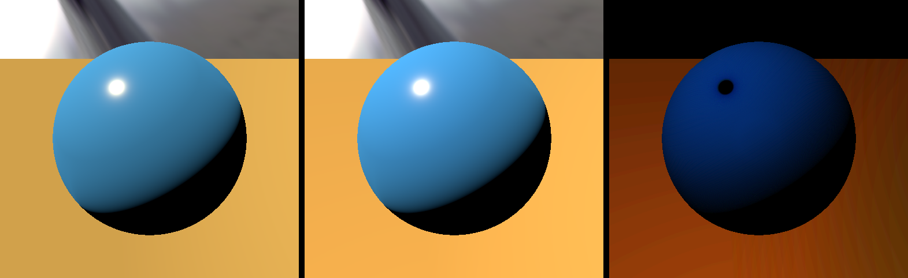
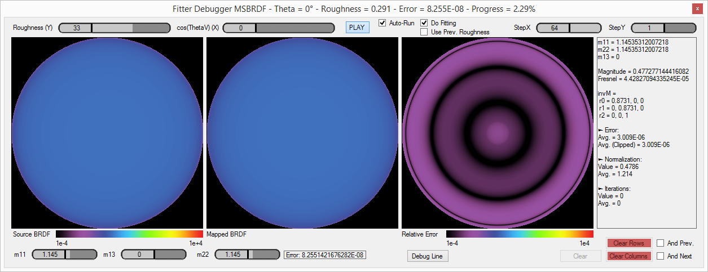
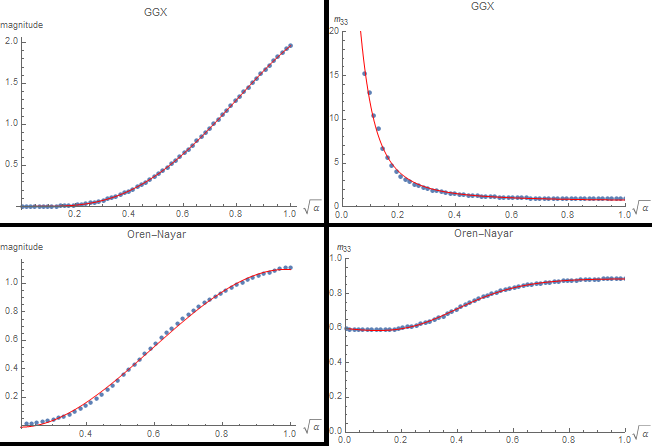
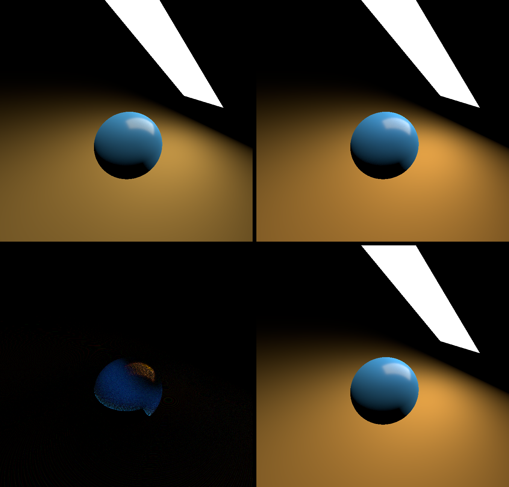

As we saw in the previous part, the energy compensation method can be very efficient at restituting the missing energy from multiple scattering events.

For real time purposes though, 3 texture taps per pixel and per light can be quite expensive, especially if the concerned light source is not covering a large solid angle,
or is not bright enough to be significant, in which case the effect of multiple scattering is quite lost and isn't really worth the cost.

This is why we will focus on light sources that are either quite significant or cover an extended area, namely:

* Sun light
* The far field environment, encoded as [Spherical Harmonics](../SHPortal)
* Area lights, encoded as linearly transformed cosines [^1]


In this section, we will use the fact that the multiple scattering part of the full BRDF only manifests itself in the case of very rough surfaces which means that almost the entire hemisphere of directions above the surface normal
 is involved in the computation of multiply-scattered radiance and we can thus easily make the important assumption that *the overall response of the MSBRDF to a large light source must be low frequency*.


## Preliminary Remark

Before tackling the actual lighting problems, just a quick remark on the irradiance tables discussed in part 1: they might seem like a costly additional texture to add to the rendering pipeline
 but it's important to realize that these textures are probably already present in your PBR renderer! :smile:

Indeed, Brian Karis introduced a now well-known split-sum approximation to the lighting equation for image-based lighting in his 2013 Siggraph presentation[^2]:

[comment]: <> (\frac{1}{N}\sum_{k=1}^N \frac{ L_i(\boldsymbol{l_k}) f(\boldsymbol{l_k},\boldsymbol{v}) \cos( \theta_{\boldsymbol{l_k}} ) } { p_k(\boldsymbol{l_k},\boldsymbol{v}) } )
[comment]: <> ( \approx \color{#08A}{ \left( \sum_{k=1}^N L_i(\boldsymbol{l_k} \right) } \cdot \color{#F80}{ \left( \sum_{k=1}^N \frac{ f(\boldsymbol{l_k},\boldsymbol{v}) \cos( \theta_{\boldsymbol{l_k}} ) }{ p_k(\boldsymbol{l_k},\boldsymbol{v}) } \right) } )

$$
\int_{\Omega^+} L_i(\boldsymbol{ \omega_i }) f( \boldsymbol{ \omega_o }, \boldsymbol{ \omega_i }, F_0 ) (\boldsymbol{ \omega_i } \cdot \boldsymbol{n}) d\omega_i
 \approx \color{#08A}{ \left( \int_{\Omega^+} L_i(\boldsymbol{ \omega_i }) d\omega_i \right) }
  \cdot \color{#F80}{ \left( \int_{\Omega^+} f( \boldsymbol{ \omega_o }, \boldsymbol{ \omega_i }, F_0 ) (\boldsymbol{ \omega_i } \cdot \boldsymbol{n}) d\omega_i \right) }
$$

The first term (teal) of the right expression represents the pre-convolved environment map, while the second term (orange) represents the pre-integrated BRDF.


Karis assumes the BRDF is based on the microfacet model:

$$
f( \boldsymbol{\omega_o}, \boldsymbol{\omega_i}, F_0 ) = \frac{ F(\boldsymbol{\omega_h} \cdot \boldsymbol{\omega_o}, F_0 ) G( \boldsymbol{\omega_o}, \boldsymbol{\omega_i}, \boldsymbol{n} ) D( \boldsymbol{n} \cdot \boldsymbol{\omega_h} )}{4 (\boldsymbol{n} \cdot \boldsymbol{\omega_i}) (\boldsymbol{n} \cdot \boldsymbol{\omega_o})}
$$

He further assumes the Fresnel term is Schlick's simplified model:

$$
F( \boldsymbol{\omega_h} \cdot \boldsymbol{\omega_o}, F_0 ) = F_0 + (1-F_0) \cdot (1 - \boldsymbol{\omega_h} \cdot \boldsymbol{\omega_o})^5
$$

That allows us to rewrite the orange BRDF integral as:

$$
\begin{align}
\color{#F80}{ \int_{\Omega^+} f( \boldsymbol{ \omega_o }, \boldsymbol{ \omega_i }, F_0 ) (\boldsymbol{ \omega_i } \cdot \boldsymbol{n}) d\omega_i }
&= F_0 \cdot \color{#080}{ \left( \int_{\Omega^+} f( \boldsymbol{ \omega_o }, \boldsymbol{ \omega_i }, 1 ) (\boldsymbol{ \omega_i } \cdot \boldsymbol{n}) d\omega_i \right) } \\\\
&+ (1 - F_0) \cdot \left( \int_{\Omega^+} (1 - \boldsymbol{\omega_h} \cdot \boldsymbol{\omega_o})^5 \cdot f( \boldsymbol{ \omega_o }, \boldsymbol{ \omega_i }, 1 ) (\boldsymbol{ \omega_i } \cdot \boldsymbol{n}) d\omega_i \right)
\end{align}
$$

We see that the integral in green is exactly the irradiance table described in part 1 and if you implemented Karis's method then there's a strong chance you're already sampling this table,
 although only in the direction of the camera (*i.e.* the tables are accessed using the $\boldsymbol{ \omega_o }$ and roughness $\alpha$ parameters).

The multiple-scattering energy compensation method really just requires an additional sample of that table in the light direction... No big deal.


## Directional Sun

The directional Sun is an important light source and is the easiest to cover.

We write the reflected radiance from a directional Sun source (*i.e.* a light source that only emits light along an infinitesimally thin direction) as:

$$
L(\boldsymbol{\omega_o}) = E_{sun} \left( f_r\left( \boldsymbol{\omega_o}, \boldsymbol{\omega_i}, \alpha \right) + f_{ms}\left( \boldsymbol{\omega_o}, \boldsymbol{\omega_i}, \alpha \right) \right) (\boldsymbol{\omega_i} \cdot \boldsymbol{n})
$$

Where $E_{sun}$ is the Sun's irradiance in $W.m^{-2}$


### Result


!!! quote ""

	

	Visualization of the effect of the multiple-scattering term over 85% rough diffuse surfaces illuminated by a directional light source.
	**Left:** Single scattering only, **Middle:** Single + Multiple scattering, **Right:** Difference x4.


### Code


??? "MS BRDF Term for regular Oren-Nayar + GGX BRDF (HLSL)"
	``` C++
	// Assuming n1=1 (air) we get:
	//	F0 = ((n2 - n1) / (n2 + n1))²
	//	=> n2 = (1 + sqrt(F0)) / (1 - sqrt(F0))
	//
	float3	Fresnel_IORFromF0( float3 _F0 ) {
		float3	SqrtF0 = sqrt( _F0 );
		return (1.0 + SqrtF0) / (1.0001 - SqrtF0);
	}

	// Returns the "average Fresnel" term for dielectrics, as given by Kulla & Conty, slide 18 (http://blog.selfshadow.com/publications/s2017-shading-course/imageworks/s2017_pbs_imageworks_slides.pdf)
	//	Favg = Integral[Omega+]{ F(µi) µi dwi }
	//
	// _IOR, from 1 to 400
	float3	FresnelAverage( float3 _IOR ) {
		return (_IOR - 1.0) / (4.08567 + 1.00071 * _IOR);
	}

	// **NOTE**: This function expects _tex_Eo to be a Texture2DArray where each slice of the array contains the irradiance Eo values for a single BRDF
	float	SampleIrradiance( float _cosTheta, float _roughness, uint _BRDFIndex ) {
		return _tex_Eo.SampleLevel( LinearClamp, float3( _cosTheta, _alpha, _BRDFIndex ), 0.0 );
	}

	// **NOTE**: This function expects _tex_Eavg to be a Texture2D where each line of the texture contains the albedo Eavg values for a single BRDF
	float	SampleAlbedo( float _alpha, uint _BRDFIndex ) {
		return _tex_Eavg.SampleLevel( LinearClamp, float2( _alpha, (0.5 + _BRDFIndex) / BRDFS_COUNT ), 0.0 );
	}

	// Estimates the view-dependent part of the MSBRDF
	float	MSBRDF_View( float _mu_o, float _roughness, uint _BRDFIndex ) {
		float	E_o = 1.0 - SampleIrradiance( _mu_o, _roughness, _BRDFIndex );	// 1 - E_o
		float	E_avg = SampleAlbedo( _roughness, _BRDFIndex );					// E_avg
		return E_o / max( 0.001, PI - E_avg );
	}

	// Estimates the full MSBRDF (view- and light-dependent)
	float	MSBRDF( float _roughness, float3 _tsNormal, float3 _tsView, float3 _tsLight, uint _BRDFIndex ) {

		float	mu_o = saturate( dot( _tsView, _tsNormal ) );
		float	mu_i = saturate( dot( _tsLight, _tsNormal ) );
		float	a = _roughness;

		float	E_i = 1.0 - SampleIrradiance( mu_i, a, _BRDFIndex );	// 1 - E_i
		return E_i * MSBRDF_View( mu_o, a, _BRDFIndex );
	}

	// Computes the full dielectric BRDF model as described in http://patapom.com/blog/BRDF/MSBRDFEnergyCompensation/#complete-approximate-model
	//
	float3	ComputeBRDF_Full( float3 _tsNormal, float3 _tsView, float3 _tsLight, float _roughnessSpecular, float3 _F0, float _roughnessDiffuse, float3 _rho ) {
		// Compute specular BRDF
		float3	MSFactor_spec = _F0 * (0.04 + _F0 * (0.66 + _F0 * 0.3));	// From http://patapom.com/blog/BRDF/MSBRDFEnergyCompensation/#varying-the-fresnel-reflectance-f_0f_0

		float3	BRDF_spec = BRDF_GGX( _tsNormal, _tsView, _tsLight, _roughnessSpecular, _F0 );			// Regular BRDF definition for GGX, replace with your own specular BRDF
				BRDF_spec += MSFactor_spec * MSBRDF( _roughnessSpecular, _tsNormal, _tsView, _tsLight, FGD_BRDF_INDEX_GGX );

		// Compute diffuse contribution
		const float	tau = 0.28430405702379613;
		const float	A1 = (1.0 - tau) / pow2( tau );
		float3	rho = tau * _rho;
		float3	MSFactor_diff = A1 * pow2( rho ) / (1.0 - rho);	// From http://patapom.com/blog/BRDF/MSBRDFEnergyCompensation/#varying-diffuse-reflectance-rhorho

		float3	BRDF_diff = BRDF_OrenNayar( _tsNormal, _tsView, _tsLight, _roughnessDiffuse, _rho );	// Regular BRDF definition for Oren-Nayar, replace with your own diffuse BRDF
				BRDF_diff += MSFactor_diff * MSBRDF( _roughnessDiffuse, _tsNormal, _tsView, _tsLight, FGD_BRDF_INDEX_OREN_NAYAR );

		// Attenuate diffuse contribution
		float	mu_o = saturate( dot( _tsView, _tsNormal ) );
		float	a = _roughnessSpecular;
		float	E_o = SampleIrradiance( mu_o, a, FGD_BRDF_INDEX_GGX );	// Already sampled by MSBRDF earlier, optimize!

		float3	IOR = Fresnel_IORFromF0( _F0 );
		float3	Favg = FresnelAverage( IOR );
		float3	kappa = 1 - (Favg * E_o + MSFactor_spec * (1.0 - E_o));

		return BRDF_spec + kappa * BRDF_diff;
	}
	```

You then simply need to add a single call to "ComputeBRDF_Full( ... )" when estimating the directional light (or any simple light model really), like this:

???+ "Retrieving the MSBRDF response for a simple directional light (HLSL)"
	``` C++
	// Here:
	//	tsView is the tangent-space camera vector pointing toward the camera
	//	tsLight is the tangent-space light vector pointing toward the light
	//	alphaS is the specular roughness
	//	F0 is the Fresnel reflection factor at normal incidence
	//	alphaD is the diffuse roughness
	//	rho is the diffuse reflectance in [0,1]
	//

	// Sample incoming projected irradiance
	float	LdotN = saturate( tsLight.z );
	float3	Ei = SUN_IRRADIANCE;	// Sun irradiance in W/m² (or lux if you're using illuminance)
			Ei *= LdotN;			// Projected irradiance

	// Compute reflected radiance
	float3	Lo = Ei * ComputeBRDF_Full( float3( 0, 0, 1 ), tsView, tsLight, alphaS, F0, alphaD, rho );
	```


## Far Field Environment

Since we made the assumption that the MSBRDF response to the far field environment is necessarily a low frequency phenomenon, we will only focus our efforts on computing the response of the MSBRDF to a low-frequency encoding of the
 environment: this is why we will ignore cube map representations traditionnally used for (single scattering) specular reflections and directly use the SH representation of these cube maps.

Assuming we have a representation of the far field environment given as a set of spherical harmonic coefficients $L_{lm}$, Ramamoorthi and Hanrahan [^3] showed that a simple 2nd order representation (*i.e.* 9 coefficients)
 is enough to properly recover the irradiance (*i.e.* the integral of the environment's radiance over an entire hemisphere).

From these coefficients, we can obtain the band-limited directional value of radiance:

$$
L(\boldsymbol{\omega}) = L_{lm} \cdot Y_{lm}(\boldsymbol{\omega}), ~~~~~ l \in [0,N], ~ m \in [-l,+l]
$$

Where $N$ is the SH order.


We compute the response of the MSBRDF to the environment by writing:

$$
\begin{align}
L(\boldsymbol{\omega_o}) &= \int_{\Omega_+} L(\boldsymbol{\omega_i}) f_{ms}\left( \boldsymbol{\omega_o}, \boldsymbol{\omega_i}, \alpha \right) \left( \boldsymbol{\omega_i} \cdot \boldsymbol{n} \right) d\omega_i \\\\
						 &= \int_{\Omega_+} \left( L_{lm} \cdot Y_{lm}(\boldsymbol{\omega_i}) \right) \cdot f_{ms}\left( \boldsymbol{\omega_o}, \boldsymbol{\omega_i}, \alpha \right) \left( \boldsymbol{\omega_i} \cdot \boldsymbol{n} \right) d\omega_i
\end{align}
$$

We first notice that this can be easily split into $N^2$ integral expressions for each index of $l, m$:

$$
L_{lm}(\boldsymbol{\omega_o}) = L_{lm} \cdot \int_{\Omega_+} Y_{lm}(\boldsymbol{\omega_i}) f_{ms}\left( \boldsymbol{\omega_o}, \boldsymbol{\omega_i}, \alpha \right) \left( \boldsymbol{\omega_i} \cdot \boldsymbol{n} \right) d\omega_i
$$


Now, if we use the energy compensation formulation in the integral, complete with the roughness value $\alpha$, we get:

$$
\begin{align}
L_{lm}(\boldsymbol{\omega_o}, \alpha) &= L_{lm} \cdot \int_{\Omega_+} Y_{lm}(\boldsymbol{\omega_i}) \frac{(1-E(\boldsymbol{\omega_o}, \alpha)).(1-E(\boldsymbol{\omega_i}, \alpha))}{\pi - E_{avg}( \alpha )} \left( \boldsymbol{\omega_i} \cdot \boldsymbol{n} \right) d\omega_i \\\\
							  &= \frac{1 - E(\boldsymbol{\omega_o}, \alpha)}{\pi - E_{avg}( \alpha )} \cdot L_{lm} \cdot \int_{\Omega_+} Y_{lm}(\boldsymbol{\omega_i}) \left( 1 - E(\boldsymbol{\omega_i}, \alpha)) \right) \left( \boldsymbol{\omega_i} \cdot \boldsymbol{n} \right) d\omega_i \\\\
							  &= \frac{1 - E(\boldsymbol{\omega_o}, \alpha)}{\pi - E_{avg}( \alpha )} \cdot L_{lm} \cdot E_{lm}( \boldsymbol{n}, \alpha ) \\\\
\end{align}
$$

We see that the result is quite simple and is nicely split into 3 distinct parts:

* $\frac{1 - E(\boldsymbol{\omega_o}, \alpha)}{\pi - E_{avg}( \alpha )}$ has already been covered in part 1 and gives the view-dependent piece of the equation</br>
</br>
* $L_{lm}$ are the environment-dependent SH coefficients (think diffuse environment probes here)</br>
</br>
* $E_{lm}( \boldsymbol{n}, \alpha ) = \int_{\Omega_+} Y_{lm}(\boldsymbol{\omega_i}) \left( 1 - E(\boldsymbol{\omega_i}, \alpha)) \right) \left( \boldsymbol{\omega_i} \cdot \boldsymbol{n} \right) d\omega_i$
 is certainly the most interesting part of all as it represents the encoding in SH of the MSBRDF response.
 We see that it's both view- and environment-agnostic and can thus be precomputed *once per type of BRDF* (*i.e.* one for GGX, one for Oren-Nayar, etc.)
  but there is still a dependence on the surface normal orientation $\boldsymbol{n}$ and the roughness coefficient $\alpha$ that needs to be worked out.


### Simplification

First, we begin by noticing that due to the isotropic nature of the MSBRDF, it must be radially symmetric and thus only the [Zonal Harmonics](../SHPortal/#estimating-the-lambertian-brdf-sh-coefficients) coefficients should be non zero.
This allows us to rewrite:

$$
E_l( \boldsymbol{n}, \alpha ) = \int_{\Omega_+} Y_{l0}(\boldsymbol{\omega_i}) \left( 1 - E(\boldsymbol{\omega_i}, \alpha)) \right) \left( \boldsymbol{\omega_i} \cdot \boldsymbol{n} \right) d\omega_i
$$

Furthermore, we could decide to either:

* Perform the integral over all possible values of $\boldsymbol{n}$ (much too expensive!),
* Perform the integral in a single direction $\boldsymbol{n} = (0,0,1)$ and rotate the environment light's $L_{lm}$ coefficients to align them on the surface normal (better but still expensive to rotate the SH),
* Or simply perform the integral in a single direction $\boldsymbol{n} = (0,0,1)$ and rotate the ZH coefficients to align them on the surface normal.

The 3rd option is obviously much cheaper since ZH coefficients can easily be rotated into any direction to obtain a full set of SH coefficients, as given by Sloan [^5]:

$$
E_{lm}( \boldsymbol{n}, \alpha ) = \sqrt{\frac{4\pi}{2l+1}} E_l( \alpha ) Y_{lm}( \boldsymbol{n} )
$$


You can find the code for the ZH rotation below:

??? "Implementation of order 2 ZH coefficients rotation in any direction (HLSL)"
	``` C++

	// Computes the Ylm coefficients in the requested direction
	//
	void	Ylm( float3 _direction, out float _SH[9] ) {
		const float	c0 = 0.28209479177387814347403972578039;	// 1/2 sqrt(1/pi)
		const float	c1 = 0.48860251190291992158638462283835;	// 1/2 sqrt(3/pi)
		const float	c2 = 1.09254843059207907054338570580270;	// 1/2 sqrt(15/pi)
		const float	c3 = 0.31539156525252000603089369029571;	// 1/4 sqrt(5/pi)

		float	x = _direction.x;
		float	y = _direction.y;
		float	z = _direction.z;

		_SH[0] = c0;
		_SH[1] = c1*y;
		_SH[2] = c1*z;
		_SH[3] = c1*x;
		_SH[4] = c2*x*y;
		_SH[5] = c2*y*z;
		_SH[6] = c3*(3.0*z*z - 1.0);
		_SH[7] = c2*x*z;
		_SH[8] = 0.5*c2*(x*x - y*y);
	}

	// Rotate ZH cosine lobe into specific direction
	void	RotateZH( float3 _A, float3 _wsDirection, out float _SH[9] ) {
		_A *= float3( 3.5449077018110320545963349666823, 2.0466534158929769769591032497785, 1.5853309190424044053380115060481 );	// Multiply by sqrt( 4 * PI / (2*l+1) ) as by eq. 26 in "On the relationship between radiance and irradiance" by Ramamoorthi

		Ylm( _wsDirection, _SH );
		_SH[0] *= _A.x;
		_SH[1] *= _A.y;
		_SH[2] *= _A.y;
		_SH[3] *= _A.y;
		_SH[4] *= _A.z;
		_SH[5] *= _A.z;
		_SH[6] *= _A.z;
		_SH[7] *= _A.z;
		_SH[8] *= _A.z;
	}

	```


So overall, we only need to precompute the ZH coefficients for various roughness values for all our BRDFs:

$$
E_{l}( \alpha ) = 2\pi \int_{0}^{\frac{\pi}{2}} Y_{l0}( \theta_i, 0 ) \left( 1 - E(\cos(\theta_i), \alpha)) \right) \cos(\theta_i) \sin( \theta_i ) d\theta_i
$$


Below we see the appearance of each of the 3 ZH coefficients $E_0( \alpha )$, $E_1( \alpha )$ and $E_2( \alpha )$ in red, green and blue respectively for the GGX and Oren-Nayar MSBRDFs:


</br>


### Fitting

We find a very close fit for the GGX coefficients:

$$
\begin{align}
	E_{0_{GGX}}(\beta) &= -0.01792303243636725 \cdot \beta + 1.0561278339405598 \cdot \beta^2 - 0.4865495717038784 \cdot \beta^3 \\\\
	E_{1_{GGX}}(\beta) &= -0.06127443169094851 \cdot \beta + 1.3380225947779523 \cdot \beta^2 - 0.6195823982255909 \cdot \beta^3 \\\\
	E_{2_{GGX}}(\beta) &= -0.10732852337149004 \cdot \beta + 0.8686198207608287 \cdot \beta^2 - 0.3980009298364805 \cdot \beta^3 \\\\
\end{align}
$$

As well as for the Oren-Nayar coefficients:

$$
\begin{align}
	E_{0_{oren}}(\beta) &= -0.0919559140506979 \cdot \beta + 1.467037714315657 \cdot \beta^2 - 1.673544888379740 \cdot \beta^3 + 0.607800523815945 \cdot \beta^4 \\\\
	E_{1_{oren}}(\beta) &= -0.1136684128860008 \cdot \beta + 1.901273744271233 \cdot \beta^2 - 2.322322430339633 \cdot \beta^3 + 0.909815621695672 \cdot \beta^4 \\\\
	E_{2_{oren}}(\beta) &= -0.0412482175221291 \cdot \beta + 1.093354950053632 \cdot \beta^2 - 1.417191923789875 \cdot \beta^3 + 0.581084435989362 \cdot \beta^4 \\\\
\end{align}
$$

Note that $\beta = \sqrt{\alpha}$ which is sometimes called the *perceptual roughness*.


### Validation

Here is the comparison for the GGX BRDF with the IOR for gold:

!!! quote ""

	

	Comparison of "ground truth" against simplified spherical harmonics environment, for various values of roughness from 0.25 to 1. Only the multiple-scattering component is shown.</br>
	**Top Row:** Ground truth sampling of the GGX MSBRDF.</br>
	**Middle Row:** A single sample of the GGX MSBRDF is used as well as a 2nd order SH representation of the environment (*i.e.* 9 coefficients).</br>
	**Bottom Row:** Difference between the two, amplified 4x.</br>


And the comparison for the Oren-Nayar BRDF with a blue reflectance:

!!! quote ""

	

	Comparison of "ground truth" against simplified spherical harmonics environment, for various values of roughness from 0.25 to 1. Only the multiple-scattering component is shown.</br>
	**Top Row:** Ground truth sampling of the Oren-Nayar MSBRDF.</br>
	**Middle Row:** A single sample of the Oren-Nayar MSBRDF is used as well as a 2nd order SH representation of the environment (*i.e.* 9 coefficients).</br>
	**Bottom Row:** Difference between the two, amplified 4x.</br>


### Code

The code used for these tests is as follows:

??? "MS BRDF Term for an SH-encoded Environment (HLSL)"
	``` C++
	float3	EstimateMSIrradiance_SH( float _roughness, float3 _wsNormal, float _mu_o, float3 _ZH, float3 _environmentSH[9], uint _BRDFIndex ) {
		float	SH[9];
		RotateZH( _ZH, _wsNormal, SH );

		// Estimate MSBRDF irradiance
		float3	result = 0.0;
		[unroll]
		for ( uint i=0; i < 9; i++ )
			result += SH[i] * _environmentSH[i];

		result = max( 0.0, result );

		// Finish by estimating the view-dependent part
		result *= MSBRDF_View( _mu_o, _roughness, _BRDFIndex );

		return result;
	}


	float3	EstimateMSIrradiance_SH_GGX( float _roughness, float3 _wsNormal, float _mu_o, float3 _environmentSH[9] ) {

		// Estimate the MSBRDF response in the normal direction
		const float3x3	fit = float3x3( -0.01792303243636725, 1.0561278339405598, -0.4865495717038784,
										-0.06127443169094851, 1.3380225947779523, -0.6195823982255909,
										-0.10732852337149004, 0.8686198207608287, -0.3980009298364805 );
		float3	roughness = sqrt( _roughness ) * float3( 1, _roughness, _roughness*_roughness );
		float3	ZH = saturate( mul( fit, roughness ) );

		return EstimateMSIrradiance_SH( _roughness, _wsNormal, _mu_o, ZH, _environmentSH, FGD_BRDF_INDEX_GGX );
	}

	float3	EstimateMSIrradiance_SH_OrenNayar( float _roughness, float3 _wsNormal, float _mu_o, float3 _environmentSH[9] ) {

		// Estimate the MSBRDF response in the normal direction
		const float3x4	fit = float3x4( -0.0919559140506979, 1.467037714315657, -1.673544888379740, 0.607800523815945,
										-0.1136684128860008, 1.901273744271233, -2.322322430339633, 0.909815621695672,
										-0.0412482175221291, 1.093354950053632, -1.417191923789875, 0.581084435989362 );
		float4	roughness = sqrt( _roughness ) * float4( 1, _roughness, _roughness*_roughness, _roughness*_roughness*_roughness );
		float3	ZH = saturate( mul( fit, roughness ) );

		return EstimateMSIrradiance_SH( _roughness, _wsNormal, _mu_o, ZH, _environmentSH, FGD_BRDF_INDEX_OREN_NAYAR );
	}

	// Computes the SH-encoded environment MS term response for both diffuse and specular BRDFs
	//	_wsNormal, the surface normal along which to estimate the diffuse SH component
	//	_wsReflected, the surface normal along which to estimate the specular SH component (should generally be the surface normal)
	//	_mu_o, cosine of the view vector with the normal (i.e. N.V)
	//	_roughnessSpecular, surface specular roughness
	//	_F0, the Fresnel reflection factor at normal incidence
	//	_roughnessDiffuse, surface diffuse roughness
	//	_rho, the diffuse reflectance factor
	//	_environmentSH, the 9 SH coefficients representing the encoding of the environment
	//
	float3	EstimateMSIrradiance_SH_Full( float3 _wsNormal, float3 _wsReflected, float _mu_o, float _roughnessSpecular, float3 _F0, float _roughnessDiffuse, float3 _albedo, float3 _environmentSH[9] ) {

		// Estimate specular irradiance
		float3	MSFactor_spec = _F0 * (0.04 + _F0 * (0.66 + _F0 * 0.3));	// From http://patapom.com/blog/BRDF/MSBRDFEnergyCompensation/#varying-the-fresnel-reflectance-f_0f_0

		float3	E_spec = MSFactor_spec * EstimateMSIrradiance_SH_GGX( _roughnessSpecular, _wsReflected, _mu_o, _environmentSH );

		// Estimate diffuse irradiance
		const float	tau = 0.28430405702379613;
		const float	A1 = (1.0 - tau) / pow2( tau );
		float3		rho = tau * _albedo;
		float3		MSFactor_diff = A1 * pow2( rho ) / (1.0 - rho);	// From http://patapom.com/blog/BRDF/MSBRDFEnergyCompensation/#varying-diffuse-reflectance-rhorho

		float3	E_diff = MSFactor_diff * EstimateMSIrradiance_SH_OrenNayar( _roughnessDiffuse, _wsNormal, _mu_o, _environmentSH );

		// Attenuate diffuse contribution
		float	a = _roughnessSpecular;
		float	E_o = SampleIrradiance( _mu_o, a, FGD_BRDF_INDEX_GGX );	// Already sampled by MSBRDF earlier, optimize!

		float3	IOR = Fresnel_IORFromF0( _F0 );
		float3	Favg = FresnelAverage( IOR );
		float3	kappa = 1 - (Favg * E_o + MSFactor_spec * (1.0 - E_o));

		return E_spec + kappa * E_diff;
	}
	```


You then simply need to add a single call to "EstimateMSIrradiance_SH_Full( ... )" at the end of your lighting pipeline, like this:

???+ "Retrieving the MSBRDF response from a SH-encoded environment (HLSL)"
	``` C++
		// Here:
		//	wsView is the world-space camera vector pointing toward the camera
		//	wsNormal is the world-space normal vector
		//	alphaS is the specular roughness
		//	F0 is the Fresnel reflection factor at normal incidence
		//	alphaD is the diffuse roughness
		//	rho is the diffuse reflectance in [0,1]
		//	envSH is the SH representation of the surrounding environment (my environment values are usually filtered with a Hanning filter with window size 2.8)
		//
		float3	wsReflected = wsNormal;	// You could try and find a better direction, like some interpolation between normal and reflected ray depending on surface's roughness maybe?

		sumIrradiance += EstimateMSIrradiance_SH_Full( wsNormal, wsReflected, saturate( -dot( wsView, wsNormal ) ), alphaS, F0, alphaD, rho, envSH );
	```


## Area Lights

!!! warning
	Here, $\boldsymbol{\omega_v}$ and $\boldsymbol{\omega_l}$ respectively replace the vectors $\boldsymbol{\omega_o}$ and $\boldsymbol{\omega_i}$ used everywhere else in this dossier
	due to the choice of the $o$ subscript used by Heitz et al. to denote the original canonical basis.

In the paper "Real-Time Polygonal-Light Shading with Linearly Transformed Cosines" [^1], Heitz et al. introduced an important tool to represent easily integrable and configurable linear distribution transformations.


The main idea is to transport difficult integration situations involving an arbitrary distribution $D(\boldsymbol{\omega})$ into a canonical domain
 where the new *original* distribution $D_o(\boldsymbol{\omega_o})$ is easily characterized.
 The paper specially focuses on the clamped cosine distribution $D_o(\boldsymbol{\omega_o}) = \frac{1}{\pi} max( 0, z ),   ~~ \boldsymbol{\omega_o}=(x,y,z)$.


!!! quote ""
	

	The source area light polygon P is the domain where the arbitrary distribution $D(\boldsymbol{\omega})$ should initialy be integrated.</br>
	Instead, the transformed polygon $P_o$ is integrated with the simpler canonical original distribution $D_o(\boldsymbol{\omega_o})$


The linearly transformed distribution has the nice property that the integration over polygons doesn't change:

$$
\int_{P} D(\boldsymbol{\omega}) d\omega = \int_{P_o} D_o(\boldsymbol{\omega_o}) d\omega_o
$$

And thus, we can write the classical lighting equation as:

$$
\begin{align}
	L(\boldsymbol{\omega_v}) &= \int_{P} L(\boldsymbol{\omega_l}) f_r( \boldsymbol{\omega_v}, \boldsymbol{\omega_l} ) (\boldsymbol{\omega_l} \cdot \boldsymbol{n}) d\omega_l \\\\
	&\approx \int_{P} L(\boldsymbol{\omega_l}) D(\boldsymbol{\omega_l}) d\omega_l \\\\
	&\approx \int_{P_o} L(\boldsymbol{\omega_o}) D_o(\boldsymbol{\omega_o}) d\omega_o
\end{align}
$$


Next, if we make the assumption that the radiance $L(\boldsymbol{\omega})$ is constant over the entire area light then we can write:

$$
\int_{P_o} L(\boldsymbol{\omega_o}) D_o(\boldsymbol{\omega_o}) d\omega_o = L \cdot \int_{P_o} D_o(\boldsymbol{\omega_o}) d\omega_o = L \cdot E(\boldsymbol{P_o}) \\\\
$$

Where $E(\boldsymbol{P_o})$ is the irradiance over the area of polygon $\boldsymbol{P_o}$.
Such irradiance has a closed form solution as given by Baum et al. [^4] and the time cost grows linearly with the amount of edges of the polygon.

Basically then, all that is required is to transform the vertices of the area light polygon $\boldsymbol{P}$ into the canonical domain
 using a pre-computed transform $M^{-1}$ so that $\boldsymbol{P_o} = M^{-1} \boldsymbol{P}$, then use the analytical expression for the irradiance.


The essential work of this technique resides in *finding the proper value of the transform matrix* $M^{-1}$ *depending on our BRDF*.
Heitz et al. provide the [source code](https://eheitzresearch.wordpress.com/415-2/) they used to fit the GGX BRDF for various values of elevation $\cos(\theta_o)$
 and surface roughness $\alpha$ that they stored into 2 textures (because the matrix $M^{-1}$ is described by 4 values + a magnitude).


!!! info
 	An interesting fact here is that the 5th value for the LTC, the magnitude, is actually the BRDF's integrated irradiance $E( \boldsymbol{\omega_v}, \alpha )$ which is, once again (!!),
	 the value given by the pre-integrated BRDF table discussed in the preliminary remarks and in part 1.

	So we only need a single additionnal texture for storing our 4 LTC coefficients after all...


### View-Dependence

We take model on our work for the SH-encoded environment to once again separate the view-dependent part out of the integral:

$$
\begin{align}
	L(\boldsymbol{\omega_v}) &= L \cdot \int_{P} f_{ms}( \boldsymbol{\omega_v}, \boldsymbol{\omega_l} ) (\boldsymbol{\omega_l} \cdot \boldsymbol{n}) d\omega_l \\\\
							 &= L \cdot \int_{P} \frac{(1-E(\boldsymbol{\omega_v}, \alpha)).(1-E(\boldsymbol{\omega_l}, \alpha))}{\pi - E_{avg}( \alpha )} (\boldsymbol{\omega_l} \cdot \boldsymbol{n}) d\omega_l \\\\
							 &= L \cdot \frac{1-E(\boldsymbol{\omega_v}, \alpha)}{\pi - E_{avg}( \alpha )} \cdot \int_{P} (1-E(\boldsymbol{\omega_l}, \alpha)) (\boldsymbol{\omega_l} \cdot \boldsymbol{n}) d\omega_l \\\\
\end{align}
$$

So the part we need to fit with a clamped-cosine distribution is only this expression:

$$
D(\boldsymbol{\omega_l}) \approx (1-E(\boldsymbol{\omega_l}, \alpha)) (\boldsymbol{\omega_l} \cdot \boldsymbol{n})
$$

What this means for us is that, similarly to regular BRDFs, we will have to pre-compute transform matrices for our MSBRDF but also that:

* There is no need to store a 2D table since we factored-out the view-dependent part of the BRDF and only a dependence on roughness $\alpha$ remains
* Due to the isotropic and smooth nature of the MSBRDF, there shouldn't be a need to handle anisotropy or complicated coefficients so the matrix $M^{-1}$ should be simpler


### Fitting

Using a modified version of my [LTC Table Fitter](https://github.com/Patapom/GodComplex/tree/master/Tools/LTCTableGenerator) (a C# version of the fitter code from S.Hill & E.Heitz),
 I managed to fit the GGX & Oren-Nayar MSBRDF.




As expected, the fitting is very smooth and only a *single* coefficient along the diagonal for the $M^{-1}$ matrix is required:

$$
\begin{align}
M^{-1} = \left( \begin{matrix}
    1 & 0 & 0 \\
    0 & 1 & 0 \\
    0 & 0 & m33(\alpha) \\
    \end{matrix} \right)
\end{align}
$$

We need an additional coefficient for the magnitude of the BRDF so all in all, that means we only require 2 coefficients for each value of roughness of the LTC table.


!!! info
    You can download the tables representing the LTC matrix diagonal coefficient and BRDF magnitude for 64 different values of roughness

	* For the [GGX BRDF](MSLTC_GGX_64.csv) 
	* For the [Oren-Nayar BRDF](MSLTC_OrenNayar_64.csv) 

	The 1st float is the roughness $\alpha$, the 2nd float is $m33({\alpha)}$ and the 3rd float is the magnitude of the BRDF.

	</br>

	Alternatively, you can use these pretty accurate analytical fits:

	

	For GGX:
	$$
	\begin{align}
		m_{33}(\beta) &= min\left( 15.2, \frac{ 21.342911007109528 + 93.01620773161568 \cdot \beta^2 }{ 0.4814723396401988 + 143.39682026031764 \cdot \beta^2} \right) \\\\
		mag(\beta) &= 0.09791431592022058 \cdot \beta - 1.4272852958071647 \cdot \beta^2 + 7.768226052923069 \cdot \beta^3 - 4.475643330561517 \cdot \beta^4 \\\\
	\end{align}
	$$

	</br>
	For Oren-Nayar:
	$$
	\begin{align}
		m_{33}(\beta) &= \frac{ 0.005048402287040277 - 0.014928238738260345 \cdot \beta + 0.027930492034822143 \cdot \beta^2 }{ 0.008420878564907999 - 0.022349996757079705 \cdot \beta + 0.034343673853208634 \cdot \beta^2 } \\\\
		mag(\beta) &= max\left( 0, 0.2559021427001363 - 2.7944531451217687 \cdot \beta + 8.298513748611509 \cdot \beta^2 - 4.662218902663712 \cdot \beta^3 \right) \\\\
	\end{align}
	$$

	Note that $\beta = \sqrt{\alpha}$ which is sometimes called the *perceptual roughness*.


### Validation

Here is the comparison for various materials illuminated by a single area light:

!!! quote ""

	

	Comparison of "ground truth" against simplified LTC approximation.</br>
	**Top-Left:** Single-scattering BRDF model only,</br>
	**Top-Right:** Ground truth multiple-scattering BRDF model where the energy-compensation MSBRDF is invoked for every ray in the Monte-Carlo integration,</br>
	**Bottom-Right:** Real time multiple-scattering BRDF where the MSBRDF is approximated by a single call to a simplified LTC distribution,</br>
	**Bottom-Left:** Difference between the real time and ground truth, amplified 16x.</br>


### Code

The code used for using the LTC tables is as follows:

??? "MS BRDF Term for a Rectangular Area Light (HLSL)"
	``` C++
	// Multiple-Scattering Table Fetch
	// **NOTE**: This function expects _tex_MS_LTC to be a Texture2D where each line of the texture contains the couple { m22, magnitude } for a single BRDF
	// Texture contains XY = { m22, magnitude }, a single coefficient of the isotropic M^-1 matrix + the BRDF's magnitude
	//
	float3x3	MSLTCSampleMatrix( float _alpha, uint _BRDFIndex, out float _magnitude ) {
		float2		UV = float2( _alpha, (0.5 + _BRDFIndex) / LTC_BRDFS_COUNT );
		float2		coeffs = _tex_MS_LTC.SampleLevel( LinearClamp, UV, 0.0 );
		_magnitude = coeffs.y;

		float3x3	invM = 0.0;
					invM._m00_m11 = 1.0;
					invM._m22 = coeffs.x;

		return invM;
	}

	// Computes the general LTC MS term for any BRDF
	//	_tsLightCorners, the 4 corners of the area-light in tangent-space, each corner's position must be relative to the currently lit position
	//	_mu_o, cosine of the view vector with the normal (i.e. N.V)
	//	_alpha, surface roughness
	//	_BRDFIndex, index of the BRDF in the LTC table
	//
	float3	EstimateMSIrradiance_LTC( float4x3 _tsLightCorners, float _mu_o, float _alpha, uint _BRDFIndex ) {
		float		magnitude;
		float3x3	ltc = MSLTCSampleMatrix( _alpha, _BRDFIndex, magnitude );
		float4x3	ltcLightCorners = mul( _tsLightCorners, ltc );		// Transform into canonical space where we evaluate the clamped cosine distribution

		float	Ei = magnitude * PolygonIrradiance( ltcLightCorners );	// This calls the rectangular area light LTC evaluation method described by Heitz et al.

		// Apply view-dependence
		return Ei * MSBRDF_View( _mu_o, _alpha, _BRDFIndex );
	}

	// Computes the LTC MS term for both diffuse and specular BRDFs
	//	_tsLightCorners, the 4 corners of the area-light in tangent-space, each corner's position must be relative to the currently lit position
	//	_mu_o, cosine of the view vector with the normal (i.e. N.V)
	//	_roughnessSpecular, surface specular roughness
	//	_F0, the Fresnel reflection factor at normal incidence
	//	_roughnessDiffuse, surface diffuse roughness
	//	_rho, the diffuse reflectance factor
	//
	float3	EstimateMSIrradiance_LTC_Full( float4x3 _tsLightCorners, float _mu_o, float _roughnessSpecular, float3 _F0, float _roughnessDiffuse, float3 _rho ) {

		// Estimate specular irradiance
		float3	MSFactor_spec = _F0 * (0.04 + _F0 * (0.66 + _F0 * 0.3));	// From http://patapom.com/blog/BRDF/MSBRDFEnergyCompensation/#varying-the-fresnel-reflectance-f_0f_0

		float3  E_spec = MSFactor_spec * EstimateMSIrradiance_LTC( _tsLightCorners, _mu_o, _roughnessSpecular, LTC_BRDF_INDEX_GGX );

		// Estimate diffuse irradiance
		const float tau = 0.28430405702379613;
		const float A1 = (1.0 - tau) / pow2( tau );
		float3      rho = tau * _rho;
		float3		MSFactor_diff = A1 * pow2( rho ) / (1.0 - rho);	// From http://patapom.com/blog/BRDF/MSBRDFEnergyCompensation/#varying-diffuse-reflectance-rhorho

		float3  E_diff = MSFactor_diff * EstimateMSIrradiance_LTC( _tsLightCorners, _mu_o, _roughnessDiffuse, LTC_BRDF_INDEX_OREN_NAYAR );

		// Attenuate diffuse contribution
		float   a = _roughnessSpecular;
		float	E_o = SampleIrradiance( _mu_o, a, FGD_BRDF_INDEX_GGX );	// Already sampled by MSBRDF earlier, optimize!

		float3	IOR = Fresnel_IORFromF0( _F0 );
		float3  Favg = FresnelAverage( IOR );
		float3  kappa = 1 - (Favg * E_o + MSFactor_spec * (1.0 - E_o));	// From http://patapom.com/blog/BRDF/MSBRDFEnergyCompensation/#complete-approximate-model

		return E_spec + kappa * E_diff;
	}
	```


You then simply need to add a single call to "EstimateMSIrradiance_LTC_Full( ... )" when estimating the area light, like this:

???+ "Retrieving the MSBRDF response from a SH-encoded environment (HLSL)"
	``` C++
	// Here:
	//	wsPosition is the world-space position of the point we're lighting
	//	tsView is the tangent-space camera vector pointing toward the camera
	//	alphaS is the specular roughness
	//	F0 is the Fresnel reflection factor at normal incidence
	//	alphaD is the diffuse roughness
	//	rho is the diffuse reflectance in [0,1]
	//	_areaLightTransform is a float4x4 matrix with
	//		row 0 = { AxisX.x, AxisX.y, AxisX.z, AxisX Length }
	//		row 1 = { AxisY.x, AxisY.y, AxisY.z, AxisY Length }
	//		row 2 = { AxisZ.x, AxisZ.y, AxisZ.z, AxisZ Length }
	//		row 3 = { Center Pos.x, Center Pos.y, Center Pos.z, Area Light Area }
	//

	// Build rectangular area light corners in tangent space
	float3		lsAreaLightPosition = _areaLightTransform[3].xyz - wsPosition;
	float4x3    wsLightCorners;
	wsLightCorners[0] = lsAreaLightPosition + _areaLightTransform[0].w * _areaLightTransform[0].xyz + _areaLightTransform[1].w * _areaLightTransform[1].xyz;
	wsLightCorners[1] = lsAreaLightPosition + _areaLightTransform[0].w * _areaLightTransform[0].xyz - _areaLightTransform[1].w * _areaLightTransform[1].xyz;
	wsLightCorners[2] = lsAreaLightPosition - _areaLightTransform[0].w * _areaLightTransform[0].xyz - _areaLightTransform[1].w * _areaLightTransform[1].xyz;
	wsLightCorners[3] = lsAreaLightPosition - _areaLightTransform[0].w * _areaLightTransform[0].xyz + _areaLightTransform[1].w * _areaLightTransform[1].xyz;

	float4x3    tsLightCorners = mul( wsLightCorners, world2TangentSpace );		// Transform them into tangent-space

	// Compute reflected radiance
	float3		Li = GetAreaLightRadiance();	// In W/m²/sr

	float3		Lo = Li * EstimateMSIrradiance_LTC_Full( tsLightCorners, saturate( tsView.z ), alphaS, F0, alphaD, rho );
	```


## Conclusion

We saw that the multiple-scattering term is quite significant on rough materials, even when using simple light models like point or directional lights.

Although it can be costly to evaluate the MS term, optimizations can be though of:

* It could be enabled only when the material's roughness goes above a given threshold
* It could be reserved for important lights only (*i.e.* the strong directional Sun light, the environment ambient term and strong area lights)
* It could be enabled for lights only if their intensity is strong enough (*i.e* relatively to the adapted relative luminance perceived by the camera, like a candle can be very strong in a dark area)

</br>
As usual, the entirety of the project is available at my [God Complex GitHub repository](https://github.com/Patapom/GodComplex/tree/master/Tests/TestMSBRDF).


## References

[^1]: Heitz, E. Dupuy, J. Hill, S. Neubelt, D. 2016 ["Real-Time Polygonal-Light Shading with Linearly Transformed Cosines"](https://eheitzresearch.wordpress.com/415-2/)
[^2]: Karis, B. 2013 ["Real Shading in Unreal Engine 4"](https://cdn2.unrealengine.com/Resources/files/2013SiggraphPresentationsNotes-26915738.pdf) 
[^3]: Ramamoorthi, R. Hanrahan, P. 2001 ["On the relationship between radiance and irradiance: determining the illumination from images of a convex Lambertian object"](https://cseweb.ucsd.edu/~ravir/papers/invlamb/josa.pdf) 
[^4]: Baum, D. R. Rushmeier, H. E. Winget, J. M. 1989 ["Improving radiosity solutions through the use of analytically determined form-factors"](http://citeseerx.ist.psu.edu/viewdoc/summary?doi=10.1.1.466.963) 
[^5]: Sloan, P-P. 2008 ["Stupid Spherical Harmonics Tricks"](https://www.ppsloan.org/publications/StupidSH36.pdf)
