
Since the papers "Real-time Shading with Filtered Importance Sampling" [^1] and "Real Shading in Unreal Engine 4" [^2] and even way before that, we all have been using the mips of cube maps
to pre-integrate the specular illuminance for different values of roughness to feed the BRDF with.

You often read something like "a different mip corresponds to some roughness value" but it's generally not very clear how exactly do you tie the mip level and the roughness value of the BRDF?

There are various possible schemes, some of them are explored by S. Lagarde in "Moving Frostbite to PBR" [^3] in section 4.9.2 eq. 63 where they chose the simple expression:

$$
m = \alpha \cdot N
$$

Where:

* $m$ is the mip level
* $N$ is the maximum mip level (e.g for a 256x256 cube map, N would be $log_2(256)=8$)
* $\alpha$ is the specular roughness (note that Lagarde uses the "linear roughness" or "perceptual roughness" $\beta = \alpha^2$ so $\sqrt{\beta} = \alpha$)

This mapping has the enormous advantage of being very simple, but it may not be optimal.

I apologize in advance for this article that will look like I'm once again dancing on the head of a pin for such a "trivial" matter but let's try and explore different metrics to map roughness to mip level and vice-versa.

## Stating the problems

Basically, we have 2 main problems when dealing with cube maps:

1. (**Construction**) an illuminance pre-integration problem where, for each mip level, we want a pixel of the cube map to cover the "largest footprint of the BRDF".
2. (**Usage**) a luminance estimation problem where we want to minimize the amount of samples to take from the BRDF/cube map

## Pre-integration problem

For this problem, we want a pixel of the cube map to contain the *most significant illuminance information* for a given roughness value that the BRDF will use.

In other words, we want the integral of the BRDF to be maximal when summed over the solid angle covered by the pixel and *we want to find the **roughness value** to make it so*.

### Maximizing the BRDF's footprint

Note that we're dealing with the Cook-Torrance microfacet specular BRDF model here:

$$
\rho( \boldsymbol{ \omega_o }, \boldsymbol{ \omega_i }, \alpha, F_0 ) = \frac{ F( \boldsymbol{ \omega_o } \cdot \boldsymbol{ \omega_h }, F_0 ) G( \boldsymbol{ \omega_i } \cdot \boldsymbol{n}, \boldsymbol{ \omega_o } \cdot \boldsymbol{n}, \alpha ) D( \boldsymbol{ \omega_h } \cdot \boldsymbol{n}, \alpha )}
{4 (\boldsymbol{ \omega_i } \cdot \boldsymbol{n}) (\boldsymbol{ \omega_o } \cdot \boldsymbol{n})}
$$

Where:

* $\boldsymbol{ n }$ is the unit surface normal vector
* $\boldsymbol{ \omega_i }$ is the unit incoming light vector
* $\boldsymbol{ \omega_o }$ is the unit outgoing view vector
* $\boldsymbol{ \omega_h }$ is the unit half vector
* $\alpha$ is the surface's roughness
* $F_0$ is the surface's specular reflectance at normal incidence

The idea is to split the expression of the BRDF used in the far-field radiance estimate equation into 2 distinct parts:

$$
\begin{align}
L_o( \boldsymbol{ \omega_o } )	&= \int_{\Omega^+} L_i( \boldsymbol{ \omega_i } ) \rho( \boldsymbol{ \omega_o }, \boldsymbol{ \omega_i }, \alpha, F_0 ) \left( \boldsymbol{ \omega_i } \cdot \boldsymbol{ n } \right) d\omega_i	\\\\
								&\approx \color{#F80}{ \left( \int_{\Omega^+} \rho( \boldsymbol{ \omega_o }, \boldsymbol{ \omega_i }, \alpha, F_0 ) \left( \boldsymbol{ \omega_i } \cdot \boldsymbol{ n } \right) d\omega_i \right) }
								\cdot \color{#08A}{\left( \int_{\Omega^+} L_i( \boldsymbol{ \omega_i } ) D( \boldsymbol{ \omega_h } \cdot \boldsymbol{n}, \alpha ) \left( \boldsymbol{ \omega_i } \cdot \boldsymbol{ n } \right) d\omega_i \right) }
\end{align}
$$

The orange term in the expression represents the pre-integrated BRDF, while the term in teal represents the pre-convolved environment map weighed by the normal distribution function (NDF) of the BRDF.

We know by definition that the normal distribution function $D( \cos(\theta), \alpha )$ integrates to 1 (cf. my [article on importance sampling](../../Math/ImportanceSampling/#using-the-normal-distribution-function-as-pdf)):

$$
pdf( \theta, \phi ) = pdf( \theta ) = D( \cos(\theta), \alpha ) \cos(\theta) \\\\
\int_{0}^{2\pi} \int_0^{\frac{\pi}{2}} pdf( \theta ) \sin(\theta) d\theta d\phi = 2\pi \int_{0}^{\frac{\pi}{2}} pdf( \theta ) \sin(\theta) d\theta = 1
$$

Or in terms of $\mu = \cos(\theta)$:

$$
2\pi \int_{1}^{0} D( \mu, \alpha ) \mu \sqrt{1 - \mu^2} d\mu = 1
$$

More generally, we get the cumulative distribution function ([CDF](../../Math/ImportanceSampling)):

$$
cdf(\mu, \alpha) = 2\pi \int_{1}^{\mu} D( \mu_i, \alpha ) \mu_i \sqrt{1 - \mu_i^2} d\mu_i
$$

#### The case of GGX

In the case of the well-known GGX model, the NDF is:

$$
D( \mu, \alpha ) = \frac{\alpha^2}{\pi ( \mu^2(\alpha^2 - 1) + 1 )^2}
$$

The antiderivative of the PDF is given by:

$$
\begin{align}
\hat{D}( \mu, \alpha) &= 2\pi \int \frac{\alpha^2}{\pi ( \mu^2(\alpha^2 - 1) + 1 )^2} \mu \sqrt{1 - \mu^2} d\mu \\\\
\hat{D}( \mu, \alpha) &= \frac{\alpha^2}{(\alpha^2 - 1) \left( 1 + \mu^2 (\alpha^2 - 1) \right) }
\end{align}
$$

The CDF is then given by:

$$
\begin{align}
cdf(\mu, \alpha) &= \hat{D}( \mu, \alpha ) - \hat{D}( 1, \alpha ) \\\\
cdf(\mu, \alpha) &= \frac{ 1 - \mu^2 }{ 1 + \mu^2 (\alpha^2 - 1) }
\end{align}
$$

### Configuration of 2 neighbor texels

We start by definining how we should represent 2 neighbor texels in the cube map.

We decide:

1. To ignore the deformation of texels at the corners and their subsequent variation in solid angle
2. To assume all texels cover an *average solid angle*
3. To suppose that this solid angle is covered by a portion of spherical cap represented by a cone with aperture angle $\theta_0$

This should make you think of 2 neighbor texels as two cones separated by their aperture angle $\theta_0$, as shown in the figure below:

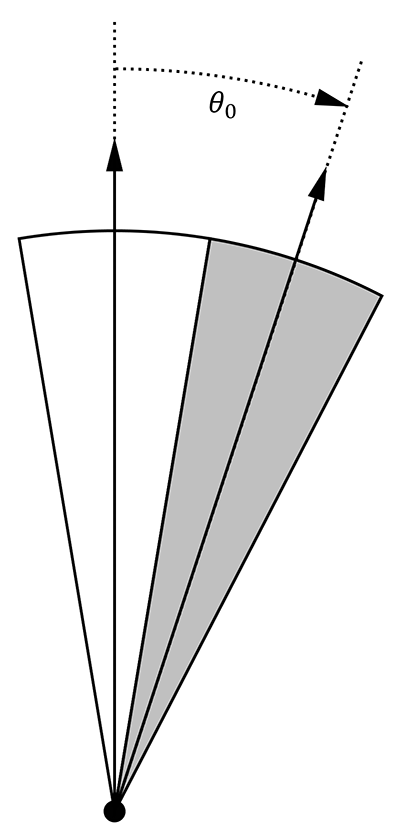

#### Solid angle of a single texel

We could follow the reasoning of McGuire [^4] and pose the *average* solid angle covered by a pixel of the cube map at a given mip level to be:

$$
d\Omega_p(m) = \frac{4\pi}{6} 2^{2(m-N)}
$$

But unfortunately, if we're looking for the equivalent cone aperture angle $\theta_0$ then we end up with an angle $\theta_0 > \frac{\pi}{2}$ at maximum aperture, when the solid angle is $d\Omega_p = \frac{4\pi}{6}$ and covers a full cube map face (i.e. coarsest mip).

Instead, we will use the aperture angle of a square-based pyramid where the base is the size of a texel at a given mip level:

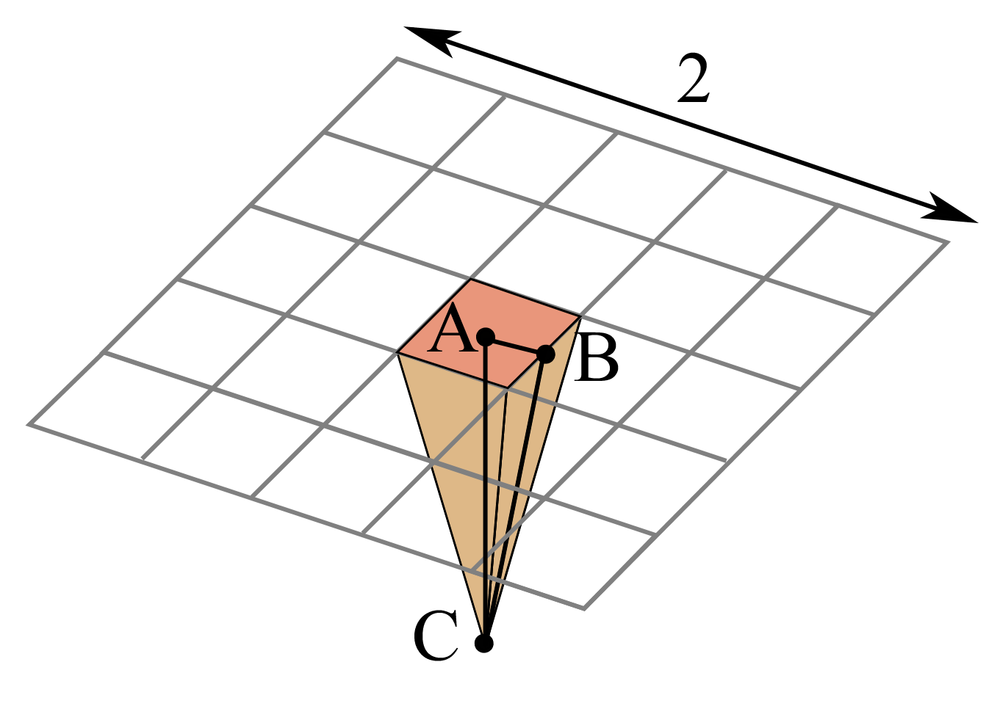

We're looking for the angle $\theta_0 = 2 \widehat{ACB}$ giving the aperture angle of the pixel pyramid shown in the figure.

We pose that the side length of the cube is 2 and the distance from the center of a cube face to the center of the cube is thus $AC = 1$.

Since a cube map with a power-of-two resolution can only have an amount of pixels for a given mip level equal to $2^{N-m}$, we can pose that the side length of a single pixel at mip $m$ is given by $2 AB = \frac{2}{2^{N-m}}$ so $AB = 2^{m-N}$.

And finally, the cosine of the angle $\widehat{ACB}$ is given by:

$$
\begin{align}
\cos( \widehat{ACB} ) &= \frac{AC}{BC} \\
&= \frac{AC}{\sqrt{ AC^2 + AB^2 }} \\
&= \frac{1}{ \sqrt{ 1^2 + \left( 2^{m-N} \right)^2 } } \\
&= \frac{1}{ \sqrt{ 1 + 2^{2(m-N)} } }
\end{align}
$$

We thus have a nice expression for $µ = \cos( \frac{\theta_0}{2} )$:

$$
\mu(m) = \frac{1}{ \sqrt{ 1 + 2^{2(m-N)} } }	 \tag{1}\label{(1)}
$$

And inversely, we find the mip level $m$ from $µ$ as given by:

$$
m(\mu) = N + \frac{1}{2} \log_2 \left( \frac{1}{\mu^2} - 1 \right)	 \tag{2}\label{(2)}
$$

We can see that at mip $N$, when there only remains a single pixel, we cover a full face of the cube so $\mu(N) = \frac{1}{\sqrt{2}}$ and $\theta_0 = \frac{\pi}{2}$.

**NOTE:** Even though we're computing the aperture angle of square-based pyramid, we will still act as if we were dealing with the aperture angle of convenient "spherical cones" with $\theta_s = \frac{\theta_0}{2}$:

Unfortunately, that also means that the maximum solid angle covered by a full cube map face will be $\Omega_s = 2\pi(1 - \cos(\frac{\pi}{4})) = \pi (2 - \sqrt{2})$ and not the expected $\frac{2\pi}{3}$...

#### The interesting case of the amount of neighbors

It's interesting to wonder how many neighbor cones a cone can have, depending on the "thickness" of the cones?

The answer is, surprisingly, between 4 and 6. No less, no more.

It's obvious for the largest cones (i.e. for the coverage of a full cube map face) to have 4 neighbors: each face of the cube map has 4 neighbor faces.
Less so when you reduce the aperture angle: you would expect a thinner cone to be able to pack a myriad of neighbor cones around it, an infinity of them actually.

It turns out that, no, you can't because as your neighbor cones get smaller, your own cone gets smaller as well and it's the same effect as if you were zooming in on the arrangement of cones: the crown tends to get smaller but the head wearing the crown as well, and that limit is finite.

This quite surprising result is given by [spherical triangle identities](https://en.wikipedia.org/wiki/Solution_of_triangles):

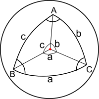

In our case, each axis from the center of the sphere to the vertices of the spherical triangle is the axis of a cone, the 3 angles $a, b, c$ separating the cones are $a = b = c = \theta_0$ and we're looking for $A$, the angle between 2 neighbors.

It's given by the equation:

$$
\cos(A) = \frac{\cos(a) - \cos(b) \cos(c)}{\sin(b) \sin(c)}
$$

Which, in our case, reduces to:

$$
\cos(A) = \frac{\cos(\theta_0) - \cos^2(\theta_0)}{1 - \cos^2(\theta_0)}
$$

We can then check that:

* When $\theta_0 = \frac{\pi}{2}$ then $A = \cos^{-1}( 0 ) = \frac{\pi}{2}$ and we can then fit $\frac{2\pi}{A} = \frac{2\pi}{\frac{\pi}{2}} = 4$ neighbors along the polar circle whose center is our texel's lobe cone
* When $\theta_0 \to 0$ then $A = \lim_{\theta_0 \to 0} \left( \cos^{-1}\left( \frac{\cos(\theta_0) - \cos^2(\theta_0)}{1 - \cos^2(\theta_0)} \right) \right) = \cos^{-1}( \frac{1}{2} ) = \frac{\pi}{3}$ and we can then fit $\frac{2\pi}{A} = \frac{2\pi}{\frac{\pi}{3}} = 6$ neighbors along the polar circle whose center is our texel's lobe cone

Here's a graph of the amount of neighbors as a function of the aperture angle:

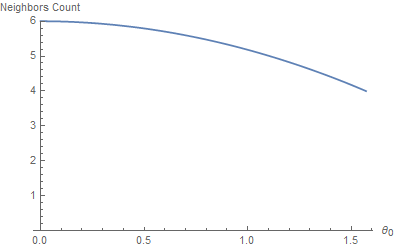

### Minimizing the Correlation

I propose that, in order to find a proper roughness value for any texel of the cube map, we attempt to fit a NDF lobe inside the texel's cone so that it has **minimal correlation with the neighbor texels' lobes**.

This essentially means that we must find $\alpha$ for a given mip level so that the NDF for that $\alpha$ doesn't make the texel's lobe overlap too much over its neighbors.

!!! quote ""

	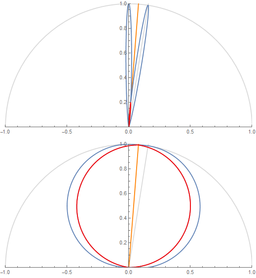

	The figure shows 2 texel lobes (in blue) and their correlation or overlap (in red) for **(top)** roughness value $\alpha=0.07$ and **(bottom)** roughness value $\alpha=1$.

	The 2 lobes are the lobes of 2 neighbor texels separated by an angle $\theta_0$ obtained from the solid angle covered by a single texel at a given mip in the cube map.

Basically, we're looking to "maximize the information" carried by a texel in order to avoid making it redundant.
A good mental image is to imagine a convolution of the cube map with a lobe of roughness 1 at the highest resolution: it would make no sense as it would carry almost exactly the same information from one pixel to its direct neighbor
(e.g. this is the bottom case in the figure above where the 2 neighbor lobes are almost completely overlapping).

### A 2D Metric

Let's suppose that we measure the correlation of 2 neighbor lobes in 2 dimensions.

We will work with normalized lobe expressions:

$$
pdf'( \theta, \alpha ) = \frac{pdf( \theta, \alpha )}{pdf( 0, \alpha )}
$$

For the correlation we could choose 2 expressions:

* The first one is $cor( \theta, \theta_0, \alpha ) = pdf'( \theta, \alpha ) \cdot pdf'( \theta_0 - \theta, \alpha )$

	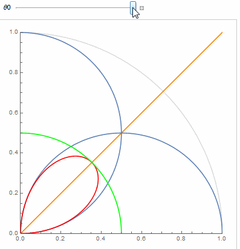

	The orange line shows the separation between a texel's cone and its neighbor's and the red portion shows the correlation.

* The second one is $cor( \theta, \theta_0, \alpha ) = max\left( 0, min\left( pdf'( \theta, \alpha ), pdf'( \theta_0 - \theta, \alpha ) \right) \right)$

	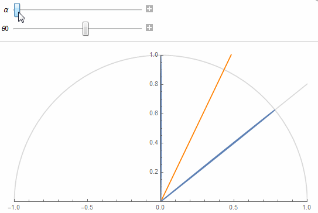

But I chose to go with the former that is a bit easier to work with.

Also, as a correlation measure, we could choose to either compute the normalized ratio of inter-penetrating area, or a single value of the correlation at the half-angle along the orange line.
Once again, I went with the easy choice of using a single measure (we will see the other measure when dealing with 3D lobes in a later section).

#### Finding the reference value

We start by noticing that there is a certain amount of correlation that we can't get rid of when we reach $m = N$ at max mip where, by definition, we wish to reach maximum roughness $\alpha = 1$.

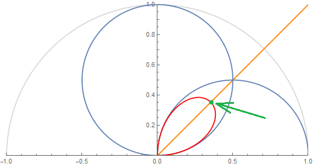

We find this *reference correlation value* by computing:

$$
c_{ref} = cor( \frac{\pi}{4}, \frac{\pi}{2}, 1 ) = \frac{1}{2}
$$

Next, we will enforce that this minimum correlation value stays the same for any value of $\theta_0$ along the orange line, the separation line between the 2 lobes at $\theta = \frac{\theta_0}{2}$:

$$
cor( \frac{\theta_0}{2}, \theta_0, \alpha ) = c_{ref}
$$

#### Finding the roughness

So for any given mip we have the cosine of the half-angle $\mu_0 = \cos\left( \frac{\theta_0}{2} \right)$ of the pixel's cone given by eq. $\eqref{(1)}$.

In the case of the GGX distribution, there is fortunately an analytical result for the correlation:

$$
cor \left( \frac{\theta_0}{2}, \theta_0, \alpha \right) = pdf'\left( \frac{\theta_0}{2}, \alpha \right) \cdot pdf'\left( \theta_0 - \frac{\theta_0}{2}, \alpha \right) = \left( pdf'\left( \frac{\theta_0}{2}, \alpha \right) \right)^2 = c_{ref}	\qquad\text{so} \\\\
pdf'\left( \frac{\theta_0}{2}, \alpha \right) = \sqrt{ c_{ref} }
$$

This means:

$$
\frac{ D\left( \frac{\theta_0}{2}, \alpha \right) \cos\left( \frac{\theta_0}{2} \right)} { D( 0, \alpha ) \cos( 0 )} = \sqrt{ c_{ref} }
$$

Solving for $\beta = \alpha^2$ gives (thanks Wolfram Alpha :heart_eyes:):

$$
\begin{align}
\beta( \mu_0 ) &= \frac{ c \mu_0^4 - c \mu_0^2 - \sqrt{ c \mu_0 (1 - \mu_0^2)^2} }{ c \mu_0^4 - \mu_0 }	 \tag{3}\label{(3)} \\
\alpha( \mu_0 ) &= \sqrt{ \beta( \mu_0 ) }
\end{align}
$$

With $c = \sqrt{ c_{ref} } = \frac{1}{\sqrt{2}}$.

This gives the following mapping from cone aperture angle to roughness value $\alpha$:

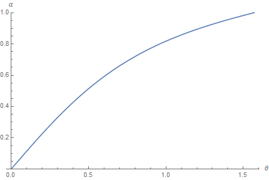

We can verify that the correlation at the half angle always lands on the target value $c_{ref}$ when using the computed roughness:

!!! quote ""
    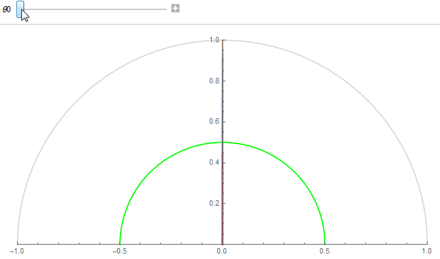

	Correlation value at half angle always lands on the green circle of radius $c_{ref}$ for any cone aperture angle.

#### Mapping mip level to roughness

By combining equations $\eqref{(1)}$ and $\eqref{(3)}$, we now have a procedure to map mip level to roughness.

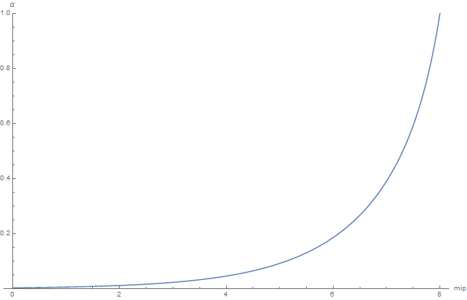

@TODO: CODE!

@TODO: Provide an alternative curve fitting to avoid using the expensive analytical expression.

#### Mapping roughness to mip level

Unfortunately, solving $\eqref{(3)}$ for $\mu$ is pretty much a nightmare. Instead, we're going to make a table of the values so we get a $\mu$ for each value of $\beta = \alpha^2$ (caution! We're using $\beta$ here!), and do a fitting of that curve...

**NOTE:** It may not be a very elegant solution but anyway, this is the computation we'll be using the most at runtime in our shaders and we couldn't have afforded a complicated expression like equation $\eqref{(3)}$ so even if we had had an analytical expression for $\mu$,
we would have eventually ended up making an approximation anyway.

So here is our fitting, in red, over the true curve in blue (it's a good sign if you can't see the blue curve underneath, means the fitting is quite good, and indeed the squared error is only 7.43266e-10):

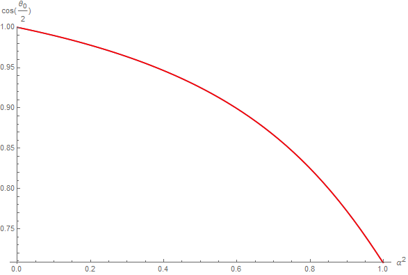

The fit curve is given by:

$$
\begin{align}
\mu( \beta ) &= \frac{ 1.2547008217731768 - 1.870418495301146 \beta +  0.72023546942613 \beta^2 }{ 1.2547008217731768 -  1.7522365852611441 \beta + 0.6453293459673146 \beta^2 } \\\\
\beta &= \alpha^2
\end{align}
$$

The resulting mip level is then obtained by using $\eqref{(2)}$ and we get this result:

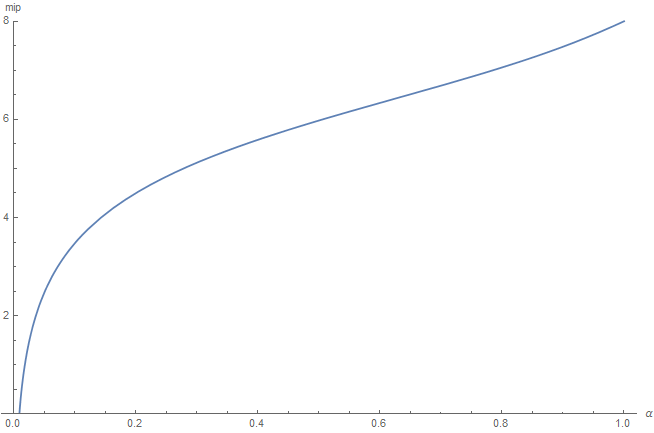

@TODO: code!

### A 3D Metric

Let's start over and choose a 3D metric this time, by measuring the *normalized ratio of lobe correlation* using the following correlation expression:

$$
cor( \theta, \theta_0, \alpha ) = max\left( 0, min\left( pdf( \theta, \alpha ), pdf( \theta_0 - \theta, \alpha ) \right) \right)
$$

This gives us the red intersection volume between 2 lobes as seen below:

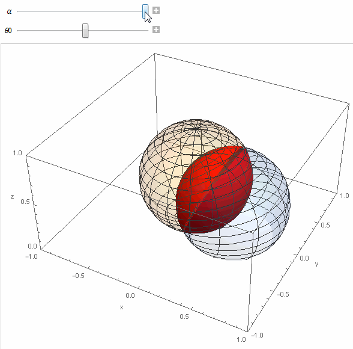

**NOTE:** The lobes appear to be once again normalized but it's not the case this time: we're using the actual pdf expression for the BRDF, **not** the normalized pdf' expression from earlier.

To normalize the result, we will simply divide by the total lobe volume later to get a value in [0,1].

#### Volume Triple Integral

In order to measure the inter-penetration of the two 3D lobes, we write the volume triple integral:

$$
\begin{align}
V &= \int_{-\pi}^{\pi} \int_0^{\frac{\pi}{2}} \int_0^{r(\theta,\phi,\alpha)} r^2 dr \sin(\theta) d\theta d\phi \\\\
  &= \int_{-\pi}^{\pi} \int_0^{\frac{\pi}{2}} \left[ \frac{1}{3} r^3 \right]_0^{r(\theta,\phi,\alpha)} \sin(\theta) d\theta d\phi \\\\ 
  &= \int_{-\pi}^{\pi} \int_0^{\frac{\pi}{2}} \frac{1}{3} r(\theta,\phi,\alpha)^3 \sin(\theta) d\theta d\phi	\tag{4}\label{(4)}
\end{align}
$$

Where:

$$
\begin{align}
r(\theta,\phi,\alpha) &= max\left( 0, min\left( pdf( \theta, \alpha ), pdf( \theta', \alpha ) \right) \right) \\\\
\cos( \theta' ) &= \sin( \theta ) \cos( \phi ) \sin( \theta_0 ) + \cos( \theta ) \cos( \theta_0 )
\end{align}
$$

Notice that we need to find the expression of the second lobe's elevation angle $\theta'$ by operating a change of reference frame.
I spare you the details of the computation but it's fairly easy to compute by writing the expression of $\boldsymbol{ \omega }$, a unit vector, in terms of spherical coordinates $\theta, \phi$ and computing $\boldsymbol{ \omega } \cdot \boldsymbol{ n' }$
 where $\boldsymbol{ n' }$ is the axis of the neighbor pixel's lobe rotated by $\theta_0$ from the main lobe's axis $\boldsymbol{ n }$.

This integral will give us $V$, the volume of inter-penetration of 2 lobes. In order to obtain the *normalized* penetration volume ratio, we need to divide $V$ by the *total volume* of a lobe $V_{max}$ which is given by the same integral $\eqref{(4)}$ but using the
lobe expression instead of the correlation:

$$
r(\theta,\phi,\alpha) = pdf( \theta, \alpha )
$$

The resulting normalized integral $c = \frac{V}{V_{max}}$ has no analytical solution that I could find so I simply baked a 129x65 table represented below:

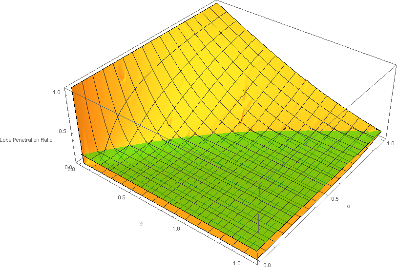

@TODO: Should we factor in the amount of neighbor cones so we have more penetration due to 6 neighbor cones when roughness is low, and less penetration due to only 4 neighbor cones when roughness is high?

We can see the penetration ratio stays in the normalized range [0,1]. The green plane represents the *reference value* of the minimal interpenetration ratio that we can't go below and that occurs, once again,
at the coarsest mip level when the lobes are separated by a $\theta_0 = \frac{\pi}{2}$ angle and roughness $\alpha = 1$, which is the case of the top right corner of the 3D graph above.

This reference correlation is roughly $c_{ref} = 0.116015$ meaning a 11% penetration.

Next, we will once again enforce that this minimum correlation value stays the same for any value of $\theta_0$.

#### Mapping mip level to roughness

Using the table, we can easly find a roughness value $\alpha$ for any cone separation angle $\theta_0$ by computing the line of intersection of the graph above and the green plane.

The target curve (in blue) is then cleaned up and easily fitted (in red):

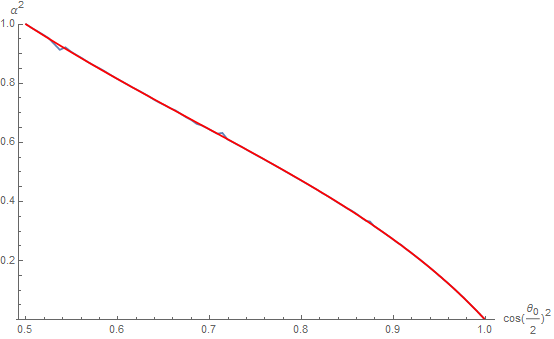

Resulting in the following expression:

$$
\begin{align}
\beta( x ) &= \frac{ 160.3332299994536 - 131.2107114069501 x -  29.133792073234147 x^2 } { 41.83893846650725 +  168.13611151303041 x - 153.7500633778045 x^2 }	\tag{5}\label{(5)} \\\\
x &= \cos\left( \frac{ \theta_0}{2} \right)^2 = \mu^2 \\\\
\beta &= \alpha^2
\end{align}
$$

**WARNING:** Notice here that we used the **squared cosine of the half angle** as input and that the function returns the **squared roughness**!
The main reason is that it's easier to fit and we always manipulate the square of the values anyway so it can avoid useless square roots in the shaders.

Finally, by combining equations $\eqref{(1)}$ and $\eqref{(5)}$, we now have a procedure to map mip level to roughness.

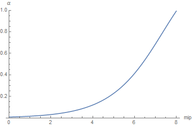

@TODO: CODE!

#### Mapping roughness to mip level

We simply need to make a table of inverted values that give a cosine value $\mu^2 = \cos( \frac{\theta_0}{2} )^2$ for any square roughness value $\beta = \alpha^2$ and find a curve fitting.

@TODO: Use the analytical inverse instead of doing another fitting! Show that it requires a sqrt...

So here is our fitting, in red, over the true curve in blue (not really visible):

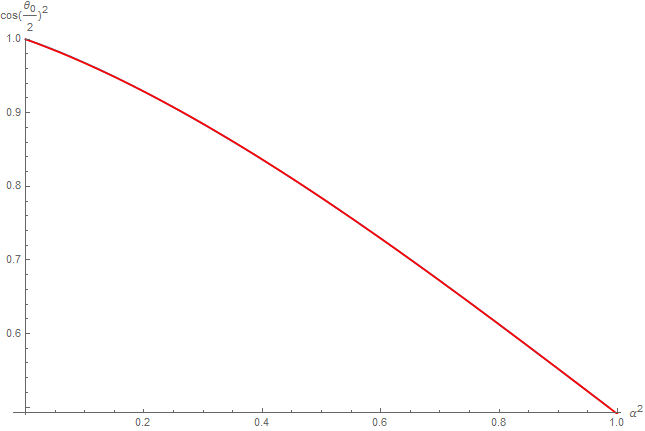

The fit curve is given by:

$$
\begin{align}
\mu( \beta )^2 &= \frac{ 5.238881411332154 - 1.5797129260127443 \beta^2 } { 5.238881411332154 + 1.5265349072841383 \beta + 0.6923074066106989 \beta^2}		\tag{6}\label{(6)} \\\\
\beta &= \alpha^2
\end{align}
$$

**WARNING:** Notice here that we used once again the **squared roughness** as input and that the function returns the **squared cosine of the half angle**!

Once again, the fitting is quite good and the squared error is only 2.39511e-6 and we verify that $\mu( 1 ) \approx \frac{1}{\sqrt{2}}$ so $\theta_0 = 2 \cos^{-1}( \mu( 1 ) ) \approx \frac{\pi}{2}$, the maximum aperture angle at maximum roughness.

The resulting mip level is then obtained by using $\eqref{(2)}$ and we get:

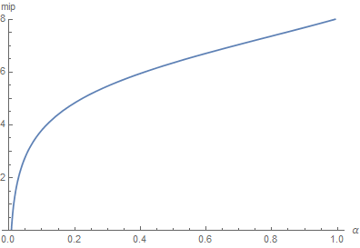

@TODO: CODE!

### Comparison of 2D and 3D metrics

It's interesting to notice that both the 2D (blue) and 3D (orange) correlation metrics have very similar shapes although the 3D correlation metric seems a bit more regular:

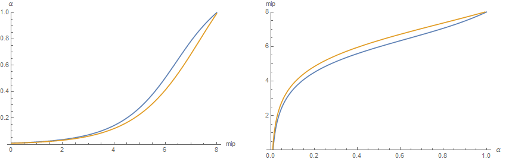

### Result

<!--
This is a live demo of what's happening when we increase the roughness:

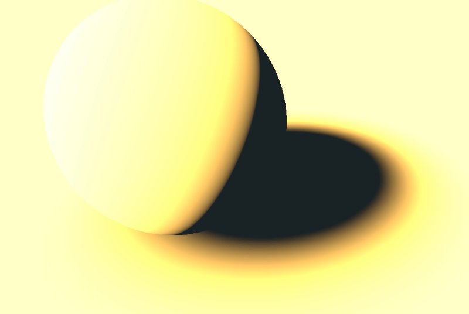
-->

## Luminance sampling problem

For the second part of our problem, we actually have many questions:

* When querying the cube map, what's the best way to interpolate pre-integrated illuminance for roughness values that are *not* exactly falling on a mip
	* What kind of error do we make when we linearly interpolate the mip levels?

* When *building the cube map*, how many samples should we take from mip level $m$ to build the cube map's mip level $m+1$?

* How many samples do we need to properly compute the illuminance integral under a given error?
	* When the point of view is aligned with the normal (cube map building case)
	* When the point of view can be anything (general case)

## Conclusion

@TODO!

## References

[^1]: Krivanek, J. Colbert, M ["Real-time Shading with Filtered Importance Sampling"](https://cgg.mff.cuni.cz/~jaroslav/papers/2008-egsr-fis/2008-egsr-fis-final-embedded.pdf)
[^2]: Karis, B. 2013 ["Real Shading in Unreal Engine 4"](https://blog.selfshadow.com/publications/s2013-shading-course/karis/s2013_pbs_epic_slides.pdf)
[^3]: Lagarde, S. de Rousiers, C. 2014 ["Moving Frostbite to PBR"](https://seblagarde.files.wordpress.com/2015/07/course_notes_moving_frostbite_to_pbr_v32.pdf)
[^4]: McGuire, M. 2011 ["Plausible Environment Lighting in Two Lines of Code"](http://casual-effects.blogspot.com/2011/08/plausible-environment-lighting-in-two.html)
