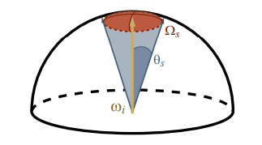

Since the papers "Real-time Shading with Filtered Importance Sampling" [^1] and "Real Shading in Unreal Engine 4" [^2] and even way before that, we all have been using the mips of cube maps to pre-integrate the specular illuminance to feed the BRDF with different values of roughness.

You often read something like "a different mip corresponds to some roughness value" but it's generally not very clear how exactly do you tie the mip level and the roughness value of the BRDF?

There are various possible schemes, some of them are explored by S. Lagarde in "Moving Frostbite to PBR" [^3] in section 4.9.2 eq. 63 where they chose the simple expression:

$$
m = \alpha \cdot N
$$

Where:

* $m$ is the mip level
* $N$ is the maximum mip level (e.g for a 256x256 cube map, N would be $log_2(256)=8$)
* $\alpha$ is the specular roughness (note that Lagarde uses the "linear roughness" or "perceptual roughness" $\alpha_{lin} = \alpha^2$ so $\sqrt{\alpha_{lin}} = \alpha$)

This mapping has the enormous advantage of being very simple, but it may not be optimal.

I apologize in advance for this article that will look like I'm once again dancing on the head of a pin for such a "trivial" matter but let's try and explore different metrics to map roughness to mip level and vice-versa.

## Stating the problems

Basically, we have 2 main problems when dealing with cube maps:

1. (**Construction**) an illuminance pre-integration problem where, for each mip level, we want a pixel of the cube map to cover the "largest footprint of the BRDF".
2. (**Usage**) a luminance estimation problem where we want to minimize the amount of samples to take from the BRDF/cube map

### Pre-integration problem

For this problem, we want a pixel of the cube map to contain the *most significant illuminance information* for a given roughness value that the BRDF will use.

In other words, we want the integral of the BRDF to be maximal when summed over the solid angle covered by the pixel and *we want to find the **roughness value** to make it so*.

#### Maximizing the BRDF's footprint

Note that we're dealing with the Cook-Torrance microfacet specular BRDF model here:

$$
\rho( \boldsymbol{ \omega_o }, \boldsymbol{ \omega_i }, \alpha, F_0 ) = \frac{ F( \boldsymbol{ \omega_o } \cdot \boldsymbol{ \omega_h }, F_0 ) G( \boldsymbol{ \omega_i } \cdot \boldsymbol{n}, \boldsymbol{ \omega_o } \cdot \boldsymbol{n}, \alpha ) D( \boldsymbol{ \omega_h } \cdot \boldsymbol{n}, \alpha )}
{4 (\boldsymbol{ \omega_i } \cdot \boldsymbol{n}) (\boldsymbol{ \omega_o } \cdot \boldsymbol{n})}
$$

Where:

* $\boldsymbol{ n }$ is the unit surface normal vector
* $\boldsymbol{ \omega_i }$ is the unit incoming light vector
* $\boldsymbol{ \omega_o }$ is the unit outgoing view vector
* $\boldsymbol{ \omega_h }$ is the unit half vector
* $\alpha$ is the surface's roughness
* $F_0$ is the surface's specular reflectance at normal incidence

The idea is to split the expression of the BRDF used in the far-field radiance estimate equation into 2 distinct parts:

$$
\begin{align}
L_o( \boldsymbol{ \omega_o } )	&= \int_{\Omega^+} L_i( \boldsymbol{ \omega_i } ) \rho( \boldsymbol{ \omega_o }, \boldsymbol{ \omega_i }, \alpha, F_0 ) \left( \boldsymbol{ \omega_i } \cdot \boldsymbol{ n } \right) d\omega_i	\\\\
								&\approx \color{#F80}{ \left( \int_{\Omega^+} \rho( \boldsymbol{ \omega_o }, \boldsymbol{ \omega_i }, \alpha, F_0 ) \left( \boldsymbol{ \omega_i } \cdot \boldsymbol{ n } \right) d\omega_i \right) }
								\cdot \color{#08A}{\left( \int_{\Omega^+} L_i( \boldsymbol{ \omega_i } ) D( \boldsymbol{ \omega_h } \cdot \boldsymbol{n}, \alpha ) \left( \boldsymbol{ \omega_i } \cdot \boldsymbol{ n } \right) d\omega_i \right) }
\end{align}
$$

The orange term in the expression represents the pre-integrated BRDF, while the term in teal represents the pre-convolved environment map weighed by the normal distribution function of the BRDF.

We know by definition that the normal distribution function $D( \cos(\theta), \alpha )$ integrates to 1:

$$
pdf( \theta, \phi ) = pdf( \theta ) = D( \cos(\theta), \alpha ) \cos(\theta) \\\\
\int_{0}^{2\pi} \int_0^{\frac{\pi}{2}} pdf( \theta ) \sin(\theta) d\theta d\phi = 2\pi \int_{0}^{\frac{\pi}{2}} pdf( \theta ) \sin(\theta) d\theta = 1
$$

Or in terms of $\mu = \cos(\theta)$:

$$
2\pi \int_{1}^{0} D( \mu, \alpha ) \mu \sqrt{1 - \mu^2} d\mu = 1
$$

More generally, we get the cumulative distribution function (CDF):

$$
cdf(\mu, \alpha) = 2\pi \int_{1}^{\mu} D( \mu_i, \alpha ) \mu_i \sqrt{1 - \mu_i^2} d\mu_i
$$

##### The case of GGX

In the case of the well-known GGX model, the NDF is:

$$
D( \mu, \alpha ) = \frac{\alpha^2}{\pi ( \mu^2(\alpha^2 - 1) + 1 )^2}
$$

The antiderivative of the PDF is given by:

$$
\begin{align}
\hat{D}( \mu, \alpha) &= 2\pi \int \frac{\alpha^2}{\pi ( \mu^2(\alpha^2 - 1) + 1 )^2} \mu \sqrt{1 - \mu^2} d\mu \\\\
\hat{D}( \mu, \alpha) &= \frac{\alpha^2}{(\alpha^2 - 1) \left( 1 + \mu^2 (\alpha^2 - 1) \right) }
\end{align}
$$

The CDF is then given by:

$$
\begin{align}
cdf(\mu, \alpha) &= \hat{D}( \mu, \alpha ) - \hat{D}( 1, \alpha ) \\\\
cdf(\mu, \alpha) &= \frac{ 1 - \mu^2 }{ 1 + \mu^2 (\alpha^2 - 1) }
\end{align}
$$

#### Configuration of 2 neighbor texels

We start by definining how we should represent 2 neighbor texels in the cube map.

We decide:

1. To ignore the deformation of texels in the corners and their subsequent variation in solid angle
2. To assume all texels cover an *average solid angle*
3. To suppose that this solid angle is covered by a portion of spherical cap represented by a cone with aperture angle $\theta_0$

This should make you think that 2 neighbor texels as two cones separated by their aperture angle $\theta_0$, as shown in the figure below:

##### Solid angle of a single texel

As explained by McGuire [^4], we know the *average* solid angle covered by a pixel of the cube map at a given mip level is given by:

$$
d\Omega_p(m) = \frac{4\pi}{6} 2^{2(m-N)}
$$

We can see that at mip $N$, when there only remains a single pixel, we cover a full face of the cube, that is $d\Omega_p = \frac{2\pi}{3}$.

##### Equivalent solid angle over the sphere

The portion of the unit sphere domain covering the same solid angle as a texel from the cube map is determined by the cosine of the elevation angle:

$$
d\Omega_c(\mu) = 2\pi (1 - \mu)
$$

Where $\mu = \cos(\theta)$ and $\theta$ is the elevation angle from the pole.

!!! quote ""
	

	The area of the spherical cap C over the unit hemisphere is $\Omega_S = 2\pi (1 - \cos(\theta))$

Posing $d\Omega_p = d\Omega_c$ we get:

$$
\mu = 1 - \frac{1}{3} 2^{2(m-N)}	 \tag{1}\label{(1)}
$$

which gives us the cosine of the spherical cap angle covering the same solid angle as a single texel of the cube map at mip $m$.

We immediately see that at the maximum mip level $m = N$ we get the maximum half aperture angle $\theta_{max}$:

$$
\theta_{max} = cos^{-1}( \mu_{max} ) = cos^{-1}( 1 - \frac{1}{3} ) = cos^{-1}( \frac{2}{3} ) \approx 48°
$$

**NOTE:** The total aperture angle for a single face of the cube map at $m = N$ (max mip) is larger than the expected $\frac{\pi}{2}$ angle.

##### The interesting case of the amount of neighbors

It's interesting to wonder how many neighbor cones a cone can have, depending on the "thickness" of the cones?

The answer is, surprisingly, between 4 and 6. No less, no more.

It's obvious for the largest cones (i.e. for the coverage of a full cube map face) to have 4 neighbors: each face of the cube map has 4 neighbor faces.
Less so when you reduce the aperture angle: you would expect a thinner cone to be able to pack a myriad of neighbor cones around it, an infinity of them actually.

It turns out that, no, you can't because as your neighbor cones get smaller, your own cone gets smaller as well and it's the same effect as if you were zooming in on the arrangement of cones: the crown tends to get smaller but the head wearing the crown as well, and that limit is finite.

This quite surprising result is given by [spherical triangle identities](https://en.wikipedia.org/wiki/Solution_of_triangles):

In our case, each axis from the center of the sphere to the vertices of the spherical triangle is the axis of a cone, the 3 angles $a, b, c$ separating the cones are $a = b = c = \theta_0$ and we're looking for $A$, the angle between 2 neighbors.

It's given by the equation:

$$
\cos(A) = \frac{\cos(a) - \cos(b) \cos(c)}{\sin(b) \sin(c)}
$$

Which, in our case, reduces to:

$$
\cos(A) = \frac{\cos(\theta_0) - \cos^2(\theta_0)}{1 - \cos^2(\theta_0)}
$$

We can then check that:

* When $\theta_0 = \frac{\pi}{2}$ then $A = \cos^{-1}( 0 ) = \frac{\pi}{2}$ and we can then fit $\frac{2\pi}{A} = \frac{2\pi}{\frac{\pi}{2}} = 4$ neighbors along the polar circle whose center is our texel's lobe cone
* When $\theta_0 \to 0$ then $A = \lim_{\theta_0 \to 0} \left( \cos^{-1}\left( \frac{\cos(\theta_0) - \cos^2(\theta_0)}{1 - \cos^2(\theta_0)} \right) \right) = \cos^{-1}( \frac{1}{2} ) = \frac{\pi}{3}$ and we can then fit $\frac{2\pi}{A} = \frac{2\pi}{\frac{\pi}{3}} = 6$ neighbors along the polar circle whose center is our texel's lobe cone

Here's a graph of the amount of neighbors as a function of the aperture angle:

**WARNING:** we can't plug our expression from earlier for the cone's angle into that nice equation since our $\theta_{max} > \frac{\pi}{2}$. A normalization would be necessary.

#### Minimizing the Correlation

I propose that, in order to find a proper roughness value for any texel of the cube map, we attempt to fit a NDF lobe inside the texel's cone so that it has **minimal correlation with the neighbor texels' lobes**.

This essentially means that we must find $\alpha$ for a given mip level so that the NDF for that $\alpha$ doesn't make the texel's lobe overlap too much over its neighbors.

!!! quote ""

	

	The figure shows 2 texel lobes (in blue) and their correlation or overlap (in red) for **(top)** roughness value $\alpha=0.07$ and **(bottom)** roughness value $\alpha=1$.

	The 2 lobes are the lobes of 2 neighbor texels separated by an angle $\theta$ obtained from the solid angle covered by a single texel at a given mip in the cube map.

Basically, we're looking to "maximize the information" carried by a texel in order to avoid making it redundant.
A good mental image is to imagine a convolution of the cube map with a lobe of roughness 1 at the highest resolution: it would make no sense as it would carry almost exactly the same information from one pixel to its direct neighbor
(e.g. the bottom case in the figure above where the 2 neighbor lobes are almost completely overlapping).

#### A 2D Metric

Let's suppose that we measure the correlation of 2 neighbor lobes in 2 dimensions.

We will work with normalized lobe expressions:

$$
pdf'( \theta, \alpha ) = \frac{pdf( \theta, \alpha )}{pdf( 0, \alpha )}
$$

For the correlation we could choose 2 expressions:

* The first one is $cor( \theta, \theta_0, \alpha ) = pdf'( \theta, \alpha ) \cdot pdf'( \theta_0 - \theta, \alpha )$

	

	The orange line shows the separation between a texel's cone and its neighbor's and the red portion shows the correlation.

* The second one is $cor( \theta, \theta_0, \alpha ) = max\left( 0, min\left( pdf'( \theta, \alpha ), pdf'( \theta_0 - \theta, \alpha ) \right) \right)$

	

But I chose to go with the former that is a bit easier to work with.

Also, as a correlation measure, we could choose to either compute the normalized ratio of inter-penetrating area, or a single value of the correlation at the half-angle along the orange line.
Once again, I went with the easy choice of using a single measure.
We will see a different metric when dealing with 3D lobes in a later section.

##### Finding the reference value

We start by noticing that there is a certain amount of correlation that we can't get rid of when we reach $m = N$ at max mip where, by definition, we wish to reach maximum roughness $\alpha = 1$.

We find this *reference correlation value* by computing:

$$
c_{ref} = cor( \frac{\pi}{4}, \frac{\pi}{2}, 1 ) = \frac{1}{2}
$$

Next, we will enforce that minimum correlation value for any value of $\theta_0$ along the orange line, the separation line between the 2 lobes at $\theta = \frac{\theta_0}{2}$:

$$
cor( \frac{\theta_0}{2}, \theta_0, \alpha ) = c_{ref}
$$

##### Finding the roughness

So for any given mip we have the solid angle $d\Omega_p(m)$ covered by a pixel and incidently, the cosine of the half-angle $\mu_0 = \cos\left( \frac{\theta_0}{2} \right)$ of the equivalent spherical cap also given by $\mu_0 = 1 - \frac{1}{3} 2^{2(m-N)}$.

In the case of the GGX distribution, there is fortunately an analytical result for the correlation:

$$
cor \left( \frac{\theta_0}{2}, \theta_0, \alpha \right) = pdf'\left( \frac{\theta_0}{2}, \alpha \right) \cdot pdf'\left( \theta_0 - \frac{\theta_0}{2}, \alpha \right) = \left( pdf'\left( \frac{\theta_0}{2}, \alpha \right) \right)^2 = c_{ref}	\qquad\text{so} \\\\
pdf'\left( \frac{\theta_0}{2}, \alpha \right) = \sqrt{ c_{ref} }
$$

This means:

$$
\frac{ D\left( \frac{\theta_0}{2}, \alpha \right) \cos\left( \frac{\theta_0}{2} \right)} { D( 0, \alpha ) \cos( 0 )} = \sqrt{ c_{ref} }
$$

Solving for $\alpha$ gives (thanks Wolfram Alpha :heart_eyes:):

$$
\alpha( \mu_0 )^2 = \frac{ c \mu_0^4 - c \mu_0^2 - \sqrt{ c \mu_0 (1 - \mu_0^2)^2} }{ c \mu_0^4 - \mu_0 }
$$

With $c = \sqrt{ c_{ref} } = \frac{1}{\sqrt{2}}$.

This gives the following mapping from cone aperture angle to roughness value $\alpha$:

We can verify that the correlation at the half angle always lands on the target value $c_{ref}$ when using the computed roughness:

!!! quote ""
    

	Correlation value at half angle always lands on the green circle of radius $c_{ref}$ for any cone aperture angle.

Obviously, a roughness value of $\alpha = 0$ *always* satisfies our criterium since the CDF is always 1, for any solid angle.

Instead, we need to cover a **certain ratio** $C \in [0,1]$ of the CDF so $cdf( \mu, \alpha ) = C$.

The ideal solution would be that the CDF covers the largest solid angle $\frac{2\pi}{3}$ for the largest roughness value $\alpha_{max} = 1$ at the largest mip $N$ so we simply need to solve:

$$
C = cdf( \mu_{max}, 1 ) = 1 - \mu_{max}^2 = 1 - \left( \frac{2}{3} \right)^2 = \frac{5}{9}
$$

(remember earlier when we found out that at the largest mip, the spherical cap would have an angle corresponding to $\mu_{max} = \frac{2}{3}$) (I told you it would become significant later!)

This results means that, for every mip level, we're looking for the CDF to cover ~55% of its [0,1] range, as shown in this animation below:

!!! quote ""
    

	CDF as a function of spherical cap angle, for various roughness $\alpha$.

	The orange part is the ratio of CDF we need to cover to maximize the footprint of the CDF for a given mip level.

So now, we know the constant $C$ that can help us find a link between $\alpha$, our surface's roughness and $\mu$, a measure of the solid angle of a pixel of a given mip level:

$$
C = \frac{ 1 - \mu^2 }{ 1 + \mu^2 (\alpha^2 - 1) }	 \tag{2}\label{(2)}
$$

#### Mapping mip level to roughness

We know from $\eqref{(1)}$ earlier that:

$$
\mu = 1 - \frac{1}{3} 2^{2(m-N)}
$$

And since it's easy to solve equation $\eqref{(2)}$ for $\alpha$:

$$
\alpha^2 = \frac{(C-1) (\mu^2-1)}{C\mu^2}
$$

We now have the procedure to map mip level to roughness.

#### Mapping roughness to mip level

Again, from $\eqref{(2)}$ we can easily solve for $\mu$:

$$
\mu = \sqrt{ \frac{1-C}{1 + C(\alpha^2 -1)} }
$$

The resulting mip level is then obtained by:

$$
m = N + \frac{1}{2} \log_2\left( 3 - 3 \mu \right)
$$

#### Result

<!--
This is a live demo of what's happening when we increase the roughness:

-->

### Luminance sampling problem

For our second problem, 

## Conclusion

Mapping is very ugly! :D

## References

[^1]: Krivanek, J. Colbert, M ["Real-time Shading with Filtered Importance Sampling"](https://cgg.mff.cuni.cz/~jaroslav/papers/2008-egsr-fis/2008-egsr-fis-final-embedded.pdf)
[^2]: Karis, B. 2013 ["Real Shading in Unreal Engine 4"](https://blog.selfshadow.com/publications/s2013-shading-course/karis/s2013_pbs_epic_slides.pdf)
[^3]: Lagarde, S. de Rousiers, C. 2014 ["Moving Frostbite to PBR"](https://seblagarde.files.wordpress.com/2015/07/course_notes_moving_frostbite_to_pbr_v32.pdf)
[^4]: McGuire, M. 2011 ["Plausible Environment Lighting in Two Lines of Code"](http://casual-effects.blogspot.com/2011/08/plausible-environment-lighting-in-two.html)
