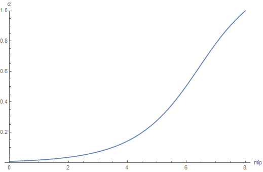

Since the papers "Real-time Shading with Filtered Importance Sampling" [^1] and "Real Shading in Unreal Engine 4" [^2], most people have been using the mips of cube maps to pre-integrate the specular illuminance to feed their BRDF for different values of roughness.

You often read something like "a different mip corresponds to some roughness value" but it's generally not very clear how exactly do you tie the mip level and the roughness value of the BRDF?

There are various possible schemes, some of them are explored by S. Lagarde in "Moving Frostbite to PBR" [^3] in section 4.9.2 eq. 63 where they chose the simple expression:

$$
m = \alpha \cdot N
$$

Where:

* $m$ is the mip level
* $N$ is the maximum mip level (e.g for a 256x256 cube map, N would be $log_2(256)=8$)
* $\alpha$ is the specular roughness (note that Lagarde uses the "linear roughness" or "perceptual roughness" $\alpha_{lin} = \alpha^2$ so $\sqrt{\alpha_{lin}} = \alpha$)

This mapping has the enormous advantage of being very simple, but it may not be optimal.

## Stating the problems

Basically, we have 2 main problems when dealing with cube maps:

1. an illuminance pre-integration problem where, for each mip level, we want a pixel of the cube map to cover the "largest footprint of the BRDF".
2. a luminance estimation problem where we want to minimize the amount of samples to take from the BRDF and the cube map

### Pre-integration problem

For this problem, we want a pixel of the cube map to contain the most significant illuminance information for a given roughness value that the BRDF will use.

In other words, we want the integral of the BRDF to be maximal when summed over the solid angle covered by the pixel and *we want to find the **roughness value** to make it so*.

#### Maximizing the BRDF's footprint

Note that we're dealing with the Cook-Torrance microfacet specular BRDF model here:

$$
\rho( \boldsymbol{ \omega_o }, \boldsymbol{ \omega_i } ) = \frac{ F( \boldsymbol{ \omega_o } \cdot \boldsymbol{h}, F_0 ) G( \boldsymbol{ \omega_i } \cdot \boldsymbol{n}, \boldsymbol{ \omega_o } \cdot \boldsymbol{n}, \alpha ) D( \boldsymbol{ \omega_h } \cdot \boldsymbol{n}, \alpha )}
{4 (\boldsymbol{ \omega_i } \cdot \boldsymbol{n}) (\boldsymbol{ \omega_o } \cdot \cdot \boldsymbol{n})}
$$

Where:

* $\boldsymbol{ n }$ is the unit surface normal vector
* $\boldsymbol{ \omega_i }$ is the unit incoming light vector
* $\boldsymbol{ \omega_o }$ is the unit outgoing view vector
* $\boldsymbol{ \omega_h }$ is the unit half vector
* $\alpha$ is the surface's roughness
* $F_0$ is the surface's specular reflectance at normal incidence

Ignoring the Fresnel coefficient $F$ that is factored out of the pre-integration anyway, and the shadowing/masking terms that are either view-dependent (not in the integral) or light-dependent (not relevant to the problem at hand),
we can focus on the normal distribution function $D( \cos(\theta), \alpha )$ for which we know that, by definition:

$$
\begin{align}
pdf( \theta, \phi ) &= pdf( \theta ) = D( \cos(\theta), \alpha ) \cos(\theta) \\\\
\int_{\Omega^+} pdf( \boldsymbol{\omega} ) d\omega &= \int_{0}^{2\pi} \int_0^{\frac{\pi}{2}} pdf( \theta ) \sin(\theta) d\theta d\phi = 2\pi \int_{0}^{\frac{\pi}{2}} pdf( \theta ) \sin(\theta) d\theta = 1
\end{align}
$$

Where:

* $\Omega^+$ is the upper-hemisphere domain
* $\boldsymbol{\omega}$ is a unit direction vector parametrized by the spherical coordinates $\theta$ and $\phi$

Or in terms of $\mu = \cos(\theta)$:

$$
2\pi \int_{1}^{0} D( \mu, \alpha ) \mu \sqrt{1 - \mu^2} d\mu = 1
$$

More generally, we get the cumulative distribution function (CDF):

$$
cdf(\mu, \alpha) = 2\pi \int_{1}^{\mu} D( \mu_i, \alpha ) \mu_i \sqrt{1 - \mu_i^2} d\mu_i
$$

##### The case of GGX

In the case of the well-known GGX model, the NDF is:

$$
D( \mu, \alpha ) = \frac{\alpha^2}{\pi ( \mu^2(\alpha^2 - 1) + 1 )^2}
$$

The antiderivative of the PDF is given by:

$$
\begin{align}
\hat{D}( \mu, \alpha) &= 2\pi \int \frac{\alpha^2}{\pi ( \mu^2(\alpha^2 - 1) + 1 )^2} \mu \sqrt{1 - \mu^2} d\mu \\\\
\hat{D}( \mu, \alpha) &= \frac{\alpha^2}{(\alpha^2 - 1) \left( 1 + \mu^2 (\alpha^2 - 1) \right) }
\end{align}
$$

The CDF is then given by:

$$
\begin{align}
cdf(\mu, \alpha) &= \hat{D}( \mu, \alpha ) - \hat{D}( 1, \alpha ) \\\\
cdf(\mu, \alpha) &= \frac{ 1 - \mu^2 }{ 1 + \mu^2 (\alpha^2 - 1) }
\end{align}
$$

#### Maximizing the CDF

As explained by McGuire [^4], we know the *average* solid angle covered by a pixel of the cube map at a given mip level is given by:

$$
d\Omega_p(m) = \frac{4\pi}{6} 2^{2(m-N)}
$$

We can see that at mip $N$, when there only remains a single pixel, we cover a full face of the cube, that is $d\Omega_p = \frac{2\pi}{3}$.

##### Equivalent solid angle over the sphere

The portion of the unit sphere domain covering the same solid angle as a texel from the cube map is determined by the cosine of the elevation angle:

$$
d\Omega_c(\mu) = 2\pi (1 - \mu)
$$

Where $\mu = \cos(\theta)$ and $\theta$ is the elevation angle from the pole.

!!! quote ""
	

	The area of the spherical cap C over the unit hemisphere is $2\pi (1 - \cos(\theta))$

Posing $d\Omega_p = d\Omega_c$ we get:

$$
\mu = 1 - \frac{1}{3} 2^{2(m-N)}	 \tag{1}\label{(1)}
$$

which gives us the cosine of the spherical cap angle covering the same solid angle as a single texel of the cube map at mip $m$.

We immediately see that at the maximum mip level $m = N$ we get the maximum aperture angle and:

$\mu_{max} = 1 - \frac{1}{3} = \frac{2}{3}$    &nbsp; &nbsp; &nbsp; &nbsp; &nbsp; (this will be important below)

**NOTE**: It's very interesting to notice that this value is independent of the resolution of the cube map and only depends on the solid angle of a single face of the cube.

##### Finding the roughness

So for any given mip we have the solid angle $d\Omega_p(m)$ covered by a pixel and incidently, the cosine of the equivalent spherical cap $\mu = 1 - \frac{1}{3} 2^{2(m-N)}$.

We're looking after the roughness value $\alpha$ that best maximizes the expression of the CDF for the given pixel footprint/solid angle.

!!! quote ""
    

	CDF as a function of spherical cap angle, for various values of roughness $\alpha$.

Obviously, a roughness value of $\alpha = 0$ *always* satisfies our criterium since the CDF is always 1, for any solid angle.

Instead, we need to cover a **certain ratio** $C \in [0,1]$ of the CDF so $cdf( \mu, \alpha ) = C$.

The ideal solution would be that the CDF covers the largest solid angle $\frac{2\pi}{3}$ for the largest roughness value $\alpha_{max} = 1$ at the largest mip $N$ so we simply need to solve:

$$
C = cdf( \mu_{max}, 1 ) = 1 - \mu_{max}^2 = 1 - \frac{1}{3}^2 = \frac{5}{9}
$$

(remember earlier when we found out that at the largest mip, the spherical cap would have an angle corresponding to $\mu_{max} = \frac{2}{3}$) (I told you it would become significant later!)

This results means that, for every mip level, we're looking for the CDF to cover ~55% of its [0,1] range, as shown in this animation below:

!!! quote ""
    

	CDF as a function of spherical cap angle, for various roughness $\alpha$.

	The orange part is the ratio of CDF we need to cover to maximize the footprint of the CDF for a given mip level.

So now, we know the constant $C$ that can help us find a link between $\alpha$, our surface's roughness and $\mu$, a measure of the solid angle of a pixel of a given mip level:

$$
C = \frac{ 1 - \mu^2 }{ 1 + \mu^2 (\alpha^2 - 1) }	 \tag{2}\label{(2)}
$$

#### Mapping mip level to roughness

We know from $\eqref{(1)}$ earlier that:

$$
\mu = 1 - \frac{1}{3} 2^{2(m-N)}
$$

And since it's easy to solve equation $\eqref{(2)}$ for $\alpha$:

$$
\alpha^2 = \frac{(C-1) (\mu^2-1)}{C\mu^2}
$$

We now have the procedure to map mip level to roughness.

#### Mapping roughness to mip level

Again, from $\eqref{(2)}$ we can easily solve for $\mu$:

$$
\mu = \sqrt{ \frac{1-C}{1 + C(\alpha^2 -1)} }
$$

The resulting mip level is then obtained by:

$$
m = N + \frac{1}{2} \log_2\left( 3 - 3 \mu \right)
$$

#### Result

<!--
This is a live demo of what's happening when we increase the roughness:

-->

### Luminance sampling problem

For our second problem, 

## Conclusion

Mapping is very ugly! :D

## References

[^1]: Krivanek, J. Colbert, M ["Real-time Shading with Filtered Importance Sampling"](https://cgg.mff.cuni.cz/~jaroslav/papers/2008-egsr-fis/2008-egsr-fis-final-embedded.pdf)
[^2]: Karis, B. 2013 ["Real Shading in Unreal Engine 4"](https://blog.selfshadow.com/publications/s2013-shading-course/karis/s2013_pbs_epic_slides.pdf)
[^3]: Lagarde, S. de Rousiers, C. 2014 ["Moving Frostbite to PBR"](https://seblagarde.files.wordpress.com/2015/07/course_notes_moving_frostbite_to_pbr_v32.pdf)
[^4]: McGuire, M. 2011 ["Plausible Environment Lighting in Two Lines of Code"](http://casual-effects.blogspot.com/2011/08/plausible-environment-lighting-in-two.html)
