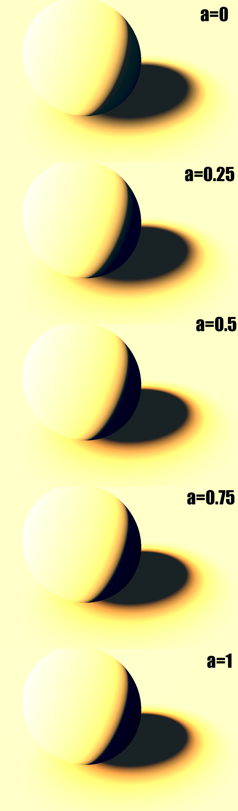

Since the paper "Real Shading in Unreal Engine 4" [^1] by Brian Karis, most people have been using pre-integrated illuminance encoded in the mips of cube maps spread throughout the 3D scene to represent the specular illuminance to feed their BRDF.

You often read something like "a different mip corresponds to some roughness value" but it's generally not very clear how exactly do you tie the mip level and the roughness value of the BRDF?

There are various possible schemes, some of them are explored by S. Lagarde in "Moving Frostbite to PBR" [^2] in section 4.9.2 eq. 63:

$$
mip = \alpha \cdot N
$$

Where $\alpha$ is the specular roughness (note that Lagarde uses the "linear roughness" or "perceptual roughness" $\alpha_{lin} = \alpha^2$ so $\sqrt{\alpha_{lin}} = \alpha$), $mip$ is the mip level and $N$ is the maximum mip level (e.g for a 256x256 cube map, N would be $log_2(256)=8$).

This mapping has the enormous advantage of being very simple, but it is not the optimal one.

## Stating the problem

Basically, for each mip level, we want a pixel to cover the "most significant footprint of BRDF".

In other words, we want the integral of the BRDF to be maximal when summed over the solid angle covered by the pixel.

Ignoring the Fresnel coefficient $F$ that is factored out of the pre-integration anyway, and the Shadowing/Masking terms that are either view-dependent (not in the integral) or light-dependent (not relevant to the problem at hand),
we can focus on the normal distribution function $N$ for which we know that:

$$
\
$$

### Customization

The goal of my application was to fit new lobes from simulated, empirical data thus I wasn't shy of adding new alien parameters to these models in order to make the resulting lobes more "bendable" and capable of fitting a larger
 set of shapes that could come out from multiple bounces of light, as can be seen in this image:

!!! quote ""
    

	Multiple orders of scattering on a diffuse surface with roughness $\alpha = 0.8$.
	Lobes are scaled to roughly the same size each time, otherwise their volume collapses to 0 very rapidly with each new bounce.

	We see that the diffuse lobes can be pretty "squashed". We get even worse kinds of shapes when dealing with dielectric materials.

#### Analytical Lobe Expression

The intensity of the lobe in a specific direction is given by:

$$
f(\omega_o,\omega_i,\alpha,\sigma,m) = \sigma \left( \left(1-m\right) + m \left( G(\mu_i, \alpha ) G(\mu_o, \alpha ) \right) \right) N( \mu_i, \alpha )
$$

Where:

* $\sigma$ is the global scale factor
* $m$ is the importance for the masking/shadowing term, which will be later set to 0 as we will see
* $G(\mu,\alpha)$ is the [masking/shadowing term for the Phong model](http://graphicrants.blogspot.fr/2013/08/specular-brdf-reference.html) which is actually that of Beckmann
* $\mu_i = \boldsymbol{\omega_i} \cdot \boldsymbol{Z}$ is the cosine of the angle between the incoming direction and the macroscopic surface normal
* $\mu_o = \boldsymbol{\omega_o} \cdot \boldsymbol{Z}$ is the cosine of the angle between the outgoing direction and the macroscopic surface normal
* $\alpha$ is the surface roughness

#### Parameters Fitting
 	
Where:
$$
\begin{align}
	a( \alpha ) &=  0.02881326115 - 0.92153748116 \alpha + 6.63272611438 \alpha^2 - 4.595702230 \alpha^3 \\\\
	b( \alpha ) &= -0.09663259042 + 7.21414360220 \alpha - 19.7868451171 \alpha^2 + 11.04205888 \alpha^3 \\\\
	c( \alpha ) &=  0.10935692546 - 10.7904051575 \alpha + 28.5080366763 \alpha^2 - 15.66525827 \alpha^3 \\\\
	d( \alpha ) &= -0.04376425480 + 5.24919600918 \alpha - 13.5827073397 \alpha^2 + 7.348408854 \alpha^3 \\\\
\end{align}
$$
 
<!-- Additionally, the fitted lobe roughness \alpha as a function of surface roughness Subscript[\alpha, s] is given by:
 
 	 \alpha(Subscript[\alpha, s])= 1-0.2687 \alpha+0.153596 \alpha^2

DAFUQ? Where does that go? Is this for all alphas???
-->

#### Result

You can see below the effect of multiple-scattering on shadows and transition areas when the roughness increases:

This is a live demo of what's happening when we increase the roughness:

## Conclusion

Regarding this lobe fitting business, you may understandably question the complexity of the computation of the multiple-scattering term considering the low visual impact it's bringing to the table, and I would completely agree with you! :smile:

Unfortunately, I never had the time to finish this project due to the time constraint of working on the production of *Dishonored 2* but I would have loved to continue experimenting, especially re-using Heitz's results instead of casting millions of rays,
 and fitting better lobe models or even find a much simpler way to add back the energy lost by single-scattering models.

Of course, people didn't stop investigate like I did, especially in large companies like Disney, Dreamworks, Weta or ImageWorks. And what had to happen did [happen](MSBRDFEnergyCompensation)...

## References

[^1]: Karis, B. 2013 ["Real Shading in Unreal Engine 4"](https://blog.selfshadow.com/publications/s2013-shading-course/karis/s2013_pbs_epic_slides.pdf)
[^2]: MacGuire, M. 2011 ["Plausible Environment Lighting in Two Lines of Code"](http://casual-effects.blogspot.com/2011/08/plausible-environment-lighting-in-two.html)
[^3]: Lagarde, S. de Rousiers, C. 2014 ["Moving Frostbite to PBR"](https://seblagarde.files.wordpress.com/2015/07/course_notes_moving_frostbite_to_pbr_v32.pdf)
