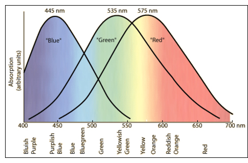
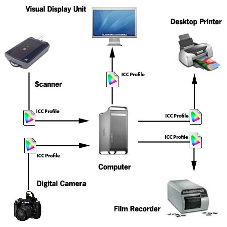
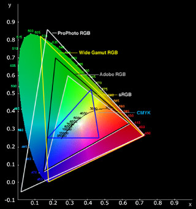
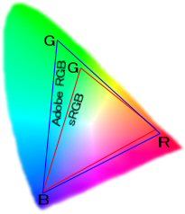
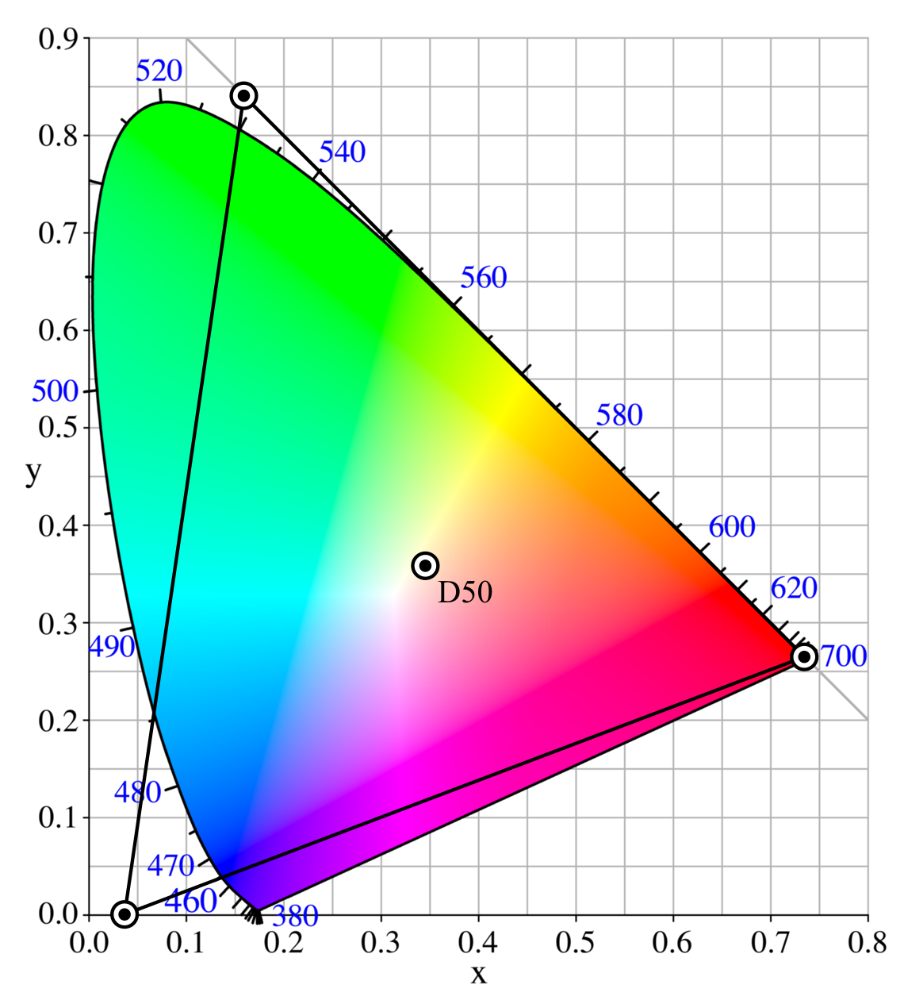
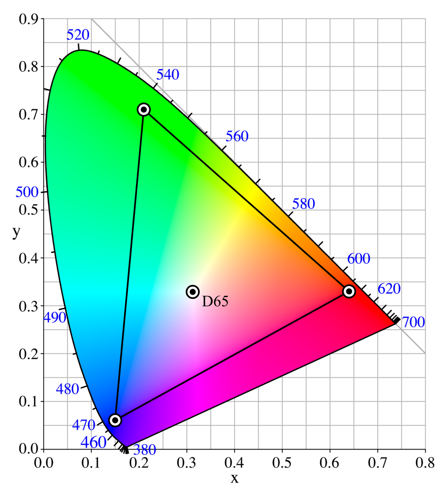
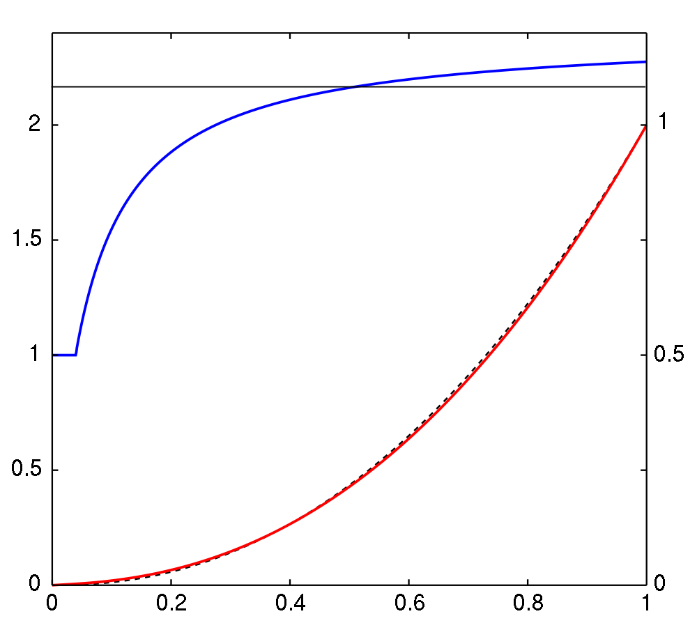
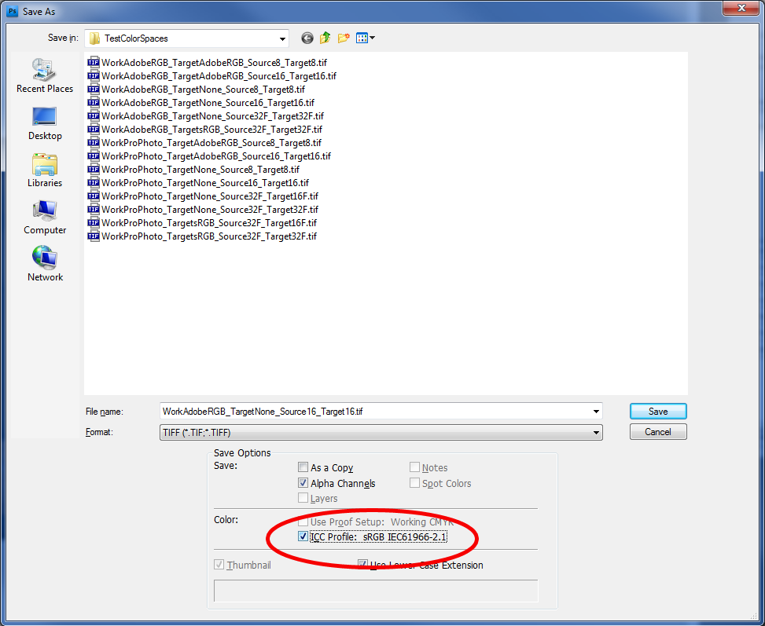


[Source](http://www.jands.com.au/support/product_support/lighting_technical_materials/what_to_look_for_when_judging_an_led_fixture146s_colour_mixing_capabilities133)

[Source](http://www.jands.com.au/support/product_support/lighting_technical_materials/what_to_look_for_when_judging_an_led_fixture146s_colour_mixing_capabilities133)

")

The **Color Profile** is the most important notion to grasp when dealing with digital imaging.
It's fundamental to understand that the **RGB Color Space** is not a device-independent space:

 the RGB colors coming from digital cameras or scanners and displayed by a CRT or LCD display device are all dependent on the way the manufacturers created their products.
 For example, with [CCD (charge-coupled device) sensors](http://en.wikipedia.org/wiki/Charge-coupled_device) Sensors, the RGB coating covering the CCD sensors can differ in many ways like the material used for each RGB filter,
  or the way the coating is attached to the sensors.

As pictured in the top image on the right, RGB tristimulus values is the obvious choice because of the way the [cone cells](http://en.wikipedia.org/wiki/Cone_cell) in the back of our eyes are themselves sensitive to red, green and blue light.
 The combination of the spectral sensitivities of each RGB cone allows us to cover the entire spectrum of visible light from ~380nm (blue) to ~700nm (red).

Obviously, human-made devices such as sensors or LEDs don't cover as much range as seen in the picture on the right. Moreover, these devices are limited in intensity or sensitivity.

As every device (including the human eye) has its own response to RGB light and since RGB is still the color space of choice for storing and working with digital images, it is of the utmost importance to use softwares that embed a *Color Management System* (CMS).

**And that includes your 3D renderer!**

##Color Management##
(source: [http://www.computer-darkroom.com/ps10_colour/ps10_1.htm](http://www.computer-darkroom.com/ps10_colour/ps10_1.htm))

A *Color Management System* or **CMS** comprises three basic components, namely: -

* A device-independent color space - this is usually referred to as the **Working** or **Reference** color space.
* **ICC profiles** for each device (i.e. printer, scanner, monitor, digital camera, etc.) that will accurately describe the unique color characteristics of each device.
* A **Color Matching Module (CMM)** that will interpret the information contained within the device profiles and carry out the instructions on how the color characteristics of each device should be treated.

If you need to take a look at a CMS then you can check [Little CMS](http://www.littlecms.com), the open source CMS by Marti Maria.

####Profile Connection Space####
In the terminology of the [International Color Consortium](http://www.color.org), a translation between two color spaces can go through a *profile connection space* (PCS).

The connection space can thus be the *Working* or *Reference* color space of the Color Management System.

&nbsp; &nbsp; &nbsp; &nbsp; *Color Space 1 &rarr; PCS ([CIELAB](ColorSpace/#cie-lab) or [CIEXYZ](ColorSpace/#cie-xyz)) &rarr; Color space 2*

 conversions into and out of the PCS are each specified by a profile.

##Color Profile##
(source: [http://www.computer-darkroom.com/ps10_colour/ps10_1.htm](http://www.computer-darkroom.com/ps10_colour/ps10_1.htm))

A digital image will usually comprise many millions pixels, each of which is represented by a numeric value.
The value assigned to each pixel will describe many attributes but  in this essay it's the color value or mix (e.g. RGB value) that we're most interested in.
As I have already mentioned, when a color is device-dependent, the appearance of pixels with identical values will very often differ because each device has its own unique way of translating the color "value" or "number" into visual color.

The role of  ICC profiles is to ensure that discrepancies that result from the widely differing color characteristics of each device are known to the color management system.
If we were discussing spoken language rather than color, then the ICC profile would be synonymous with a translator.

Device profiles come in two basic forms, i.e. **Input** and **Output**:

* Input profiles typically describe the color characteristics of scanners and digital cameras
* Output profiles describe devices such as monitors, printers and film recorders.

Input profiles are often referred to as one-way since they represent the source device.
For obvious reasons we can never convert a document into the color space of our scanner or digital camera.
Output profiles on the other hand are two-way meaning we can convert From or To them.
For example, we can convert a document with an embedded monitor profile into a document that has a color profile describing a printer, or vice versa.

Consumer class film and flatbed scanner applications have been "ICC-aware" for some time now, with the vendors usually choosing sRGB as their preferred color space, which is a bit of a misnomer because sRGB is not a device color space (rather a color profile).
Clearly, these vendors are doing some work behind the scenes so as to keep things simple for the user, which isn't necessarily as wise as it might first appear.
The sRGB color space isn't generally regarded as appropriate for high quality image editing, especially when print or film output is required.
So, to overcome this some vendors also provide the user with the option of choosing from a small selection of alternatives.

For example, printer vendors such as Epson provide generic ICC profiles with their photo class printers, although it's generally accepted these profiles are rarely as accurate as users would like.
Nevertheless, they are getting better with each new generation of printer.

!!! info
    As a rule of thumb, truly accurate color matching usually requires customized ICC profiles for each device and/or media type.
    These ICC profiles can be created professionally or you can buy your own profiling application.

###ICC Profiles###
(source: [http://www.computer-darkroom.com/ps10_colour/ps10_1.htm](http://www.computer-darkroom.com/ps10_colour/ps10_1.htm))

So, we have Device Profiles and Working Space Profiles - how do they interact?

The first thing we need to understand is that for any color profile to be useful to the color management system, they must conform with the [**ICC standard**](http://www.color.org).
In fact you'll more often see such profiles referred to as just ICC profiles.
Anyway, without the aid of  device profiles the accurate translation of the document color data (the RGB numbers) from the scanner or digital camera into the **Working Space** will prove very difficult, if not impossible.

Likewise, without the aid of accurate media specific printer profiles, the translation from the **Working Space** into the color space of a digital printer will prove equally difficult.
We also need an accurate **monitor profile** so as to ensure that what we see on the monitor is a true representation of the document color.

The following flow diagram demonstrates a typical imaging workflow, with the document being passed between devices: - from scanner/digital camera --> to --> computer --> to --> monitor/printer.

The following image illustrates the [Color Gamut](http://en.wikipedia.org/wiki/Gamut) covered by all standard profiles like [ProPhoto RGB](http://en.wikipedia.org/wiki/ProPhoto_RGB_color_space), [Adobe RGB](http://en.wikipedia.org/wiki/Adobe_RGB_color_space)
 and [sRGB](http://en.wikipedia.org/wiki/SRGB) color profiles:

You can easily see here that each of these standard profiles are defined as a triangle where each vertex represents the [*chromaticities*](ColorSpace/#cie-xyy) for Red, Green and Blue.

Moreover, there is an additional spot inside the triangle called the [*White Point*](Illuminants/#white-point) (see also the [Illuminants](Illuminants) section).

The white point is a very important data as it defines the color "white" in image capture, encoding, or reproduction. Depending on the application, different definitions of white are needed to give acceptable results.
For example, photographs taken indoors may be lit by incandescent lights, which are relatively orange compared to daylight.
Defining "white" as daylight will give unacceptable results when attempting to color correct a photograph taken with incandescent lighting.

##Standard & Custom Profiles##
We can distinguish 2 kinds of color profiles:

* Standard profiles like ProPhoto RGB, Adobe RGB and sRGB that each have their use depending on your goal (professional photography, web design, video games, simple user, etc.)
* Custom profiles that you can create specifically for your devices (digital camera, LCD monitor, printer, etc.)

###Standard Profiles###
Let's review the different standard profiles by decreasing gamut coverage:

####ProPhoto####
(Source: [http://en.wikipedia.org/wiki/ProPhoto_RGB_color_space](http://en.wikipedia.org/wiki/ProPhoto_RGB_color_space))

The [ProPhoto RGB](http://en.wikipedia.org/wiki/ProPhoto_RGB_color_space) color profile covering 90% of the entire gamut and used by professional photographers. We note the white point is set to [D50](Illuminants/#1963-illuminants) (5000K):

The ProPhoto RGB color space, also known as ROMM RGB (Reference Output Medium Metric), is an output referred RGB color space developed by Kodak.
It offers an especially large gamut designed for use with photographic output in mind.

The ProPhoto RGB color space encompasses over 90% of possible surface colors in the [CIE L\*a\*b\*](ColorSpace/#cie-lab) color space, and 100% of likely occurring real world surface colors
 making ProPhoto even larger than the [Wide Gamut RGB color space](http://en.wikipedia.org/wiki/Wide-gamut_RGB_color_space).

The ProPhoto RGB primaries were also chosen in order to minimize hue rotations associated with non-linear tone scale operations.
One of the downsides to this color space is that approximately 13% of the representable colors are imaginary colors that do not exist and are not visible colors.
This means that potential color accuracy is wasted for reserving these unnecessary colors.

When working in color spaces with such a large gamut, it is recommended to **work in 16-bit color depth** to avoid posterization effects.
This will occur more frequently in 8-bit modes as the gradient steps are much larger.

The white point corresponds to [D50](Illuminants/#1963-illuminants). The chromaticities of the primary colors and the white point are as follows:

| color | x | y |
| - |- |- |  
| Red | 0.7347 | 0.2653 |
| Green | 0.1596 | 0.8404 |
| Blue | 0.0366 | 0.0001 |
| White | 0.3457 | 0.3585 |

####Adobe RGB####
(source: [http://en.wikipedia.org/wiki/Adobe_RGB_color_space](http://en.wikipedia.org/wiki/Adobe_RGB_color_space))

The [Adobe RGB](http://en.wikipedia.org/wiki/ProPhoto_RGB_color_space) color profile covering 50% of the entire gamut and widely used by photographers. We note the white point is set to [D65](Illuminants/#1963-illuminants) (6500K):

The Adobe RGB color space encompasses roughly 50% of the visible colors specified by the Lab color space, improving upon the gamut of the sRGB color space primarily in cyan-greens.

In Adobe RGB, colors are specified as (R,G,B) triplets, where each of the R, G, and B components can have values between 0 and 1.
When displayed on a monitor, the exact chromaticities of the white point (1,1,1), the black point (0,0,0), and the primaries [(1,0,0) etc.] are specified.

Moreover, the luminance of the monitor should be 160 cd/m2 at the white point, and 0.5557 cd/m2 at the black point, which implies a contrast ratio of 287.9. The environment of the monitor is illuminated at 32 lux.

As with sRGB, the RGB component values in Adobe RGB are not proportional to the luminances. Rather, *a gamma of 2.2 is assumed*, without the linear segment near zero that is present in sRGB.
The precise gamma value is 563 / 256, or 2.19921875.

The white point corresponds to [D65](Illuminants/#1963-illuminants).
The chromaticities of the primary colors and the white point are as follows:

| color | x | y |
| - |- |- |  
| Red | 0.6400 | 0.3300 |
| Green | 0.2100 | 0.7100 |
| Blue | 0.1500 | 0.0600 |
| White | 0.3127 | 0.3290 |

Adobe RGB (1998) color profile specification: [http://www.adobe.com/digitalimag/pdfs/AdobeRGB1998.pdf](http://www.adobe.com/digitalimag/pdfs/AdobeRGB1998.pdf)

####sRGB####
(Source: [http://en.wikipedia.org/wiki/SRGB](http://en.wikipedia.org/wiki/SRGB))

Finally, the image below illustrates the [sRGB](http://en.wikipedia.org/wiki/SRGB) color profile which is the most widely used and documented profile, but also the one covering the least of the gamut (about 35%).
We note the white point is also set to [D65](Illuminants/#1963-illuminants) (6500K):

(notice how the red and blue end points of the triangle match the ones of the Adobe RGB profile, only the green chromaticity is stretched down)

Plot of the sRGB intensities versus sRGB numerical values (red), and this function's slope in log-log space (blue) which is the effective gamma at each point. Below a compressed value of 0.04045 or a linear intensity of 0.00313,
 the curve is linear so the gamma is 1. Behind the red curve is a dashed black curve showing an exact gamma = 2.2 power law:

As seen above, sRGB is a widely used color profile but covers a smaller portion of the color gamut than Adobe RGB : about 35% as opposed to almost 50% for Adobe RGB.

The sRGB color space has been endorsed by the W3C, Exif, Intel, Pantone, Corel, and many other industry players; it is used in proprietary and open graphics file formats, such as SVG.

The sRGB color space is well specified and is designed to match typical home and office viewing conditions, rather than the darker environment typically used for commercial color matching.

Nearly all software is now designed with the assumption that an 8-bit-per-channel image file placed unchanged onto an 8-bit-per-channel display will appear much as the sRGB specification dictates.
LCDs, digital cameras, printers, and scanners all follow the sRGB standard.
Devices which do not naturally follow sRGB (as was the case for older CRT monitors) include compensating circuitry or software so that, in the end, they also obey this standard.

!!! note
    For this reason, one can generally assume, *in the absence of embedded profiles or any other information, that any 8-bit-per-channel image file or any 8-bit-per-channel image API or device interface can be treated as being in the sRGB color space*.

sRGB also defines a nonlinear transformation between the intensity of these primaries and the actual number stored.
The curve is *similar to the gamma response of a CRT display*. It is more important to replicate this curve than the primaries to get correct display of an sRGB image.
This nonlinear conversion means that sRGB is a reasonably efficient use of the values in an integer-based image file to display human-discernible light levels.

The white point corresponds to [D65](Illuminants/#1963-illuminants).
The chromaticities of the primary colors and the white point are as follows:

| color | x | y |
| - |- |- |  
| Red | 0.6400 | 0.3300 |
| Green | 0.3000 | 0.6000 |
| Blue | 0.1500 | 0.0600 |
| White | 0.3127 | 0.3290 |

###Custom Color Profiling your Devices###

####Monitor Calibration and Characterization####
(source: [http://www.computer-darkroom.com/ps10_colour/ps10_1.htm](http://www.computer-darkroom.com/ps10_colour/ps10_1.htm))

Monitor calibration and characterization (profiling) is probably the most important aspect of a color managed workflow; yet many users seem oblivious to issues poor monitor calibration, etc. can have on their documents.
So, what is calibration, why is it so important, and why is it different from characterization?

Calibration is a process whereby a device is brought to a standard state (e.g. a color temperature of 6500K and gamma of 2.2), whereas characterizing the monitor is the process of determining how the monitor represents or reproduces color.

We characterize the monitor by measuring how it displays known color values, then creating an ICC profile.
The ICC profile is simply a data file that includes a description of the monitor's color handling characteristics (i.e. its gamut).
The calibration data will also be written into the ICC profile.

As I've already mentioned, Photoshop then uses the monitor profile to automatically optimize the display of documents.
It does so by carrying out an on-the-fly conversion between your document profile (e.g. ProPhoto RGB, Adobe RGB, sRGB, ColorMatch) and your monitor profile.
This conversion does not alter the actual document in any way; just its appearance on the monitor.

There are 2 main ways of calibrating a monitor:

* Software
* Hardware

Obviously, software-only monitor calibration applications use the human eye to determine tone and color differences between a series of white/grey/black/color patches.
However, it  should go without saying that the eye isn't the most accurate method of measuring these differences.

Therefore, my recommendation would be to use a hardware based system such as the [Datacolor SpyderPro3](http://spyder.datacolor.com/product-mc-s3pro.php),
[X-rite Photo ColorMunki](http://www.xrite.com/product_overview.aspx?ID=1115) or **[X-rite Photo i1 Display 2](http://www.xrite.com/product_overview.aspx?ID=788)** (my personnal choice, comes with a [ColorChecker](ColorProfile/#colorchecker)).

If you wish to calibrate visually without having to purchase one of these expensive babies though, you can:

* Use the Color Management program embedded in Windows Vista SP2 or Windows 7 (Control Panel --> Color Management)
* To easily calibrate your LCD display, use [http://www.lagom.nl/lcd-test/](http://www.lagom.nl/lcd-test/)
* Or check out this [comprehensive page](http://desktoppub.about.com/gi/o.htm?zi=1/XJ&zTi=1&sdn=desktoppub&cdn=compute&tm=5&f=11&tt=14&bt=1&bts=0&st=10&zu=http%3A//www.normankoren.com/makingfineprints1A.html)

You can also find many ICC profiles for various monitors from the ICC Profiles Database at [http://www.tftcentral.co.uk/articles/icc_profiles.htm](http://www.tftcentral.co.uk/articles/icc_profiles.htm).
These profiles have all been created using the hardware devices mentioned earlier.

Although it's not possible to share ICC profiles with other users of the same monitor to achieve the exact same results, ICC profiles which are shared can often at least help improve settings and colour accuracy to a certain degree,
 and so are an easy method of attempting calibration without the need for a colorimeter.

####Camera Profiling####

#####Shooting in RAW#####
If your camera can output RAW images then it is possible to obtain its color profile:

* You can check this simple video showing how to correctly setup the color profile of your camera:

    <iframe width='500' height='281' src='https://www.pinkbike.com/v/embed/125981/?colors=c80000' allowfullscreen frameborder='0'></iframe>

* Also make sure to check that [blog post](http://blog.pcode.nl/2010/06/28/darktable-camera-color-profiling/) for advice on how to buy a proper target and how to correctly shoot it for calibration.

The actual *working color profile* will be decided when you import the RAW file in your favorite RAW reader.

#####Shooting in JPEG#####
Otherwise, low end cameras that store JPEGs mostly use pre-defined profiles like [sRGB](http://en.wikipedia.org/wiki/SRGB) or [Adobe RGB](http://en.wikipedia.org/wiki/Adobe_RGB_color_space) described earlier.

JPEG is ill-advised anyway because of lossy compression and mostly because of immediate and irreversible choices you have to do like color balance and color grading which are otherwise deferred to a more adequate software in the case of RAW images.

!!! note
    * Shoot pictures in RAW
    * Work with **ProPhoto RGB** or **Adobe RGB** for largest coverage of the gamut
    * Store images in 16 bits whenever possible (PNG or TIFF)

####Working with Photoshop####

!!! warning
    * For PNGs, the color profile is always stored as a **/cHRM** metadata that can easily be read back to obtain a standard color profile, even though there is no explicit profile name embedded as meta.
    * For other formats like JPG or TIFF, always enable the "ICC profile" option in the save dialog otherwise there is no way to determine the image's color profile when reloading the bitmap in a 3D application and it can be quite wrong if you assume sRGB by default whereas Photoshop working profile is Adobe RGB or ProPhoto!
    

##What is a profile in terms of code?
(Source: [http://blog.pcode.nl/2010/06/28/darktable-camera-color-profiling/](http://blog.pcode.nl/2010/06/28/darktable-camera-color-profiling/))

There are basically two kinds of profiles:

* XYZ matrices (these are often called color matrices) and are typically combined with a gamma curve
* LUT (Look-Up Table) profiles.

The big difference is that with a XYZ matrix all color transformations are calculated on the fly, while LUTs are precalculated, so transforming color via a LUT is simply looking up an input color and it’s matching output color.
The nice thing about LUTs is that they can deal with slight (nonlinear) deviations and can even be tweaked for creative purposes.
So when generating a LUT profile, the profile is likely to pick up some of the peculiarities of your particular camera.

XYZ matrices don’t have that problem since they are defined by only 3×3 coordinates in XYZ colorspace, and thus are quite generic by their very nature.
This is also the reason why we are sticking to color matrices instead of supplying more detailed LUT profiles (besides diskspace usage).

We discuss the maths of to compute a custom XYZ color matrix from 3 chromaticities and the white point [here](ColorTransforms/#xyz-matrices).

As a general rule:

* Standard color profiles like sRGB or Adobe RGB use XYZ matrices and are generic to all devices
* Custom profiles created by hardware devices or special calibration softwares generate LUT profiles and are specific to your devices

XYZ Matrices and LUTs only describe *chromaticity calibration*. The human eye is also very sensitive to another value called the *luminance*.
Thus, color profiles also describe a *luminance calibration* often described in the form of a power function: the well-known **gamma function** or **gamma correction**.

*Gamma correction is often considered more important than chromaticity correction*.

---
##Next

Next, we will discuss of the [Color Illuminants](Illuminants).