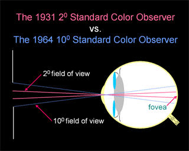
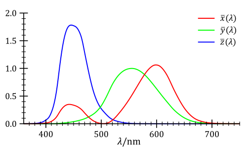
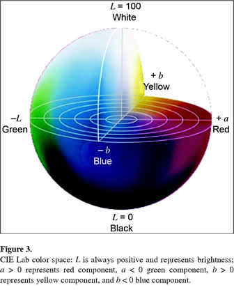

#Color Spaces#
A color space is the 3-dimensional space in which colors can be represented. 3 dimensions are enough for all applications to describe a color faithfully,
 but various conventions can be chosen to select each dimension depending on the intended goal (processing, display, accuracy, perception, etc.).

Some of the color spaces are [CIE XYZ](ColorSpace/#cie-xyz), [CIE xyY](ColorSpace/#cie-xyy), [CIE LAB](ColorSpace/#cie-lab), [RGB](ColorSpace/#rgb), [HSV, HSL](ColorSpace/#hsl-and-hsv), HSB, [YUV](ColorSpace/#yuv).

These color spaces can be categorized in different ways:

* *Device independent* or [*Absolute color spaces*](ColorSpace/#absolute-color-space) like XYZ, xyY or Lab
* [*Device dependent*](ColorSpace/#device-dependent-color-spaces) or *Relative color spaces* like RGB, HSV, HSL, HSB and YUV

Or:

* *RGB-based* color spaces like XYZ, RGB
* *Non RGB-Based* color spaces like HSV, HSL, HSB, YUV, Lab

##Absolute Color Space##
(Source: [http://en.wikipedia.org/wiki/Absolute_color_space](http://en.wikipedia.org/wiki/Absolute_color_space))

In color science, there are two meanings of the term absolute color space:

* A color space in which the perceptual difference between colors is directly related to distances between colors as represented by points in the color space.
* A color space in which colors are unambiguous, that is, where the interpretations of colors in the space are colorimetrically defined without reference to external factors.

In this section, we concentrate on the second definition.

[CIEXYZ](ColorSpace/#cie-xyz) and [sRGB](ColorProfile/#srgb) are examples of absolute color spaces, as opposed to a generic RGB color space.

A non-absolute color space can be made absolute by defining its relationship to absolute colorimetric quantities.
For instance, if the red, green, and blue colors in a monitor are measured exactly, together with other properties of the monitor, then RGB values on that monitor can be considered as absolute.
The L\*a\*b\* is sometimes referred to as absolute, though it also needs a [white point](Illuminants/#white-point) specification to make it so.

A popular way to make a color space like RGB into an absolute color is to define an [**ICC profile**](ColorProfile/#icc-profile), which contains the attributes of the RGB.
This is not the only way to express an absolute color, but it is the standard in many industries. RGB colors defined by widely accepted profiles include [sRGB](ColorProfile/#srgb) and [Adobe RGB](ColorProfile#adobe-rgb).
The process of adding an ICC profile to a graphic or document is sometimes called [tagging or embedding](Image_Metadata); tagging therefore marks the absolute meaning of colors in that graphic or document.

###Conversion###
A color in one absolute color space can be converted into another absolute color space, and back again, in general; however, some color spaces may have gamut limitations, and converting colors that lie outside that gamut will not produce correct results.
There are also likely to be rounding errors, especially if the popular range of only 256 distinct values per component (8-bit color) is used.

One part of the definition of an absolute color space is the viewing conditions. The same color, viewed under different natural or artificial lighting conditions, will look different.
Those involved professionally with color matching may use viewing rooms, lit by standardized lighting.

Occasionally, there are precise rules for converting between non-absolute color spaces. For example [HSL and HSV](ColorSpace/#hsl-and-hsv) spaces are defined as mappings of RGB.
Both are non-absolute, but the conversion between them should maintain the same color.
However, in general, *converting between two non-absolute color spaces (for example, RGB to CMYK) or between absolute and non-absolute color spaces (for example, RGB to L\*a\*b\*) is almost a meaningless concept without specyfying a [Color Profile](ColorProfile)*.

See also the [Color Transforms](ColorTransforms) page for helpful formulas transforming from one color space to another.

##Standard Observer##

(Source: [http://en.wikipedia.org/wiki/CIE_1931_color_space#The_CIE_standard_observer](http://en.wikipedia.org/wiki/CIE_1931_color_space#The_CIE_standard_observer))

Due to the distribution of [cone cells](http://en.wikipedia.org/wiki/Cone_cell) in the eye, the tristimulus values depend on the observer's field of view. To eliminate this variable, the CIE defined the standard (colorimetric) observer.
Originally this was taken to be the chromatic response of the average human viewing through a 2° angle, due to the belief that the color-sensitive cones resided within a 2° arc of the fovea.
Thus the CIE 1931 Standard Observer is also known as the **CIE 1931 2° Standard Observer**. A more modern but less-used alternative is the CIE 1964 10° Standard Observer.

For the 10° experiments, the observers were instructed to ignore the central 2° spot. The 1964 Supplementary Standard Observer is recommended for more than about a 4° field of view.
Both standard observers are discretized at 5 nm wavelength intervals and distributed by the CIE.

The standard observer is characterized by three color matching functions.

The derivation of the CIE standard observer from color matching experiments is given below, after the description of the CIE RGB space.

###Color matching functions###

The **color matching functions** are the numerical description of the chromatic response of the *observer* (described above).

The CIE has defined a set of three *color-matching functions*, called $\overline{x}(\lambda)$, $\overline{y}(\lambda)$, and $\overline{z}(\lambda)$,
which can be thought of as the spectral sensitivity curves of three linear light detectors that yield the CIE XYZ tristimulus values *X*, *Y*, and *Z*.
The tabulated numerical values of these functions are known collectively as the CIE standard observer.

The tristimulus values for a color with a [spectral power distribution](http://en.wikipedia.org/wiki/Spectral_power_distribution) $I(\lambda)\,$ are given in terms of the standard observer by:

$$
X= \int_0^\infty I(\lambda)\,\overline{x}(\lambda)\,d\lambda
$$

$$
Y= \int_0^\infty I(\lambda)\,\overline{y}(\lambda)\,d\lambda
$$

$$
Z= \int_0^\infty I(\lambda)\,\overline{z}(\lambda)\,d\lambda
$$

where $\lambda\$ is the wavelength of the equivalent monochromatic light (measured in nanometers).

Other observers, such as for the CIE RGB space or other RGB color spaces, are defined by other sets of three color-matching functions, and lead to tristimulus values in those other spaces.

The values of *X*, *Y*, and *Z* are bounded if the intensity spectrum *I*(*&lambda;*) is bounded.

!!! info
    You can download the color-matching function tables as CSV files from [http://cvrl.ioo.ucl.ac.uk/cmfs.htm](http://cvrl.ioo.ucl.ac.uk/cmfs.htm).
	Or you can find them on this site:

	* [2-deg XYZ CMFs transformed from the CIE (2006) 2-deg LMS cone fundamentals](../data/Colorimetry/ColorMatchingFunctions/lin2012xyz2e_fine_7sf.csv)
	* [10-deg XYZ CMFs transformed from the CIE (2006) 2-deg LMS cone fundamentals (1nm)](../data/Colorimetry/ColorMatchingFunctions/lin2012xyz10e_fine_7sf.csv)
	* [CIE 1931 2-deg, XYZ CMFs (5nm)](../data/Colorimetry/ColorMatchingFunctions/ciexyz31.csv)
	* [CIE 1931 2-deg, XYZ CMFs (1nm)](../data/Colorimetry/ColorMatchingFunctions/ciexyz31_1.csv)
	* [CIE 1931 2-deg, XYZ CMFs modified by Judd (1951)](../data/Colorimetry/ColorMatchingFunctions/ciexyzj.csv)
	* [CIE 1931 2-deg, XYZ CMFs modified by Judd (1951) and Vos (1978)](../data/Colorimetry/ColorMatchingFunctions/ciexyzjv.csv)
	* [CIE 1964 10-deg, XYZ CMFs (5nm)](../data/Colorimetry/ColorMatchingFunctions/ciexyz64.csv)
	* **[CIE 1964 10-deg, XYZ CMFs (1nm)](../data/Colorimetry/ColorMatchingFunctions/ciexyz64_1.csv) <-- I'm generally using this one**
	* [Stiles & Burch (1955) 2-deg, RGB CMFs](../data/Colorimetry/ColorMatchingFunctions/sbrgb2.csv)
	* [Stiles & Burch (1959) 10-deg, RGB CMFs](../data/Colorimetry/ColorMatchingFunctions/sbrgb10f.csv)
	* [Stiles & Burch (1959) 10-deg, RGB CMFs](../data/Colorimetry/ColorMatchingFunctions/sbrgb10w.csv)

##Device-Independent Color Spaces##
These color spaces can also be used as [*Profile Connection Space*](ColorProfile) (PCS).

&nbsp; &nbsp; &nbsp; &nbsp; &nbsp; Color Space 1 &rarr; PCS (CIELAB or CIEXYZ) &rarr; Color space 2;

Conversions into and out of the PCS are each specified by a [color profile](ColorProfile).

###CIE XYZ###
The [CIE 1931 XYZ](http://en.wikipedia.org/wiki/CIE_XYZ) color space is one of many RGB color spaces, distinguished by a particular set of monochromatic (single-wavelength) primary colors.

The XYZ color space should be considered the *master* color space as it can encompass and describe all other RGB color spaces. It's also independent of any device and is a reference space.

You can check this very educational video for a visual explanation of what is XYZ as opposed to standard RGB:

<iframe width="560" height="315" src="https://www.youtube.com/embed/x0-qoXOCOow" frameborder="0" allow="autoplay; encrypted-media" allowfullscreen></iframe>

The human eye has photoreceptors called cone cells for medium- and high-brightness color vision, with sensitivity peaks in short (S, 420–440 nm), middle (M, 530–540 nm), and long (L, 560–580 nm) wavelengths.

In the CIE XYZ color space, the tristimulus values are not the S, M, and L responses of the human eye, but rather a set of tristimulus values called X, Y, and Z, which are roughly red, green and blue, 
respectively (note that the X,Y,Z values are not physically observed red, green, blue colors. Rather, they may be thought of as 'derived' parameters from the red, green, blue colors).

###CIE xyY###

(Source: [http://en.wikipedia.org/wiki/CIE_XYZ](http://en.wikipedia.org/wiki/CIE_XYZ))

 locus, with wavelengths shown in nanometers. Note that the image itself describes colors using [[Color_Profile#sRGB|sRGB]], and colors outside the [[Color_Profile#sRGB|sRGB]] [http://en.wikipedia.org/wiki/Gamut gamut] cannot be displayed properly. Depending on the color space and calibration of your display device, the sRGB colors may not be displayed properly either. This diagram displays the maximallly saturated bright colors that can be produced by a computer monitor or television set.")

All around this compendium, you will find many images that look like this colored horseshoe above.

This is called the **chromaticity diagram** and is represented in the **xyY** color space, not to be confused with the **XYZ** color space seen above, although both are tightly related through simple linear transforms.

The concept of color can be divided into two parts: **brightness** (or luminance) and **chromaticity**. For example, the color white is a bright color, while the color grey is considered to be a less bright version of that same white. In other words, the chromaticity of white and grey are the same while their brightness differs.

The CIE XYZ color space was deliberately designed so that **the Y parameter was a measure of the brightness or luminance of a color**. The chromaticity of a color was then specified by the two derived parameters x and y, two of the three normalized values which are functions of all three tristimulus values X, Y, and Z:

$$
x = \frac{X}{X+Y+Z}
$$

$$
y = \frac{Y}{X+Y+Z}
$$

$$
z = \frac{Z}{X+Y+Z}\\\\
= 1 - x - y
$$

The derived color space specified by x, y, and Y is known as the **CIE xyY** color space and is widely used to specify colors in practice. 

The *X* and *Z* tristimulus values can be calculated back from the chromaticity values *x* and *y* and the *Y* tristimulus value:

$$
X=\frac{Y}{y}x
$$

$$
Z=\frac{Y}{y}(1-x-y)
$$

###CIE LAB###

(Source: [http://en.wikipedia.org/wiki/Lab_color_space](http://en.wikipedia.org/wiki/Lab_color_space))

A **Lab color space** is a [color-opponent](http://en.wikipedia.org/wiki/Opponent_process) space with dimension **L** for lightness and **a** and **b** for the color-opponent dimensions, based on nonlinearly compressed [CIE XYZ](ColorSpace/#cie-xyz) color space coordinates.

There are 2 "versions" of the LAB color spaces (both are related in purpose, but differ in implementation):

* The Hunter 1948 (L,a,b) color space version
* The CIE 1976 (L\*,a\*,b\*) color space version which is now widely used and called CIELAB or even Lab despite the fact the Lab coordinates actually refer to L\*,a\*,b\* coordinates.

The intention of the "Lab" color space is to create a space which can be computed via simple formulas from the [CIE XYZ](ColorSpace/#cie-xyz) space, but is more perceptually uniform than [CIE XYZ](ColorSpace/#cie-xyz).
Perceptually uniform means that a change of the same amount in a color value should produce a change of about the same visual importance. 
When storing colors in limited precision values, this can improve the reproduction of tones. Lab space is relative to the [white point](Illuminants/#white-point) of the [CIE XYZ](ColorSpace/#cie-xyz) data they were converted from.
Lab values do not define absolute colors unless the [white point](Illuminants/#white-point) is also specified.
Often, in practice, the [white point](Illuminants/#white-point) is assumed to follow a standard and is not explicitly stated (e.g., for "absolute colorimetric" [rendering intents](ColorProfile/#rendering-intent) ICC L\*a\*b\* values
 are relative to [CIE standard illuminant D50](ColorProfile/#1963-illuminants), while they are relative to the unprinted substrate for other [rendering intents](ColorProfile/#rendering-intent)).

The L\*a\*b\* color space includes all perceivable colors which means that its [gamut](http://en.wikipedia.org/wiki/Gamut) exceeds those of the RGB and CMYK color models.
One of the most important attributes of the L\*a\*b\*-model is the device independency.
This means that the colors are defined independent of their nature of creation or the device they are displayed on.
The L\*a\*b\* color space is used e.g. in Adobe Photoshop when graphics for print have to be converted from RGB to CMYK, as the L\*a\*b\* [gamut](http://en.wikipedia.org/wiki/Gamut) includes both the RGB and CMYK [gamut](http://en.wikipedia.org/wiki/Gamut).
Also it is used as an interchange format between different devices as for its device independency.

Unlike the RGB and CMYK color models, **Lab color is designed to approximate human vision**. It aspires to perceptual uniformity, and its L component closely matches human perception of lightness.
It can thus be used to make accurate color balance corrections by modifying output curves in the a and b components, or to adjust the lightness contrast using the L component.

On the other hand, **RGB or CMYK spaces model the output of physical devices rather than human visual perception**.

##Device-Dependent Color Spaces##

###RGB###
You are certainly familiar with the RGB color space. It's the most widely used color space and, as a graphics programmer, it's the one we are dealing with everyday whether it's stored in image files or used in runtime textures.
Also, 3D renderers and shaders exclusively deal with RGB values.

Despite its familiarity, it is not obvious to understand that RGB is **not** a device-independent format but is strongly tainted by the various stages of the color pipeline an image goes through,
from acquisition to display (see also [Absolute Color Space](ColorSpace/#absolute-color-space)).

Also, RGB represents a limited part of the entire color [gamut](http://en.wikipedia.org/wiki/Gamut) which is represented by the horseshoe chromaticity diagram of the [xyY](ColorSpace/#cie-xyy) color space described earlier.

It's important to understand that a **RGB color is inherently tied to a [Color Profile](ColorProfile)** and cannot be interpreted as a standalone color.

To be perfectly accurate, a RGB color should be transformed into the master [XYZ color space](ColorSpace/#cie-xyz) thanks to its color profile data which will then yield a device-independent color.

Conversely, the device-independent XYZ color can then be transformed back into RGB (or any other device-dependent color space) with maybe some other associated color profile. For example, to be stored to disk or printed out.

Transformation of device-dependent colors into XYZ and back again is the role of a [Color Management System](ColorProfile/#color-management), such systems are embedded in various Operating Systems but also in softwares like Adobe Photoshop.

You can find various transform operations from device-dependent color spaces to XYZ here : [Color Transforms](ColorTransforms)

###HSL and HSV###

(Source: [http://en.wikipedia.org/wiki/HSL_and_HSV](http://en.wikipedia.org/wiki/HSL_and_HSV))

 and HSV (e–h). Above (a, e): cut-away 3D models of each. Below: two-dimensional plots showing two of a model’s three parameters at once,
 holding the other constant: cylindrical shells (b, f) of constant saturation,
  in this case the outside surface of each cylinder; horizontal cross-sections (c, g) of constant HSL lightness or HSV value,
   in this case the slices halfway down each cylinder; and rectangular vertical cross-sections (d, h) of constant hue, in this case of hues 0° red and its complement 180° cyan.")

HSL and HSV are the two most common cylindrical-coordinate representations of points in an RGB color model, which rearrange the geometry of RGB in an attempt to be more intuitive and perceptually relevant than the cartesian (cube) representation.
They were developed in the 1970s for computer graphics applications, and are used for color pickers, in color-modification tools in image editing software, and less commonly for image analysis and computer vision.

HSL stands for hue, saturation, and lightness, and is often also called HLS. HSV stands for hue, saturation, and value, and is also often called HSB (B for brightness).
A third model, common in computer vision applications, is HSI, for hue, saturation, and intensity.
Unfortunately, while typically consistent, *these definitions are not standardized*, and any of these abbreviations might be used for any of these three or several other related cylindrical models.

In each cylinder, the angle around the central vertical axis corresponds to "hue", the distance from the axis corresponds to "saturation", and the distance along the axis corresponds to "lightness", "value" or "brightness".
Note that while "hue" in HSL and HSV refers to the same attribute, their definitions of "saturation" differ dramatically.

Because **HSL and HSV are simple transformations of device-dependent RGB models**, the physical colors they define depend on the colors of the red, green, and blue primaries of the device or of the particular RGB space, and on the gamma correction used to represent the amounts of those primaries.
Each unique RGB device therefore has unique HSL and HSV spaces to accompany it, and numerical HSL or HSV values describe a different color for each basis RGB space.

Please refer to the [Color Transforms](ColorTransforms) page for useful transformations between color spaces.

###YUV###

YUV is essentially a format used for analog video and broadcasting and won't be discussed here.
Please refer to [http://en.wikipedia.org/wiki/YUV](http://en.wikipedia.org/wiki/YUV) for information about YUV, YCbCr, YCoCg and the many standards that were devised across the history of television.

##Rendering Intent##

(Source: [http://en.wikipedia.org/wiki/Color_management#Rendering_intent](http://en.wikipedia.org/wiki/Color_management#Rendering_intent))

When the gamut of source color space exceeds that of the destination, saturated colors are liable to become clipped (inaccurately represented), or more formally burned.
 The color management module can deal with this problem in several ways. The ICC specification includes four different rendering intents:

* Absolute colorimetric
* Relative colorimetric
* Perceptual
* Saturation.

###Absolute Colorimetric###
Absolute colorimetry and relative colorimetry actually use the same table but differ in the adjustment for the white point media.
If the output device has a much larger gamut than the source profile, i.e., all the colors in the source can be represented in the output, using the absolute colorimetry rendering intent would "ideally" (ignoring noise, precision, etc.)
give an exact output of the specified [CIELAB](ColorSpace/#cie-lab) values.

Perceptually, the colors may appear incorrect, but instrument measurements of the resulting output would match the source.
Colors outside of the proof print system's possible color are mapped to the boundary of the color gamut.
Absolute colorimetry is useful to get an exact specified color (e.g., IBM blue), or to quantify the accuracy of mapping methods.

According to the Photoshop definition:

!!! quote
    Attempts to match the absolute Lab coordinates of the destination colors to the absolute Lab coordinates of the source colors.
    Does not adjust for different media white points.
    Mostly used for "logo" colors and hard proofing.

###Relative Colorimetric###
The goal in relative colorimetry is to be truthful to the specified color, with only a correction for the media.
 Relative colorimetry is useful in proofing applications, since you are using it to get an idea of how a print on one device will appear on a different device.
  Media differences are the only thing you really would like to adjust for.
  
Obviously there has to be some gamut mapping going on also.
Usually this is done in a way where hue and lightness are maintained at the cost of reduced saturation.
Relative colorimetric is the default rendering intent on most systems.

According to the Photoshop definition:

!!! quote
    Attempts to match the media-relative Lab coordinates of the destination colors to the media-relative Lab coordinates of the source colors.
    The source white point is mapped to the destination white point. Recommended for most conversions, especially when most source colors are already inside the destination gamut.

###Perceptual and Saturation###
The perceptual and saturation intents are where the results really depend upon the profile maker.
 This is even how some of the competitors in this market differentiate themselves.
  These intents should be created by the profile maker so that pleasing images occur with the perceptual intent while eye-catching business graphics occur with the saturation intent.
   This is achieved through the use of different perceptual remaps of the data as well as different gamut mapping methods. Perceptual rendering is recommended for color separation.

In practice, photographers almost always use relative or perceptual intent, as for natural images, absolute causes color cast, while saturation produces unnatural colors.
 Relative intent handles out-of-gamut by clipping (burning) these colors to the edge of the gamut, leaving in-gamut colors unchanged, while **perceptual intent smoothly moves out-of-gamut colors into gamut,
  preserving gradations, but distorts in-gamut colors in the process**. If an entire image is in-gamut, relative is perfect, but when there are out of gamut colors, which is more preferable depends on a case-by-case basis.

**Saturation intent is most useful in charts and diagrams**, where there is a discrete palette of colors which one wishes to have saturated (to "pop"), but where the specific hue is less important.

According to the Photoshop definition:

!!! quote
    * Perceptual:
    Requests a visually pleasing rendering, preserving the visual relationships between source colors.
    Often used to render wide gamut source images, where preserving the relationship of colors inside and outside the destination gamut is more important than exactly matching the colors inside the destination gamut.

    *  Saturation:
    Requests a highly saturated rendering, at the possible expense of color accuracy. Mostly used for business graphics (Pies, Charts, etc.), where color accuracy is less important than having a highly saturated result.

##Difference between Color Space and Color Profile

!!! warning
    It's fundamental not to confuse the RGB Color Spaces described earlier, with the **Color Profiles** like [sRGB](ColorProfile/#srgb) or [Adobe RGB](ColorProfile/#adobe-rgb).

    The color profiles describe how to map a RGB value to the entire [gamut](http://en.wikipedia.org/wiki/Gamut) of [chromaticities](ColorSpace/#cie-xyy) and how to interpret the luminance (e.g. linear or gamma-corrected).

##References##
 (2001) Harold, R. W. "[An Introduction to Appearance Analysis](http://www.color.org/ss84.pdf)"

---
##Next

Next, we will discuss of the very important notion of [Color Profiles](ColorProfile).
