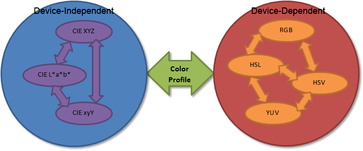

As seen in the [Color Space](../ColorSpace) page, it's important to understand the difference between [Absolute (or device-independent) Color Space](../ColorSpace/#absolute-color-space)
 (*.e.g.* CIEXYZ, CIExyY, CIELAB) and device-dependent colors spaces (*e.g.* RGB, HSL, HSB, HSV).

For example, it makes sense to convert from a device-dependent [RGB](../ColorSpace/#rgb) space to a [HSL](../ColorSpace/#hsl-and-hsv) space since, even though they are both device-dependent, they are defined in the same "dependent space".

Also, it makes sense to convert from 2 device-independent spaces like [CIEXYZ](../ColorSpace/#cie-xyz) and [CIELAB](../ColorSpace/#cie-lab).

Most importantly, *the conversions between device-dependent color spaces and device-independent color spaces* must **always** be accompanied by a [Color Profile](../ColorProfile) that appropriately describes the *dependence to the device*.




## Device-Dependent Color Space Conversions
Here, we will list the different conversions between device-dependent color spaces.

###RGB / HSL###
(Source: [http://www.easyrgb.com](http://www.easyrgb.com))

####RGB &rarr; HSL####
* Input: RGB in [0,1]
* Output: HSL in [0,1]

``` C++
 var_Min = min( R, G, B )		// Min. value of RGB
 var_Max = max( R, G, B )		// Max. value of RGB
 del_Max = var_Max - var_Min	// Delta RGB value
 
 L = ( var_Max + var_Min ) / 2
 
 if ( del_Max == 0 )			// This is a gray, no chroma...
 {
    H = 0						// HSL results from 0 to 1
    S = 0
 }
 else							// Chromatic data...
 {
    if ( L < 0.5 ) S = del_Max / ( var_Max + var_Min )
    else           S = del_Max / ( 2 - var_Max - var_Min )
 
    del_R = ( ( ( var_Max - var_R ) / 6 ) + ( del_Max / 2 ) ) / del_Max
    del_G = ( ( ( var_Max - var_G ) / 6 ) + ( del_Max / 2 ) ) / del_Max
    del_B = ( ( ( var_Max - var_B ) / 6 ) + ( del_Max / 2 ) ) / del_Max
 
    if      ( var_R == var_Max ) H = del_B - del_G
    else if ( var_G == var_Max ) H = ( 1 / 3 ) + del_R - del_B
    else if ( var_B == var_Max ) H = ( 2 / 3 ) + del_G - del_R
 
    if ( H < 0 ) H += 1
    if ( H > 1 ) H -= 1
 }
```

####HSL &rarr; RGB####
* Input: HSL in [0,1]
* Output: RGB in [0,1]

``` C++
 if ( S == 0 )
 {
    (R,G,B) = L;
 }
 else
 {
    if ( L < 0.5 ) var_2 = L * ( 1 + S )
    else           var_2 = ( L + S ) - ( S * L )
 
    var_1 = 2 * L - var_2
 
    R = Hue_2_RGB( var_1, var_2, H + ( 1 / 3 ) ) 
    G = Hue_2_RGB( var_1, var_2, H )
    B = Hue_2_RGB( var_1, var_2, H - ( 1 / 3 ) )
 }
 
 Hue_2_RGB( v1, v2, vH )
 {
    if ( vH < 0 ) vH += 1
    if ( vH > 1 ) vH -= 1
    if ( ( 6 * vH ) < 1 ) return ( v1 + ( v2 - v1 ) * 6 * vH )
    if ( ( 2 * vH ) < 1 ) return ( v2 )
    if ( ( 3 * vH ) < 2 ) return ( v1 + ( v2 - v1 ) * ( ( 2 / 3 ) - vH ) * 6 )
    return ( v1 )
 }
```

###RGB / HSV###
(Source: [http://www.easyrgb.com](http://www.easyrgb.com))

####RGB &rarr; HSV####
* Input: RGB in [0,1]
* Output: HSV in [0,1]

``` C++
 var_Min = min( R, G, B )		// Min. value of RGB
 var_Max = max( R, G, B )		// Max. value of RGB
 del_Max = var_Max - var_Min	// Delta RGB value 
 
 V = var_Max
 
 if ( del_Max == 0 )			// This is a gray, no chroma...
 {
    H = 0						// HSV results from 0 to 1
    S = 0
 }
 else							// Chromatic data...
 {
    S = del_Max / var_Max
 
    del_R = ( ( ( var_Max - var_R ) / 6 ) + ( del_Max / 2 ) ) / del_Max
    del_G = ( ( ( var_Max - var_G ) / 6 ) + ( del_Max / 2 ) ) / del_Max
    del_B = ( ( ( var_Max - var_B ) / 6 ) + ( del_Max / 2 ) ) / del_Max
 
    if      ( var_R == var_Max ) H = del_B - del_G
    else if ( var_G == var_Max ) H = ( 1 / 3 ) + del_R - del_B
    else if ( var_B == var_Max ) H = ( 2 / 3 ) + del_G - del_R
 
    if ( H < 0 ) H += 1
    if ( H > 1 ) H -= 1
 }
```

####HSV &rarr; RGB####
* Input: HSV in [0,1]
* Output: RGB in [0,1]

``` C++
 if ( S == 0 )						// HSV from 0 to 1
 {
    (R,G,B) = V
 }
 else
 {
    var_h = H * 6
    if ( var_h == 6 ) var_h = 0	// H must be < 1
    var_i = int( var_h )			// Or ... var_i = floor( var_h )
    var_1 = V * ( 1 - S )
    var_2 = V * ( 1 - S * ( var_h - var_i ) )
    var_3 = V * ( 1 - S * ( 1 - ( var_h - var_i ) ) )
 
    if      ( var_i == 0 ) { R = V     ; G = var_3 ; B = var_1 }
    else if ( var_i == 1 ) { R = var_2 ; G = V     ; B = var_1 }
    else if ( var_i == 2 ) { R = var_1 ; G = V     ; B = var_3 }
    else if ( var_i == 3 ) { R = var_1 ; G = var_2 ; B = V     }
    else if ( var_i == 4 ) { R = var_3 ; G = var_1 ; B = V     }
    else                   { R = V     ; G = var_1 ; B = var_2 }
 }
```

## Device-Independent Color Space Conversions
Here, we will list the different conversions between device-independent color spaces.

###XYZ / xyY###
(Source: [http://www.easyrgb.com](http://www.easyrgb.com))

####XYZ &rarr; xyY####

* Input: (Observer. = 2°, Illuminant = D65)
    * X in [0, 0.95047]
    * Y in [0, 1.00000]
    * Z in [0, 1.08883]
* Output: xyY in [0,1]

$$
 Y = Y \\\\
 x = X / ( X + Y + Z ) \\\\
 y = Y / ( X + Y + Z ) \\\\
$$

####xyY &rarr; XYZ####

* Input: xyY in [0,1]
* Output: (Observer. = 2°, Illuminant = D65)
    * X in [0, 0.95047]
    * Y in [0, 1.00000]
    * Z in [0, 1.08883]

$$
 X = x * ( Y / y ) \\\\
 Y = Y \\\\
 Z = ( 1 - x - y ) * ( Y / y ) \\\\
$$


###XYZ / Lab###
(Source: [http://www.easyrgb.com](http://www.easyrgb.com))

Remember that [CIE L\*a\*b\*](../ColorSpace/#cie-lab) is device-independent but needs a [white point](../Illuminants/#white-point) reference nevertheless.

Here, the [D65 illuminant](../Illuminants/#white-points-of-standard-illuminants) is used.

####XYZ &rarr; L\*a\*b\*

* Input: (Observer. = 2°, Illuminant = D65)
    * X in [0, 0.95047]
    * Y in [0, 1.00000]
    * Z in [0, 1.08883]
* Output:
    * L\* in [0,100]
    * a\*, b\* in [-1,1]

``` C++
 var_X = X / ref_X          // ref_X = 0.95047   Observer= 2°, Illuminant= D65
 var_Y = Y / ref_Y          // ref_Y = 1.000
 var_Z = Z / ref_Z          // ref_Z = 1.08883
 
 if ( var_X > 0.008856 ) var_X = var_X ^ ( 1/3 )
 else                    var_X = ( 7.787 * var_X ) + ( 16 / 116 )
 if ( var_Y > 0.008856 ) var_Y = var_Y ^ ( 1/3 )
 else                    var_Y = ( 7.787 * var_Y ) + ( 16 / 116 )
 if ( var_Z > 0.008856 ) var_Z = var_Z ^ ( 1/3 )
 else                    var_Z = ( 7.787 * var_Z ) + ( 16 / 116 )
 
 CIE-L\* = ( 116 * var_Y ) - 16
 CIE-a\* = 500 * ( var_X - var_Y )
 CIE-b\* = 200 * ( var_Y - var_Z )
```

####L\*a\*b\* &rarr; XYZ####

* Input:
    * L\* in [0,100]
    * a\*, b\* in [-1,1]
* Output: (Observer. = 2°, Illuminant = D65)
    * X in [0, 0.95047]
    * Y in [0, 1.00000]
    * Z in [0, 1.08883]

``` C++
 var_Y = ( CIE-L\* + 16 ) / 116
 var_X = CIE-a\* / 500 + var_Y
 var_Z = var_Y - CIE-b\* / 200
 
 if ( var_Y^3 > 0.008856 ) var_Y = var_Y^3
 else                      var_Y = ( var_Y - 16 / 116 ) / 7.787
 if ( var_X^3 > 0.008856 ) var_X = var_X^3
 else                      var_X = ( var_X - 16 / 116 ) / 7.787
 if ( var_Z^3 > 0.008856 ) var_Z = var_Z^3
 else                      var_Z = ( var_Z - 16 / 116 ) / 7.787
 
 X = ref_X * var_X     // ref_X = 0.95047     Observer= 2°, Illuminant= D65
 Y = ref_Y * var_Y     // ref_Y = 1.00000
 Z = ref_Z * var_Z     // ref_Z = 1.08883
```

## Device-dependent / Device-independent Color Space Conversions

###RGB (in sRGB) / XYZ###
(Source: [http://www.easyrgb.com](http://www.easyrgb.com))

Please refer to the [sRGB color profile](../ColorProfile/#srgb) specification to understand the pseudo-gamma correction in the following routines.

####RGB &rarr; XYZ####
* Input: RGB in [0,1] with sRGB gamma profile
* Output: (Observer. = 2°, Illuminant = D65)
    * X in [0, 0.95047]
    * Y in [0, 1.00000]
    * Z in [0, 1.08883]

``` C++
 // Apply gamma correction (*i.e.* conversion to linear-space)
 if ( R > 0.04045 ) R = ( ( R + 0.055 ) / 1.055 ) ^ 2.4
 else               R = R / 12.92
 if ( G > 0.04045 ) G = ( ( G + 0.055 ) / 1.055 ) ^ 2.4
 else               G = G / 12.92
 if ( B > 0.04045 ) B = ( ( B + 0.055 ) / 1.055 ) ^ 2.4
 else               B = B / 12.92
 
 // Observer. = 2°, Illuminant = D65
 X = R * 0.4124 + G * 0.3576 + B * 0.1805
 Y = R * 0.2126 + G * 0.7152 + B * 0.0722
 Z = R * 0.0193 + G * 0.1192 + B * 0.9505
```

####XYZ &rarr; RGB####
* Input: (Observer. = 2°, Illuminant = D65)
    * X in [0, 0.95047]
    * Y in [0, 1.00000]
    * Z in [0, 1.08883]
* Output: RGB in [0,1] with sRGB gamma profile

``` C++
 R = X *  3.2406 + Y * -1.5372 + Z * -0.4986
 G = X * -0.9689 + Y *  1.8758 + Z *  0.0415
 B = X *  0.0557 + Y * -0.2040 + Z *  1.0570
 
 if ( R > 0.0031308 ) R = 1.055 * ( R ^ ( 1 / 2.4 ) ) - 0.055
 else                 R = 12.92 * R
 if ( G > 0.0031308 ) G = 1.055 * ( G ^ ( 1 / 2.4 ) ) - 0.055
 else                 G = 12.92 * G
 if ( B > 0.0031308 ) B = 1.055 * ( B ^ ( 1 / 2.4 ) ) - 0.055
 else                 B = 12.92 * B
```


###RGB (in Adobe RGB) / XYZ###

(Source: [http://www.adobe.com/digitalimag/pdfs/AdobeRGB1998.pdf](http://www.adobe.com/digitalimag/pdfs/AdobeRGB1998.pdf))

####RGB &rarr; XYZ####
* Input: RGB in [0,1] with Adobe RGB gamma profile
* Output: (Observer. = 2°, Illuminant = D65)
    * X in [0, 0.95047]
    * Y in [0, 1.00000]
    * Z in [0, 1.08883]

``` C++
 // Gamma correction of ~2.2
 R = R ^ 2.19921875
 G = G ^ 2.19921875
 B = B ^ 2.19921875
 
 // Observer. = 2°, Illuminant = D65
 X =  0.57667 * R + 0.18556 * G + 0.18823 * B
 Y =  0.29734 * R + 0.62736 * G + 0.07529 * B
 Z =  0.02703 * R + 0.07069 * G + 0.99134 * B
```

####XYZ &rarr; RGB####
* Input: (Observer. = 2°, Illuminant = D65)
    * X in [0, 0.95047]
    * Y in [0, 1.00000]
    * Z in [0, 1.08883]
* Output: RGB in [0,1] with Adobe RGB gamma profile

``` C++
 R =  2.04159 * X - 0.56501 * Y - 0.34473 * Z
 G = -0.96924 * X + 1.87597 * Y + 0.04156 * Z
 B =  0.01344 * X - 0.11836 * Y + 1.01517 * Z
 
 // Gamma correction
 R = R ^ (1.0 / 2.19921875)
 G = G ^ (1.0 / 2.19921875)
 B = B ^ (1.0 / 2.19921875)
```


###RGB (in Adobe RGB ICC Profile v2.4) / XYZ###
(Source: [http://www.adobe.com/digitalimag/pdfs/AdobeRGB1998.pdf](http://www.adobe.com/digitalimag/pdfs/AdobeRGB1998.pdf))

####RGB &rarr; XYZ####
* Input: RGB in [0,1] with Adobe RGB gamma profile
* Output: (Observer. = 2°, Illuminant = D50)
    * X in [0, 0.9642]
    * Y in [0, 1.0000]
    * Z in [0, 0.8249]

``` C++
 // Gamma correction of ~2.2
 R = R ^ 2.19921875
 G = G ^ 2.19921875
 B = B ^ 2.19921875
 
 // Observer. = 2°, Illuminant = D50
 X = 0.60974 * R + 0.20528 * G + 0.14919 * B
 Y = 0.31111 * R + 0.62567 * G + 0.06322 * B
 Z = 0.01947 * R + 0.06087 * G + 0.74457 * B
```

####XYZ &rarr; RGB####
* Input: (Observer. = 2°, Illuminant = D50)
    * X in [0, 0.9642]
    * Y in [0, 1.0000]
    * Z in [0, 0.8249]
* Output: RGB in [0,1] with Adobe RGB gamma profile

``` C++
 R =  1.96253 * X - 0.61068 * Y - 0.34137 * Z
 G = -0.97876 * X + 1.91615 * Y + 0.03342 * Z
 B =  0.02869 * X - 0.14067 * Y + 1.34926 * Z
 
 // Gamma correction
 R = R ^ (1.0 / 2.19921875)
 G = G ^ (1.0 / 2.19921875)
 B = B ^ (1.0 / 2.19921875)
```

###RGB (in ProPhoto RGB) / XYZ###
(Source: [http://citeseerx.ist.psu.edu/viewdoc/summary?doi=10.1.1.202.294](http://citeseerx.ist.psu.edu/viewdoc/summary?doi=10.1.1.202.294))

####RGB &rarr; XYZ####
* Input: RGB in [0,1] with ProPhoto RGB gamma profile
* Output: (Observer. = 2°, Illuminant = D50)
    * X in [0, 0.96421]
    * Y in [0, 1.00000]
    * Z in [0, 0.82519]

``` C++
 // Gamma correction
 if ( R > 16 * 0.001953 ) R = R ^ 1.8
 else                     R = R / 16
 if ( G > 16 * 0.001953 ) G = G ^ 1.8
 else                     G = G / 16
 if ( B > 16 * 0.001953 ) B = B ^ 1.8
 else                     B = B / 16
 
 // Observer. = 2°, Illuminant = D50
 X = 0.7977 * R + 0.1352 * G + 0.0313 * B
 Y = 0.2880 * R + 0.7119 * G + 0.0001 * B
 Z = 0.0000 * R + 0.0000 * G + 0.8249 * B
```

####XYZ &rarr; RGB####
* Input: (Observer. = 2°, Illuminant = D50)
    * X in [0, 0.96421]
    * Y in [0, 1.00000]
    * Z in [0, 0.82519]
* Output: RGB in [0,1] with ProPhoto RGB gamma profile

``` C++
 R =  1.3460 * X - 0.2556 * Y - 0.0511 * Z
 G = -0.5446 * X + 1.5082 * Y + 0.0205 * Z
 B =  0.0000 * X + 0.0000 * Y + 1.2123 * Z
 
 // Gamma correction
 if ( R > 0.001953 ) R = R ^ ( 1 / 1.8 )
 else                R = 16.0 * R
 if ( G > 0.001953 ) G = G ^ ( 1 / 1.8 )
 else                G = 16.0 * G
 if ( B > 0.001953 ) B = B ^ ( 1 / 1.8 )
 else                B = 16.0 * B
```

###RGB (in Radiance RGB) / XYZ###

Radiance RGB is the default profile for Radiance files (*.HDR) and the chromaticities found in the [source code](http://www.radiance-online.org/) are:

| color | x | y |
| - |- |- |  
| Red | 0.6400 | 0.3300 |
| Green | 0.2900 | 0.6000 |
| Blue | 0.1500 | 0.0600 |
| White | 0.3333 | 0.3333 |


####RGB &rarr; XYZ####
* Input: RGB in [0,1]
* Output:
    * X in [0, 0.96421]
    * Y in [0, 1.00000]
    * Z in [0, 0.82519]

$$
 X = 0.5141 * R + 0.3238 * G + 0.1619 * B \\\\
 Y = 0.2651 * R + 0.6701 * G + 0.0647 * B \\\\
 Z = 0.0241 * R + 0.1228 * G + 0.8530 * B \\\\
$$

####XYZ &rarr; RGB####
* Input:
    * X in [0, 0.96421]
    * Y in [0, 1.00000]
    * Z in [0, 0.82519]
* Output: RGB in [0,1]

$$
 R =  2.5653 * X - 1.1668 * Y - 0.3984 * Z \\\\
 G = -1.0221 * X + 1.9783 * Y + 0.0438 * Z \\\\
 B =  0.0747 * X - 0.2519 * Y + 1.1772 * Z \\\\
$$


## Dealing with Generic Color Profiles

###XYZ Matrices###
When dealing with standard profiles like [sRGB](../ColorProfile/#srgb), [Adobe RGB](../ColorProfile/#adobe-rgb) or [ProPhoto RGB](../ColorProfile/#prophoto)
 you are given the [chromaticities](../ColorSpace/#cie-xyy) of Red, Green, Blue and the one for the [White Point](../Illuminants/#white-point).

Also, when opening PNG file you can encounter the **cHRM** chunk that describes the same chromaticities. You then need to transform these 4 2D values into a 3x3 matrix to convert the RGB value to and from the XYZ master space.


First of all, remembering our basic [CIEXYZ](../ColorSpace/#cie-xyz) and [CIExyY](../ColorSpace/#cie-xyy) conversions, let's enumerate what we know:

* From the chromaticities for Red<br/>
    $$
	xyz_R = \frac{XYZ_R}{X_R+Y_R+Z_R} = \frac{XYZ_R}{\Sigma_R}
	$$ 
* From the chromaticities for Green<br/>
    $$
	xyz_G = \frac{XYZ_G}{X_G+Y_G+Z_G} = \frac{XYZ_G}{\Sigma_G}
	$$ 
* From the chromaticities for Blue<br/>
    $$
	xyz_B = \frac{XYZ_B}{X_B+Y_B+Z_B} = \frac{XYZ_B}{\Sigma_B}
	$$ 

* From the chromaticities for White<br/>
    $$
	xyz_W
	$$ 
* The standard luminance for White<br/>
    $$
	Y_W = 1
	$$
* The complete expression for the White Point (since we have a completely defined $xyY_W$, we can thus easily convert to $XYZ_W$, see [CIE XYZ color space](../ColorSpace/#cie-xyz))<br/>
    $$
	XYZ_W
	$$

Note that we *don't know* the $XYZ_R$, $XYZ_G$ and $XYZ_B$ vectors.

So we are looking for $M_{XYZ}$ so that:
$$
XYZ = RGB . M_{XYZ} = RGB .
\begin{bmatrix}
XYZ_R \\\\
XYZ_G \\\\
XYZ_B
\end{bmatrix} = RGB . 
\begin{bmatrix}
\Sigma_R.xyz_R \\\\
\Sigma_G.xyz_G \\\\
\Sigma_B.xyz_B
\end{bmatrix}
$$


Using $RGB_W = [1,1,1]$ we can write:
$$
XYZ_W = [1,1,1] . M_{XYZ} = \Sigma_R.xyz_R + \Sigma_G.xyz_G + \Sigma_B.xyz_B
$$

Or, in matrix form again:
$$
XYZ_W = \Sigma_{RGB} . 
\begin{bmatrix}
xyz_R \\\\
xyz_G \\\\
xyz_B
\end{bmatrix} = \Sigma_{RGB} . M_{xyz}
$$


Solving by right composing with $M_{xyz}^{-1}$:
$$
\Sigma_{RGB} = XYZ_W . M_{xyz}^{-1}
$$

we thus obtain $\Sigma_{RGB}$ and since:
$$
\begin{bmatrix}
\Sigma_R . xyz_R \\\\
\Sigma_G . xyz_G \\\\
\Sigma_B . xyz_B
\end{bmatrix} =
\begin{bmatrix}
XYZ_R \\\\
XYZ_G \\\\
XYZ_B
\end{bmatrix} =  M_{XYZ} 
$$

We finally obtain $M_{XYZ}$ that converts a RGB color into an XYZ color (obviously, you need to use the inverse $M_{XYZ}^{-1}$ to convert from XYZ back into RGB).

To sum up:

1. Invert the 3x3 $M_{xyz}$ matrix constructed from the 3 R,G,B chromaticities
2. Multiply with $XYZ_W$ to obtain $\Sigma_{RGB}$
3. Finish by using $\Sigma_{RGB}$ and $M_{xyz}$ to obtain $M_{XYZ}$

<br/>
You can find the code to build the $M_{XYZ}$ matrix here: [ColorProfile.cpp](https://github.com/Patapom/GodComplex/blob/master/Packages/ImageUtilityLib/ColorProfile.cpp#L59)


###Custom ICC Profiles###

Decoding true ICC profiles is a little *over the top* for our purpose.
I never truly had the need for it so I won't be discussing full custom profiles here although you can read the [ICC Profile specs](http://www.color.org/specification/ICC1v43_2010-12.pdf) if you like.

Also, if you really need a complete [CMS](../ColorProfile/#color-management), you should download the excellent [Little CMS](http://www.littlecms.com/) by Marti Maria.
