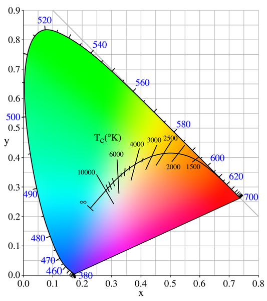
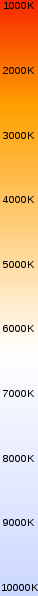
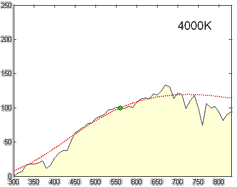
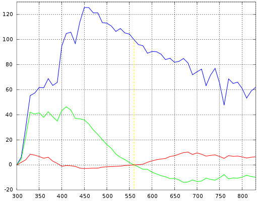
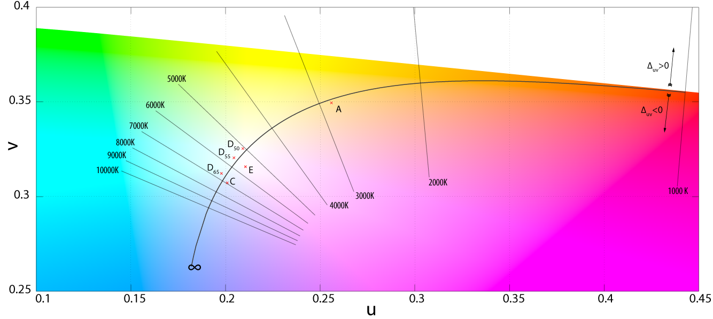
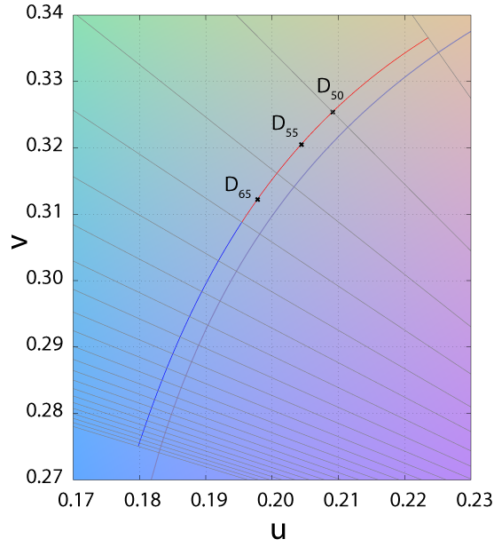
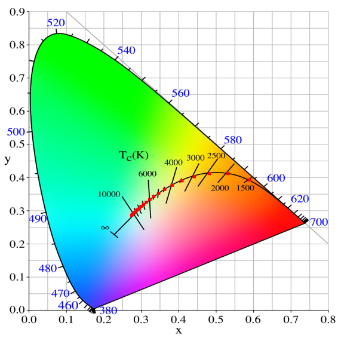

#Color Illuminants

##Black Body##

(source [http://en.wikipedia.org/wiki/Planck%27s_law](http://en.wikipedia.org/wiki/Planck%27s_law))

The color (chromaticity) of blackbody radiation depends on the temperature of the black body; the locus of such colors, shown here in CIE 1931 x,y space, is known as the Planckian locus:

A black body is an idealized physical body that absorbs all incident electromagnetic radiation.
 Because of this perfect absorptivity at all wavelengths, a black body is also the best possible emitter of thermal radiation, which it radiates incandescently in a characteristic, continuous spectrum that depends on the body's temperature.
  At Earth-ambient temperatures this emission is in the infrared region of the electromagnetic spectrum and is not visible. The object appears black, since it does not reflect or emit any visible light.

The thermal radiation from a black body is energy converted electrodynamically from the body's pool of internal thermal energy at any temperature greater than absolute zero.
 It is called blackbody radiation and has a frequency distribution with a characteristic frequency of maximum radiative power that shifts to higher frequencies with increasing temperature.
  As the temperature increases past a few hundred degrees Celsius, black bodies start to emit visible wavelengths, appearing red, orange, yellow, white, and blue with increasing temperature.
   When an object is visually white, it is emitting a substantial fraction as ultraviolet radiation.

In terms of wavelength (*λ*), Planck's law is written:

$$
B_\lambda(T) =\frac{2 hc^2}{\lambda^5}\frac{1}{ e^{\frac{hc}{\lambda k_\mathrm{B}T}} - 1}
$$

where *B* is the spectral radiance, *T* is the absolute temperature of the black body, *k*B is the Boltzmann constant, *h* is the Planck constant, and *c* is the speed of light.

##Correlated Color Temperature (CCT)##

Color Temperatures ([Source](http://www.soultravelmultimedia.com/2010/04/11/what-is-kelvin-temperature-and-how-can-photographers-make-it-work-for-them/))

	<table style="border-collapse:separate; border-spacing:0; border-width:2px; border-style:solid; border-color:#000; padding:0; margin:15px">
	<tr>
	<th style="border-style: solid; border-width: 0 1px 1px 0"> Temperature
	</th>
	<th style="border-style: solid; border-width: 0 0 1px 0"> Source
	</th></tr>
	<tr>
	<td style="border-style: solid; border-width: 0 1px 0 0"> 1,700&#160;K
	</td>
	<td style="border-style: solid; border-width: 0 0 0 0"> Match flame
	</td></tr>
	<tr>
	<td style="border-style: solid; border-width: 0 1px 0 0"> 1,850&#160;K
	</td>
	<td style="border-style: solid; border-width: 0 0 0 0"> Candle flame, sunset/sunrise
	</td></tr>
	<tr>
	<td style="border-style: solid; border-width: 0 1px 0 0"> 2,700–3,300&#160;K
	</td>
	<td style="border-style: solid; border-width: 0 0 0 0"> Incandescent light bulb
	</td></tr>
	<tr>
	<td style="border-style: solid; border-width: 0 1px 0 0"> 3,200&#160;K
	</td>
	<td style="border-style: solid; border-width: 0 0 0 0"> Studio lamps, photofloods, etc.
	</td></tr>
	<tr>
	<td style="border-style: solid; border-width: 0 1px 0 0"> 3,350&#160;K
	</td>
	<td style="border-style: solid; border-width: 0 0 0 0"> Studio "CP" light
	</td></tr>
	<tr>
	<td style="border-style: solid; border-width: 0 1px 0 0"> 4,100–4,150&#160;K
	</td>
	<td style="border-style: solid; border-width: 0 0 0 0"> Moonlight, xenon arc lamp
	</td></tr>
	<tr>
	<td style="border-style: solid; border-width: 0 1px 0 0"> 5,000&#160;K
	</td>
	<td style="border-style: solid; border-width: 0 0 0 0"> Horizon daylight
	</td></tr>
	<tr>
	<td style="border-style: solid; border-width: 0 1px 0 0"> 5,500–6,000&#160;K
	</td>
	<td style="border-style: solid; border-width: 0 0 0 0"> Vertical daylight, electronic flash
	</td></tr>
	<tr>
	<td style="border-style: solid; border-width: 0 1px 0 0"> 6,500&#160;K
	</td>
	<td style="border-style: solid; border-width: 0 0 0 0"> Daylight, overcast
	</td></tr>
	<tr>
	<td style="border-style: solid; border-width: 0 1px 1px 0"> 6,500–9,300&#160;K
	</td>
	<td style="border-style: solid; border-width: 0 0 1px 0"> LCD or CRT screen
	</td></tr>
	<tr>
	<td style="border-style: solid; border-width: 0" colspan="2"> These temperatures are merely characteristic; considerable variation may be present.
	</td></tr></table>

##CIE Illuminants##

Used for :

* Describing general lighting conditions (when taking a picture, or displaying one).
* Spectral characteristics similar to natural light sources
* Reproducible in the laboratory

The [white point](ColorProfile/#white-point) of an illuminant is the [chromaticity](ColorSpace/#cie-xyy) of a white object under the illuminant.

###1931 Illuminants###

* Illuminant A = Typical Incandescent Light (2856 K)
* Illuminant B = Direct Sunlight
* Illuminant C = Average daylight from total sky (ambient sky light)

###1963 Illuminants - The D-Illuminant

Illuminant D represents **Phases of daylight**.

* Necessarily followed by the first 2 digits of the CCT (e.g. D65 = D 6504K)
* Represent daylight more completely and accurately than do Illuminants B and C because the spectral distributions for the D Illuminants have been defined across the ultraviolet (UV), visible, and near-infrared (IR) wavelengths (300–830 nm).
* Most industries use D65 when daylight viewing conditions are required
* D50 is used by graphic arts industry --> more spectrally balanced across spectrum

###Other Illuminants###

* Illuminant E = Equal energy illuminant
* Illuminant F = Fluorescent lamps of different composition.
    * F1–F6 "standard" fluorescent lamps consist of two semi-broadband emissions of antimony and manganese activations in calcium halophosphate phosphor.
    * F4 is of particular interest since it was used for calibrating the CIE Color Rendering Index (the CRI formula was chosen such that F4 would have a CRI of 51).
    * F7–F9 are "broadband" (full-spectrum light) fluorescent lamps with multiple phosphors, and higher CRIs.
    * F10–F12 are narrow triband illuminants consisting of three "narrowband" emissions (caused by ternary compositions of rare-earth phosphors) in the R,G,B regions of the visible spectrum.
 The phosphor weights can be tuned to achieve the desired CCT.

##White Point##

(Source: [http://en.wikipedia.org/wiki/Standard_illuminant#White_point](http://en.wikipedia.org/wiki/Standard_illuminant#White_point))

The white point is a very important data as it defines the color "white" in image capture, encoding, or reproduction. Depending on the application, different definitions of white are needed to give acceptable results.
 For example, photographs taken indoors may be lit by incandescent lights, which are relatively orange compared to daylight. Defining "white" as daylight will give unacceptable
  results when attempting to color correct a photograph taken with incandescent lighting.

Illuminant and white point are separate concepts. For a given illuminant, its white point is uniquely defined. A given white point, on the other hand, generally does not uniquely correspond to only one illuminant.
 From the commonly used [CIE 1931 chromaticity diagram](#black-body), it can be seen that almost all non-spectral colors, including colors described as white, can be produced by infinitely many combinations of spectral colors,
  and therefore by infinitely many different illuminant spectra.

The spectrum of a standard illuminant, like any other profile of light, can be converted into tristimulus values.
The set of three tristimulus coordinates of an illuminant is called a white point. If the profile is normalised, then the white point can equivalently be expressed as a pair of chromaticity coordinates.
If an image is recorded in tristimulus coordinates (or in values which can be converted to and from them), then the white point of the illuminant used gives the maximum value of the tristimulus coordinates
 that will be recorded at any point in the image, in the absence of fluorescence. It is called the white point of the image.

The process of calculating the white point discards a great deal of information about the profile of the illuminant, and so although it is true that for every illuminant the exact white point can be calculated,
 it is not the case that *knowing the white point of an image alone tells you a great deal about the illuminant that was used to record it*.

Please refer to the [D Illuminant Computation](#d-illuminant-computation) page for an interesting way of computing the Spectral Power Distribution (SPD) from CCT.

###White points of standard illuminants###

A list of standardized illuminants, their CIE chromaticity coordinates (x,y) of a perfect reflecting (or transmitting) diffuser, and their correlated color temperatures (CCTs) are given below.

The CIE chromaticity coordinates are given for both the 2 degree field of view (1931) and the 10 degree field of view (1964).

The color swatches represent the hue of each white point, calculated with luminance Y=0.54 and the standard observer, assuming correct sRGB display calibration.

<table cellspacing="0" align="center" class="wikitable" style="width:60em">
<caption><b>White points</b>
</caption>
<tr>
<th rowspan="2">Name
</th>
<th colspan="2">CIE 1931 2°
</th>
<th colspan="2">CIE 1964 10°
</th>
<th rowspan="2">CCT (K)
</th>
<th rowspan="2">Hue
</th>
<th rowspan="2" style="width:25em; text-align:left; padding-left:1em;">Note
</th></tr>
<tr>
<th align="center"><i>x</i>2
</th>
<th align="center"><i>y</i>2
</th>
<th align="center"><i>x</i>10
</th>
<th align="center"><i>y</i>10
</th></tr>
<tr>
<td align="center">A
</td>
<td align="center">0.44757
</td>
<td align="center">0.40745
</td>
<td align="center">0.45117
</td>
<td align="center">0.40594
</td>
<td align="center">2856
</td>
<td bgcolor="#ffb263">
</td>
<td style="padding-left:1em;">Incandescent / Tungsten
</td></tr>
<tr>
<td align="center">B
</td>
<td align="center">0.34842
</td>
<td align="center">0.35161
</td>
<td align="center">0.34980
</td>
<td align="center">0.35270
</td>
<td align="center">4874
</td>
<td bgcolor="#d6beab">
</td>
<td style="padding-left:1em;">{obsolete} Direct sunlight at noon
</td></tr>
<tr>
<td align="center">C
</td>
<td align="center">0.31006
</td>
<td align="center">0.31616
</td>
<td align="center">0.31039
</td>
<td align="center">0.31905
</td>
<td align="center">6774
</td>
<td bgcolor="#c6c0ca">
</td>
<td style="padding-left:1em;">{obsolete} Average / North sky Daylight
</td></tr>
<tr>
<td align="center">D50
</td>
<td align="center">0.34567
</td>
<td align="center">0.35850
</td>
<td align="center">0.34773
</td>
<td align="center">0.35952
</td>
<td align="center">5003
</td>
<td bgcolor="#d1c0a8">
</td>
<td style="padding-left:1em;">Horizon Light. <a href="/index.php?title=ICC_profile&amp;action=edit&amp;redlink=1" class="new" title="ICC profile (page does not exist)">ICC profile</a> <a href="/index.php?title=Color_management&amp;action=edit&amp;redlink=1" class="new" title="Color management (page does not exist)">PCS</a>
</td></tr>
<tr>
<td align="center">D55
</td>
<td align="center">0.33242
</td>
<td align="center">0.34743
</td>
<td align="center">0.33411
</td>
<td align="center">0.34877
</td>
<td align="center">5503
</td>
<td bgcolor="#cbc1b2">
</td>
<td style="padding-left:1em;">Mid-morning / Mid-afternoon Daylight
</td></tr>
<tr>
<td align="center">D65
</td>
<td align="center">0.31271
</td>
<td align="center">0.32902
</td>
<td align="center">0.31382
</td>
<td align="center">0.33100
</td>
<td align="center">6504
</td>
<td bgcolor="#c2c2c2">
</td>
<td style="padding-left:1em;">Noon Daylight: Television, sRGB color space
</td></tr>
<tr>
<td align="center">D75
</td>
<td align="center">0.29902
</td>
<td align="center">0.31485
</td>
<td align="center">0.29968
</td>
<td align="center">0.31740
</td>
<td align="center">7504
</td>
<td bgcolor="#bcc3ce">
</td>
<td style="padding-left:1em;">North sky Daylight
</td></tr>
<tr>
<td align="center">E
</td>
<td align="center">1/3
</td>
<td align="center">1/3
</td>
<td align="center">1/3
</td>
<td align="center">1/3
</td>
<td align="center">5454
</td>
<td bgcolor="#d3beba">
</td>
<td style="padding-left:1em;">Equal energy
</td></tr>
<tr>
<td align="center">F1
</td>
<td align="center">0.31310
</td>
<td align="center">0.33727
</td>
<td align="center">0.31811
</td>
<td align="center">0.33559
</td>
<td align="center">6430
</td>
<td bgcolor="#bec4bd">
</td>
<td style="padding-left:1em;">Daylight Fluorescent
</td></tr>
<tr>
<td align="center">F2
</td>
<td align="center">0.37208
</td>
<td align="center">0.37529
</td>
<td align="center">0.37925
</td>
<td align="center">0.36733
</td>
<td align="center">4230
</td>
<td bgcolor="#ddbd96">
</td>
<td style="padding-left:1em;">Cool White Fluorescent
</td></tr>
<tr>
<td align="center">F3
</td>
<td align="center">0.40910
</td>
<td align="center">0.39430
</td>
<td align="center">0.41761
</td>
<td align="center">0.38324
</td>
<td align="center">3450
</td>
<td bgcolor="#eeb97d">
</td>
<td style="padding-left:1em;">White Fluorescent
</td></tr>
<tr>
<td align="center">F4
</td>
<td align="center">0.44018
</td>
<td align="center">0.40329
</td>
<td align="center">0.44920
</td>
<td align="center">0.39074
</td>
<td align="center">2940
</td>
<td bgcolor="#fdb36a">
</td>
<td style="padding-left:1em;">Warm White Fluorescent
</td></tr>
<tr>
<td align="center">F5
</td>
<td align="center">0.31379
</td>
<td align="center">0.34531
</td>
<td align="center">0.31975
</td>
<td align="center">0.34246
</td>
<td align="center">6350
</td>
<td bgcolor="#bbc5b8">
</td>
<td style="padding-left:1em;">Daylight Fluorescent
</td></tr>
<tr>
<td align="center">F6
</td>
<td align="center">0.37790
</td>
<td align="center">0.38835
</td>
<td align="center">0.38660
</td>
<td align="center">0.37847
</td>
<td align="center">4150
</td>
<td bgcolor="#dcbf8c">
</td>
<td style="padding-left:1em;">Lite White Fluorescent
</td></tr>
<tr>
<td align="center">F7
</td>
<td align="center">0.31292
</td>
<td align="center">0.32933
</td>
<td align="center">0.31569
</td>
<td align="center">0.32960
</td>
<td align="center">6500
</td>
<td bgcolor="#c2c2c2">
</td>
<td style="padding-left:1em;">D65 simulator, Daylight simulator
</td></tr>
<tr>
<td align="center">F8
</td>
<td align="center">0.34588
</td>
<td align="center">0.35875
</td>
<td align="center">0.34902
</td>
<td align="center">0.35939
</td>
<td align="center">5000
</td>
<td bgcolor="#d1c0a8">
</td>
<td style="padding-left:1em;">D50 simulator, Sylvania F40 Design 50
</td></tr>
<tr>
<td align="center">F9
</td>
<td align="center">0.37417
</td>
<td align="center">0.37281
</td>
<td align="center">0.37829
</td>
<td align="center">0.37045
</td>
<td align="center">4150
</td>
<td bgcolor="#e0bc97">
</td>
<td style="padding-left:1em;">Cool White Deluxe Fluorescent
</td></tr>
<tr>
<td align="center">F10
</td>
<td align="center">0.34609
</td>
<td align="center">0.35986
</td>
<td align="center">0.35090
</td>
<td align="center">0.35444
</td>
<td align="center">5000
</td>
<td bgcolor="#d1c0a7">
</td>
<td style="padding-left:1em;">Philips TL85, Ultralume 50
</td></tr>
<tr>
<td align="center">F11
</td>
<td align="center">0.38052
</td>
<td align="center">0.37713
</td>
<td align="center">0.38541
</td>
<td align="center">0.37123
</td>
<td align="center">4000
</td>
<td bgcolor="#e3bc92">
</td>
<td style="padding-left:1em;">Philips TL84, Ultralume 40
</td></tr>
<tr>
<td align="center">F12
</td>
<td align="center">0.43695
</td>
<td align="center">0.40441
</td>
<td align="center">0.44256
</td>
<td align="center">0.39717
</td>
<td align="center">3000
</td>
<td bgcolor="#fab46b">
</td>
<td style="padding-left:1em;">Philips TL83, Ultralume 30
</td></tr></table>

### D-Illuminant Computation

(Source: [http://en.wikipedia.org/wiki/Standard_illuminant#Illuminant_series_D](http://en.wikipedia.org/wiki/Standard_illuminant#Illuminant_series_D))

Relative spectral power distribution of illuminant D and a black body of the same correlated color temperature (in red), normalized about 560nm.

Derived by Judd, MacAdam, and Wyszecki, the **D** series of illuminants are constructed to represent natural daylight. They are difficult to produce artificially, but are easy to characterize mathematically.

H. W. Budde of the National Research Council of Canada in Ottawa, H. R. Condit and F. Grum of the Eastman Kodak Company in Rochester, New York, and S. T. Henderson and D. Hodgkiss
 of Thorn Electrical Industries in Enfield had independently measured the spectral power distribution (SPD) of daylight from 330 to 700&nbsp;nm, totaling among them 622 samples.
 Judd *et al.* analyzed these samples and found that the (x,y) chromaticity coordinates had a simple, quadratic relation:

$$
y=2.870x - 3.000x^2 - 0.275
$$

Simonds supervised the characteristic vector analysis of the SPDs.
Application of his method revealed that the SPDs could be satisfactorily approximated by using the mean (S0) and first two characteristic vectors (S1 and S2):

$$
S(\lambda) = S_0(\lambda) + M_1 S_1(\lambda) + M_2 S_2(\lambda)
$$

In simpler terms, the SPD of the studied daylight samples can be expressed as the linear combination of three, fixed SPDs. The first vector (S0) is the mean of all the SPD samples,
which is the best reconstituted SPD that can be formed with only a fixed vector.
The second vector (S1) corresponds to yellow–blue variation, accounting for changes in the correlated color temperature due to presence or absence of clouds or direct sunlight.
The third vector (S2) corresponds to pink–green variation caused by the presence of water in the form of vapor and haze.

To construct a daylight simulator of a particular correlated color temperature one merely needs to know the coefficients M1 and M2 of the characteristic vectors S1 and S2.

Characteristic vectors of illuminant D; component SPDs S0 (blue), S1 (green), S2 (red):

Expressing the chromaticities x and y as:

$$
x=\frac{X_0+M_1 X_1+M_2 X_2}{S_0+M_1 S_1 + M_2 S_2}
$$

$$
y=\frac{Y_0+M_1 Y_1+M_2 Y_2}{S_0+M_1 S_1 + M_2 S_2}
$$

and making use of known tristimulus values for the mean vectors, they were able to express M1 and M2 as follows:
Kelly's figures depicted the lines of constant correlated color temperature on the CIE 1960 UCS, as shown here, as well as the familiar xy diagram.

$$
M_1=\frac{-1.3515-1.7703x+5.9114y}{0.0241+0.2562x-0.7341y}
$$

$$
M_2=\frac{0.0300-31.4424x+30.0717y}{0.0241+0.2562x-0.7341y}
$$

The only problem is that this left unsolved the computation of the coordinate $(x,y)$ for a particular phase of daylight.
Judd *et al.* simply tabulated the values of certain chromaticity coordinates, corresponding to commonly-used correlated color temperatures, such as 5500&nbsp;K, 6500&nbsp;K, and 7500&nbsp;K.

For other color temperatures, one could consult figures made by Kelly.
This problem was addressed in the CIE report that formalized illuminant D, with an approximation of the x coordinate in terms of the reciprocal color temperature,
 valid from 4000&nbsp;K to 25,000&nbsp;K. The y coordinate trivially followed from Judd's quadratic relation.

Judd *et al.* then extended the reconstituted SPDs to 300–330&nbsp;nm and 700–830&nbsp;nm by using Moon's spectral absorbance data of the Earth's atmosphere. 

The tabulated SPDs presented by the CIE today are derived by linear interpolation of the 10&nbsp;nm data set down to 5&nbsp;nm.
 The limited nature of the photometric data is not an impediment to the calculation of the CIEXYZ tristimulus values since the CIE standard colorimetric observer's color matching functions are only tabulated from 380 to 780&nbsp;nm
  in increments of 5&nbsp;nm.

Similar studies have been undertaken in other parts of the world, or repeating Judd et al.'s analysis with modern computational methods. In several of these studies, the daylight locus is notably closer to the Planckian locus than in Judd et al.

#### Computation

The relative spectral power distribution (SPD) $S_D (\lambda)$ of a D series illuminant can be derived from its chromaticity coordinates in the CIE 1931 color space, $(x_D,y_D)$:

$$
x_D = \begin{cases}
0.244063 + 0.09911 \frac{10^3}{T} + 2.9678 \frac{10^6}{T^2} - 4.6070 \frac{10^9}{T^3} & 4000K \leq T \leq 7000K \\\\
0.237040 + 0.24748 \frac{10^3}{T} + 1.9018 \frac{10^6}{T^2} - 2.0064 \frac{10^9}{T^3} & 7000K < T \leq 25000K
\end{cases}
$$

$$
y_D = -3.000 x_D^2 + 2.870 x_D - 0.275
$$

where T is the illuminant's CCT. The chromaticity coordinates of the Illuminants D are said to form the *CIE Daylight Locus*.

Daylight locus in the CIE 1960 UCS. The isotherms are perpendicular to the Planckian locus.
The two sections of the daylight locus, from 4000–7000&nbsp;K and 7000–25000&nbsp;K, are color coded.
Note that the two loci are separated by a fairly even distance, of around $\Delta_{uv}=0.003$.

The relative SPD is given by:

$$
S_D(\lambda)=S_0(\lambda)+M_1 S_1(\lambda)+M_2 S_2(\lambda)
$$

$$
M_1=(-1.3515-1.7703x_D+5.9114y_D)/M
$$

$$
M_2=(0.03000-31.4424x_D+30.0717y_D)/M
$$

$$
M=0.0241+0.2562x_D-0.7341y_D
$$

where $S_0(\lambda), S_1(\lambda), S_2(\lambda)$ are the mean and first two eigenvector SPDs, depicted above.
The characteristic vectors both have a zero at 560&nbsp;nm, since all the relative SPDs have been normalized about this point.

The CCTs of the canonical illuminants, D50, D55, D65, and D75, differ slightly from what their names suggest.
For example, D50 has a CCT of 5003&nbsp;K ("horizon" light), while D65 has a CCT of 6504&nbsp;K (noon light).
As explained in a previous section, this is because the value of the constants in Planck's law have been slightly changed since the definition of these canonical illuminants, whose SPDs are based on the original values in Planck's law.

### Custom Illuminant Computation by Spectral Integration ###

By combining the spectral radiance given by [Planck's law](#black-body), and the spectral power distribution of the [CIE Color Matching Functions](ColorSpace/#color-matching-functions),
it's relatively easy to obtain the XYZ values of any white point given its Correlated Color Temperature.

You can find an example code here:

* [ComputeWhitePointChromaticities.cpp](http://patapom.com/Temp/SourceCodes/IlluminantComputation/ComputeWhitePointChromaticities.cpp) <-- Actual code
* [ColorMatchingFunctions.cpp](http://patapom.com/Temp/SourceCodes/IlluminantComputation/ColorMatchingFunctions.cpp) <-- Giant array of spectral power distribution values

These 2 sources come from my personal library "[God Complex](https://github.com/Patapom/GodComplex)".

As you can see in the picture below, I'm plotting the loci of various white points from 1500K to 12000K by 500K increments and the results match pretty well (red dots).

