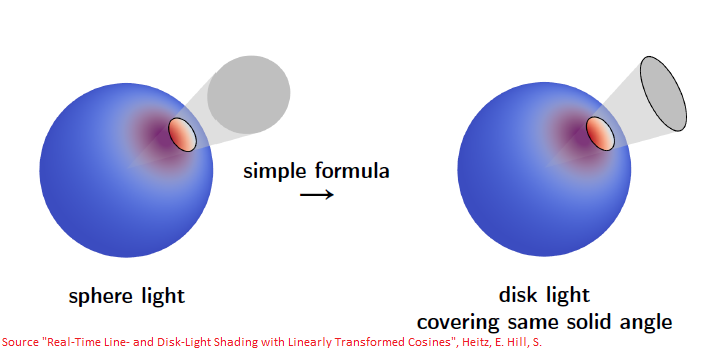
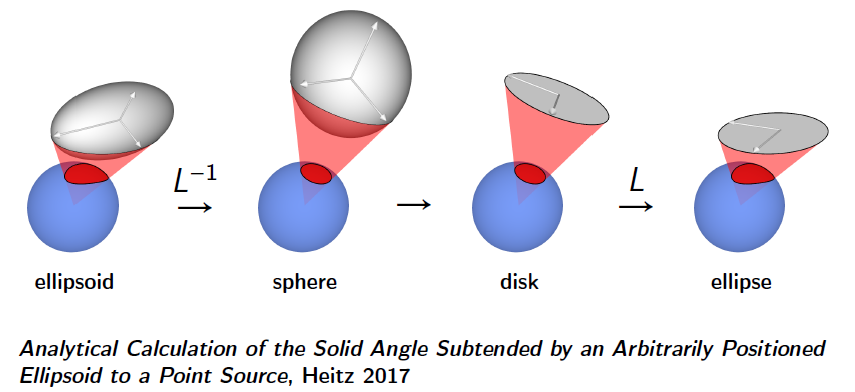
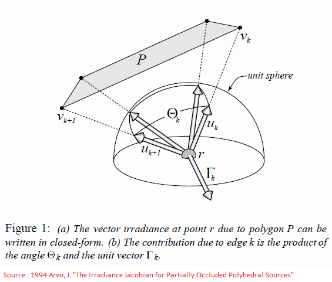
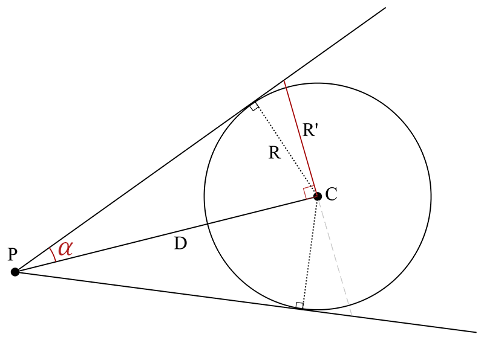
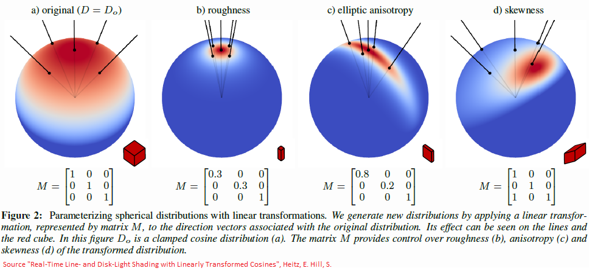
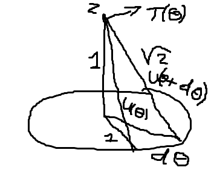
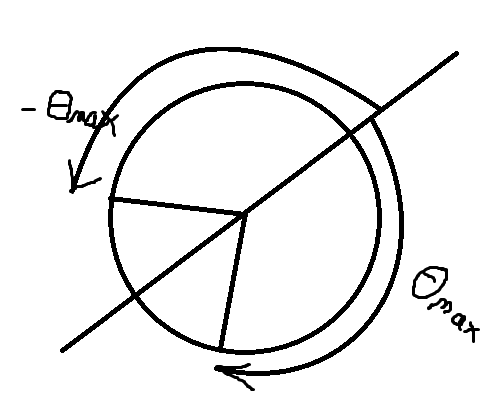

# Disk & Spherical Optimization for LTC Area Lights

In 2016, Heitz et al. introduced Linearly-Transformed Cosines (LTC) [^1], a simple technique to provide area lighting for various types of BRDF at the cost of a lookup table and a simple 3x3 matrix transform.

The idea is relatively simple:

1. Transform the coordinates of a polygonal light source into a canonical space where it's easier to compute the luminance integration
2. Apply the polygonal irradiance vector equation in that simplified space

<br/>
In a second paper from 2017 [^2], Heitz & Hill proposed an update for line and disk area lights, which is the part we will focus on in this small article.

First, Heitz notices that spherical lights can always be replaced with disks covering the same solid angle:




Next, Heitz generalizes the problem of solving sphere and disk area lights into the unique problem of solving for ellipses:




Unfortunately, this generalization to ellipses leads to a code that is quite heavy to evaluate in a shader and that is prone to precision issues.
Also, it requires a highly-specialized code that deviates from the simple irradiance vector formulation used in all other area light types which prevents a nice general uniform and simple code path that compilers are fond of.


In this article, instead of computing a general solution with ellipses, we will extend the LTC philosophy and introduce a new simple transform that will bring the difficult general case of ellipses into yet another simple
canonical space where we will compute the solution.


## Review

First, let's review some essential notions.

### Principle of the Linearly-Transformed Cosines Technique

When computing the reflected luminance from area lights, we usually need to use the following integral:

$$
L(\boldsymbol{\omega'}) = \int_{A} L(\boldsymbol{\omega}) D(\boldsymbol{\omega}) d\omega	\label{(1)}\tag{1}
$$

Where:

* $\boldsymbol{\omega}$ is the incoming light direction
* $\boldsymbol{\omega'}$ is the outgoing view direction
* $L(\boldsymbol{\omega})$ is the incoming luminance (which we will assume is constant over the entire area light for simplifcation purpose)
* $L(\boldsymbol{\omega'})$ is the outgoing luminance
* $A$ is the area covered by the arealight
* $D(\boldsymbol{\omega})$ is the cosine-weighted [BRDF](../../../BRDF/BRDF%20Definition)


The simple yet brilliant idea of LTC is to transform the general case of an arbitrarily oriented surface for which we require to compute equation $\eqref{(1)}$,
into a new canonical space where the distribution $D_o\left(\boldsymbol{\omega_o}=(x,y,z) \right) = \frac{1}{\pi} max( 0, z )$ is a simple cosine lobe (*i.e.* the cosine-weighted lambert distribution).

All we need to accomplish this magic is a matrix $M^{-1}$ that linearly transforms any vector $\boldsymbol{\omega}$ into a canonical unit vector $\boldsymbol{\omega_o}$ such that:

$$
\boldsymbol{\omega_o} = \frac{M^{-1} \boldsymbol{\omega}}{ \| M^{-1} \boldsymbol{\omega} \| }
$$

!!! note
	Heitz & Hill provide the [source code](https://github.com/selfshadow/ltc_code/tree/master/fit) to fit most useful BRDF distributions (GGX, Beckmann, Disney) and create LTC tables of the $M^{-1}$ matrix for various view angles and surface roughness values.<br/>

	You can also check my implementation of their fitter [here](https://github.com/Patapom/GodComplex/tree/master/Tools/LTCTableGenerator) (basically a rewrite of their code since I really need to understand the code I'm using, I can't just copy it and forget),
	if also features some additional types of BRDF like original the Cook-Torrance, Ward-Dür and Oren-Nayar formulations.


An interesting property is given by eq. (2) from [^1] and tells us the norm of the distribution is conserved in the canonical space:

$$
\int_{\Omega} D(\boldsymbol{\omega}) d\omega = \int_{\Omega_o} D_o(\boldsymbol{\omega_o} )d\omega_o
$$

The most interesting property, though, is given by this equation:

$$
\int_{P} D(\boldsymbol{\omega}) d\omega = \int_{P_o} D_o(\boldsymbol{\omega_o} )d\omega_o	\label{(2)}\tag{2}
$$

This basically means we only need to transform any arbitrarily oriented surface $P$ into its canonical space version $P_o$ via a multiplication by $P_o = M^{-1} P$ then we can compute equation $\eqref{(1)}$ there,
and the result would be equivalent to doing the computation in the original (complicated) space.


### Vector Irradiance

In 1939, Gershun [^3] introduced the vector field known as "the light field" defining a vector quantity $\boldsymbol{\Phi}(\boldsymbol{x})$ for all point in space $\boldsymbol{x}$ as:

$$
\boldsymbol{\Phi}(\boldsymbol{x}) = \int_{\Omega} L(\boldsymbol{x}, \boldsymbol{\omega_i}) \boldsymbol{\omega_i} d\omega_i
$$

Where:

* $\Omega$ represents the unit sphere domain in $\mathbb{R}^3$
* $\boldsymbol{\omega_i}$ represents a unit incoming direction vector
* $d\omega_i$ represents the solid angle subtended by $\boldsymbol{\omega_i}$
* $L(\boldsymbol{x}, \boldsymbol{\omega_i})$ represents the radiance received at point $\boldsymbol{x}$ in direction $\boldsymbol{\omega_i}$

<br/>

$\boldsymbol{\Phi}(\boldsymbol{x})$ is called the ***vector irradiance*** which is a very important quantity from which we can derive the scalar flux of irradiance passing through a surface with normal $\boldsymbol{n}$:

$$
\phi(\boldsymbol{x},\boldsymbol{n}) = \int_{\Omega} L(\boldsymbol{x}, \boldsymbol{\omega_i}) \left( \boldsymbol{\omega_i} \cdot \boldsymbol{n} \right) d\omega_i = \boldsymbol{\Phi}(\boldsymbol{x}) \cdot \boldsymbol{n}
$$

The scalar value $\phi(\boldsymbol{x},\boldsymbol{n})$ is well known to the computer graphics community as we familiarly call it the (scalar) irradiance and we usually denote it $E(\boldsymbol{x},\boldsymbol{n})$.

Also note that, ignoring translucency, transparency and sub-surface scattering effects, we usually only account for radiance incoming from the hemisphere where $\left( \boldsymbol{\omega_i} \cdot \boldsymbol{n} \right) > 0$.


### Closed-Form Polygonal Source of Vector Irradiances

An interesting case where the vector irradiance has a closed-form solution is given by polyhedral light sources.

In 1994[^4] and 1995[^5], James Arvo introduced this formulation in his work to produce amazing results (I strongly encourage you to read the papers).


For any polygon P with $N$ edges that is a diffuse source with constant emission $E_0$ in W/m², the vector irradiance given by P perceived at $\boldsymbol{x}$ is given by:

$$
\boldsymbol{\Phi(\boldsymbol{x})} = -\frac{E_0}{2\pi} \sum_{i=1}^N  \frac{ \boldsymbol{u_i} \times \boldsymbol{u_{i+1}} }{ \| \boldsymbol{u_i} \times \boldsymbol{u_{i+1}} \| } \cos^{-1}\left( \boldsymbol{u_i} \cdot \boldsymbol{u_{i+1}} \right)	\tag{3}\label{(3)}
$$

The vectors $\boldsymbol{u_i}$ are unit vectors pointing from $\boldsymbol{x}$ to each vertex $\boldsymbol{v_i}$ of P, as seen in the figure below:




From $\eqref{(3)}$, we can find the familiar scalar irradiance arriving at a surface point $\boldsymbol{x}$ with normal $\boldsymbol{n}$:

$$
E(\boldsymbol{x}, \boldsymbol{n}) = \boldsymbol{\Phi(\boldsymbol{x})} \cdot \boldsymbol{n}
$$

It turns out that dotting with the surface normal $\boldsymbol{n}$ yields the lambert distribution, and that is exactly what we need to compute equation $\eqref{(2)}$:

$$
\begin{align}
E(\boldsymbol{x}, \boldsymbol{n}) &= \boldsymbol{\Phi(\boldsymbol{x})} \cdot \boldsymbol{n}	\\
					&= E_0 \int_{P_o} \frac{1}{\pi} \left( \boldsymbol{\omega_o} \cdot \boldsymbol{n} \right) d\omega_o  \\
					&= E_0 \int_{P_o} D_o(\boldsymbol{\omega_o} )d\omega_o
\end{align}
$$

(assuming the polygon $P_o$ lies entirely above the surface (i.e. $\boldsymbol{\omega_o} \cdot \boldsymbol{n} > 0$), but let's leave the issue of clipping for later)


### The disk equivalent to a sphere

Here we show how to convert any spherical area light into a front-facing disk covering the same solid angle.

We start from the following construction of the sphere centered in $C$ of radius $R$ seen from point $P$ at distance $D$:




Without changing the position of the light $C$, we're looking for the new radius $R'$ shown in red, covering the same solid angle as the sphere and facing the point $P$ so the disk's normal is aligned with $\left<PC\right>$.

Re-orienting the disk is quite straightforward, we're going to use Frisvad's method.

Now, knowing the distance $D$ and radius $R$, we can write:

$$
\begin{align}
sin(\alpha) &= \frac{R}{D}	\\
tan(\alpha) &= \frac{R'}{D}	
\end{align}
$$

From there, we easily get:

$$
R' = D \frac{R}{\sqrt{D^2 - R^2}}
$$


Which is done by the HLSL code below:

??? "Sphere to Disk (HLSL)"
	``` C++

	// Build orthonormal basis from a 3D Unit Vector Without normalization [Frisvad2012])
	void BuildOrthonormalBasis( float3 _normal, out float3 _tangent, out float3 _bitangent ) {
		float a = _normal.z > -0.9999999 ? 1.0 / (1.0 + _normal.z) : 0.0;
		float b = -_normal.x * _normal.y * a;

		_tangent = float3( 1.0 - _normal.x*_normal.x*a, b, -_normal.x );
		_bitangent = float3( b, 1.0 - _normal.y*_normal.y*a, -_normal.y );
	}

    // The sphere is only a front-facing disk so let's rebuild a local frame for that disk and compute its radius
	float3		P = world-space position of the point we're lighting
	float3		C = world-space position of the spherical light
	float		R = world-space radius (in meters) of the spherical light

    float3      wsLight = wsLightPosition - wsSurfacePosition;
    float       D = length(wsLight);
                wsLight *= D > 1e-3 ? 1.0 / D : 1.0;

    // Re-orient the disk to face our position
	float3	wsLightTangent, wsLightBiTangent;
	BuildOrthonormalBasis( -wsLight, wsLightTangent, wsLightBiTangent );

    // Then we recompute the disk's radius and intensity to match the solid angle covered by the sphere
    if ( D - R > 1e-3 ) {
        float   tanTheta = R * rsqrt( saturate( D*D - R*R ) );
        R = D * tanTheta;			// New disk radius when standing at distance D
    } else {
        lightLuminance = 0.0;		// Inside the disk: reduce intensity to 0
    }
	```


## Simpler Formulation

Okay, so now let's go with the simplification.

Since we should agree that a sphere can be represented by an equivalent front-facing disk, from there we can generalize the problem to *computing the illuminance given by arbitrarily oriented surfaces*.

In the case of regular isotropic BRDFs, we transform the vertices of our polygon by a matrix $M^{-1}$ where the matrix $M$ is of the form:

$$
M = \left(
\begin{matrix}
a & 0 & 0 \\
0 & b & 0 \\
c & 0 & 1 \\
\end{matrix}
\right)
$$

The effects of the 3 coefficients $(a, b, c)$ of the matrix are described by [^1] and range from anisotropic scaling to skewness:



<!--(note that Heitz & al. were using the original matrix formulation where the bottom-right coefficient was set to 1, since then they changed it so it's the central coefficient that is 1, as mentioned above.
This doesn't change the effects though)
-->

The inverse matrix $M^{-1}$ is described by only 4 parameters:

$$
M^{-1} = \left(
\begin{matrix}
a' & 0 & b' \\
0 & 1 & 0 \\
c' & 0 & d' \\
\end{matrix}
\right)
$$


Suppose we have an arbritrary area (say, a disk or an ellipse) circumscribed by a rectangle described by a position and 2 vectors:


Transforming the vectors of such a rectangle by the matrix $M^{-1}$


### Transforming the problem into "easy space"


### Computing the exact integral in "easy space"

Once we're in the canonical space described above, we need to compute equation $\eqref{(3)}$ for a special kind of polygon which is the unit circle.




Our view point is at the coordinate $\boldsymbol{Z}=(0,0,1)$ and in this scenario, the discrete sum of computations along the polygonal edges transforms into a continuous integration along the circumference of the circle:

$$
\begin{align}
\boldsymbol{\Phi(\boldsymbol{x})} &= -\frac{E_0}{2\pi} \sum_{i=1}^N  \frac{ \boldsymbol{u_i} \times \boldsymbol{u_{i+1}} }{ \| \boldsymbol{u_i} \times \boldsymbol{u_{i+1}} \| } \cos^{-1}\left( \boldsymbol{u_i} \cdot \boldsymbol{u_{i+1}} \right)	\\
&\downarrow	\\
\boldsymbol{\Phi(\boldsymbol{x})} &= -\frac{E_0}{2\pi} \int_{-\pi}^{\pi} \boldsymbol{\tau}(\theta) \theta d\theta
\end{align}
$$

#### The expression for vector Tau

The expression for $\boldsymbol{\tau}(\theta)$ is simple enough: we're going to assume the disk is a polygon made of an infinite amount of tiny edges of length $d\theta$ and integrate each component of the irradiance vector along the disk.

We start by writing the expression for the continuous unit vector $\boldsymbol{u}(\theta)$ that will replace the discrete vector expression $\boldsymbol{u_i}$ from equation $\eqref{(3)}$:

$$
\boldsymbol{u}(\theta) = \frac{\boldsymbol{P}(\theta) - \boldsymbol{Z}}{ \| \boldsymbol{P}(\theta) - \boldsymbol{Z} \| }
$$

$\boldsymbol{P}(\theta)$ is a point on the circle at a given angle $\theta$ and is written:

$$
\boldsymbol{P}(\theta) = \left[
\begin{array} \\
\cos(\theta) \\
\sin(\theta)  \\
0
\end{array}
\right]
$$

Since we know $P$ is always lying on the unit circle and $\boldsymbol{Z}$ is one unit above the circle, it's easy to compute $\| \boldsymbol{P}(\theta) - \boldsymbol{Z} \| = \sqrt{2}$.

We then get the full expression for the components of $\boldsymbol{u}(\theta)$:

$$
\boldsymbol{u}(\theta) = \frac{1}{\sqrt{2}} \left[
\begin{array} \\
\cos(\theta) \\
\sin(\theta)  \\
-1
\end{array}
\right]
$$

Then we can write the elementary displacement along the circle as:

$$
\frac{d\boldsymbol{u}}{d\theta} = \frac{1}{\sqrt{2}} \left[
\begin{array} \\
-\sin(\theta) \\
\cos(\theta)  \\
0
\end{array}
\right]
$$

We obtain the unit vector $\boldsymbol{u}(\theta + d\theta)$ as:

$$
\boldsymbol{u}(\theta + d\theta) = \frac{ \boldsymbol{u}(\theta) + d\theta \left( \frac{d\boldsymbol{u}}{d\theta} \right) }{ \| \boldsymbol{u}(\theta) + d\theta \left( \frac{d\boldsymbol{u}}{d\theta} \right) \| }
$$

$$
\boldsymbol{u}(\theta + d\theta) = \frac{1}{2+d\theta^2} \left[ 
\begin{array} \\
\cos(\theta) - \sin(\theta) d\theta  \\
\sin(\theta) + \cos(\theta) d\theta \\
-1	\\
\end{array}
\right]
$$


Finally, we can obtain:

$$
\begin{align}
\boldsymbol{\tau}(\theta) &= \frac{\boldsymbol{u}(\theta) \times \boldsymbol{u}(\theta + d\theta)}{ \| \boldsymbol{u}(\theta) \times \boldsymbol{u}(\theta + d\theta) \| } \\
\boldsymbol{\tau}(\theta) &= \frac{1}{\sqrt{2}} \left[
\begin{array}\\
\cos(\theta)\\
\sin(\theta)\\
1\\
\end{array}
\right]
\end{align}
$$


#### Integrating each component

Assuming we split the unit circle into 2 symmetrical halves:



We simply need to write the integral from $-\theta_{max}$ to $\theta_{max}$ for each component of the irradiance vector:

$$
\boldsymbol{\Phi(\boldsymbol{x})} = -\frac{E_0}{2\sqrt{2}\pi} \left[
\begin{array} \\
\int_{-\theta_{max}}^{\theta_{max}} \theta \cos(\theta) d\theta  \\
\int_{-\theta_{max}}^{\theta_{max}} \theta \sin(\theta) d\theta  \\
\int_{-\theta_{max}}^{\theta_{max}} \theta d\theta  \\
\end{array}
\right]
$$


### Clipping is also easy

Heitz et al. used a trick to avoid clipping the polygonal light sources: they convert the irradiance vector given by the polygon into a form factor/solid angle and find an equivalent sphere covering the same solid angle.
Then, they clip the sphere with the surface plane (some convoluted but exact code exists for sphere clipping).

In our case, the clipping code is always there and very easy to apply so we don't need the sphere approximation and can use an exact result instead.


## Bonus: Equivalent disk luminance

When converting a spherical area light source into a disk area light, we need to compute the equivalent illuminance the disk must provide to match the sphere's illuminance.

Let's imagine the sphere is a light bulb with a given power $\Phi$ in lumens.

This power must be diffusely emitted by all points of the sphere of radius $R$ and so the illuminance and the luminance of a small differential element on the sphere are given by:

$$
\begin{align}
dE &= \frac{\Phi}{4\pi R^2} \\
dL &= \frac{dE}{2\pi} = \frac{\Phi}{8 \pi^2 R^2} 
\end{align}
$$


## End Note

It was with great sadness that I learned [James Arvo had passed away](https://senate.universityofcalifornia.edu/_files/inmemoriam/html/jamesrichardarvo.html) in 2011. :cry:<br/>
I remember reading his papers with great fondness while graduating from early University years, although I couldn't understand most of what was written (and I still can't, really), I was amazed at the quality of his work which was exceptionnal for the time.


## References

[^1]: 2016 Heitz, E. Dupuy, J. Hill, S. Neubelt, D. ["Real-Time Polygonal-Light Shading with Linearly Transformed Cosines"](https://eheitzresearch.wordpress.com/415-2/)
[^2]: 2017 Heitz, E. Hill, S. ["Real-Time Line- and Disk-Light Shading with Linearly Transformed Cosines"](https://blog.selfshadow.com/publications/s2017-shading-course/heitz/s2017_pbs_ltc_lines_disks.pdf)
[^3]: 1939 Gershun, A. ["The Light Field"](https://qcloud.coding.net/u/vincentqin/p/blogResource/git/raw/master/light-field-depth-estimation/1.Gershun-1939-Journal_of_Mathematics_and_Physics.pdf)
[^4]: 1994 Arvo, J. ["The Irradiance Jacobian for Partially Occluded Polyhedral Sources"](https://www.graphics.cornell.edu/pubs/1994/Arv94.pdf)
[^5]: 1995 Arvo, J. ["Applications of Irradiance Tensors to the Simulation of Non-Lambertian Phenomena"](http://citeseerx.ist.psu.edu/viewdoc/download?doi=10.1.1.89.2596&rep=rep1&type=pdf)
[^3]: 1989 Baum, D.R. Rusheimer, H. E. Winget, J. M. ["Improving radiosity solutions through the use of analytically determined form-factors"](http://citeseerx.ist.psu.edu/viewdoc/download?doi=10.1.1.466.963&rep=rep1&type=pdf)


Source "Real-Time Line- and Disk-Light Shading with Linearly Transformed Cosines"
