# Colored Penumbra Effect

This article is about this particular effect that can sometimes be detected in the penumbra regions of an image and that is often exagerated by artists,
 as can be seen in these beautiful paintings by [Piotr Jablonski](https://www.behance.net/gallery/16101045/TOMCAT):

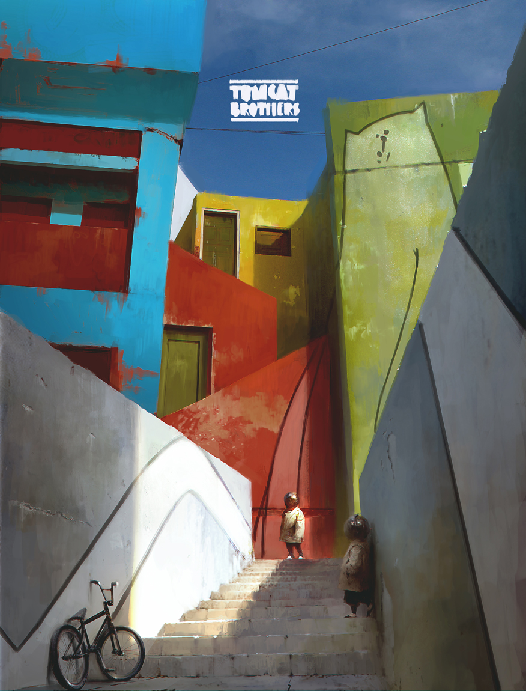

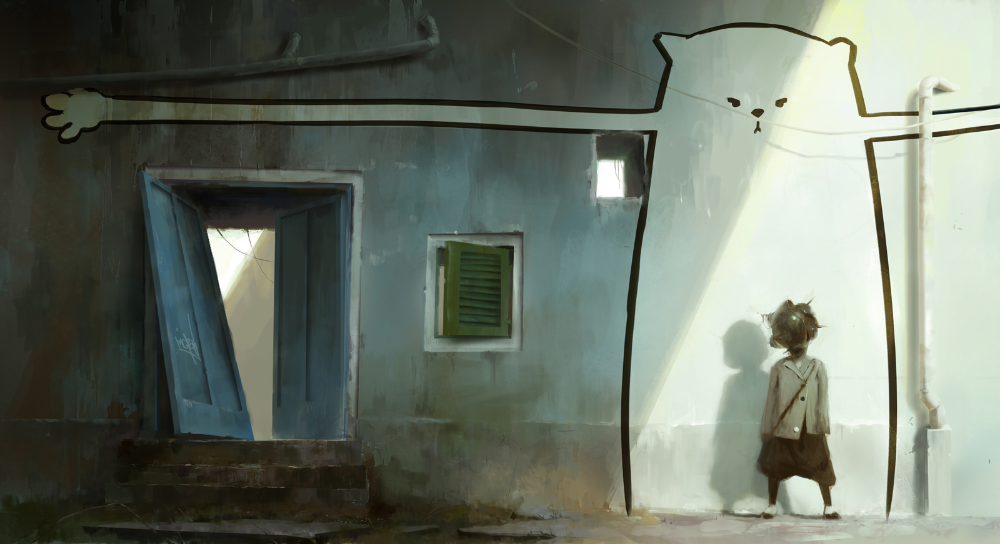


Or again in these concept arts from [Goro Fujita](https://twitter.com/gorosart)

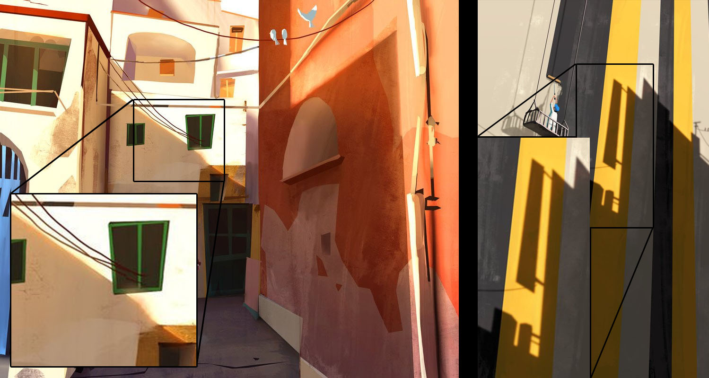


## Under the Skin

Shadow saturation is often quite visible when sub-surface scattering phenomenons are involved, like in skin or marble.
Intuitively you can imagine the saturation is coming from the many scattering events that occur beneath the skin or within the translucent material.

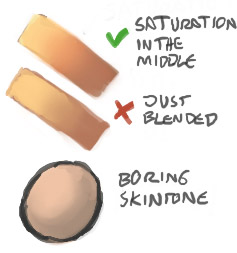

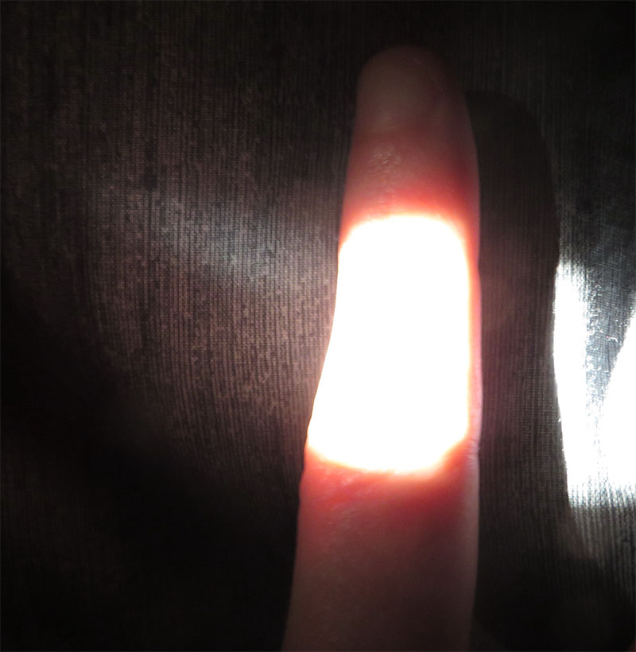


## More Generally

It's quite natural to extrapolate and imagine the effect is also present whenever light encounters a very rough material, regardless of it being a metal, a dielectric, a translucent skin patch or even a strongly isotropically scattering gas.

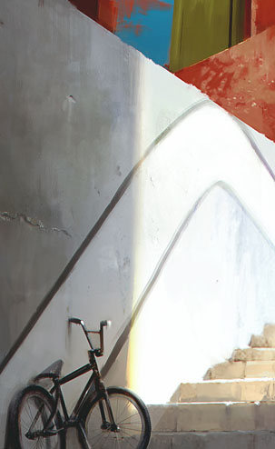

A simple explanation is that, assuming the surface/volume has an absorption albedo $\rho < 1$ and is lit by a radiance source $L_i$ then:

* A single rough reflection will yield a radiance $L_o \propto\rho L_i$
* A second rough reflection will yield a radiance $L_o \propto\rho^2 L_i$
* A third rough reflection will yield a radiance $L_o \propto\rho^3 L_i$
* And so on...
* In a general manner, after N reflections, the radiance will be $L_o \propto\rho^N L_i$

Thus, we have a [geometric series](http://mathworld.wolfram.com/GeometricSeries.html) and an ideally reflecting rough surface should give us:

$$
\begin{align}
 L_o & \propto L_i [\rho + \rho^2 + \rho^3 ...  + \rho^N ...]\\\\
 L_o & \propto L_i \sum_{i=1}^\infty{\rho^i} \\\\
 L_o & \propto L_i \left(\frac{\rho}{1-\rho}\right)
 \end{align}
$$

This equation is, of course, entirely incorrect because it doesn't ensure energy conservation if $\rho > \frac{1}{2}$, as can be seen in this plot.

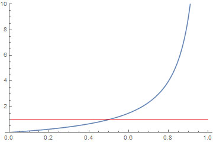


Nonetheless, it helps us grasp the nature of the phenomenon.


## Conditions for Saturated Shadow

We can distinguish 2 cases:

### Distant Indirect Lighting

A strong direct light will produces a saturated *distant indirect lighting*

* The material needs no restriction on roughness

* The material needs to be quite bright and *possibly desaturated* so the saturated indirect reflection shows up

* The saturation comes from the distant reflected indirect lighting that brings the surface coloration

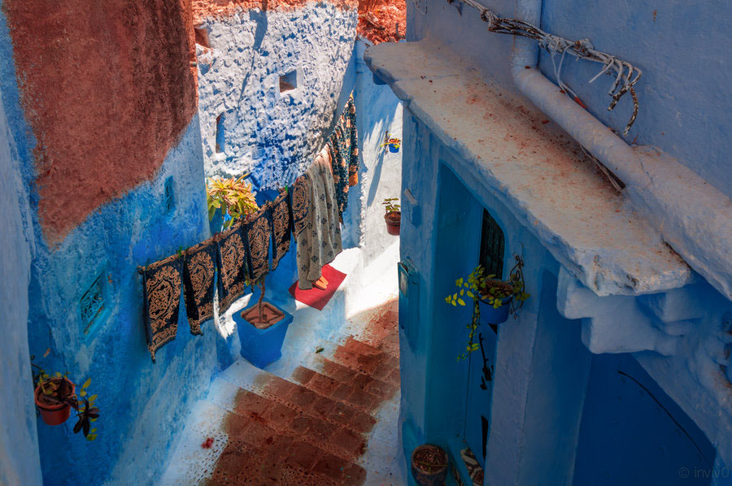

!!! note
    This case is not as spectacular as the second one since it will show a saturated ambient light, *not necessarily located only in the penumbra but in the full shadow as well*.


### A Rough Saturated Surface

A strong direct light will produce saturated penumbras if it scatters a lot through or at the surface of the material

* The material needs to be very rough or very anisotropic to scatter nearly in a diffuse manner (*e.g.* sand, dust, skin, granulates).

* The material needs to be already quite saturated in order for the $\rho^N$ saturation to show

* The material needs to have a $\rho$ that is quite reflective (*i.e.* not a dark value) otherwise the saturation won't show as any successive bounce will quickly --> 0

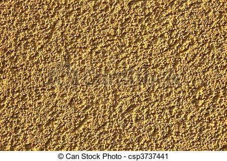


### General Required Conditions

In both cases anyway, we need:

* A very strong direct lighting, so we can safely assume this is an outdoor effect that is only seen in bright Sunlight
* A very dark and desaturated ambient light when the surface is in full shadow, in opposition to the bright light
* A large penumbra transition zone for the effect to be sufficiently visible


## Simulation

The case of the rough saturated surfaces is the most interesting for us. It appears in the penumbra region simply because:

* In full shadow, only indirect lighting can be perceived as an almost uniform ambient light (saturated or not)
* In full sun light, the strong direct lighting completely burns the subtle saturation effect and we perceive the surface as white

In the penumbra, on the other hand, we have all the possible transition states between fully burnt-out predominant direct light, down to the fully washed-out ambient indirect light.
Within that small transition zone of the penumbra, the saturation comes in full effect.

!!! note ""
    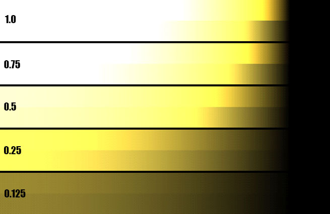

    The effect of $\frac{\rho}{1-\rho}$ with $\rho = k * (0.9,0.8,0.3)$ for various values of surface reflectance $k$ and a light intensity of 10.<br/>
	**Top color gradients**: color saturation is enabled. **Bottom color gradients**: color saturation is disabled (*i.e.* regular diffuse lighting model)


The figure above shows the standard diffuse lighting equation:

$$
L_o = L_i \rho_d (\boldsymbol{\omega_i}\cdot\boldsymbol{n})
$$

With $L_i=10$ the incoming radiance, $\boldsymbol{\omega_i}$ the incoming light direction varying from 0 to more than 90° away from the surface normal $\boldsymbol{n}$.

And finally $\rho_d$ the diffuse [BRDF](../../BRDF/BRDF%20Definition/) that we tweaked a little to incorporate our saturation term:

* When we use the regular diffuse BRDF $\rho_d = \frac{\rho}{\pi}$ we get the bottom gradients in the figure.

* But if we use the new saturated term:
$$
\rho_d = \frac{\rho}{2 \pi (1-\rho)}
$$

    Then there is an additional energy term due to the multiply-scattered energy that is added back to the equation as well as a nice color saturation.


## Implementation

In order to have a physically plausible implementation of the color saturation though, we need to make sure the saturation term is energy-conservative, meaning that we can't output more energy than we receive.

As we saw earlier, this is clearly not the case for values of $\rho > 0.5$ and we had to introduce a $\frac{1}{2}$ factor in the $\rho_d = \frac{\rho}{2 \pi (1-\rho)}$ diffuse BRDF to avoid that.


In general, we want a physically correct BRDF term that properly accounts for multiple scattering, this is why I would advise you to read the [MSBRDF page](../../BRDF/MSBRDF) that deals with that exact subject.

Eventually, we can use the following code to alter the shadow gradient and reveal the multiple-scattering effect early in the terminator band:

``` C++
// Simple shadow contrasting method
float	ContrastShadow( float _shadow, float _LdotN ) {

	float	shadow2 = lerp( 1.0, _shadow, saturate( 10.0 * (_LdotN-0.2) ) );	// This removes shadowing on back faces
			shadow2 = 1.0 - pow( 1.0 - shadow2, 16 );
//			shadow2 *= saturate( 0.2 + 0.8 * dot( light, _normal ) );			// Larger L.N, eating into the backfaces
			shadow2 *= _LdotN;
	return shadow2;
}
```

## Results

You can see below the effect of multiple-scattering on shadows and transition areas when the roughness increases:

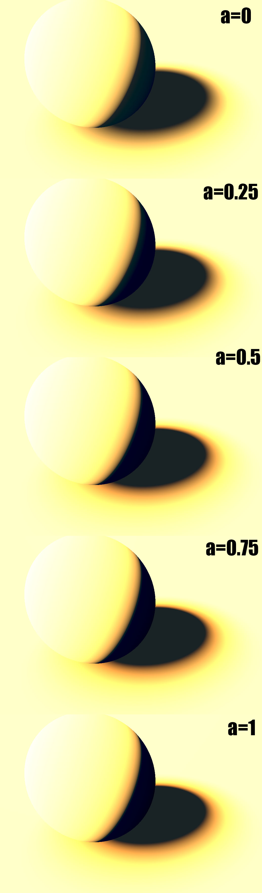


This is a live demo of what's happening when we increase the roughness:


## Art Tutorials

!!! note ""
    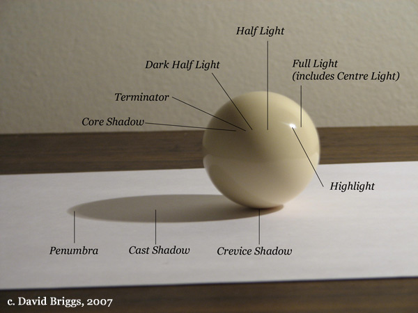

    Figure 2.4. Glossy sphere under a single direct light source, showing terminology of light and shade. Photograph by David Briggs. [Source](http://www.huevaluechroma.com/022.php)

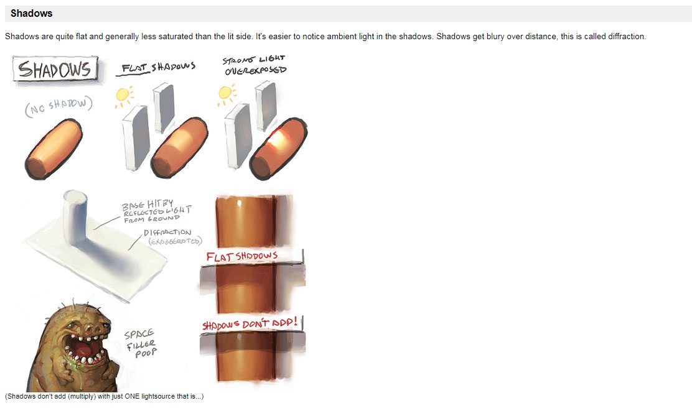

From [https://androidarts.com/art_tut.htm#shadows](https://androidarts.com/art_tut.htm#shadows)

Classic Arts:

[http://www.art.net/~rebecca/ShadeDefinitions.html](http://www.art.net/~rebecca/ShadeDefinitions.html)

Pinterest with many interesting slides:

[https://www.pinterest.com/roqueromero/resources-lights-and-shadows-tuts/](https://www.pinterest.com/roqueromero/resources-lights-and-shadows-tuts/)


## References

[^1]: 
