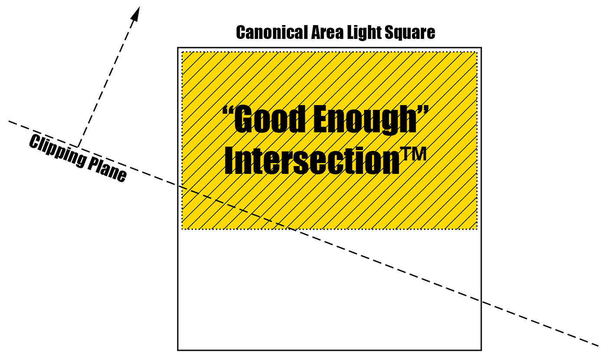

# Adding Area Lights

At the end of 2014 we decided to add support for rectangular area lights.

I believed textured rectangles were ideal since any other shape could be achieved by mapping a texture of the required shape onto the rectangle.

Area lights are a big part of next-gen rendering but are extremely difficult to render correctly mainly because the lighting integral requires many samples, both from the BRDF and the area light itself.

The lighting equation we need to resolve is:

$$
L( \boldsymbol{x}, \boldsymbol{\omega_o} ) = \int_A L(\boldsymbol{x},\boldsymbol{\omega_i}) f( \boldsymbol{\omega_o}, \boldsymbol{\omega_i} ) (\boldsymbol{\omega_i} \cdot \boldsymbol{n}) d\omega_i
$$

Where:

* $\boldsymbol{x}$ is the surface position we're computing the radiance for
* $\boldsymbol{\omega_o}$ is the outgoing view direction
* $\boldsymbol{\omega_i}$ is the incoming light direction
* $L( \boldsymbol{x}, \boldsymbol{\omega_o} )$ is the outgoing radiance in the view direction
* $L( \boldsymbol{x}, \boldsymbol{\omega_i} )$ is the incoming radiance in the light direction
* $A$ is the area light's surface, *clipped by the surface's plane*
* $f( \boldsymbol{\omega_o}, \boldsymbol{\omega_i} )$ is the surface's BRDF
* $\boldsymbol{n}$ is the surface's normal at $\boldsymbol{x}$
* $d\omega_i$ is the tiny solid angle covered by the incoming radiance

To solve this integral we usually numerically integrate by taking many samples on the surface of the area light but this is completely out of question for our purpose so instead, we make drastic simplifcations of this integral.

As usual, we split the BRDF into 2 parts: diffuse and specular.

$$
f_d( \boldsymbol{\omega_o}, \boldsymbol{\omega_i} ) = \frac{\rho_d}{\pi} \\\\
f_s( \boldsymbol{\omega_o}, \boldsymbol{\omega_i} ) = Ward( \boldsymbol{\omega_o}, \boldsymbol{\omega_i} )
$$

Then $f( \boldsymbol{\omega_o}, \boldsymbol{\omega_i} ) = F'( \boldsymbol{\omega_o}, \boldsymbol{\omega_i}, \boldsymbol{n} ) \cdot f_d( \boldsymbol{\omega_o}, \boldsymbol{\omega_i} )
 + F( \boldsymbol{\omega_o}, \boldsymbol{\omega_i}, \boldsymbol{n} ) \cdot f_s( \boldsymbol{\omega_o}, \boldsymbol{\omega_i} )$

$F( \boldsymbol{\omega_o}, \boldsymbol{\omega_i}, \boldsymbol{n} )$ is the specular Fresnel coefficient
$F'( \boldsymbol{\omega_o}, \boldsymbol{\omega_i}, \boldsymbol{n} )$ is the diffuse Fresnel coefficient (which is not exactly $1 - F( \boldsymbol{\omega_o}, \boldsymbol{\omega_i}, \boldsymbol{n} )$ but almost)

The integral becomes:

$$
\begin{align}
L_d( \boldsymbol{x}, \boldsymbol{\omega_o} ) &= \frac{\rho_d}{\pi} \int_A L(\boldsymbol{x},\boldsymbol{\omega_i}) F'( \boldsymbol{\omega_o}, \boldsymbol{\omega_i}, \boldsymbol{n} ) f_d( \boldsymbol{\omega_o}, \boldsymbol{\omega_i} ) (\boldsymbol{\omega_i} \cdot \boldsymbol{n}) d\omega_i	 \tag{1}\label{(1)} \\\\
L_s( \boldsymbol{x}, \boldsymbol{\omega_o} ) &= \int_A L(\boldsymbol{x},\boldsymbol{\omega_i}) F( \boldsymbol{\omega_o}, \boldsymbol{\omega_i}, \boldsymbol{n} ) f_s( \boldsymbol{\omega_o}, \boldsymbol{\omega_i} ) (\boldsymbol{\omega_i} \cdot \boldsymbol{n}) d\omega_i							 \tag{2}\label{(2)}
\end{align}
$$


## Simple Model

We can leverage the computation by considering some drastic simplifications:

$\eqref{(1)}$ becomes:

$$
L_d( \boldsymbol{x}, \boldsymbol{\omega_o} ) \approx F'( \boldsymbol{\omega_o}, \boldsymbol{\omega_{avg}}, \boldsymbol{n} ) \frac{\rho_d}{\pi} (\boldsymbol{\omega_{avg}} \cdot \boldsymbol{n}) \left( \int_A L(\boldsymbol{x},\boldsymbol{\omega_i}) d\omega_i \right)
$$

$\boldsymbol{\omega_{avg}}$ is the average incoming direction for the whole area light

$\eqref{(2)}$ becomes:

$$
L_s( \boldsymbol{x}, \boldsymbol{\omega_o} ) \approx \left( \int_A F( \boldsymbol{\omega_o}, \boldsymbol{\omega_i}, \boldsymbol{n} ) f_s( \boldsymbol{\omega_o}, \boldsymbol{\omega_i} ) (\boldsymbol{\omega_i} \cdot \boldsymbol{n}) d\omega_i \right) \cdot \left( \int_A L(\boldsymbol{x},\boldsymbol{\omega_i}) d\omega_i \right)
$$


All we need to do to accomplish this is a way to quickly compute:

1. The clipping area $A$ of the light's rectangle by the surface's plane
2. Compute the integral of the radiance given by the visible part of the clipped area light
3. Compute the integral of the BRDF given by the visible part of the clipped area light

Part 2 is easily done sampling a specific mip of the area light texture.

The mip level will be provided by the clipping routine as well as the aperture of the BRDF's glossiness cone for the specular part (for the diffuse part, the entire hemisphere is used and the entire area light is considered each time).


### Fake Clipping

As I wanted to avoid expensive clipping routines with conditions, my simple idea is whatever the orientation of the rectangular area light,
 I could always transform it into a canonical square that needed to be cut by an arbitrary plane (*i.e.* the current pxixel's surface's plane).

I arrived at a compromise that was good enough™ in that it returned an approximately clipped area and, more importantly, a continuous area (*i.e.* no sudden jumps depending on the rectangle's orientation,
 except some "bounces" when the area of the intersected rectangle stops growing, "bounces" and starts shrinking again).

The most important approximation is that I would *always return a rectangular area* approximating the cut, not the exact cut itself!




First of all, consider this elementary segment clipping routine:

??? "Segment clipping (HLSL)"
	``` C++
	// Condition-less clipping routine that returns the result of the intersection of [P0,P1] with the given plane:
	//	_ Return the intersection point if the segment cuts the plane
	//	_ Return P0 if both P0 and P1 stand below the plane
	//	_ Returns P1 if both P0 and P1 stand above the plane
	//
	float3	ClipSegment( float3 _P0, float3 _P1, float3 _PlanePosition, float3 _PlaneNormal ) {

		float3	V = _P1 - _P0;
		float3	D = _PlanePosition - _P0;
		float	d = dot( D, _PlaneNormal );
		float	t = d / dot( V, _PlaneNormal );

		// The actual code we want to execute is:
		// 	if ( d > 0.0 || t >= 0.0 )
		// 		return _P0 + saturate( t - 1e-3 ) * V;	// There's an intersection
		// 	else
		// 		return _P1;								// Both points are above the plane, go straight to end point
		//
		// But we can replace them with this condition-less code:
		float	d_or_t = d > 0.0 || t >= 0.0 ? 1.0 : 0.0;
		return lerp( _P1, _P0 + saturate( t - 1e-3 ) * V, d_or_t );
	}
	```

We notice that it always returns a point, even when the plane intersects outside the bounds of the segment. This is important as it means we will always deal with exactly 4 points at any particular stage of the clipping operation.

Next, I realized that my good enough™ clipping would miss intersections if I applied it only once in the clockwise order, so I simply applied it a second time with segments in the reverse counter-clockwise order.

You can find the complete clipping code below that returns a float4 where:

* xy contains the UV coordinates of the top-left corner of the clipped rectangle
* zw contains the UV coordinates of the bottom-right corner of the clipped rectangle


??? "The Full Clipping Code (HLSL)"
	``` C++
	// Computes the potential UV clipping of the canonical area light by the surface's normal
	// The algorithm is "quite cheap" as it doesn't use any condition and proceeds like this:
	//		1) Depending on the orientation of the plane's normal, we choose P0 as the farthest point away from the plane
	//		2) We build P1, P2 and P3 from P0
	//			=> the P0,P1,P2,P3 quad will either be CW or CCW but that does not matter
	//		3) We browse the quad in the P0->P1->P2->P3 orientation and keep the min/max of the clipped segments each time
	//		4) We browse the quad in the P3->P2->P1->P0 orientation and keep the min/max of the clipped segments each time
	//		5) We transform the min/max back into UV0 and UV1
	//
	// This is a crude approximation of the clipped UV area but it's okay for our needs
	// If you watch the solid angle of the clipped square as perceived by a surface, you will notice some
	//	discontinuities in the sense of "area bounces" because of the min/max but these discontinuites
	//	become less noticeable as they concur with the N.L becoming 0 at these locations
	//
	//	_lsPosition, the position of the clipping plane in local area light space
	//	_lsNormal, the normal of the clipping plane in local area light space
	//	_AreaLightScale, the size of the area light rectangle
	//
	float4	ComputeAreaLightClipping( float3 _lsPosition, float3 _lsNormal, float2 _AreaLightScale ) {

		// Find the coordinates of the farthest point away from the plane
		float	X0 = _AreaLightScale.x * (_lsNormal.x < 0.0 ? -1.0 : 1.0);
		float	Y0 = _AreaLightScale.y * (_lsNormal.y < 0.0 ? -1.0 : 1.0);

		// Build the remaining quad coordinates by mirroring
		float3	P0 = float3( X0, Y0, 0.0 );
		float3	P1 = float3( -X0, Y0, 0.0 );
		float3	P2 = float3( -X0, -Y0, 0.0 );
		float3	P3 = float3( X0, -Y0, 0.0 );

		// Compute clipping of the square by browsing the contour in both CCW and CW
		// We keep the min/max of positions each time
		float2	Min = 100.0;
		float2	Max = -100.0;

		// CCW
		float3	P = ClipSegment( P0, P1, _lsPosition, _lsNormal );
		Min = min( Min, P.xy );	Max = max( Max, P.xy );

		P = ClipSegment( P, P2, _lsPosition, _lsNormal );
		Min = min( Min, P.xy );	Max = max( Max, P.xy );

		P = ClipSegment( P, P3, _lsPosition, _lsNormal );
		Min = min( Min, P.xy );	Max = max( Max, P.xy );

		P = ClipSegment( P, P0, _lsPosition, _lsNormal );
		Min = min( Min, P.xy );	Max = max( Max, P.xy );

		// CW
		P = ClipSegment( P0, P3, _lsPosition, _lsNormal );
		Min = min( Min, P.xy );	Max = max( Max, P.xy );

		P = ClipSegment( P, P2, _lsPosition, _lsNormal );
		Min = min( Min, P.xy );	Max = max( Max, P.xy );

		P = ClipSegment( P, P1, _lsPosition, _lsNormal );
		Min = min( Min, P.xy );	Max = max( Max, P.xy );

		P = ClipSegment( P, P0, _lsPosition, _lsNormal );
		Min = min( Min, P.xy );	Max = max( Max, P.xy );

		// Pack coordinates
		return float4( Min, Max );
	}
	```

Of course, 3 years later, I realize now that I was still in the old mindset where I considered it was better to write a lot of code than a single condition.
This is not true anymore and copy/pasting this code I found many obvious optimizations I could apply if I ever had to use that code again...


### Computing the Irradiance

Since the clipping routine gave us 2 UV coordinates within the area light as the approximate intersection, it is quite easy to sample the mip-mapped textured from there.

Note that the textures we were using are actually bounded by black borders to account for the solid angle's footprint growing and sampling outside the domain of the area light.


??? "Area Light Sampling (HLSL)"
	``` C++
	// Samples the area light given 2 local coordinates
	float3	SampleAreaLight( float2 _lsPosMin, float2 _lsPosMax, float2 _AreaLightScale, uint _SliceIndex, const bool _UseAlpha ) {

		// Transform local space coordinates into UV coordinates
		float2	InvScale = 1.0 / _AreaLightScale;
		float2	UV0 = InvScale * float2( _lsPosMin.x, _lsPosMax.y );
				UV0 = 0.5 * float2( 1.0 + UV0.x, 1.0 - UV0.y );
		float2	UV1 = InvScale * float2( _lsPosMax.x, _lsPosMin.y );
				UV1 = 0.5 * float2( 1.0 + UV1.x, 1.0 - UV1.y );

		// Determine mip level
		float2	DeltaUV = 0.5 * (UV1 - UV0);
		float	RadiusPixels = AREA_LIGHT_TEX_DIMENSIONS.x * 0.5 * (DeltaUV.x + DeltaUV.y);
		float	MipLevel = log2( 1e-4 + RadiusPixels );

		// Compute an approximation of the clipping of the projected disc and the area light:
		//	__
		//	  |  ...
		//	  |.
		//	 .|
		//	. |   
		//	.I+---+ C
		//	. |
		//	 .|
		//	  |.
		//	  |  ...
		//	__|
		//
		// We simply need to compute the distance between C, the center of projection
		//	and I, the closest position to C within the square area light and normalize
		//	it by the radius of the circle of confusion to obtain a nice, round fading
		//	zone when the circle exits the area light...
		float2	UVCenter = 0.5 * (UV0 + UV1);
		float2	SatUVCenter = saturate( UVCenter );
		float	Attenuation = smoothstep( 1.0, 0.0, saturate( length( (UVCenter - SatUVCenter) / (1e-3 + DeltaUV) ) ) );

		float4	Color = _SliceIndex < 255 ? texPoolAreaLights.SampleLevel( trilinearSampler, float3( SatUVCenter, _SliceIndex ), MipLevel ) : 1.0;
		if ( _UseAlpha ) {
			Color.xyz *= Color.w;	// Diffuse uses alpha to allow smoothing out of the texture's borders...
		}

		return Attenuation * Color.xyz;
	}
	```


### Directional/Ambient Projector


## Paraboloid Exponential Shadow Maps


## Test Project

You can find the entire area light test project in my [God Complex GitHub repository](https://github.com/Patapom/GodComplex/tree/master/Tests/TestAreaLight).

