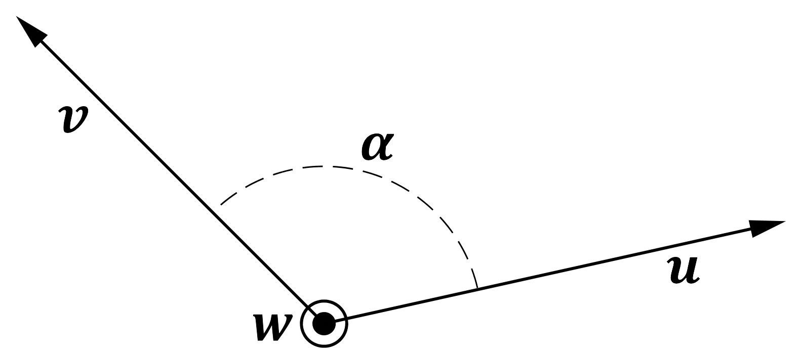
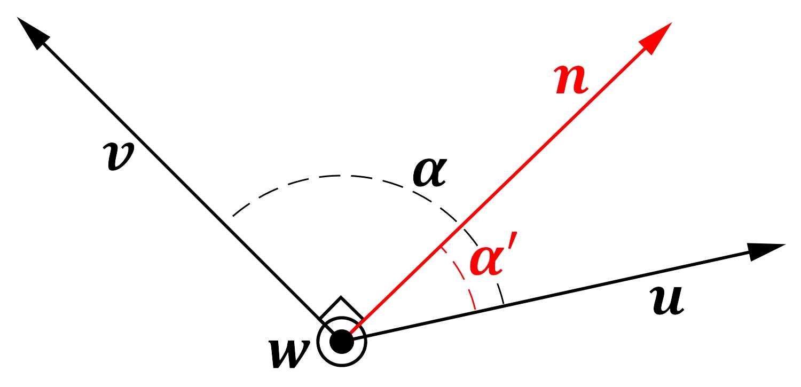

The cross-product is a strange beast.

## Do it that way

It's usually taught to you in 6th grade where you are told its 2D definition first:



$$
\boldsymbol{u} = ( u_x, u_y, 0 ) ~~~~~~~~~~ \boldsymbol{v} = ( v_x, v_y, 0 ) ~~~~~~~~~~ \boldsymbol{w}= \boldsymbol{u} \times \boldsymbol{v} = (0, 0, u_x  v_y - u_y  v_x )
$$

You are also told that $\Vert\boldsymbol{w}\Vert = \Vert\boldsymbol{u}\Vert \Vert\boldsymbol{v}\Vert sin(\alpha)$ and that the resulting vector $\boldsymbol{w}$ is orthogonal to its base constituents $\boldsymbol{u}$ and $\boldsymbol{v}$.

Then everyone in the classroom starts doing some strange gestures with their fingers to understand which way the vector should point to, something about the "right hand rule", clockwise rotation, counter-clockwise rotation, etc.

And then you start using it everywhere because as soon as you need something orthogonal to another, the cross-product immediately pops into your mind.


## But why?

Why introduce such a tool? Where does it come from? Is it really necessary? Isn't the $u_x  v_y - u_y  v_x$ part a bit arbitrary?

The [history section of the Wikipedia page](https://en.wikipedia.org/wiki/Cross_product#History) says the dot and cross product were apparently introduced by Lagrange in order to study the tetrahedron in three dimensions.
Obviously, you start imagining the volume of a tetrahedron, some parallelograms come to mind, the [wedge product](https://en.wikipedia.org/wiki/Exterior_algebra), areas, volumes, tensors, group theory and whatnots, etc.
(By the way, I encourage you to read the very interesting article [^1] by Nathan Reed about the Grassman Algebra that makes a nice echo to what I am writing here) (and he published it pretty much the same day I finished writing this :smile:)

And you're no closer to an idea than when you started... I won't pretend I will provide a brilliant explanation of "why the cross product" either, just adding oil to the thought process here.


## Factorizing the Tools

As a programmer, there is nothing I hate more than duplicate code... And I claim that the cross product is nothing more than a duplicate tool: the essential original tool being the dot product!

Why bother learning a new notation? Only because it's found in many places? Why not calling it the "orthogonal dot product" at the very least?
Because it would seem that most people forgot the cross product is really the dot product but rewrote in another way. Let me explain.

When we write:

$$
u_x  v_y - u_y  v_x
$$

Aren't we actually doing the dot product?

$$
u_x (v_y) + u_y (-v_x) = \boldsymbol{u} \cdot \boldsymbol{n}
$$

With $\boldsymbol{n}=( v_y, -v_x, 0 )$

I chose the symbol $\boldsymbol{n}$ on purpose, to show that this vector is actually the **normal** vector to our original $\boldsymbol{v}$ vector:



We know that $\boldsymbol{u} \cdot \boldsymbol{n} = \Vert\boldsymbol{u}\Vert \Vert\boldsymbol{n}\Vert cos(\alpha')$ and, from the figure we can see that $\alpha' = \alpha-\frac{\pi}{2}$ and thus,
 indeed, $cos(\alpha') = cos(\alpha-\frac{\pi}{2}) = sin(\alpha)$ and we find back the original expression:

$$
\Vert\boldsymbol{w}\Vert = u_x  v_y - u_y  v_x = \boldsymbol{u} \cdot \boldsymbol{n} = \Vert\boldsymbol{u}\Vert \Vert\boldsymbol{n}\Vert cos(\alpha') = \Vert\boldsymbol{u}\Vert \Vert\boldsymbol{v}\Vert sin(\alpha)
$$


## So what is it then?

We just saw that the cross-product is nothing more than a mere dot product with a vector $\boldsymbol{n}$ normal to the original vector $\boldsymbol{v}$.
As the dot product measures the alignment of 2 vectors (*i.e.* the alignment being maximum when the dot product is 1 in absolute value), and since we're measuring the alignment of a vector $\boldsymbol{n}$ that is orthogonal to $\boldsymbol{v}$, then we're actually measuring the orthogonality of the two vectors $\boldsymbol{u}$ and $\boldsymbol{v}$.

**Claim**: The cross product is just a twist of the dot product to measure "how much two vectors are orthogonal from each other".


## Three Dimensions

In 3 dimensions, the arbitrary nature of the operations you are told to remember is at its maximum!


Indeed, if you have:

$$
\boldsymbol{u} = ( u_x, u_y, u_z ) ~~~~~~~~~~ \boldsymbol{v} = ( v_x, v_y, v_z )
$$

Then, get ready... The cross product $\boldsymbol{u} \times \boldsymbol{v}$ is given by:

$$
 ~~~~~~~~~~ \boldsymbol{w}= \boldsymbol{u} \times \boldsymbol{v} =\begin{cases}
u_y v_z - u_z v_y\\\\
u_z v_x - u_x v_z\\\\
u_x v_y - u_y v_x\\\\
\end{cases}
$$

You easily see the patterns, the rotations and permutations that are necessary to retrieve the result. You memorize it and you retrieve it each time you need it.

But one more time, I claim these are just 3 little dot products in disguise:

$$
 ~~~~~~~~~~ \boldsymbol{w}= \boldsymbol{u} \times \boldsymbol{v} =\begin{cases}
u_y (v_z) + u_z (-v_y) = u_y n_y + u_z n_z = \boldsymbol{u_{yz}} \cdot \boldsymbol{n_{yz}}\\\\
u_z (v_x) + u_x (-v_z) = u_z n_z + u_x n_x = \boldsymbol{u_{zx}} \cdot \boldsymbol{n_{zx}}\\\\
u_x (v_y) + u_y (-v_x) = u_x n_x + u_y n_y = \boldsymbol{u_{xy}} \cdot \boldsymbol{n_{xy}}\\\\
\end{cases}
$$

With $\boldsymbol{u_{yz}} = \begin{cases}u_y\\\\u_z\end{cases} ~~~~~$
$\boldsymbol{u_{zx}} = \begin{cases}u_z\\\\u_x\end{cases} ~~~~~$
$\boldsymbol{u_{xy}} = \begin{cases}u_x\\\\u_y\end{cases}$

And
$\boldsymbol{n_{yz}} = \begin{cases}v_z\\\\-v_y\end{cases} ~~~~~$
$\boldsymbol{n_{zx}} = \begin{cases}v_x\\\\-v_z\end{cases} ~~~~~$
$\boldsymbol{n_{xy}} = \begin{cases}v_y\\\\-v_x\end{cases}$

Each little dot product is actually measuring **how much 2D sub-vectors are orthogonal from each other along each axis**, each in their own 2D sub-space XY, YZ, ZX (once again, Nathan Reed uses better words than I am, in his article about Grassman algebra [^1]).


* The X coordinate equals how much the 2D vectors are orthogonal from each other in the complementary 2D sub-space YZ
* The Y coordinate equals how much the 2D vectors are orthogonal from each other in the complementary 2D sub-space ZX
* The Z coordinate equals how much the 2D vectors are orthogonal from each other in the complementary 2D sub-space XY


## Orthogonality

Building a new 3D vector this way is actually yielding a vector that is orthogonal to the other two base vectors (unless the 2 base vectors are colinear).
Obviously, there are only 6 possible permutations of different triplets of vector components for arbitrary vectors $\boldsymbol{u}$, $\boldsymbol{v}$ and $\boldsymbol{w}$:

$~~~~u_x v_y w_z$

$~~~~u_y v_z w_x$

$~~~~u_z v_x w_y$

$~~~~u_x v_z w_y$

$~~~~u_y v_x w_z$

$~~~~u_z v_y w_x$


And they all find their expression as positive and negative quantities when writing the dot product of $\boldsymbol{w}$ with the resulting cross product $\boldsymbol{u} \times \boldsymbol{v}$:

$\boldsymbol{w} \cdot (\boldsymbol{u} \times \boldsymbol{v}) = u_y v_z w_x - u_z v_y w_z + u_z v_x w_y - u_x v_z w_y + u_x v_y w_z - u_y v_x w_z$


Whenever $\boldsymbol{w}$ turns out to be $\boldsymbol{w} = \boldsymbol{u}$ or $\boldsymbol{w} = \boldsymbol{v}$, the quantities find balancing positive and negative quantities that eventually vanish, thus proving that the 
vector resulting from the cross product construction is indeed orthogonal to its base construction vectors $\boldsymbol{u}$ and $\boldsymbol{v}$.


## Higher Dimensions

So we gathered interesting information so far:

1. The cross product is actually a collection of $N$ dot products, $N$ being the amount of dimensions of our space
2. The $N$ dot products from point 1. are performed between vectors of dimension $N-1$, each of these vectors $\boldsymbol{u_i}$, $\boldsymbol{v_i}$ and $\boldsymbol{n_i}$ being expressed in the sub-space $i \in [1,N]$ excluding the dimension $i$ itself
 (*e.g.* in 3D, $\boldsymbol{n_1}=\boldsymbol{n_{yz}}$ is a combination of components from axes $Y$ and $Z$, excluding axis $X$)
3. Each dot product is performed between the original vector $\boldsymbol{u}$ and a "normal vector" $\boldsymbol{n}$ that is derived from the original vector $\boldsymbol{v}$ by permutations
 and optional sign changes of the components of $\boldsymbol{v}$ so that $\boldsymbol{v} \cdot \boldsymbol{n} = 0$
4. The combination of permutations and sign changes from point 3. stays the same for all $N$ sub-space normal vectors
5. Dotting the vector $\boldsymbol{w} = \boldsymbol{u} \times \boldsymbol{v}$ with either one of the base vectors $\boldsymbol{u}$ and $\boldsymbol{v}$ must yield 0, guaranteeing the orthogonality of the result
6. The algebra must also be anti-commutative so that $\boldsymbol{u} \times \boldsymbol{v} = -\left(\boldsymbol{v} \times \boldsymbol{u}\right)$ (but is this a consequence or a condition? Couldn't we accept a commutative cross-product?)

<br/>
Assuming these rules apply for any dimension, let's try and build a 4D cross-product!


### Odd Dimensions

From point 3., we know that $\boldsymbol{n} \cdot \boldsymbol{v} = 0$.

In order for this to be possible, we use point 2. to notice that we **must have sub-vectors of even dimension** for terms coupling and canceling to occur!

Indeed, for example in 4 dimensions, we would build our cross product as:

$$
\boldsymbol{w} = \begin{cases}
\boldsymbol{u_{123}} \cdot \boldsymbol{n_{123}}\\\\
\boldsymbol{u_{230}} \cdot \boldsymbol{n_{230}}\\\\
\boldsymbol{u_{301}} \cdot \boldsymbol{n_{301}}\\\\
\boldsymbol{u_{012}} \cdot \boldsymbol{n_{012}}
\end{cases}
$$

And for any of these 4 cases, we could write something like this expression:

$$
\boldsymbol{v_{012}} \cdot \boldsymbol{n_{012}} = 0
$$

But whatever the way we may construct the vector $\boldsymbol{n_{012}}$, we will find no combination so that:

$$
v_0 \cdot ? + v_1 \cdot ? + v_2 \cdot ? = 0
$$

Simply because we need an even amount of terms for that to be possible (*i.e.* so that an even amount of + and - terms cancel each other).

!!! note
    This leads to the very interesting remark that **cross products only exist for odd dimensions** 3, 5, 7 and so on.
	(you may object the 2D case but we're actually doing a 3D cross product with planar 2D vectors really, the true 2D cross-product doesn't exist)
	(interestingly, the 1D cross product is simply the product of two scalars :smile:)

And indeed, for odd dimensions you get sub-space vectors of even dimensions and you can then have terms coupling that cancel each other.


### Permutations

For example, for 5 dimensions you can write the cross product as:

$$
\boldsymbol{w} = \begin{cases}
\boldsymbol{u_{1234}} \cdot \boldsymbol{n_{1234}}\\\\
\boldsymbol{u_{2340}} \cdot \boldsymbol{n_{2340}}\\\\
\boldsymbol{u_{3401}} \cdot \boldsymbol{n_{3401}}\\\\
\boldsymbol{u_{4012}} \cdot \boldsymbol{n_{4012}}\\\\
\boldsymbol{u_{0123}} \cdot \boldsymbol{n_{0123}}
\end{cases}
$$


Selecting the simple case $\boldsymbol{u_{0123}} \cdot \boldsymbol{n_{0123}}$, we first notice from point 2. and 3. that $\boldsymbol{n_{0123}}$ needs to be a [derangement](https://en.wikipedia.org/wiki/Derangement) 
of the indices $0123$ to ensure that no component index from $\boldsymbol{u}$ gets multiplied by the same component index from $\boldsymbol{n} = derangement\left(\boldsymbol{v}\right)$ (*i.e.* $u_0$ can't get multiplied by $v_0$, $u_1$ can't get multiplied by $v_1$ and so on).

The amount of possible derangements in 4 dimensions, noted $!4$, is 9:

$$
\begin{align}
(1032) (1302) (1203) \\\\
(2031) (2301) (2310) \\\\
(3012) (3201) (3210) \\\\
\end{align}
$$

We can further reduce the amount of possibilities by remembering that $\boldsymbol{v_{0123}} \cdot \boldsymbol{n_{0123}} = 0$, implying the construction of the normal vector must satisfy:

$$
\boldsymbol{v_{0123}} \cdot \boldsymbol{n_{0123}} = v_0 \cdot ? + v_1 \cdot ? + v_2 \cdot ? + v_3 \cdot ? = 0
$$

And this can only happen in the following *"mirror"* cases:

$$
\boldsymbol{n_{0123}} =
\begin{cases}
\pm v_1 \\\\
\mp v_0 \\\\
\pm v_3 \\\\
\mp v_2
\end{cases}
\quad \text{or} \quad 
\boldsymbol{n_{0123}} =
\begin{cases}
\pm v_2 \\\\
\pm v_3 \\\\
\mp v_0 \\\\
\mp v_1
\end{cases}
\quad \text{or} \quad 
\boldsymbol{n_{0123}} =
\begin{cases}
\pm v_3 \\\\
\pm v_2 \\\\
\mp v_1 \\\\
\mp v_0
\end{cases}
$$

This is because if you decide to couple $v_0$ with $v_2$, then you necessarily need to couple $v_2$ with $v_0$ in mirror, with a negative sign to make both terms cancel each other.<br/>
Moreover, coupling $v_0$ with $v_2$ also forces the mirror coupling of $v_1$ with $v_3$...

As for the signs coupling, with 4D vectors you only have the following mirror choices, in the case of permutation $\boldsymbol{n_{0123}} = \boldsymbol{v_{1032}}$:

$$
+-+- \\\\
-+-+ \\\\
+--+ \\\\
-++-
$$


It's now quite easy to notice that for any odd dimension $N=2k+1$, the number of possible combinations for constructing a normal vector is equal to $2^k \cdot (2k-1)!!$.

--> The term $2^k$ is the amount of binary sign permutations (so $2^x$) for each pair (so $\frac{N-1}{2} = \frac{2k}{2} = k$ as exponent)

--> The term $(2k-1)!!$ is due to the number of possible swaps of even sub-space dimensions (*i.e.* $2k$) without including your own dimension (*i.e.* in 3D, $x$ can use $y$ and $z$ but not itself, so $-1$).<br/>
Notice that it involves the [double factorial](https://en.wikipedia.org/wiki/Double_factorial) $n!! = n(n-2)(n-4) \cdots 5\cdot3\cdot1$ because we're dealing with recursion here: if it takes only 3 valid derangements in 5D,
 then in 7D it will take 5 times the amount of valid derangements so $5 \times 3$, and in 9D it will take $7 \times 5 \times 3$ valid derangements, etc.


### Finding the Right One

So all in all, for 5D vectors, we saw that we can choose among $(2\cdot2-1) \cdot 2^2 = 12$ possible ways to rewrite any sub-space 4D vector like $\boldsymbol{v_{0123}}$.

All we need now is to enforce point 5. to guarantee the orthogonality of the constructed vector.

So we write the final required expression:

$$
\boldsymbol{u} \cdot (\boldsymbol{u} \times \boldsymbol{v}) = \boldsymbol{v} \cdot (\boldsymbol{u} \times \boldsymbol{v}) = \boldsymbol{0}
$$

This expression can be developped into a pretty nightmarish result, for example with the 5D vectors $\boldsymbol{u_{01234}}$ and $\boldsymbol{v_{01234}}$ and using the combination $\boldsymbol{n_{0123}} = (v_1,-v_0,v_3,-v_2)$ for each sub-space vector we get:

$$
\begin{align}
\boldsymbol{u} \cdot (\boldsymbol{u} \times \boldsymbol{v}) 
&= u_0.u_1.v_2 - u_0.u_2.v_1 + u_0.u_3.v_2 + u_0.u_2.v_3 \\\\
&+ u_1.u_2.v_3 - u_1.u_3.v_2 + u_1.u_4.v_0 + u_1.u_0.v_4 \\\\
&+ u_2.u_3.v_4 - u_2.u_4.v_3 + u_2.u_0.v_1 + u_2.u_1.v_0 \\\\
&+ u_3.u_4.v_0 - u_3.u_0.v_4 + u_3.u_1.v_2 + u_3.u_2.v_1 \\\\
&+ u_4.u_0.v_1 - u_4.u_1.v_0 + u_4.u_2.v_3 + u_4.u_3.v_2 \\\\
\end{align}
$$

Focusing on the single first term $u_0.u_1.v_2$ we easily see that it cannot be found again anywhere else in the expression, either as a positive or negative quantity, and is thus *not cancelled*.<br/>
The combination $\boldsymbol{n_{0123}} = (v_1,-v_0,v_3,-v_2)$ is thus not a good candidate for creating the 5D cross product operator.

I wrote a simple program that tries all possible combinations and accumulates $uuv$ triplets as positive and negative quantities. If all the resulting factors for each triplet are 0 then the combination is marked as valid for the cross product.

???- "Code for finding a 5D Cross Product"
    ``` C++

	void	TestCross5D() {
		int[][]	derangements = new int[3][] {
			new int[4] { 1, 0, 3, 2 },		// Couple {x,y} and {z,w}
			new int[4] { 2, 3, 0, 1 },		// Couple {x,z} and {y,w}
			new int[4] { 3, 2, 1, 0 },		// Couple {x,w} and {y,z}
		};
		int[][]	couples = new int[3][] {
			new int[4] { 1, -1, 2, -2 },	// Couple {x,y} and {z,w}
			new int[4] { 1, 2, -1, -2 },	// Couple {x,z} and {y,w}
			new int[4] { 1, 2, -2, -1 },	// Couple {x,w} and {y,z}
		};

		int[,]	permutations = new int[5,4] {
			{ 1, 2, 3, 4 },					// Row x uses yzwt
			{ 2, 3, 4, 0 },					// Row y uses zwtx
			{ 3, 4, 0, 1 },					// Row z uses wtxy
			{ 4, 0, 1, 2 },					// Row w uses txyz
			{ 0, 1, 2, 3 },					// Row t uses xyzw
		};

		int[]	signs = new int[4];

		List< Tuple<int,int> >	solutionsU = new List<Tuple<int, int>>();
		List< Tuple<int,int> >	solutionsV = new List<Tuple<int, int>>();
		List< Tuple<int,int> >	solutions = new List<Tuple<int, int>>();

		// Try all possible derangements
		for ( int i=0; i < 3; i++ ) {
			int[]	derangement = derangements[i];
			int[]	couple = couples[i];

			// Try all possible sign combinations
			for ( int s=0; s < 4; s++ ) {
				int	s0 = (s & 1) != 0 ? 1 : -1;
				int	s1 = (s & 2) != 0 ? 1 : -1;
				signs[0] = (couple[0] < 0 ? -1 : 1) * (Math.Abs(couple[0]) == 1 ? s0 : s1);
				signs[1] = (couple[1] < 0 ? -1 : 1) * (Math.Abs(couple[1]) == 1 ? s0 : s1);
				signs[2] = (couple[2] < 0 ? -1 : 1) * (Math.Abs(couple[2]) == 1 ? s0 : s1);
				signs[3] = (couple[3] < 0 ? -1 : 1) * (Math.Abs(couple[3]) == 1 ? s0 : s1);

				// Estimate each line of w.(u x v)
				Array.Clear( m_sumTripletsU, 0, 5*5*5 );
				Array.Clear( m_sumTripletsV, 0, 5*5*5 );
				for ( int d=0; d < 5; d++ ) {
					int	index_w_0 = d;
					int	index_u_0 = permutations[d,0];
					int	index_v_0 = permutations[d,derangement[0]];
					int	sign_0 = signs[0];
					AddTripletU( index_w_0, index_u_0, index_v_0, sign_0 );
					AddTripletV( index_w_0, index_u_0, index_v_0, sign_0 );

					int	index_w_1 = d;
					int	index_u_1 = permutations[d,1];
					int	index_v_1 = permutations[d,derangement[1]];
					int	sign_1 = signs[1];
					AddTripletU( index_w_1, index_u_1, index_v_1, sign_1 );
					AddTripletV( index_w_1, index_u_1, index_v_1, sign_1 );

					int	index_w_2 = d;
					int	index_u_2 = permutations[d,2];
					int	index_v_2 = permutations[d,derangement[2]];
					int	sign_2 = signs[2];
					AddTripletU( index_w_2, index_u_2, index_v_2, sign_2 );
					AddTripletV( index_w_2, index_u_2, index_v_2, sign_2 );

					int	index_w_3 = d;
					int	index_u_3 = permutations[d,3];
					int	index_v_3 = permutations[d,derangement[3]];
					int	sign_3 = signs[3];
					AddTripletU( index_w_3, index_u_3, index_v_3, sign_3 );
					AddTripletV( index_w_3, index_u_3, index_v_3, sign_3 );
				}

				// Check if the sum only contains zeroes
				bool	allZeroesU = true;
				bool	allZeroesV = true;
				for ( int j=0; j < 5*5*5; j++ ) {
					int	z = j;
					int	x = z / (5*5);
					z -= 5*5 * x;
					int	y = z / 5;
					z -= 5* y;

					int	sumU = m_sumTripletsU[x,y,z];
					int	sumV = m_sumTripletsV[x,y,z];
					if ( sumU != 0 ) {
						allZeroesU = false;
					}
					if ( sumV != 0 ) {
						allZeroesV = false;
					}
				}
				if ( allZeroesU && allZeroesV ) {
					solutions.Add( new Tuple<int,int>( i, s ) );
				} else if ( allZeroesU ) {
					solutionsU.Add( new Tuple<int,int>( i, s ) );
				} else if ( allZeroesV ) {
					solutionsV.Add( new Tuple<int,int>( i, s ) );
				}
			}
		}

		if ( solutions.Count == 0 )
			throw new Exception( "No solution!" );
	}

	int[,,]	m_sumTripletsU = new int[5,5,5];
	void	AddTripletU( int _u0, int _u1, int _v, int _sign ) {
		if ( _u0 == _u1 || _u1 == _v ) throw new Exception(  "Can't have identical indices!" );
		m_sumTripletsU[_u0, _u1, _v] += _sign;
		m_sumTripletsU[_u1, _u0, _v] += _sign;
	}
	int[,,]	m_sumTripletsV = new int[5,5,5];
	void	AddTripletV( int _v0, int _u, int _v1, int _sign ) {
		if ( _v0 == _u || _u == _v1 ) throw new Exception(  "Can't have identical indices!" );
		m_sumTripletsV[_v0, _u, _v1] += _sign;
		m_sumTripletsV[_v1, _u, _v0] += _sign;
	}

    ```


Unfortunately, this code returns **no valid solution** so, unless I made a mistake, it seems that there is no 4D combination of component and sign swaps that creates an algebra that induces the cross-product operator.


## Only special odd dimensions

According to [wikipedia](https://en.wikipedia.org/wiki/Seven-dimensional_cross_product), the next space where a cross product is available is in 7D so I'm expecting to find solutions with this new code
that checks the $5!! \cdot 2^3 = 120$ possible indices permutations for 6D sub-space vectors:

???- "Code for finding a 7D Cross Product"
	``` C++
	void	TestCross7D() {
		// Manual creation of the 5*3 possible valid derangements
		const int	x=0, y=1, z=2, w=3, s=4, t=5;
		int[][]	derangements = new int[5*3][] {
			new int[6] { y, x, w, z, t, s },
			new int[6] { y, x, s, t, z, w },
			new int[6] { y, x, t, s, w, z },

			new int[6] { z, w, x, y, t, s },
			new int[6] { z, s, x, t, y, w },
			new int[6] { z, t, x, s, w, y },	// SOLUTION #1!

			new int[6] { w, z, y, x, t, s },
			new int[6] { w, s, t, x, y, z },
			new int[6] { w, t, s, x, z, y },

			new int[6] { s, z, y, t, x, w },	// SOLUTION #2!
			new int[6] { s, w, t, y, x, z },
			new int[6] { s, t, w, z, x, y },

			new int[6] { t, z, y, s, w, x },
			new int[6] { t, w, s, y, z, x },
			new int[6] { t, s, w, z, y, x },
		};
		int[][]	coupless = new int[5*3][];
		for ( int i=0; i < derangements.Length; i++ ) {		// Automate couples creation to avoid mistakes...
			int[]	couples = new int[6];
			coupless[i] = couples;
			int	coupleIndex = 1;
			for ( int j=0; j < 6; j++ ) {
				if ( couples[j] == 0 ) {
					couples[j] = coupleIndex;
					couples[derangements[i][j]] = -coupleIndex;
					coupleIndex++;
				}
			}
		}

		int[,]	permutations = new int[7,6] {
			{ 1, 2, 3, 4, 5, 6 },			// Row i uses jklmno
			{ 2, 3, 4, 5, 6, 0 },			// Row j uses klmnoi
			{ 3, 4, 5, 6, 0, 1 },			// Row k uses lmnoij
			{ 4, 5, 6, 0, 1, 2 },			// Row l uses mnoijk
			{ 5, 6, 0, 1, 2, 3 },			// Row m uses noijkl
			{ 6, 0, 1, 2, 3, 4 },			// Row n uses oijklm
			{ 0, 1, 2, 3, 4, 5 },			// Row o uses ijklmn
		};

		int[]	signs = new int[6];

		List< Tuple<int,int> >	solutionsU = new List<Tuple<int, int>>();
		List< Tuple<int,int> >	solutionsV = new List<Tuple<int, int>>();
		List< Tuple<int,int> >	solutions = new List<Tuple<int, int>>();

		// Try all possible derangements
		for ( int i=0; i < derangements.Length;i++ ) {
			int[]	derangement = derangements[i];
			int[]	couples = coupless[i];

			// Try all possible sign combinations
			for ( int sign=0; sign < 8; sign++ ) {
				int[]	signBits = new int[] {
					(sign & 1) != 0 ? -1 : 1,
					(sign & 2) != 0 ? -1 : 1,
					(sign & 4) != 0 ? -1 : 1
				};
				signs[0] = (couples[0] < 0 ? -1 : 1) * signBits[Math.Abs(couples[0]) - 1];
				signs[1] = (couples[1] < 0 ? -1 : 1) * signBits[Math.Abs(couples[1]) - 1];
				signs[2] = (couples[2] < 0 ? -1 : 1) * signBits[Math.Abs(couples[2]) - 1];
				signs[3] = (couples[3] < 0 ? -1 : 1) * signBits[Math.Abs(couples[3]) - 1];
				signs[4] = (couples[4] < 0 ? -1 : 1) * signBits[Math.Abs(couples[4]) - 1];
				signs[5] = (couples[5] < 0 ? -1 : 1) * signBits[Math.Abs(couples[5]) - 1];

				// Estimate each line of w.(u x v)
				Array.Clear( m_sumTripletsU, 0, 7*7*7 );
				Array.Clear( m_sumTripletsV, 0, 7*7*7 );
				for ( int d=0; d < 7; d++ ) {
					int	index_w_0 = d;
					int	index_u_0 = permutations[d,0];
					int	index_v_0 = permutations[d,derangement[0]];
					int	sign_0 = signs[0];
					AddTripletU( index_w_0, index_u_0, index_v_0, sign_0 );
					AddTripletV( index_w_0, index_u_0, index_v_0, sign_0 );

					int	index_w_1 = d;
					int	index_u_1 = permutations[d,1];
					int	index_v_1 = permutations[d,derangement[1]];
					int	sign_1 = signs[1];
					AddTripletU( index_w_1, index_u_1, index_v_1, sign_1 );
					AddTripletV( index_w_1, index_u_1, index_v_1, sign_1 );

					int	index_w_2 = d;
					int	index_u_2 = permutations[d,2];
					int	index_v_2 = permutations[d,derangement[2]];
					int	sign_2 = signs[2];
					AddTripletU( index_w_2, index_u_2, index_v_2, sign_2 );
					AddTripletV( index_w_2, index_u_2, index_v_2, sign_2 );

					int	index_w_3 = d;
					int	index_u_3 = permutations[d,3];
					int	index_v_3 = permutations[d,derangement[3]];
					int	sign_3 = signs[3];
					AddTripletU( index_w_3, index_u_3, index_v_3, sign_3 );
					AddTripletV( index_w_3, index_u_3, index_v_3, sign_3 );

					int	index_w_4 = d;
					int	index_u_4 = permutations[d,4];
					int	index_v_4 = permutations[d,derangement[4]];
					int	sign_4 = signs[4];
					AddTripletU( index_w_4, index_u_4, index_v_4, sign_4 );
					AddTripletV( index_w_4, index_u_4, index_v_4, sign_4 );

					int	index_w_5 = d;
					int	index_u_5 = permutations[d,5];
					int	index_v_5 = permutations[d,derangement[5]];
					int	sign_5 = signs[5];
					AddTripletU( index_w_5, index_u_5, index_v_5, sign_5 );
					AddTripletV( index_w_5, index_u_5, index_v_5, sign_5 );
				}

				// Check if the sum only contains zeroes
				bool	allZeroesU = true;
				bool	allZeroesV = true;
				for ( int j=0; j < 7*7*7; j++ ) {
					int	Z = j;
					int	X = Z / (7*7);
					Z -= 7*7 * X;
					int	Y = Z / 7;
					Z -= 7 * Y;

					int	sumU = m_sumTripletsU[X,Y,Z];
					int	sumV = m_sumTripletsV[X,Y,Z];
					if ( sumU != 0 ) {
						allZeroesU = false;
					}
					if ( sumV != 0 ) {
						allZeroesV = false;
					}
				}
				if ( allZeroesU && allZeroesV ) {
					solutions.Add( new Tuple<int,int>( i, sign ) );
				} else if ( allZeroesU ) {
					solutionsU.Add( new Tuple<int,int>( i, sign ) );
				} else if ( allZeroesV ) {
					solutionsV.Add( new Tuple<int,int>( i, sign ) );
				}
			}
		}

		if ( solutions.Count == 0 )
			throw new Exception( "No solution!" );
	}

	int[,,]	m_sumTripletsU = new int[7,7,7];
	void	AddTripletU( int _u0, int _u1, int _v, int _sign ) {
		if ( _u0 == _u1 || _u1 == _v ) throw new Exception(  "Can't have identical indices!" );
		m_sumTripletsU[_u0, _u1, _v] += _sign;
		m_sumTripletsU[_u1, _u0, _v] += _sign;
	}
	int[,,]	m_sumTripletsV = new int[7,7,7];
	void	AddTripletV( int _v0, int _u, int _v1, int _sign ) {
		if ( _v0 == _u || _u == _v1 ) throw new Exception(  "Can't have identical indices!" );
		m_sumTripletsV[_v0, _u, _v1] += _sign;
		m_sumTripletsV[_v1, _u, _v0] += _sign;
	}
	```

We indeed find 2 solutions (actually 4 but I ignored the signs mirroring) with the following 2 derangements:

* $\boldsymbol{n_{012345}} = ( +v_2, +v_5, -v_0, +v_4, -v_3, -v_1 )$

* $\boldsymbol{n_{012345}} = ( +v_4, +v_2, -v_1, +v_5, -v_0, -v_3 )$


Fully expanding the 1st solution we get:

$$
\begin{align}
\boldsymbol{u} \cdot (\boldsymbol{u} \times \boldsymbol{v}) 
&= u_0.u_1.v_3 + u_0.u_2.v_6 - u_0.u_3.v_1 + u_0.u_4.v_5 - u_0.u_5.v_4 - u_0.u_6.v_2 \\\\
&+ u_1.u_2.v_4 + u_1.u_3.v_0 - u_1.u_4.v_2 + u_1.u_5.v_6 - u_1.u_6.v_5 - u_1.u_0.v_3 \\\\
&+ u_2.u_3.v_5 + u_2.u_4.v_1 - u_2.u_5.v_3 + u_2.u_6.v_0 - u_2.u_0.v_6 - u_2.u_1.v_4 \\\\
&+ u_3.u_4.v_6 + u_3.u_5.v_2 - u_3.u_6.v_4 + u_3.u_0.v_1 - u_3.u_1.v_0 - u_3.u_2.v_5 \\\\
&+ u_4.u_5.v_0 + u_4.u_6.v_3 - u_4.u_0.v_5 + u_4.u_1.v_2 - u_4.u_2.v_1 - u_4.u_3.v_6 \\\\
&+ u_5.u_6.v_1 + u_5.u_0.v_4 - u_5.u_1.v_6 + u_5.u_2.v_3 - u_5.u_3.v_2 - u_5.u_4.v_0 \\\\
&+ u_6.u_0.v_2 + u_6.u_1.v_5 - u_6.u_2.v_0 + u_6.u_3.v_4 - u_6.u_4.v_3 - u_6.u_5.v_1 \\\\
\end{align}
$$

We can verify the terms indeed cancel each other...


Anti-commutativity?

## References

[^1]: Reed, N. ["Normals and the Inverse Transpose, Part 1: Grassmann Algebra"](http://reedbeta.com/blog/normals-inverse-transpose-part-1/)
