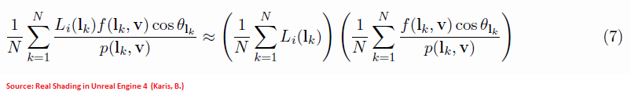

We often need to perform a numerical integration of a function $f(x)$.

It's really easy to lose oneself into technical terms and explanations about integration, Monte-Carlo integration, probability distribution functions (pdf), cumulative distribution functions (cdf), jacobians and that kind of stuff.
I, for one, am often completely at a loss whether I need to divide or not by the pdf, or account for weighting or not.


So let's be super clear, super fast!

We immediately state that all these methods are *equivalent*:

$$
\begin{align}
	&\int_a^b f(x) dx														\tag{1}\label{(1)}	\\\\
	&\approx \frac{b-a}{N} \sum_{i=1}^N f(a + \frac{ i-1 }{N} (b-a) )		\tag{2}\label{(2)}	\\\\
	&\approx \frac{b-a}{N} \sum_{i=1}^N f( X_i )							\tag{3}\label{(3)}	\\\\
	&\approx \frac{1}{N} \sum_{i=1}^N \frac{f( X_i' )}{pdf( X_i' )}			\tag{4}\label{(4)}	\\\\
	&\approx \frac{1}{N} \sum_{i=1}^N \frac{f( X_i'' )}{pdf( X_i'' )}		\tag{5}\label{(5)}	\\\\
\end{align}
$$


Where:

* Equation $\eqref{(1)}$ is the actual integration we wish to perform
* Equation $\eqref{(2)}$ is the approximation of the integral using uniform sampling
* Equation $\eqref{(3)}$ is the approximation of the integral using *basic* Monte-Carlo sampling
* Equation $\eqref{(4)}$ is the approximation of the integral using *general* Monte-Carlo sampling with weighting by the probability density function (pdf)
* Equation $\eqref{(5)}$ is the approximation of the integral using importance sampling (and yes, it's exactly the same as expression $\eqref{(4)}$)


**NOTE**: Be careful of the $X_i$, $X'_i$ and $X''_i$ that are random variables that each follow a different distribution, as will be explained below.


## Details for each Method

### 1) The actual integral

Sometimes, it's possible that your function $f(x)$ is simple or chosen explicitly so that its antiderivate can be determined analytically.

If that's the case then great! You don't need any of the other methods to estimate the integral!


Most of the time, though, $f(x)$ is either unknown (e.g. you only have a black box that returns an output value for any input value), ill-determined or complex (e.g. most BRDFs), subject to external constraints that you have no control over (e.g. lighting, environment, materials, etc.).

For all theses cases, you have no other choice than doing a **numerical integration**, that is sampling your function at various places over its domain and apply some magic. That's what the methods described below are for.

But don't forget that after all, you're only computing an integral and that importance sampling and other "advanced" methods designed for reducing errors/imprecision/noise/variance are only there to *optimize* the computation.
You don't need them if you don't like them.
You can use method from eq. $\eqref{(2)}$ everywhere and still be perfectly fine! (although you won't have the fastest integration in the Universe, nor the most precise).


### 2) Uniform Sampling

This technique is the simplest of all and it's also called the [Riemann sum](https://en.wikipedia.org/wiki/Riemann_sum).


This is the most basic way of performing the integration: you simply subdivide the integration domain into $N$ equal intervals, sample the function regularly along the interval and accumulate the area of each tiny rectangle along the way.

In the long run, with enough samples you get:

$$
\lim_{N \to \infty} \left( \sum_{i=1}^N f( x_i ) \Delta_x \right) = \int_a^b f(x) dx
$$

With $x_i = a + \frac{i-1}{N} (b - a)$ a regularly-spaced position in the domain $[a,b]$ and $\Delta_x = \frac{b-a}{N}$ the size of the base of the tiny rectangles.


**PROS**:

* Simple

**CONS**:

* Easy to miss tiny features if your interval is not fine enough, in which case you will need *lots* of samples $N$ to properly cover the domain


### 3) Basic Monte-Carlo

As very well explained in [^1], the idea of Monte-Carlo integration is to sample your function $f(x)$ randomly all over the integration domain, pray that you have the best possible samples, and average the result.


In the end, if you have enough samples, it can be proven that:

$$
\lim_{N \to \infty} \left( \frac{b-a}{N} \sum_{i=1}^N f( X_i ) \right) = \int_a^b f(x) dx
$$

With $X_i = a + \xi (b-a)$ a *uniformly distributed* random number in the range $[a,b]$ and $\xi$ a *uniformly distributed* random number in the range $[0,1]$ (the number that is commonly returned by any good random generation function available in most languages).


**PROS**:

* Still very simple

**CONS**:

* Still easy to miss tiny features if you're not using enough samples
* No clear advantage over Riemann


### 4) General Monte-Carlo

Still following the explanation in [^1], we can state that the basic Monte-Carlo integration is okay as long as the distribution of the random variable is uniform.

This was the case earlier where we chose $X_i = a + \xi (b-a)$ and the *probability distribution function* (pdf) for $X_i$ simply was $\frac{1}{b-a}$, meaning there is an equal chance to choose a sample anywhere in the integration domain.


Now, if we use another random variable $X'_i$ following an arbitrary distribution $pdf( X'_i )$ then the *general Monte-Carlo* integration is given by:

$$
\lim_{N \to \infty} \left( \frac{1}{N} \sum_{i=1}^N \frac{f( X'_i )}{pdf( X'_i )} \right) = \int_a^b f(x) dx
$$


So what does it bring us? Okay, it gives more weight to less probable samples so low-probability areas (i.e. with a low pdf) are properly accounted for in the integration; while high-probability areas (i.e. with a high pdf) have a not so important weight, as shown in the figure below.


Well, to be honest, it doesn't bring anything in the balance to accelerate or increase the quality of the integration. The only thing it does really, is *ensuring that whatever the distribution of random samples $X'_i$, 
they are all accounted for in the integral at their "just value" in order to avoid any bias*.

Basically, the division by the pdf simply tries to balance the samples so you end up with the *same scenario than if you had chosen a uniform distribution*.

So what's the point of doing that then?


**PROS**:

* Unbiased, whatever the pdf we may choose
* Scales very well to high dimensions

**CONS**:

* More difficult to understand
* Still not certain to cover all important features!
* pdf may not be readily available
* Very low-probability samples can have a very large weight, introducing noise (because of the division)
* Halving noise artefacts requires 4 times more samples


### 5) Importance Sampling

So all in all, what we've been doing until now is praying to pick the best random samples but that's not an effective way to choose random samples, is it?

That's where importance sampling comes into play: choose the best samples!
But this can only happen if we have an *idea* about the shape of the function we're integrating, *i.e.* if we know the shape of its pdf.

As elegantly put in [^2], Monte-Carlo integration is a stochastic process so even though we may know the pdf of a function, we cannot *choose* to place the samples where we deem it would be more interesting,
otherwise we would bias the sampling and we would get an incorrect value for the integral.

Instead, we still must draw random numbers from our uniform random numbers generator and *bend* the distribution to make it draw more samples in the places that are more important (i.e. where the pdf is higher).


As a matter of fact, bending a uniform distribution into any pdf is pretty easy by using the cumulative distribution function (cdf) which is given by this definition:

$$
\begin{align}
cdf( x ) &= \int_{-\infty}^{x} pdf( t ) dt	\\\\
cdf( x ) &= P( X \le x )	\qquad \text{Probability that} X \text{ is less than } x
\end{align}
$$

Also by definition, the cdf over the entire domain of the pdf sums to 1 (since the sum of the probabilities of all possibles events to happen over the entire domain must be 1):

$$cdf = \int_{-\infty}^{+\infty} pdf( t ) dt = 1$$


For example, the well-known GGX normal distribution function (which is in itself a probability distribution function) can be integrated into a CDF, as shown in the figure below:

!!! quote ""

	

	The CDF for GGX as a function of $\theta$ for a roughness value $\alpha = 0.7$


So we know the cdf of the distribution we want to match. Then what?

Then we **invert** the CDF so a uniform random number $\xi \in [0,1]$ gets mapped into the target value $\theta \in [0,\frac{\pi}{2}]$ with the distribution we're expecting.

!!! quote ""

	

	The amazingly well done inversion of the cdf using a rotation + a flip of the above figure! :grin:
	<br/>
	You enter a random number $\xi \in [0,1]$ and it returns the value for $\theta$ to use in the GGX equation...


This effectively gives us our random value $X''_i$ from eq. $\eqref{(5)}$ that will help us to *target* our samples to the areas where they will be the most useful.


Basically, the integral is the same as the general Monte-Carlo formulation in eq. $\eqref{(4)}$ because this **is** the general Monte-Carlo formulation,
except we used a *tailored pdf* to target a specific distribution that will bring more samples to the interesting areas:

$$
\lim_{N \to \infty} \left( \frac{1}{N} \sum_{i=1}^N \frac{f( X''_i )}{pdf( X''_i )} \right) = \int_a^b f(x) dx
$$


**PROS**:

* Sampling the domain is better covered, less risk of missing important features due to the use of the pdf instead of uniform probability

**CONS**:

* More difficult to understand
* Must have an idea about the shape of the pdf of the the function to integration


## Notes on Importance Sampling


### No need to be exact

An interesting and important take away point in choosing a pdf for importance sampling is that you don't *have to* choose the *exact* pdf of your function, you just need to use a *good enough match* as shown below:


### How to read BRDF integrals with pdf?

From eq. $\eqref{(5)}$ and the note above, we see that the division by the pdf implies that the pdf matches the shape of the function that we're integrating:

$$
pdf( X''_i ) \propto f( X''_i )
$$

(here the $\propto$ doesn't mean so much "proportional to" than "similar to")


It's especially true when dealing with BRDF's because we usually choose one of the terms of the BRDF, the Normal Distribution Function (NDF), as a good approximation for the pdf.

!!! note
	The NDF is itself a distribution that integrates to 1 over the domain of the upper hemisphere above our surface so it's perfect for the job, and that's certainly no coincidence: <!-- as we will see below in the chapter talking about how designing your own BRDF:-->
	
	$$
	\int_0^{2\pi} \int_0^{\frac{\pi}{2}} D( \theta ) \cos( \theta ) \sin( \theta ) d\theta d\phi = 1
	$$


What this means for us is that Monte-Carlo integration of our BRDF using one of the terms, $D$, of the BRDF as pdf will make the $D$ disappear.


Basically if your BRDF expression is something of the sort:

$$
f( \boldsymbol{ \omega_i }, \boldsymbol{ \omega_o } ) = D( \boldsymbol{ \omega_i }, \boldsymbol{ \omega_i } ) \cdot g( \boldsymbol{ \omega_i }, \boldsymbol{ \omega_o } )
$$

Where:

* $\boldsymbol{ \omega_i }$ is the unit incoming vector
* $\boldsymbol{ \omega_o }$ is the unit outgoing vector
* $f( \boldsymbol{ \omega_i }, \boldsymbol{ \omega_o } )$ is the BRDF
* $D( \boldsymbol{ \omega_i }, \boldsymbol{ \omega_i } )$ is normal distribution function
* $g( \boldsymbol{ \omega_i }, \boldsymbol{ \omega_i } )$ is the remaining expression of the BRDF (possibily involving shadowing/masking, Fresnel, etc.)


Then a Monte-Carlo integration using $D( \boldsymbol{ \omega_i }, \boldsymbol{ \omega_i } ) \cos( \boldsymbol{ \omega_i } \cdot \boldsymbol{ n } )$ as pdf will give:

$$
r = \frac{1}{N} \sum_{i=1}^N \frac{ f( \boldsymbol{ \omega_i }, \boldsymbol{ \omega_o } ) \cos( \boldsymbol{ \omega_i } \cdot \boldsymbol{ n } ) \cdot L( \boldsymbol{ \omega_i }, \boldsymbol{ \omega_o } ) }{ D( \boldsymbol{ \omega_i }, \boldsymbol{ \omega_i } ) \cos( \boldsymbol{ \omega_i } \cdot \boldsymbol{ n } ) } = 
\frac{1}{N} \sum_{i=1}^N g( \boldsymbol{ \omega_i }, \boldsymbol{ \omega_o } ) \cdot L( \boldsymbol{ \omega_i }, \boldsymbol{ \omega_o } )
$$

Here, $r$ is the result of the integration, $\boldsymbol{ n }$ is the surface normal and $L( \boldsymbol{ \omega_i }, \boldsymbol{ \omega_o } )$ is some additional term that gets involved in the integration and composed with the BRDF (e.g. lighting).

The result is that the NDF term $D( \boldsymbol{ \omega_i }, \boldsymbol{ \omega_i } ) \cos( \boldsymbol{ \omega_i } \cdot \boldsymbol{ n } )$ disappears altogether from the sum expression, but make no mistake, it's still there and what we're really computing is this:

$$
r = \int f( \boldsymbol{ \omega_i }, \boldsymbol{ \omega_o } ) \cos( \boldsymbol{ \omega_i } \cdot \boldsymbol{ n } ) \cdot L( \boldsymbol{ \omega_i }, \boldsymbol{ \omega_o } )
$$


Why am I mentioning this? Well, because I spent quite a lot of time wondering if the $D$ term should be included in the cube-map pre-integration step as described in [^4] eq. (7) because Karis's expression for the split-sum approximation
is quite confusing:



Here it really *seems* like the first term simply sums the incoming radiance without accounting for anything else, but where the roughness of the surface would be taken into account then?

Turns out the directions to use to sample the incoming light are biased with a cdf involving the BRDF's $D$ term as we said, and the actual expression that is evaluated really is this:

$$
\frac{1}{N} \sum_{k=1}^N \frac{ L_i( \boldsymbol{l}_k ) f( \boldsymbol{l}_k, \boldsymbol{v} ) \cos( \theta_{\boldsymbol{l}_k} ) }{ p( \boldsymbol{l}_k, \boldsymbol{v} ) }
\approx \left( \sum_{k=1}^N \frac{ L_i( \boldsymbol{l}_k ) p( \boldsymbol{l}_k, \boldsymbol{v} ) } { p( \boldsymbol{l}_k, \boldsymbol{v} ) } \right)
\left( \sum_{k=1}^N \frac{ f( \boldsymbol{l}_k, \boldsymbol{v} ) \cos( \theta_{\boldsymbol{l}_k} ) }{ p( \boldsymbol{l}_k, \boldsymbol{v} ) } \right)
$$

Here, $p( \boldsymbol{l}_k, \boldsymbol{v} )$ is the integration pdf as well as the normal distribution function that is used to weigh the cube map's incoming radiance.
Since it's both at the numerator and the denominator, it's understandable it was omitted but it's not immediately obvious and I think it's worth mentionning after all...


## Some Practical Examples

### A "good enough pdf"

I'm using another great excerpt from [^2] where they give a nice example of a "good enough pdf" to show that it's always better to use even an average match to the function you want to integrate, than to use a uniform sampling.


Here the function we wish to integrate is shown in red and is $f(x)=\sin(x)$. Its integral over $[0,\frac{\pi}{2}]$ simply yields 1.

Then we choose samples from 2 distributions:

* A uniform distribution ${pdf}_0(x) = \frac{1}{\frac{\pi}{2}} = \frac{2}{\pi}$ shown in green
* Another distribution ${pdf}_1(x) = \frac{8 x}{\pi^2}$ shown in blue that will attempt to match $f(x)$ a bit better


#### Uniform pdf

In the case of ${pdf}_0$ the cdf is simply ${cdf}_0(X_i) = \int_0^{X_i} {pdf}_0( x ) dx = \frac{2}{\pi} X_i$.

Now to invert the CDF we pose $\xi = {cdf}_0( X_i )$ then finding $X_i$ from $\xi$ is easy and is given by $X_i = \frac{\pi}{2} \xi$, with $\xi \in [0,1]$ a uniformly distributed random number.

And the Monte-Carlo sum will write:

$$
\int_0^\frac{\pi}{2} f(x) dx \approx \frac{1}{N} \sum_{i=1}^N \frac{ f( X_i ) }{ {pdf}_0( X_i ) } = \frac{\pi}{2 N} \sum_{i=1}^N \sin( X_i )
$$

#### Tailored pdf

In the case of ${pdf}_1$ the cdf is ${cdf}_1(X_i) = \int_0^{X_i} {pdf}_1( x ) dx = \frac{4}{\pi^2} X_i^2$.

Now to invert the CDF we pose $\xi = {cdf}_1( X_i )$ then finding $X_i$ from $\xi$ is easy and is given by $X_i = \frac{\pi}{2} \sqrt{ \xi }$, with $\xi \in [0,1]$ a uniformly distributed random number.

And the Monte-Carlo sum will write:

$$
\int_0^\frac{\pi}{2} f(x) dx \approx \frac{1}{N} \sum_{i=1}^N \frac{ f( X_i ) }{ {pdf}_1( X_i ) } = \frac{\pi^2}{8 N} \sum_{i=1}^N \frac{\sin( X_i )}{X_i}
$$

#### Results of the race

Now, for an equal amount of samples and the same random values $\xi$ used for both pdf's, here is the plot of the estimate of the integral:


It's easy to see that importance sampling has a lower variance (i.e. deviation from the target) than uniform sampling, even with this crude estimate of the pdf of $f(x)$!


### Importance Sampling for GGX

Another important example of integration is the rendering equation:

$$
L( \boldsymbol{\omega_o} ) = \int_{\Omega^+} L( \boldsymbol{\omega_i} ) f( \boldsymbol{\omega_i}, \boldsymbol{\omega_o} ) (\boldsymbol{\omega_i} \cdot \boldsymbol{n}) d\omega_i
$$

Where:

* $\Omega^+$ is the upper hemisphere domain
* $\boldsymbol{\omega_i}$ is the incoming light unit vector
* $\boldsymbol{\omega_o}$ is the outgoing view unit vector
* $\boldsymbol{n}$ is the surface normal
* $L( \boldsymbol{\omega_i} )$ is the incoming radiance
* $L( \boldsymbol{\omega_o} )$ is the outgoing radiance
* $f( \boldsymbol{\omega_i}, \boldsymbol{\omega_o} )$ is the surface's BRDF


We can approximate this integral once again by using Monte-Carlo integration:

$$
\int_{\Omega^+} L( \boldsymbol{\omega_i} ) f( \boldsymbol{\omega_i}, \boldsymbol{\omega_o} ) (\boldsymbol{\omega_i} \cdot \boldsymbol{n}) d\omega_i \approx \frac{1}{N} \sum_{k=1}^N \frac{ L( \boldsymbol{\omega_{i_k}} ) f( \boldsymbol{\omega_{i_k}}, \boldsymbol{\omega_o} ) (\boldsymbol{\omega_{i_k}} \cdot \boldsymbol{n}) }{ pdf( \boldsymbol{\omega_{i_k}}, \boldsymbol{\omega_o} )}
$$

Each sample's direction $\boldsymbol{\omega_{i_k}}$ should be chosen according to a pdf that matches the integrand as closely as possible.

We often don't have any control over the incoming radiance (for example, in the case of a distant environment by a cube map, we don't know what's in the pixels beforehand!) so there's not much to do on this front (unless we start importance/stratify sampling the environment map as done in [^8] or [^9]).

For the BRDF though, we could choose a pdf that resembles the overall shape of the function.


#### Using the Normal Distribution Function as pdf

In the case of the Cook-Torrance micro-facet model and the specific case where the normal distribution function (NDF) is the Trowbrdige-Reitz (GGX) distribution, the NDF is easily integrable and, by definition, integrates to 1 over the hemisphere
(like all NDF's should, for the obvious reason of energy conservation):

$$
\begin{align}
D_{GGX}( \theta, \alpha ) = \frac{\alpha^2}{\pi ( \cos^2(\theta) (\alpha^2-1) + 1 )^2}	&\\\\
\int_0^{2\pi} \int_0^{\frac{\pi}{2}} D_{GGX}( \theta, \alpha ) \cos( \theta ) \sin( \theta ) d\theta d\phi &= 1
\end{align}
$$

Here, we use the spherical coordinates $\theta$ and $\phi$ that express the direction of the unit vector $\boldsymbol{\omega_i}$ on the hemisphere.
The cartesian coordinates for $\boldsymbol{\omega_i}$ are given by:

$$
\boldsymbol{\omega_i} = 
\begin{cases}
x = \sin(\theta) \cos(\phi) \\\\
y = \sin(\theta) \sin(\phi) \\\\
z = \cos(\theta)
\end{cases}
$$


We can then very conveniently use that NDF, along with the cosine weight as the pdf for our integration:

$$
pdf_{GGX}( \theta, \phi ) = D_{GGX}( \theta, \alpha ) \cos( \theta )
$$

Slight problem though, we're integrating over a 2D domain!

Gasp!


#### Multiple dimensions

We're not going to delve too deep into probablity theory here but in the general case, the pdf we must use for the denominator of our Monte-Carlo integration is called the **Joint Density**.

For multiple variables it's written as:

$$
P( A, B, C, D )	\quad \text{or} \\\\
P( A \cap B \cap C \cap D )
$$

It's the probability that all conditions A, B, C **and** D are satisfied (operative word is *and*).

When the variables A, B, C and D are dependent on each other, the joint density is written as:

$$
P(  A, B, C, D ) = P( A | B, C, D ) \cdot P( B | C, D ) \cdot P( C | D ) \cdot P( D )
$$

Where $P( A | B, C, D )$ is called the **conditional probability** of A given B, C and D have occurred. Identically, $P( B | C, D )$ is the conditional probability of B given C and D have occurred, and so on. </br>
The remaining probability $P(D)$ is called the **marginal probability**.


So basically, in our 2D case of integration over the hemisphere, we can write that:

$$
\begin{align}
pdf( \theta, \phi ) &= pdf( \theta | \phi ) \cdot pdf( \phi )	\qquad \text{or}	\\
pdf( \theta, \phi ) &= pdf( \phi | \theta ) \cdot pdf( \theta )
\end{align}
$$

It means that the probability to have a sample in the direction given by $\phi$ *and* $\theta$ is the product of the probabilty $P(\phi)$ of having a sample along the angle $\phi$ times the probability $P(\theta | \phi)$
of having a sample along the direction $\theta$ *knowing* we already have a sample along the angle $\phi$.

Or the reverse, the product of the probabilty $P(\theta)$ of having a sample along the angle $\theta$ times the probability $P(\phi | \theta)$
of having a sample along the direction $\phi$ *knowing* we already have a sample along the angle $\theta$.

Both lead to the same joint probability and by the way, that's the base for the famous Bayes' theorem.


As we saw earlier, the cdf is given by:

$$
cdf( \bar{\theta}, \bar{\phi} ) = \int_0^{\bar{\phi}} \int_0^{\bar{\theta}} pdf( \theta, \phi ) \sin( \theta ) d\theta d\phi
$$

And so:

$$
\begin{align}
cdf( \bar{\theta}, \bar{\phi} ) &= \int_0^{\bar{\phi}} \int_0^{\bar{\theta}} pdf( \theta | \phi ) \cdot pdf( \phi ) \sin( \theta ) d\theta d\phi = \int_0^{\bar{\phi}} pdf( \phi ) \left[ \int_0^{\bar{\theta}} pdf( \theta | \phi )  \sin( \theta ) d\theta \right] d\phi	\qquad \text{or}	\\
cdf( \bar{\theta}, \bar{\phi} ) &= \int_0^{\bar{\phi}} \int_0^{\bar{\theta}} pdf( \phi | \theta ) \cdot pdf( \theta ) \sin( \theta ) d\theta d\phi = \int_0^{\bar{\theta}} pdf( \theta ) \left[ \int_0^{\bar{\phi}} pdf( \theta | \phi ) d\phi \right] \sin( \theta ) d\theta	\\
\end{align}
$$


Conducting the integration over the entire domain for *all* dimensions *but one* will yield the marginal probability:

$$
\begin{align}
P( \theta ) &= \int_0^{2\pi} pdf( \theta, \phi ) \sin( \theta ) d\phi	\qquad \text{or}	\\
P( \phi ) &= \int_0^{\frac{\pi}{2}} pdf( \theta, \phi ) \sin( \theta ) d\theta	\\
\end{align}
$$


#### Back to GGX

Let's rewrite the cdf using the GGX pdf we saw earlier:

$$
cdf( \bar{\theta}, \bar{\phi} ) = \int_0^{\bar{\phi}} \int_0^{\bar{\theta}} D_{GGX}( \theta, \alpha ) \cos( \theta ) \sin( \theta ) d\theta d\phi
$$


Conveniently enough, we only have a dependency on $\theta$ and, as explained in Tobias Alexander Franke's blog post [^3], we could simply choose to integrate of the entire $\phi \in [0,2\pi]$ domain to obtain the marginal probability distribution function $pdf(\theta)$:

$$
\begin{align}
pdf(\theta ) &= \int_0^{2\pi} {pdf}_{GGX}( \theta, \phi ) d\phi  \\\\
pdf(\theta ) &= \int_0^{2\pi} D_{GGX}( \theta, \alpha ) \cos( \theta ) d\phi  \\\\
pdf(\theta ) &= 2\pi \; D_{GGX}( \theta, \alpha ) \cos( \theta ) \\\\
pdf(\theta ) &= 2\pi \Bigl( {pdf}_{GGX}( \theta, \phi ) \Bigr) \\\\
\end{align}
$$

From what we saw earlier:

$$
\begin{align}
pdf( \theta, \phi ) &= pdf( \phi | \theta ) \cdot pdf( \theta )	\qquad \text{so}	\\\\
pdf( \phi | \theta ) &= \frac{pdf( \theta, \phi )}{pdf( \theta )}
\end{align}
$$

And we get:

$$
pdf( \phi | \theta ) = \frac{ {pdf}_{GGX}( \theta, \phi ) } { 2\pi \Bigl( {pdf}_{GGX}( \theta, \phi ) \Bigr) } = \frac{1}{2\pi}
$$


##### Finding the cdf

Now that we know the expressions for $pdf( \theta )$ and $pdf( \phi | \theta )$, we can integrate these expressions to get the cumulative distribution functions for both of them:

$$
\begin{align}
cdf( \bar{\theta} ) &= 2\pi \int_0^{\bar{\theta}} D_{GGX}( \theta, \alpha ) \cos( \theta ) \sin( \theta ) d\theta \\
cdf( \bar{\theta} ) &= \frac{ 1 - \cos^2( \bar{\theta} ) } { (\alpha^2 - 1) \cos^2( \bar{\theta} ) + 1 }
\end{align}
$$

And:

$$
\begin{align}
cdf( \bar{\phi} | \bar{\theta} ) &= \int_0^{\bar{\phi}} \frac{1}{2\pi} d\phi \\
cdf( \bar{\phi} | \bar{\theta} ) &= \frac{\bar{\phi}}{2\pi}
\end{align}
$$


##### Inverting the cdf

If we pose that $\{ cdf( \bar{\theta} ), cdf( \bar{\phi} | \bar{\theta} ) \} = \{ \xi_0, \xi_1 \}$ where $\{ \xi_0, \xi_1 \} \in [0,1]$ is a set of 2 uniformly-distributed random variables
then it's simple enough to solve the expressions and find values for $\bar{\phi}$ and $\bar{\theta}$:

$$
\begin{align}
\bar{\theta} &= \sqrt{ \frac{ 1 - \xi_0 } { \xi_0 (\alpha^2 - 1) + 1 } }		\qquad and\\
\bar{\phi} &= 2\pi \xi_1
\end{align}
$$


<!--

 J( \theta_h, \theta_i )
Where $\theta_h$ is the angle between the normal and the half vector and $J( \theta_h, \theta_i )$ the Jacobian that gives the footprint of passing from the half-angle space to the incoming angle space...

Wait a minute! What the hell is this damn Jacombian doing here? (and what the hell is a Jacobian anyway?)


##### The Jacobian Menace

-->


#### Result

Here is a comparison of 2 renderings from [^10], both using 64 samples per pixel. The top row shows standard uniform sampling while the bottom row uses importance sampling.


## Additional Discussions

### Why is Monte-Carlo working?

It's often refered as a neat little trick, and indeed Monte-Carlo integration resides in exploiting the definition of the [Expected Value](https://en.wikipedia.org/wiki/Expected_value) in the continuous case:

$$
\hat{G} = E[g(x)] = \int_{\mathbb{R}} p(x) g(x) dx		\qquad \tag{6}\label{(6)}
$$

Remember that the Expected Value is actually the mean value of a continuous function defined over $\mathbb{R}$, the integral simply means we're going to sum the function $g(x)$ weighted by the probability density fuction $p(x)$ at each location.
The result will simply be the *average value $\hat{G}$ of the function* $g(x)$.


Writing the expected value of the Monte-Carlo summation gives us:

$$
\begin{align}
E\left[ \frac{1}{N} \sum_{i=1}^N \frac{f( X_i )}{p( X_i )} \right] &= \frac{1}{N} \sum_{i=1}^N E\left[ \frac{f( X_i )}{p( X_i )} \right]	\\
&= \frac{1}{N} \sum_{i=1}^N \int_{\Omega} \frac{f(x)}{p(x)} p(x) dx \\
&= \frac{1}{N} \sum_{i=1}^N \int_{\Omega} f(x) dx \\
&= \int_{\Omega} f(x) dx \\
\end{align}
$$

So by posing $g(x) = \frac{f(x)}{p(x)}$ and operating a substitution of $\eqref{(6)}$ into the 1st line, we end up with the result we're looking for: the proper integral of $f(x)$.


### Stratified Sampling & Low-Discrepancy Sequences

With importance sampling, we saw that we could bend a uniform distribution into any other pdf of our choice, preferably one that looks like the function we're integrating.

But it doesn't guarantee in any way that our random samples will be nicely layed out: even if our random number generator follows a uniform distribution, there's nothing preventing it from e.g. generating a million times the same number.
Such bias would be sooner or later corrected as to make the distribution uniform again, but random means random and however improbable, this scenario *could* theoretically happen.

Everyone who played a bit with the traditional C function **rand()** could witness first hand that the values it generated were far from well layed out in the domain.
In the figure below showing a 2D example, we see the points tend to be clumped together and don't really cover the plane very well:


So we'd like a better coverage of the plane but without introducing bias in the distribution that must remain uniform.


#### Stratified Sampling

The simplest solution is to use [stratified sampling](https://en.wikipedia.org/wiki/Stratified_sampling):
subdivide your N-dimensional uniform domain into uniform pieces, and use the random number to jitter a position within each sub-domain:

!!! quote ""

	

	Image from [http://www.pbr-book.org Chapter 7.3](http://www.pbr-book.org/3ed-2018/Sampling_and_Reconstruction/Stratified_Sampling.html)


#### Low-Discrepancy Sequences

It's clear in the figure above demonstrating stratified sampling that unfortunately, it doesn't prevent points clustering even though it strongyly reduces their occurrences.

Instead, we could use alternatives to the uniform sampling represented in figure 7.18 (b) above that would be less regular. These are called low-discrepancy sequences of points (the discrepancy is the gap between 2 sequential points).

The most well-known sequence types are:

* [van der Corput](https://en.wikipedia.org/wiki/Van_der_Corput_sequence)

	

* [Halton Sequence](https://en.wikipedia.org/wiki/Halton_sequence)

	

* [Hammersley Set](https://en.wikipedia.org/wiki/Low-discrepancy_sequence#Hammersley_set)

	

* [Sobol Sequence](https://en.wikipedia.org/wiki/Sobol_sequence)

	

* [Golden Ratio Sequence](http://extremelearning.com.au/a-simple-method-to-construct-isotropic-quasirandom-blue-noise-point-sequences/)

	

* [Weyl Sequence](https://en.wikipedia.org/wiki/Weyl_sequence)

	

	Also available as a ShaderToy [here](https://www.shadertoy.com/view/4dtBWH)


Each are more or less difficult to construct and have their own sets of advantages and inconvenients.

You can check various ways of constructing such sequences by reading the excellent posts [^6], [^7] and the wikipedia page [here](https://en.wikipedia.org/wiki/Low-discrepancy_sequence#Construction_of_low-discrepancy_sequences).


### Multiple Importance Sampling

We saw earlier how choosing the appropriate pdf could improve the quality of the integration, but we based our choice of pdf solely on the normal distribution function part of the BRDF.
Unfortunately, when integrating luminance it's not only the BRDF but also the incoming light that exhibits high frequencies or discontinuous areas that are difficult to sample (this is called *variance*, when dealing with probabilities).

For example, imagine there is a single tiny spot emitting light in the surroundings of the point we're computing the lighting for. Then we can affirm that it would be really wasteful to generate sampling directions that do not point exactly toward that spot.

#### Using a single sampling strategy

That's the situation depicted in the following image where a single strategy is used each time to sample either the BRDF or the light source, resulting in various noisy artefacts depending on whether the light source is tiny, or the roughness of the surface is low (only 4 samples per pixel are used in this image).


We can see that there is noise (i.e. *high variance*) whenever:

* We sample following the pdf given by the BRDF and the roughness is high
	* There's very low probability to choose a direction that can hit a very small light source
	* This case is illustrated by the noise in the bottom-left corner of image (a) above
* We sample following the pdf given by the light source and the roughness is low
	* There's very low probability to choose a direction that is aligned with the direction of principal reflection of the BRDF
	* This case is illustrated by the noise in the top-right corner of image (b) above


In a general manner, when the quantity to integrate is complex and the variance can come from several sources (e.g. BRDF *and* lighting), it would be interesting to have a strategy to **combine** the pdf's of the various sources into a single pdf that would be
 good enough to accomodate all the sources.

That's where **Multiple Importance Sampling (MIS)** comes into play.


#### Using multiple sampling strategies

We can imagine lots of ways to combine pdf's like multiplying them together, adding them, having a weighted sum, combining them through various functions, etc. as long as the resulting pdf remains *unbiased*.

This has been well studied by Veach in his 1997 thesis [^5] that is often quoted as reference.

The idea is to choose samples according to different strategies $i$ (e.g. BRDF or light source are 2 strategies in our previous example) and assigning weights $w_i( x )$ for each strategy:

$$
\hat{F} = \sum_{i=1}^{n} \sum_{j=1}^{n_i} w_i( X_{i,j} ) \frac{ f( X_{i,j} ) }{ n_i \, p( X_{i,j} ) }
$$

In this expression:

* $n$ is the number of strategies
* $n_i$ is the number of *samples* used for the strategy #$i$
* $w_i(x)$ is the weight to give to the sample (note that the weights must all sum to one $\sum_{i=1}^n w_i( x ) = 1$ for all $f(x) \neq 0$)


#### Optimal combination heuristic

Veach showed that a particularly simple heuristic, the **power heuristic** was an optimal choice:

$$
w_i( x ) = \frac{ \left( n_i \,  p_i(x) \right)^{\beta} }{ \sum_{k=1}^{n} \left( n_k \, p_k(x) \right)^{\beta} }
$$

Where $\beta$ is an arbitrary constant.
Note that the particular case of the power heuristic for $\beta = 1$ is called the **balanced heuristic**.


We can take this combination as a weighted sum of the probabilities of each sample, seen from the point of view of all the different strategies.

For example, when dealing with the 2 strategies of sampling the BRDF *or* the light, each sampling direction has a given probability in the eye of each strategy:

* Imagine a sampling direction exactly in the principal reflection direction of the BRDF $X_{brdf}$ that will have a strong probability $p_{brdf}( X_{brdf} )$ in the eye of the BRDF; but if there's no light in that particular direction then the same sample will have a low probability $p_{light}( X_{brdf} )$ in the eye of the light.
* Reciprocally, a sampling direction exactly in the direction of a light $X_{light}$ that will have a strong probability $p_{light}( X_{light} )$ in the eye of the light; but if the BRDF is very low in that particular direction then the same sample will have a low probability $p_{brdf}( X_{light} )$ in the eye of the BRDF

Nevertheless, assuming the number of samples $n_{brdf} = n_{light}$ and the probabilities are approximately equal (*i.e.* $p_{brdf}( X_{brdf} ) \approx p_{light}( X_{light} )$ and $p_{brdf}( X_{light} ) \approx p_{light}( X_{brdf} )$), then we should obtain approximately the same weights when using the heuristic:

$$
\begin{align}
w_{brdf}( X_{brdf} ) &= \frac{ \left( n_{brdf} \, p_{brdf}(X_{brdf}) \right)^{\beta} }{ \left( n_{brdf} \, p_{brdf}(X_{brdf}) \right)^{\beta} + \left( n_{light} \, p_{light}(X_{brdf}) \right)^{\beta} }	\\
w_{light}( X_{light} ) &= \frac{ \left( n_{light} \, p_{light}(X_{light}) \right)^{\beta} }{ \left( n_{brdf} \, p_{brdf}(X_{light}) \right)^{\beta} + \left( n_{light} \, p_{light}(X_{light}) \right)^{\beta} }	\qquad \text{and}\\\\
w_{brdf}( X_{brdf} ) &\approx w_{light}( X_{light} )
\end{align}
$$


Below we can see the improvement of using the various heuristics to evaluate the samples (still using 4 samples per pixel):


The image below shows an illustration of the weights given to each sampling strategy. Red means sampling the BRDF and green means sampling the light.


#### Pseudo-Code

Below is a pseudo-code for implementing MIS:

???+ "Multiple Importance Sampling Pseudo-Code"
	``` C++

	// We show how to use importance sampling for 3 sampling strategies and a constant power beta=2
	// We use 1 sample per strategy (so n_i = 1 and doesn't show in the pdf)
	//
	// Note that the code simplifies a lot when using the balanced heuristic with BETA = 1
	//
	const float	BETA = 2.0

	result = 0
	for ( sampleIndex in [1,N] ) {

		////////////////////////////////////////////////////////////////
		// Take a sample using strategy #1
		X = GetSample( p1[sampleIndex] )
		pdf1 = p1[sampleIndex]	// Also = p1[X]

		// Estimate the pdf of the sample for all the other strategies
		pdf2 = p2[X]
		pdf3 = p3[X]

		// Combine the pdf's
		combinedPDF = pow( pdf1, BETA ) + pow( pdf2, BETA ) + pow( pdf3, BETA )
		result += pow( pdf1, BETA ) * f( X ) / (combinedPDF * pdf1)


		////////////////////////////////////////////////////////////////
		// Take a sample using strategy #2
		X = GetSample( p2[sampleIndex] )
		pdf2 = p2[sampleIndex]	// Also = p2[X]

		// Estimate the pdf of the sample for all the other strategies
		pdf1 = p1[X]
		pdf3 = p3[X]

		// Combine the pdf's
		combinedPDF = pow( pdf1, BETA ) + pow( pdf2, BETA ) + pow( pdf3, BETA )
		result += pow( pdf2, BETA ) * f( X ) / (combinedPDF * pdf2)


		////////////////////////////////////////////////////////////////
		// Take a sample using strategy #3
		X = GetSample( p3[sampleIndex] )
		pdf3 = p3[sampleIndex]	// Also = p3[X]

		// Estimate the pdf of the sample for all the other strategies
		pdf1 = p1[X]
		pdf2 = p2[X]

		// Combine the pdf's
		combinedPDF = pow( pdf1, BETA ) + pow( pdf2, BETA ) + pow( pdf3, BETA )
		result += pow( pdf3, BETA ) * f( X ) / (combinedPDF * pdf3)
	}

	return result / (3*N);	// The constant 3 comes from the fact we're using 3 strategies here 

	```

<!--

### Creating your own BRDF

On a vu que les BRDF sont essentiellement basées sur une distribution des normales qui doit fondamentalement s'intégrer à 1 sur tout le domaine de définition (l'hémisphère supérieur)


On pose $t = cos^2\left(\theta\right)$ du coup: $dt = -2.sin\left(\theta\right).cos\left(\theta\right)$

ca permet de voir qu'on a le cos²(theta) gratos lors de l'intégration puisque sin(theta) cos(theta) sont forcément dans l'intégrale en sphérique...


@TODO: When to know if the pdf is included in the integration?

 ==> On utilise généralement la NDF comme pdf d'intégration, donc si on divise par cette pdf, ça veut dire que la NDF est au numérateur aussi et qu'elle fait donc partie de l'intégrande!


Parler du Jacobien, Walter 07.
http://www.stat.rice.edu/~dobelman/notes_papers/math/Jacobian.pdf


Quand on importance sample la direction de H, la réflexion de V ou L renvoie souvent sous l'hémisphère et donc le rayon est inutile et on doit le discarder
 ==> Ne peut-on pas bias l'importance sampling de manière à ne générer que des rayons sur l'hémisphère positif, mais avec la même distribution??


### Metropolis Hastings

<blockquote class="twitter-tweet" data-lang="en"><p lang="en" dir="ltr">Metropolis-Hasting is a surprisingly simple way to sample from a density known only up to a constant. Defines a Markov chains whose stationary distribution is the target one. <a href="https://t.co/bUuHRASizo">https://t.co/bUuHRASizo</a> <a href="https://t.co/OnhhQ5X10l">pic.twitter.com/OnhhQ5X10l</a></p>&mdash; Gabriel Peyré (@gabrielpeyre) <a href="https://twitter.com/gabrielpeyre/status/977819766290309120?ref_src=twsrc%5Etfw">March 25, 2018</a></blockquote>
<script async src="https://platform.twitter.com/widgets.js" charset="utf-8"></script>

[wikipedia](https://en.wikipedia.org/wiki/Metropolis%E2%80%93Hastings_algorithm)


 -->


## Conclusion

I hope this post is useful and not too redundant with the many posts about importance sampling that can be found across the web; I really tried to gather (hopefully) clear and digest information from all around in an attempt at clarifying what I find to be difficult concepts.

Personally, the *epiphany* came to me when I understood the fact that we only need *good enough* pdf's to improve the quality of Monte-Carlo integration, that's why I insisted quite a bit about that.


Unfortunately, I'm one of those guys that "get things quickly but need a ***lot*** of explaining", and probabilities and importance sampling have always been a real struggle for me.
Moreover, I have a tendency to forget things very easily and very quickly so these blog posts are not so much made to advertise stuff at the face of the world,
as they're a good way for me to remember information in my own words so I don't have to struggle as much the next time... :sweat_smile:

I hope this post will serve its purpose (as usual, it's much too long :expressionless:).


## References

[^1]: Scratch a pixel ["Monte Carlo Integration"](https://www.scratchapixel.com/lessons/mathematics-physics-for-computer-graphics/monte-carlo-methods-in-practice/monte-carlo-integration)
[^2]: Scratch a pixel ["Importance Sampling"](https://www.scratchapixel.com/lessons/mathematics-physics-for-computer-graphics/monte-carlo-methods-in-practice/variance-reduction-methods)
[^3]: 2014 Franke, T. A. ["Notes on Importance Sampling"](https://www.tobias-franke.eu/log/2014/03/30/notes_on_importance_sampling.html)
[^4]: 2013 Karis, B. ["Real Shading in Unreal Engine 4"](https://blog.selfshadow.com/publications/s2013-shading-course/karis/s2013_pbs_epic_notes_v2.pdf)
[^5]: 1997 Veach, E. ["Robust Monte Carlo Methods for Light Transport Simulation, Chapter 9"](https://graphics.stanford.edu/courses/cs348b-03/papers/veach-chapter9.pdf)
[^6]: 2018 Roberts, M. ["The Unreasonable Effectiveness of Quasirandom Sequences"](http://extremelearning.com.au/unreasonable-effectiveness-of-quasirandom-sequences/)
[^7]: 2018 Roberts, M. ["A simple method to construct isotropic quasirandom blue noise point sequences"](http://extremelearning.com.au/a-simple-method-to-construct-isotropic-quasirandom-blue-noise-point-sequences/)
[^8]: 2004 Mei, X. Jaeger, M. Hu, B. ["An Effective Stratified Sampling Scheme for Environment Maps with Median Cut Method"](http://www.cs.albany.edu/~xmei/resource/pdf/sampling.pdf)
[^9]: 2014 Agarwal, S. Ramamoorthi, R. Belongie, S. Jensen, H. W. ["Structured Importance Sampling of Environment Maps"](https://vision.cornell.edu/se3/wp-content/uploads/2014/09/54_structured.pdf)
[^10]: 2015 Jiayin, C. ["Sampling microfacet BRDF](https://agraphicsguy.wordpress.com/2015/11/01/sampling-microfacet-brdf/)
