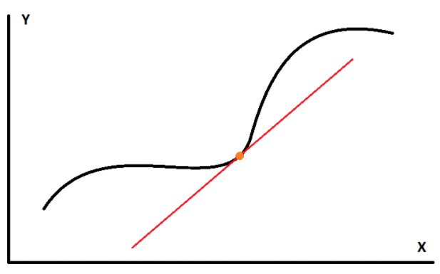
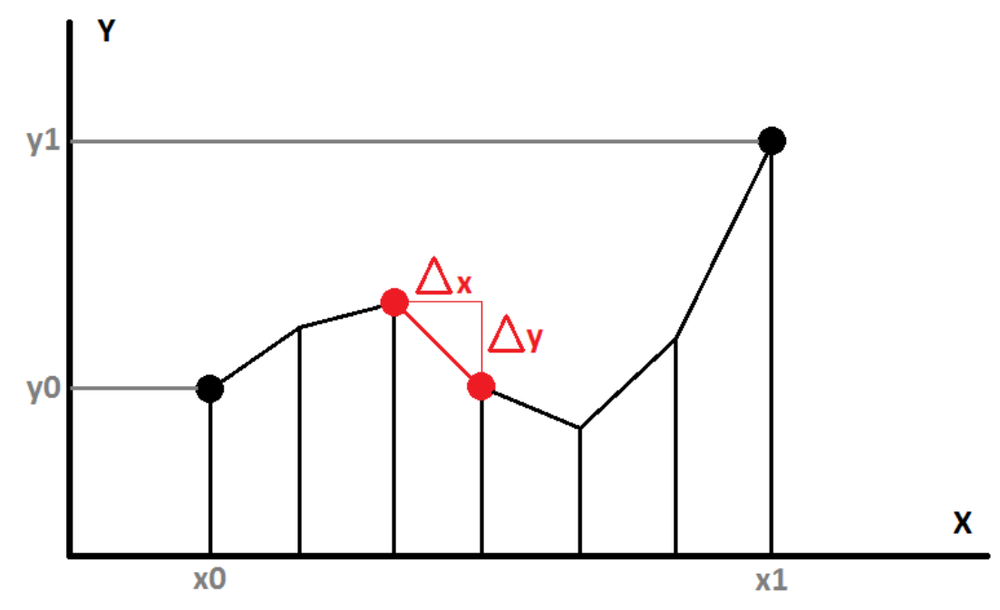


If you took calculus class at some point in your life, you must have learned the following fact:

$$
\int_a^b f(x) dx = F(x)\Big|_a^b = F(b) - F(a)
$$

It means that the result of the integration of $f(x)$ along the interval $[a,b]$ is equal to the indefinite integral of $f(x)$, written as $F(x)$, evaluated at the boundaries of the interval $a$ and $b$.

I always found quite fascinating that an integral, which basically consists in summing infinitely many tiny areas of infinitesimal width $dx$ (and thus computing the total area under the curve given by $f(x)$),
 essentially reduces to **just subtracting 2 values of some other function $F(x)$**.

Well, the explanation for that is in fact very very simple (as is often the case in math if you work with it long enough).

Imagine you rewrite the above integral this way, which is totally equivalent but will better serve our purpose:

$$
 \int_a^b f'(x) dx = f(x)\Big|_a^b = f(b) - f(a)
$$

Notice the prime in $f'(x)$ within the integral, that’s the key part. 
We were taught that $f'(x)$ is called the *derivative* of a function $f(x)$ and that it is the **slope** of the function $f(x)$ at any point $x$. 
The slope is basically the rate of climbing of the straight line passing through $f(x)$ and **tangent** to the curve at $x$, as seen on the figure below:

## Walking the path

Now imagine the scenario where you are asked to follow a path, but there’s a trick:

* You start from a point at horizontal coordinate $x_0$ and altitude $y_0$
* At every single point along the path, you are **only given the slope of the path** to guide your steps (so you can only walk by following the slope of the path)
* You stop when you reach the horizontal coordinate $x_1$
* You will then be standing at altitude $y_1$

 

So in order to follow the path as truly as possible, you will repeat the following algorithm:

* Interrogate the slope at the coordinate $x$ where you’re currently standing
* March horizontally by a very small step we will call $\Delta x$
* Climb by a tiny altitude $\Delta y = \Delta x * slope$
* Repeat until you reach $x_1$

The algorithm is represented by the figure below:

### Using discrete steps

At this point, we can then agree to write this algorithm in a recursive fashion:

$$
y_{i+1} = y_i + \Delta x. f'\left(x_i\right)
$$

Or, assuming we chose $\Delta x = \frac{x_1 - x_0}{N}$, using the discrete sum notation:

$$
y_1 = y_0 + \sum_{i=0}^{N-1} \Delta x. f'\left( x_0 + i.\Delta x \right)
$$

### Using infinitesimal steps

Now you must also agree that if we reduced the $\Delta x$ step to the infinitesimally small step $dx$ by making $N \to \infty$, we could then transform the discrete sum into a continuous integral:

$$
\begin{align}
y_1 &= y_0 + \int_{x_0}^{x_1} f'(x) dx \quad  \text{or} \\\\
y_1 - y_0 &= \int_{x_0}^{x_1} f'(x) dx
\end{align}
$$

So this expression simply tells us that summing the slope $f'(x)$ at every location between $x_0$ and $x_1$ will take us from start altitude $y_0$ to end altitude $y_1$ and we will have followed the path exactly!

And thus, since by definition the indefinite integral $\int f'(x) dx = f(x)$ we get:

$$
y_1 - y_0 = f(x_1) - f(x_0)
$$

## Conclusion

And that’s the gist of integration:

<strong>
Walking an unknown path using a known function that only gives us the slope of the path.
</strong>

 

!!! remark
    A good real-world analogy I suppose would be to consider $f'(x)$ as being a GPS giving you lots of directions to go from point A to point B, while $f(x)$ would be the *full map* that you simply need to read to know where A and B are.

