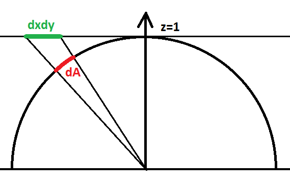
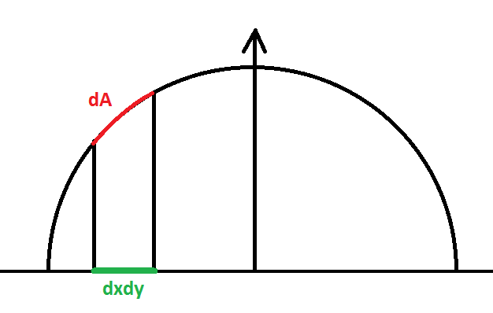
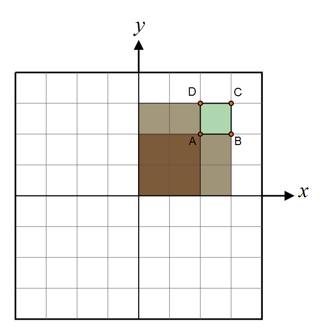
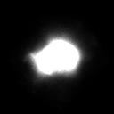
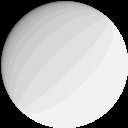

Hi!

Maybe you already bumped into the problem of projecting a cubemap into spherical harmonics and found this page to help you out: [http://www.rorydriscoll.com/2012/01/15/cubemap-texel-solid-angle/](http://www.rorydriscoll.com/2012/01/15/cubemap-texel-solid-angle/) ?




But maybe you need the solution to another, similar problem that consists in finding the solid angle of a pixel lying in the z=0 plane and orthogonally projected onto the hemisphere, but couldn't find a page with that computation?




Well let me help you with that! :smile:


First of all, the document that was used initially to do the computations -- whether it be in AMD's cube map generator, Rory Driscoll's summary or this page -- is the very interesting [thesis by Manne Öhrström](http://citeseerx.ist.psu.edu/viewdoc/download?doi=10.1.1.5.9464&rep=rep1&type=pdf).


## Cubemap Projection Configuration ##

The configuration for a cube map is that pixels are lying on a plane z=1 such as $\mathbf{p'}=(x,y,1), -1<x<1, -1<y<1$ and we project back onto the unit hemisphere by normalizing the vector $\mathbf{p}=\frac{\mathbf{p'}}{|\mathbf{p'}|}=\frac{(x,y,1)}{\sqrt{1+x^2+y^2}}$ as shown on figure 1 above.

The idea is to compute the area of a small element of surface on the hemisphere as we make it vary on the plane, we do that by computing the partial derivatives of $\mathbf{p}$ along x and y that give us the vectors $\frac{\partial \mathbf{p}}{\partial x}$ and $\frac{\partial \mathbf{p}}{\partial y}$.

It is well-known to graphics programmers that computing the cross product of these vectors gives us the normal to the sphere at position $\mathbf{p}$, and the length of that normal is the tiny area element $dA$ on the hemisphere.

Integrating this operation (cross product and norm computation) over an interval $[a,b]\in\mathbb{R}^2$ yields:

$$
\begin{align}
A(x,y)	&= \int_0^y \int_0^x \left | \frac{\partial \mathbf{p}}{\partial x} \times \frac{\partial \mathbf{p}}{\partial y} \right | \, da \, db \\\\
		&= \int_0^y \int_0^x \left (1+a^2+b^2 \right )^{-\frac{3}{2}} \, da \, db \\\\
		&= \left | atan( \frac{xy}{\sqrt{1+x^2+y^2}} ) \right | \quad \quad \quad (1)
\end{align}
$$


It's easy to notice that $A(1,1) = \frac{\pi}{6}$ which is the solid angle covered by a quarter of our cube map face, the solid angle of an entire face would be $\frac{2\pi}{3}$ and all 6 faces of the cube map are then covering a proper solid angle of $4\pi$ and all is well!


Now, for our little problem...


## Our Projection Configuration ##

Our configuration is a little bit different as our points $\mathbf{p'}(x,y) = (x,y,0)$ and we project onto the hemisphere to obtain $\mathbf{p}(x,y) = (x,y,\sqrt{1-x^2-y^2})$.

The partial derivatives along x and y give:

$\frac{\partial \mathbf{p}}{\partial x} = \begin{pmatrix} 1 \\ 0 \\ -\frac{x}{\sqrt{1-x^2-y^2}} \end{pmatrix}$

$\frac{\partial \mathbf{p}}{\partial y} = \begin{pmatrix} 0 \\ 1 \\ -\frac{y}{\sqrt{1-x^2-y^2}} \end{pmatrix}$


The cross product of these 2 vectors gives:

$\frac{\partial \mathbf{p}}{\partial x} \times \frac{\partial \mathbf{p}}{\partial y} = \frac{1}{\sqrt{1-x^2-y^2}} \begin{pmatrix} x \\ y \\ \sqrt{1-x^2-y^2} \end{pmatrix}$


And the norm is:

$\left | \frac{\partial \mathbf{p}}{\partial x} \times \frac{\partial \mathbf{p}}{\partial y} \right | = \frac{1}{\sqrt{1-x^2-y^2}}$


Which looks kinda nice! Integrating where it is definite (i.e. with x and y in the unit circle) $\int_0^1\int_0^1 \frac{1}{\sqrt{1-x^2-y^2}} dx \, dy = \frac{\pi}{2}$ which is a quarter of the entire hemisphere's solid angle $2\pi$, so we're good!

Except the primitive of this expression is a bit of nightmare after all, but this is our final result:

$$
\begin{align}
 A(x,y) &= \int_0^y \int_0^x \frac{1}{\sqrt{1-a^2-b^2}} da \, db \\\\
        &= y \cdot \tan ^{-1}\left(\frac{x}{\sqrt{1-x^2-y^2}}\right) + x \cdot \tan ^{-1}\left(\frac{y}{\sqrt{1-x^2-y^2}}\right) \\\\
		&+ \frac{1}{2} \left(\tan ^{-1}\left(\frac{1-x-y^2}{y \sqrt{1-x^2-y^2}}\right)-\tan ^{-1}\left(\frac{1+x-y^2}{y \sqrt{1-x^2-y^2}}\right)\right)	\tag{2}\label{(2)}
\end{align}
$$

I tried to further out the simplification of the last 2 atan terms since a difference of atan gives a single atan but it turns out it shows some precision issues.


## How to use this? ##

As explained by Driscoll, we compute the area of a single pixel by doing the exact same operation as with Summed Area Tables, that is we compute 4 values for the area of 4 sections like shown here:



Then we get:
$dA(x,y) = C + A - D - B$


!!! note
    * Obviously, you have to be very careful not to use eq. (2) outside of its region of definition $x^2+y^2 < 1$
    
    * Trying to compute the hemisphere's area using eq. (2) turns out to be converging '''super slowly''': even with a quarter disc split into 10000x10000 pixels, I can only reach 1.5535995614989679...


Here is the C# code to compute the solid angle of a pixel of coordinates (X, Y) in an image of size (Width, Height):

``` C++

	double	ComputeSolidAngle( uint _X, uint _Y, uint _width, uint _height ) {
		double	x0 = 2.0 * _X / _width - 1.0;
		double	y0 = 2.0 * _Y / _height - 1.0;
		double	x1 = 2.0 * (_X+1) / _width - 1.0;
		double	y1 = 2.0 * (_Y+1) / _height - 1.0;

		double	A0, A1, A2, A3;
		if ( !ComputeArea( x0, y0, out A0 ) )
			return 0.0;
		if ( !ComputeArea( x1, y0, out A1 ) )
			return 0.0;
		if ( !ComputeArea( x0, y1, out A2 ) )
			return 0.0;
		if ( !ComputeArea( x1, y1, out A3 ) )
			return 0.0;

		double	dA = A3 - A1 - A2 + A0;
		return Math.Max( 0.0, dA );
	}

	// y ArcTan[x/Sqrt[1 - x^2 - y^2]] + x ArcTan[y/Sqrt[1 - x^2 - y^2]] + 1/2 (ArcTan[(1 - x - y^2)/(y Sqrt[1 - x^2 - y^2])] - ArcTan[(1 + x - y^2)/(y Sqrt[1 - x^2 - y^2])])
	bool	ComputeArea( double x, double y, out double _area ) {
		double	sqRadius = x*x  + y*y;
		if ( sqRadius > 1.0 ) {
			// Outside unit circle
			_area = 0.0;
			return false;
		}

		double	rcpCosTheta = 1.0 / Math.Sqrt( 1.0 - sqRadius );
		if ( double.IsInfinity( rcpCosTheta ) ) {
			if ( x == 0.0 ) x = 1e-12;
			if ( y == 0.0 ) y = 1e-12;
		}
		_area = y * Math.Atan( x * rcpCosTheta ) + x * Math.Atan( y * rcpCosTheta )
			+ 0.5 * (Math.Atan( (1 - x - y*y) * rcpCosTheta / y ) - Math.Atan( (1 + x - y*y) * rcpCosTheta / y ));

		return true;
	}
``` 


## Example ##

Say you have the normalized expression of a Normal Distribution Function D(x,y) defined in an image of the flattened hemisphere:




And you want to compute the shadowing/masking term as given by Dupuy et al in ["Extracting Microfacet-based BRDF Parameters from Arbitrary Materials with Power Iterations"](https://www.semanticscholar.org/paper/Extracting-Microfacet%E2%80%90based-BRDF-Parameters-from-Dupuy-Heitz/d82ed38d9085c3d8b3d9fff6dd21c72355e2d70c) eq. 3:

$G(\mathbf{k}) = \frac{cos \theta_k}{\int_{\Omega_+}{\mathbf{k}\mathbf{h} \, D(\mathbf{h}}) \, d\omega_h}$


All you have to do is to write a convolution for each pixel of the image with a code similar to this:

``` C++
 // Perform an integration with the NDF weighted by the cosine of the angle with that particular direction
 float3 k = given;
 float3 h;
 float  convolution = 0.0;
 for ( uint Y=0; Y < Height; Y++ ) {
   h.y = 2.0f * Y / Height - 1.0f;
   for ( uint X=0; X < Width; X++ ) {
     h.x = 2.0f * X / Width - 1.0f;
     float  sqSinTheta = h.x*h.x + h.y*h.y;
     if ( sqSinTheta >= 1.0f )
       continue;
     
     h.z = sqrt( 1.0f - sqSinTheta );
     
     float  k_o_h = k.Dot( h );         // k.h
     float  D = NDF[X,Y].x;             // D(h)
     float  dW = ComputeArea( X, Y );   // dW
     
     convolution += k_o_h * D * dW;
   }
 }
 float	G = k.z / convolution;
``` 

This yields the G term as an image that I'm showing here with a strong contrast applied, otherwise it's mostly white:


