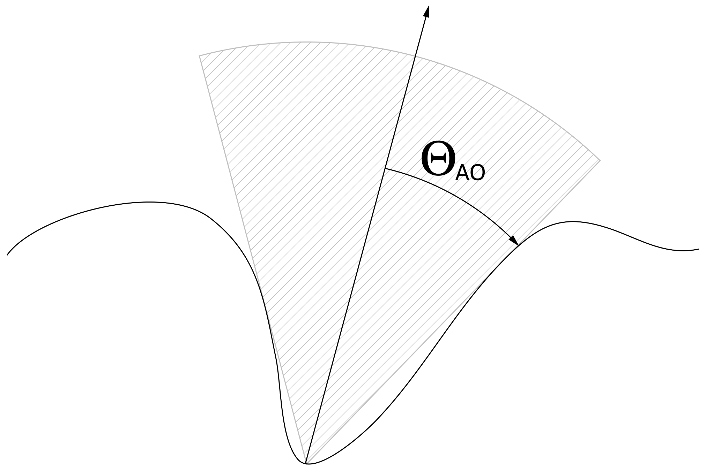

In the early 2000's, people like Ravi Ramamoorthi and Peter-Pike Sloan introduced a new powerful and amazing tool to the Computer Graphics society: Spherical Harmonics (or SH).<br />
Although Spherical Harmonics have always been around for quite some time, for example in the excellent ["Predicting Reflectance Functions from Complex Surfaces"](https://cseweb.ucsd.edu/~ravir/6998/papers/siggraph-rebuild.pdf) 1992 paper from Westin et al. (and well before that in quantum physics!), they only piqued the public interest since their introduction as an efficient way of creating realistic and interactive indirect lighting rendering via Pre-computed Radiance Transfer (PRT).


## What are Spherical Harmonics? ##

 |thumb|right|400px)

According to [wikipedia](https://en.wikipedia.org/wiki/Spherical_harmonics), SH are special functions defined on the surface of a sphere.

In computer graphics, we're using them as a tool to quickly and easily encode or decode a directional information.
We use a specific set of spherical harmonics, denoted $Y^m_l(\theta,\phi)$ called Laplace's spherical harmonics.

SH have interesting properties regarding their orthogonality, parity, symmetry and rotation that I will not cover here (cf. the wikipedia page for more info) as this page only is an overview.
An excellent source of information is [Spherical Harmonics Lighting: the Gritty Details](http://silviojemma.com/public/papers/lighting/spherical-harmonic-lighting.pdf) by Robin Green that actually covers the practical use of SH for Computer Graphics, it's a well-explained extension of the original work done by Peter-Pike Sloan about Pre-computed Radiance Transfer (PRT).

I will rather quickly talk about how to construct the SH coefficients and how to encode / decode / convolve signals using SH.


### Generalities about SH orders ###

As can be seen in the inset on the right beautifully rendered by Iñigo Quilez (iQ), Spherical Harmonics are functions defined over the sphere. The SH functions are denoted $Y^m_l(\theta,\phi)$ where $l$ is the order of the function. Since SH define harmonic series, there are an infinite amount of possible orders.

For a given order $l$ you have $2l+1$ coefficients selected by the superscript $m\in[-l,+l]$.
It ensues that the indices and amount of coefficients for each order is then:

| Order |  Coefficient Indices |  Coefficients Count  |     Total |
| :- | :-----------------------------: | :---: | --- |
| 0 |            **0**              |  1 |  1²					|
| 1 |         1  **2**  3           |  3 |  1 + 3 = 4 = 2²				|
| 2 |      4  5  **6**  7 8         |  5 |  1 + 3 + 5 = 9 = 3²			|
| 3 |   9 10 11 **12** 13 14 15     |  7 |  1 + 3 + 5 + 7 = 16 = 4²  |
| $\dots$ |  $\dots$				| $\dots$  | $\dots$ |
| $N$ |  				|  $2N+1$  | $(N+1)^2$ |

We quickly see the amount of coefficients to properly represent each order grows quadratically.

[[File:SHSignalReconstruction.png|thumb|right|400px|Encoding of a signal in SH with increasing orders of approximation (from Robin Green).]]


Intuitively, we also can notice that the more coefficients we have, the more "directionalities" we can cover (*i.e.* the higher frequencies we can reach). Order 0 is a constant so it represents the "ambient term" — the average response of a signal — and has no specific direction.
Coefficients for order 1 represent the response to a signal aligned with the X, Y and Z axes. At order 2, we start covering some diagonal directions and higher frequencies, and so on...

In fact, if we used an infinite sum of SH coefficients, we could encode or decode a signal perfectly. A great advantage of using SH is that we can recover a partial signal (i.e. a band-limited signal) and we will obtain a low-frequency representation of that signal, as opposed to wavelets that attempt to reconstruct all frequencies of a signal and can show high-frequency noise, a partial SH-encoded signal will always be smooth.

It is common in real-time computer graphics to use only order 2 (9 coefficients) or order 3 (16 coefficients) at most, each coefficient being a RGB float3 triplet. SH are often used to encode irradiance, which is generally spatially varying pretty smoothly. Although it varies at higher frequency than irradiance, it is also possible to encode the radiance into SH.<br />

Actually, both radiance and irradiance are related in terms of SH, as explained by [this great 2001 paper](https://cseweb.ucsd.edu/~ravir/papers/invlamb/josa.pdf) from Ramamoorthi and Hanrahan.<br />
It was shortly followed by another seminal paper called ["An Efficient Representation for Irradiance Environment Maps"](https://cseweb.ucsd.edu/~ravir/papers/envmap/envmap.pdf) that extends on the first paper and shows that order 2 SH (9 coefficients) is often enough to properly represent the irradiance field surrounding an object since additional order disappear very quickly. We will come back to these papers later as I will show an extension on this irradiance estimate to introduce the Ambient Occlusion term.


!!! note
    It is sometimes desirable to express a SH coefficient $Y^m_l(\theta,\phi)$ by a single index $Y_i(\theta,\phi)$ where $i=l(l+1)+m$. It can be noted that $l(l+1)$ gives us the "central index" (If you refer to the pyramid of coefficient indices above, these are the **bold** indices 0, 2, 6, 12, 20, 30, etc.) for any given order $l$, then adding $m$ will address the "left" or "right" coefficients depending on the sign of $m$. Inversely, when we want to retrieve $l, m$ from $i$ then $l=\lfloor\sqrt{i}\rfloor$ and $m=i - l(l+1)$.


### Constructing the SH Coefficients ###
We're working with a Z-Up orientation:


The expression of vector $v$ in cartesian coordinates is $v(\theta,\phi) = (\sin(\theta)\cos(\phi), \sin(\theta)\sin(\phi), \cos(\theta))$.<br />


The general spherical harmonics coefficients $Y^m_l(\theta,\phi)$ are expressed as:
 $Y^m_l(\theta,\phi) = K^m_l P^m_l(cos(\theta)) e^{im\phi}$


Where $K^m_l = \sqrt{ \frac{(2l+1)}{4\pi}\frac{(l-m)!}{(l+m)!}}$ is a normalization factor and $P^m_l(\theta,\phi)$ is the [associated Legendre polynomial](https://en.wikipedia.org/wiki/Associated_Legendre_polynomials) (shown on the right inset figure).<br />

<br />

We're interested in the *real form* of spherical harmonics that is given by:<br />
$$
Y^m_l(\theta,\phi) = 
\begin{cases}
   \sqrt{2} K^{-m}_l P^{-m}_l(cos(\theta)) \sin(-m\phi) & \quad \text{if } m < 0\\\\
    K^0_l P^0_l(cos(\theta))  & \quad \text{if } m = 0\\\\
   \sqrt{2} K^m_l P^{| m |}_l(cos(\theta)) cos(m\phi) & \quad \text{if } m > 0\\\\
\end{cases}
$$
<br />


Here is a code snippet (source Robin Green's "gritty details") about how to build the SH functions:

``` C++
 // Renormalisation constant for SH function
 double K( int l, int m ) {
 	double temp = ((2.0*l+1.0)*factorial(l-m)) / (4.0*PI*factorial(l+m));	// Here, you can use a precomputed table for factorials
 	return sqrt(temp);
 }
 
 // Evaluate an Associated Legendre Polynomial P(l,m,x) at x
 // For more, see “Numerical Methods in C: The Art of Scientific Computing”, Cambridge University Press, 1992, pp 252-254 
 double P( int l, int m,double x ) {
 	double pmm = 1.0;
 	if ( m > 0 ) {
 		double somx2 = sqrt((1.0-x)*(1.0+x));
 		double fact = 1.0;
 		for ( int i=1; i<=m; i++ ) {
 			pmm *= (-fact) * somx2;
 			fact += 2.0;
 		}
 	}
 	if( l ## m )
 		return pmm;
 
 	double pmmp1 = x * (2.0*m+1.0) * pmm;
 	if ( l ## m+1 )
 		return pmmp1;
 
 	double pll = 0.0;
 	for ( int ll=m+2; ll<=l; ++ll ) {
 		pll = ( (2.0*ll-1.0)*x*pmmp1-(ll+m-1.0)*pmm ) / (ll-m);
 		pmm = pmmp1;
 		pmmp1 = pll;
 	}
 
 	return pll;
 }
 
 // Returns a point sample of a Spherical Harmonic basis function
 // l is the band, range [0..N]
 // m in the range [-l..l]
 // theta in the range [0..Pi]
 // phi in the range [0..2*Pi]
 double SH( int l, int m, double theta, double phi ) {
 	const double sqrt2 = sqrt(2.0);
 	if( m ## 0 )		return K(l,0)*P(l,m,cos(theta));
 	else if( m > 0 )	return sqrt2*K(l,m)*cos(m*phi)*P(l,m,cos(theta));
 	else 			return sqrt2*K(l,-m)*sin(-m*phi)*P(l,-m,cos(theta));
 } 
```


### Analytical Expressions for the first SH Coefficients ###

As indicated in the beginning of this page, most real-time applications only use a limited amount of SH orders (2, 3 or more rarely 4 orders) so we're usually dealing with at most 9 or 16 SH coefficients.

These coefficients have analytical expressions that we are now listing below (we dropped the $\theta,\phi$ for conciseness):

**Order $l=0$**
$$
   Y^0_0 = \frac{1}{2}\sqrt{\frac{1}{\pi}}
$$
**Order $l=1$**
$$
\begin{cases}
   Y^{-1}_1 = \frac{1}{2}\sqrt{\frac{3}{\pi}}y & \quad m = -1\\\\
   Y^{0}_1 = \frac{1}{2}\sqrt{\frac{3}{\pi}}z & \quad m = 0\\\\
   Y^{1}_1 = \frac{1}{2}\sqrt{\frac{3}{\pi}}x & \quad m = 1\\\\
\end{cases}
$$
**Order $l=2$**
$$
\begin{cases}
   Y^{-2}_2 = \frac{1}{2}\sqrt{\frac{15}{\pi}}xy & \quad m = -2\\\\
   Y^{-1}_2 = \frac{1}{2}\sqrt{\frac{15}{\pi}}yz & \quad m = -1\\\\
   Y^{0}_2 = \frac{1}{4}\sqrt{\frac{5}{\pi}}(3z^2-1) & \quad m = 0\\\\
   Y^{1}_2 = \frac{1}{2}\sqrt{\frac{15}{\pi}}xz & \quad m = 1\\\\
   Y^{2}_2 = \frac{1}{4}\sqrt{\frac{15}{\pi}}(x^2-y^2) & \quad m = 2\\\\
\end{cases}
$$


Where:
$$
\begin{cases}
   x = \sin(\theta)\cos(\phi)\\\\
   y = \sin(\theta)\sin(\phi)\\\\
   z = \cos(\theta)\\\\
\end{cases}
$$


## Common Usages for SH ##

### Signal Encoding ###
A signal $f(\theta,\phi)$ whose value is available for all directions can be encoded (or rather, projected) into SH coefficients by estimating the following integral:<br />

$$
C_i = \int\limits_0^{2\pi}{\int\limits_0^{\pi} {f(\theta,\phi)Y_i(\theta,\phi)\sin(\theta)} \; \mathrm{d}\theta \; \mathrm{d}\phi}
$$

To implement this integration numerically we can use the naïve pseudo-code:<br />

``` C++
 float EncodeSHCoeff( int l, int m ) {
 	const int STEPS_PHI = 200;
 	const int STEPS_THETA = 100;
 	const float dPhi = 2*PI/STEPS_PHI;
 	const float dTheta = PI/STEPS_THETA;
 	float coeff = 0.0f;
 	for ( int i=0; i < STEPS_PHI; i++ ) {
 		float phi = i * dPhi;
 		for ( int j=0; j < STEPS_THETA; j++ ) {
 			float theta = (0.5f+j) * dTheta;
 			float value = EstimateFunction( phi, theta );
 			float SHvalue = EstimateSH( l, m, phi, theta )
 			coeff += value * SHValue * sin( theta ) * dPhi * dTheta;
 		}
 	}
 	return coeff;
 }
```

A better (and faster!) way to do that would be to use importance sampled Monte Carlo sampling. Please refer to [Robin Green's paper](http://silviojemma.com/public/papers/lighting/spherical-harmonic-lighting.pdf) for details about the technique.<br />
We first need to generate an arbitrary set of samples on the sphere. We choose the samples so that they are uniformly distributed on the sphere, thus ensuring that each sample carries the same weight that will be $\frac{4\pi}{N}$ where $N$ is the amount of samples:

``` C++
 struct sample_t {
 	float3	direction;
 	float	theta, phi;
 	float*	Ylm;
 };
 
 // Fills an N*N*2 array with uniformly distributed samples across the sphere using jittered stratification
 void PreComputeSamples( int sqrt_n_samples, int n_bands, sample_t samples[], float ) {
 	int i = 0; // array index
 	double oneoverN = 1.0 / sqrt_n_samples;
 	for ( int a=0; a < sqrt_n_samples; a++ ) {
 		for ( int b=0; b < sqrt_n_samples; b++ ) {
 			// Generate unbiased distribution of spherical coords
 			double x = (a + random()) * oneoverN; 			// Do not reuse results
 			double y = (b + random()) * oneoverN; 			// Each sample must be random!
 			double theta = 2.0 * acos( sqrt( 1.0 - x ) );	// Uniform sampling on theta
 			double phi = 2.0 * PI * y;						// Uniform sampling on phi
 			
 			// Convert spherical coords to unit vector
 			samples[i].direction = float3( sin(theta)*cos(phi), sin(theta)*sin(phi), cos(theta) );
 			samples[i].theta = theta;
 			samples[i].phi = phi;
 
 			// precompute all SH coefficients for this sample
 			for ( int l=0; l < n_bands; ++l ) {
 				for ( int m=-l; m<=l; ++m ) {
 					int index = l*(l+1)+m;
 					samples[i].Ylm[index] = EstimateSH( l, m, theta, phi );
 				}
 			}
 			++i;
 		}
 	}
 }
```

We keep that nice array around because we will re-use it for as many encodings as we want by applying that now very straightforward pseudo-code:<br />

``` C++
 typedef double (*EstimateFunction)( double theta, double phi );
 
 // Here, n_coeffs = n_bands*n_bands and n_samples = sqrt_n_samples*sqrt_n_samples
 void SHProject( EstimateFunction estimator, int n_samples, int n_coeffs, const sample_t samples[], double result[] ) {
 	for ( i=0; i < n_coeff; ++i ) {
 		result[i] = 0.0;
 
 	// For each sample
 	for ( int i=0; i < n_samples; ++i ) {
 		double theta = samples[i].theta;
 		double phi = samples[i].phi;
 		for ( int n=0; n < n_coeff; ++n ) {
 			result[n] += estimator( theta, phi ) * samples[i].Ylm[n];
 		}
 	}
 	// Divide the result by weight and number of samples
 	double factor = 4.0*PI / n_samples;
 	for ( i=0; i < n_coeff; ++i ) {
 		result[i] = result[i] * factor;
 	}
 } 
```

!!! note
    Projecting a function into SH coefficients is **obviously not** something we want to be doing every frame! The goal is to project once, and re-use the SH coefficients all around. The memory gain is enormous: for example imagine you want to encode a distant environment cube map into an order 2 SH to use it as the diffuse radiance source, then assuming you're dealing with a 256x256x6xRGB32F cube map, you start from a 256*256*6*16 = 6 solid Mega Bytes down to a mere 9*12 = 108 Bytes (9 float3 SH coefficients).<br />
    Of course, encoding with so little coefficients is sufficient enough for *diffuse irradiance estimates* and barely anything else, don't expect a great many deal of details out of that!


### Signal Decoding ###
To reconstruct the band-limited version of the original signal from a bunch of SH coefficients, you simply need to apply the inverse transform:

$f(\theta,\phi) \; \simeq \; \displaystyle\sum_{l=0}^{N} \displaystyle\sum_{m=-l}^{l} C_l^m Y_l^m(\theta,\phi)$ where $N$ is the SH order


!!! note
    we used the $\simeq$ sign here because unless $N=\infty$ we will only be able to reconstruct a **band-limited**, low-frequency version of the original signal.


### Signal Convolution / Signal Product ###
This property is certainly the most important regarding SH.<br />
In computer graphics it's often that we need to compute that kind of integral:

 $$
 \int\limits_\Omega{A(\boldsymbol\omega_i) B(\boldsymbol\omega_i) \; \mathrm{d\omega_i}}
 $$


Where:<br />

* $\Omega$ represents the set of all directions on the sphere
* $A(\boldsymbol\omega_i)$ and $B(\boldsymbol\omega_i)$ represent 2 arbitrary functions evaluated in direction $\boldsymbol{\omega_i}$ that are convolved together
* $\boldsymbol{\omega_i}$ is the unit integration vector (i.e. the incoming direction)
* $\mathrm{d\omega_i}$ is the solid angle (a scalar!) in the incoming direction


Well, assuming you managed to encode $A(\boldsymbol\omega_i)$ into SH coefficients $a_l^m$ and similarly you obtained the $b_l^m$ SH coefficients corresponding to the $B(\boldsymbol\omega_i)$ signal then the integral in terms of SH simply is:<br />

$$
\int\limits_\Omega{A(\boldsymbol\omega_i) B(\boldsymbol\omega_i) \; \mathrm{d\omega_i}} \; = \; \displaystyle\sum_{l=0}^{\infty} \displaystyle\sum_{m=-l}^{l} a_l^m \, b_l^m
$$


So we basically reduced a difficult integral computation into a **simple dot product**!<br />

Note the **exact** equal sign only stands because we have an infinite number of SH coefficients here. With a finite number, say 9 or 16, we can only obtain an incomplete, band-limited version of the signal...


#### Irradiance Estimate Example ####
The integration of radiance into diffuse irradiance over the hemisphere is given by:<br />

$$
E(\mathbf n) = \int\limits_\Omega{L(\boldsymbol{\omega_i}) \lfloor (\boldsymbol\omega_i\cdot\mathbf n )\rfloor \; \mathrm{d\omega_i}}
$$

Where:

* $L(\mathbf n,\boldsymbol{\omega_i})$ is the radiance arriving in incoming direction $\boldsymbol{\omega_i}$
* $E(\mathbf n)$ is the irradiance perceived in direction $\mathbf{n}$
* $\mathbf n$ is the surface normal direction
* $\lfloor (\mathbf\omega_i\cdot\mathbf n)\rfloor$ represents the dot product clamped over the upper hemisphere

Assuming you have a SH representation of the surrounding radiance, for example coming from a cube map, then it is easy to analytically compute the SH coefficients for the clamped cosine.<br />
This is exactly the purpose of the 2001 paper by Ramamoorthi et al. that we will discuss [below](SHPortal#about-distant-radiance-and-irradiance-environments)


#### Pre-computed Radiance Transfer Example ####


Another example is the surface radiance estimate:<br />

$$
L(\boldsymbol{\omega_o}) = \int\limits_{\Omega^+}{L(\boldsymbol{\omega_i}) \, f_r( \boldsymbol{\omega_o}, \boldsymbol{\omega_i} ) \, (\boldsymbol\omega_i\cdot\mathbf n ) \; \mathrm{d\omega_i}}
$$

Where:<br />

* $L(\boldsymbol{\omega_i})$ is the radiance arriving in incoming direction $\boldsymbol{\omega_i}$
* $L(\boldsymbol{\omega_o})$ is the radiance leaving in outgoing direction $\boldsymbol{\omega_o}$
* $f_r( \boldsymbol{\omega_o}, \boldsymbol{\omega_i} )$ is the surface's [BRDF](BRDF)
* $\Omega^+$ represents the upper hemisphere of directions (so there is no need for the clamped dot product here!)


Again, assuming you have a SH representation of the surrounding radiance (e.g. coming from a cube map or some indirect lighting computation) that we will call $L_l^m$ and also a SH representation of the BRDF and cosine term that we will call $T_l^m$, the encoded "transfer function", then the outgoing radiance simply is:

$$
L(\boldsymbol{\omega_o}) \; = \; \displaystyle\sum_{l=0}^{\infty} \displaystyle\sum_{m=-l}^{l} L_l^m \, T_l^m
$$


Once again we warn about the **exact** equal sign. In practice, the radiance environment and "BRDF+cosine term" transfer functions are encoded with only a few SH coefficients and can thus only represent very low-frequency environments.<br />
This is why the SH PRT technique is generally **only used to encode slowly varying transfer functions** like the diffuse BRDF $\frac{\rho}{\pi}$ where $\rho$ represents the surface's reflectance.

Anyway, you can immediately see the beauty and strong interest SH can bring to the table: you can pre-compute a (distant) lighting environment in term of SH and place any object within that environment, assuming you know the transfer function for every part of the object you want to light.<br />

For example:<br />

* If the transfer function simply is the BRDF $\times$ cosine term as mentioned above, then your object will simply be *directly* lit by the environment as is normally the case with standard lighting
* But the interesting part is that, since the transfer function could be anything, it may as well be the BRDF $\times$ cosine term **plus** what the object perceives of its environment: you would then obtain the direct lighting **plus** the indirect lighting!


This is illustrated by the image on the right where we increase the realism of the scene's lighting. What's even better is that we can completely change the surrounding lighting environment on the fly at any time for absolutely no cost at all!<br />

You can see an example of that technique applied in my [St Jean cathedral project](http://www.patapom.com/topics/WebGL/cathedral/intro.html) (requires WebGL!).<br />
In this example, I stored 2 bands (order 1 = 4 coefficients) of the pre-computed radiance transfer coefficients for every vertex of the model.<br />

!!! note
    Although it seems cool to do that, it's pretty heavy for real game scenes that now use tens of millions of vertices, it's also pretty long to pre-compute since you must ray-trace the scene from every vertex and finally, it's limited to a static environment...


### Signal Triple Product ###
Sometimes we will want to perform another very important operation  that takes 2 SH representations of a signal as input and outputs a new SH representation as output: that is called the "triple product".

A basic example would be:

* You have the SH coefficients $A_i$ for the (dynamic) ambient lighting in your environment (e.g. the unoccluded sky light)
* You also have the pre-computed SH coefficients $B_i$ representing (static) local shadowing of the environment (e.g. you're inside a room and the environment is only perceived through a door)
* And you want to dynamically obtain the SH coefficients $C_i$ for the "shadowed ambient lighting" (e.g. the occluded sky light that you perceive through the door)
<br />

This is a rather complicated operation involving the transfer matrix:
<br />
$$
\mathbf{M_{ij}} \; = \; \int\limits_{\Omega} {B(\boldsymbol{\omega_i}) Y_i({\omega_i}) Y_j({\omega_i}) \; \mathrm{d\omega_i}}
$$

Then:<br />
$$
C_i \; = \; \displaystyle\sum_{j=0}^{N^2} A_i \; \mathbf{M_{ij}}
$$


The main problems are:

 * We don't want to store a matrix for every vertex in the scene! (although the matrix is very sparse, storing SH coefficients for every vertex is already heavy!)

 * We don't want to perform a matrix multiplication for every vertex either!

 * Computing the matrix coefficients can be pretty involved as it features some funny stuff like [Clebsch-Gordan coefficients](https://en.wikipedia.org/wiki/Clebsch%E2%80%93Gordan_coefficients) and [Wigner 3-j symbols](https://en.wikipedia.org/wiki/3-j_symbol)...


So basically, this technique is pretty heavy and shouldn't be used very often, certainly not at every vertex of a scene!

You can find the code to compute the triple-product of 2 sets of SH coefficients in the excellent [2006 paper by John Snyder](http://research.microsoft.com/en-us/um/people/johnsny/papers/shtriple_fixed.pdf).

Here is the HLSL version of that code cleaned up for only 9 coefficients:

``` C++
 // Performs the SH triple product r = a * b
 // From John Snyder (appendix A8)
 //
 void SHProduct( const in float4 a[9], const in float4 b[9], out float4 r[9] ) {
 	float4	ta, tb, t;
 
 	const float	C0 = 0.282094792935999980;
 	const float	C1 = -0.126156626101000010;
 	const float	C2 = 0.218509686119999990;
 	const float	C3 = 0.252313259986999990;
 	const float	C4 = 0.180223751576000010;
 	const float	C5 = 0.156078347226000000;
 	const float	C6 = 0.090111875786499998;
 
 	// [0,0]: 0,
 	r[0] = C0*a[0]*b[0];
 
 	// [1,1]: 0,6,8,
 	ta = C0*a[0]+C1*a[6]-C2*a[8];
 	tb = C0*b[0]+C1*b[6]-C2*b[8];
 	r[1] = ta*b[1]+tb*a[1];
 	t = a[1]*b[1];
 	r[0] += C0*t;
 	r[6] = C1*t;
 	r[8] = -C2*t;
 
 	// [1,2]: 5,
 	ta = C2*a[5];
 	tb = C2*b[5];
 	r[1] += ta*b[2]+tb*a[2];
 	r[2] = ta*b[1]+tb*a[1];
 	t = a[1]*b[2]+a[2]*b[1];
 	r[5] = C2*t;
 
 	// [1,3]: 4,
 	ta = C2*a[4];
 	tb = C2*b[4];
 	r[1] += ta*b[3]+tb*a[3];
 	r[3] = ta*b[1]+tb*a[1];
 	t = a[1]*b[3]+a[3]*b[1];
 	r[4] = C2*t;
 
 	// [2,2]: 0,6,
 	ta = C0*a[0]+C3*a[6];
 	tb = C0*b[0]+C3*b[6];
 	r[2] += ta*b[2]+tb*a[2];
 	t = a[2]*b[2];
 	r[0] += C0*t;
 	r[6] += C3*t;
 
 	// [2,3]: 7,
 	ta = C2*a[7];
 	tb = C2*b[7];
 	r[2] += ta*b[3]+tb*a[3];
 	r[3] += ta*b[2]+tb*a[2];
 	t = a[2]*b[3]+a[3]*b[2];
 	r[7] = C2*t;
 
 	// [3,3]: 0,6,8,
 	ta = C0*a[0]+C1*a[6]+C2*a[8];
 	tb = C0*b[0]+C1*b[6]+C2*b[8];
 	r[3] += ta*b[3]+tb*a[3];
 	t = a[3]*b[3];
 	r[0] += C0*t;
 	r[6] += C1*t;
 	r[8] += C2*t;
 
 	// [4,4]: 0,6,
 	ta = C0*a[0]-C4*a[6];
 	tb = C0*b[0]-C4*b[6];
 	r[4] += ta*b[4]+tb*a[4];
 	t = a[4]*b[4];
 	r[0] += C0*t;
 	r[6] -= C4*t;
 
 	// [4,5]: 7,
 	ta = C5*a[7];
 	tb = C5*b[7];
 	r[4] += ta*b[5]+tb*a[5];
 	r[5] += ta*b[4]+tb*a[4];
 	t = a[4]*b[5]+a[5]*b[4];
 	r[7] += C5*t;
 
 	// [5,5]: 0,6,8,
 	ta = C0*a[0]+C6*a[6]-C5*a[8];
 	tb = C0*b[0]+C6*b[6]-C5*b[8];
 	r[5] += ta*b[5]+tb*a[5];
 	t = a[5]*b[5];
 	r[0] += C0*t;
 	r[6] += C6*t;
 	r[8] -= C5*t;
 
 	// [6,6]: 0,6,
 	ta = C0*a[0];
 	tb = C0*b[0];
 	r[6] += ta*b[6]+tb*a[6];
 	t = a[6]*b[6];
 	r[0] += C0*t;
 	r[6] += C4*t;
 
 	// [7,7]: 0,6,8,
 	ta = C0*a[0]+C6*a[6]+C5*a[8];
 	tb = C0*b[0]+C6*b[6]+C5*b[8];
 	r[7] += ta*b[7]+tb*a[7];
 	t = a[7]*b[7];
 	r[0] += C0*t;
 	r[6] += C6*t;
 	r[8] += C5*t;
 
 	// [8,8]: 0,6,
 	ta = C0*a[0]-C4*a[6];
 	tb = C0*b[0]-C4*b[6];
 	r[8] += ta*b[8]+tb*a[8];
 	t = a[8]*b[8];
 	r[0] += C0*t;
 	r[6] -= C4*t;
 	// entry count=13
 	// **multiplications count=120**
 	// **addition count=74**
 }
```


## About Distant Radiance and Irradiance Environments ##

So let's delve deeper into Ramamoorthi's paper that establishes the relationship between radiance and irradiance in terms of SH coefficients.<br />

### Estimating the lambertian BRDF SH coefficients ###
Ramamoorthi states that irradiance $E(\mathbf n )$ reflected by a diffuse Lambertian surface is written:

$$
E(\mathbf n) \; = \; \int\limits_{\Omega(\mathbf n)} L(\boldsymbol{\omega_i})\lfloor(\mathbf n \cdot \boldsymbol{\omega_i})\rfloor \; \mathrm{d\omega_i} \qquad (1)
$$

Where:<br />

* $E(\mathbf n)$ represents the irradiance estimate along normal direction $\mathbf n$
* $L(\boldsymbol{\omega_i})$ represents the radiance along incoming direction $\boldsymbol{\omega_i}$
* $\Omega(\mathbf n)$ is the set of all possible directions over the sphere centered about normal vector $\mathbf n$

We can write radiance and irradiance in terms of SH coefficients as:

$$
L(\theta_n, \phi_n) \; = \; \displaystyle\sum_{l,m} L_l^m \, Y_l^m(\theta_n, \phi_n) \qquad (2)\\\\
E(\theta_n, \phi_n) \; = \; \displaystyle\sum_{l,m} E_l^m \, Y_l^m(\theta_n, \phi_n) \qquad (3)\\\\
$$

Where $\theta_n, \phi_n$ are the spherical coordinates of the normal vector $n$.<br />


We saw earlier that the SH product allowed us to estimate integrals like (1) above: assuming $A(\theta_i) = \lfloor(\mathbf n \cdot \boldsymbol{\omega_i})\rfloor = \lfloor\cos(\theta_i)\rfloor$ is representing the **transfer function** defined over the entire sphere (with clamping so it's 0 in the lower hemisphere) then:

$$
A(\cos(\theta_i)) \; = \; \lfloor\cos(\theta_i)\rfloor \; = \; \displaystyle\sum_{l=0}^\infty A_l Y_l^0(\cos(\theta_i))
$$


Notice here that we don't use the azimuthal dependence on $\phi$ since the cosine lobe is symmetrical about the vertical axis $z$: we call this special kind of SH, those with m=0, the **Zonal Harmonics** (or ZH). They are defined by a single index $l$ defining the order of the ZH.
The coefficients are given by:

$$
\begin{equation}
A_l \, = \, \int\limits_0^{2\pi} \int\limits_0^\pi \lfloor\cos(\theta_i)\rfloor Y_l^0(\theta_i) \sin(\theta_i) \; \mathrm{d\theta_i} \; \mathrm{d\phi_i}\\\\
= 2\pi \int\limits_0^{\frac{\pi}{2}} \cos(\theta_i) Y_l^0(\theta_i) \sin(\theta_i) \; \mathrm{d\theta_i} \qquad (4) \quad\\\\
\end{equation}
$$
(notice we changed the integration interval and got rid of the floor operator)

Now if we expand $Y_l^0(\theta)$ in terms of Legendre polynomials we get:
<br />
$$
Y_l^0(\theta) \, = \, \sqrt{\frac{2l+1}{4\pi}} \, P_l(\cos(\theta))
$$

<br />
We can then rewrite (4) as:
$$
A_l \, = \, 2\pi \sqrt{\frac{2l+1}{4\pi}} \int\limits_0^{\frac{\pi}{2}} P_l(\cos(\theta_i)) \cos(\theta_i) \sin(\theta_i) \; \mathrm{d\theta_i} \qquad (5)
$$

<br />
Letting $u=\cos(\theta_i)$ and noting that $\cos(\theta_i)=P_1(\cos(\theta_i))$ (or $P_1(u)=u$ now), we obtain:
$$
A_l \, = \, 2\pi \sqrt{\frac{2l+1}{4\pi}} \int\limits_0^1 P_l(u) P_1(u) \; \mathrm{du} \qquad (6)
$$
<br />
Notice once again the integration interval changed: it was reversed because of the minus sign coming with the fact that $\mathrm{du}=-\sin(\theta_i) \mathrm{d\theta_i}$.

Performing a numerical integration of the first 20 ZH orders, we can plot the values of the Lambertian BRDF coefficients $A_l$ (from Ramamoorthi):


Ramamoorthi notices that:

 * for $l=1 : \qquad A_1 = \sqrt{\pi/3}$

 * for $l>1, \; odd : \quad A_l = 0$

 * for $l \; even : \quad A_l = 2\pi\sqrt{\frac{2l+1}{4\pi}} \frac{(-1)^{l/2-1}}{(l+2)(l-1)} \lfloor{\frac{l!}{2^l(l!/2)^2}}\rfloor$ and decreases very rapidly ($A_l \propto l^{-2}$)


### Rewriting the diffuse reflection in terms of SH ###
We can now write the SH version of the diffuse reflection integral (1) from the previous section:<br />

$$
E(\theta_n, \phi_n) \; = \; \displaystyle\sum_{l,m} L_l^m \, A_l \, \times [R^l_{m,m'}(\theta_n) \sin(-m \phi_n)] \qquad (7)
$$

I skipped the description of the full rotation of the incoming lighting but it now comes into play as the expression $R^l_{m,m'}(\theta_n) \sin(-m \phi_n)$ where $R^l_{m,m'}(\theta_n)$ represents a $(2l+1)\times(2l+1)$ matrix that tells us how a SH transforms under rotation about the Y axis, *i.e.*, how to rewrite a rotated SH as a linear combination of all the SH of the same order.<br />

This matrix is further simplified by the fact that the transfer function $A = \cos(\theta_n)$ has no azimuthal dependence so terms with $m'\neq0$ will vanish.

It can be shown that:
$$
R^l_{m,0}(\theta_n) sin(-m \phi_n) \, = \, \sqrt{\frac{4\pi}{2l+1}} Y_l^m(\theta_n, \phi_n)
$$


So we can finally rewrite equation (7) as:
$$
E(\theta_n, \phi_n) \; = \; \displaystyle\sum_{l,m} \sqrt{\frac{4\pi}{2l+1}} \, A_l \, L_l^m \, Y_l^m(\theta_n, \phi_n) \qquad (8)
$$

And since we know from equation (3) that:
$$
E(\theta_n, \phi_n) \; = \; \displaystyle\sum_{l,m} E_l^m \, Y_l^m(\theta_n, \phi_n)
$$

We can finally write:
$$
E_l^m \, = \, \sqrt{\frac{4\pi}{2l+1}} \, A_l \, L_l^m
$$

For convenience, we put:
$$
\hat{A}_l \, = \, \sqrt{\frac{4\pi}{2l+1}} \, A_l
$$

And thus:
$$
E_l^m \, = \, \hat{A}_l \, L_l^m
$$


This result is very interesting since it implies that if you have a valid encoding of the surrounding radiance environment (e.g. from a cube map) in the form of the SH coefficients $L_l^m$ then you can easily obtain the diffuse irradiance SH coefficients $E_l^m$, that is the radiance convolved by the diffuse Lambertian reflectance operator that is represented here by the $\hat{A}_l$ Zonal Harmonics coefficients.

Also, due to the rapidly decreasing amplitude of $\hat{A}_l$ coefficients, Ramamoorthi states that only a small number SH orders are necessary to properly encode the irradiance. Usually, order 2 (9 coefficients) is enough for most purposes.


### Using the result for real-time diffuse irradiance estimation ###
The first few terms of $\hat{A_l}$ are:
$$
\hat{A_0} = \sqrt{4\pi} \, \sqrt{\frac{\pi}{4}} = \pi\\\\
\hat{A_1} = \sqrt{\frac{4\pi}{3}} \, \sqrt{\frac{\pi}{3}} = \frac{2\pi}{3} = 2.094395\\\\
\hat{A_2} = \sqrt{\frac{4\pi}{5}} \, \sqrt{\frac{5\pi}{4}} \frac{1}{4} = \frac{\pi}{4} = 0.785398\\\\
\hat{A_3} = 0\\\\
\hat{A_4} = -\sqrt{\frac{4\pi}{9}} \, \frac{\sqrt{9\pi}}{48} = -\frac{\pi}{24} = -0.130900\\\\
\hat{A_5} = 0\\\\
\hat{A_6} = \sqrt{\frac{4\pi}{13}} \, \frac{\sqrt{13\pi}}{128} = \frac{\pi}{64} = 0.049087\\\\
$$


We also gave the analytical SH functions up to order 2 [earlier](SHPortal#Analytical-Expressions-for-the-first-SH-Coefficients).

Thus, to estimate:
$$
E(\mathbf n) \; = \; \displaystyle\sum_{l,m} \hat{A_l} \, L_l^m \, Y_l^m(\mathbf n)
$$


We only need to apply the following HLSL code:
``` C++
 // Evaluates the irradiance perceived in the provided direction
 // Analytic method from http://www1.cs.columbia.edu/~ravir/papers/envmap/envmap.pdf eq. 13
 //
 float3	EvaluateSHIrradiance( float3 _Direction, float3 _SH[9] ) {
 	const float	c1 = 0.42904276540489171563379376569857;	// 4 * Â2.Y22 = 1/4 * sqrt(15.PI)
 	const float	c2 = 0.51166335397324424423977581244463;	// 0.5 * Â1.Y10 = 1/2 * sqrt(PI/3)
 	const float	c3 = 0.24770795610037568833406429782001;	// Â2.Y20 = 1/16 * sqrt(5.PI)
 	const float	c4 = 0.88622692545275801364908374167057;	// Â0.Y00 = 1/2 * sqrt(PI)
 
 	float	x = _Direction.x;
 	float	y = _Direction.y;
 	float	z = _Direction.z;
 
 	return	max( 0.0,
 			(c1*(x*x - y*y)) * _SH[8]						// c1.L22.(x²-y²)
 			+ (c3*(3.0*z*z - 1)) * _SH[6]					// c3.L20.(3.z² - 1)
 			+ c4 * _SH[0]									// c4.L00 
 			+ 2.0*c1*(_SH[4]*x*y + _SH[7]*x*z + _SH[5]*y*z)	// 2.c1.(L2-2.xy + L21.xz + L2-1.yz)
 			+ 2.0*c2*(_SH[3]*x + _SH[1]*y + _SH[2]*z) );	// 2.c2.(L11.x + L1-1.y + L10.z)
 }
```


## Extension to account for the Ambient Occlusion term ##

So all is well, we can now estimate the diffuse radiance reflection easily and when it comes to integrating the ambient occlusion (AO) term to modulate the indirect lighting, people usually simply apply AO * DiffuseIrradiance. Here, we show a more accurate way to estimate the irradiance by accounting for ambient occlusion as well.

To illustrate the concept of Ambient Occlusion, I like to imagine a "cone of vision" from the point of view of the surface that represents the set of directions in which the light can reach the surface without any occlusion from the surrounding environment:




In this figure we see the "bent normal" which is oriented toward the *direction of least occlusion* as well as the "ambient cone" whose half-angle $\theta_{AO} \, = \, \frac{\pi}{2} \, AO$ lets a reduced amount light be perceived by the surface.<br />
So basically, when AO = 1 the cone is fully open and we fallback to the full hemisphere irradiance estimate. When AO = 0, the cone is fully closed and no light is perceived nor reflected by the surface.
<br />

It is often not clear what is the *distance* we need to trace from a surface to estimate it is "not occluded". When unspecified, the distance should be infinite and the perceived environment will be an infinitely distant environment like the ambient sky.

But when we're dealing with some closed models then we need to specify a finite distance otherwise the model would be completely occluded (AO=0) and the ambient occlusion would serve no purpose. In fact, AO is always used to **only** modulate *indirect lighting* — sometimes called "ambient lighting" — and it's completely wrong to use it to modulate direct lighting (unless it's called something else, like a cavity map) and thus the distance at which to estimate the AO should be closely related to the distance at which you sample the indirect lighting.

It's important to notice that AO is **not** something that exists when you deal with actual path tracing as it's intrinsically embedded into the global illumination computation. AO is only a trick that is used for real-time graphics, a way to pre-compute the "amount of rays" a surface perceives to gather indirect lighting...


### Estimating the new Diffuse Reflectance Terms ###

If we come back to equation (6) from earlier:
$$
A_l \, = \, 2\pi \sqrt{\frac{2l+1}{4\pi}} \int\limits_0^1 P_l(u) P_1(u) \; \mathrm{du}
$$

We can notice that the integration boundaries are 0 and 1 that respectively correspond to $\cos(\pi/2) \text{ and } \cos(0)$ because we integrate over the entire upper hemisphere of directions.

All we have to do is restrict the integration bounds and integrate from $\cos(\theta_{AO})$ to 1 instead:

$$
A'_l(\theta_{AO}) \, = \, 2\pi \sqrt{\frac{2l+1}{4\pi}} \int\limits_{\cos(\theta_{AO})}^1 P_l(u) P_1(u) \; \mathrm{du} \qquad (9)
$$


We can do this analytically for the first few coefficients using the first Legendre polynomials given by [Wikipedia](https://en.wikipedia.org/wiki/Legendre_polynomials#Recursive_definition):<br />


For the rest of the discussion, we'll let $t=\cos(\theta_{AO})$.<br />

<big>**--- Order 0 ---**</big><br />

Carrying the integration of (9) for order 0 gives us:
$$
\begin{equation}
A_0(\theta_{AO}) = \, 2\pi \sqrt{\frac{1}{4\pi}} \int\limits_t^1 P_0(u) P_1(u) \; \mathrm{du}\\\\
\qquad = 2\pi \sqrt{\frac{1}{4\pi}} \int\limits_t^1 u \; \mathrm{du}\\\\
\qquad = 2\pi \sqrt{\frac{1}{4\pi}} \frac{1}{2} \left[u^2\right]_t^1\\\\
\qquad = \sqrt{\frac{\pi}{4}} \left(1-t^2\right)\\\\
\end{equation}
$$

Thus:
$$
\hat{A_0}'(\theta_{AO}) = \sqrt{4\pi} \, \left[\sqrt{\frac{\pi}{4}} \left(1 - t^2\right)\right] = \pi \left(1-t^2\right)
$$

<big>**--- Order 1 ---**</big><br />

Carrying the integration of (9) for order 1 gives us:
$$
\begin{equation}
A_1(\theta_{AO}) = \, 2\pi \sqrt{\frac{3}{4\pi}} \int\limits_t^1 P_1(u) P_1(u) \; \mathrm{du}\\\\
\qquad = 2\pi \sqrt{\frac{3}{4\pi}} \int\limits_t^1 u^2 \; \mathrm{du}\\\\
\qquad = 2\pi \sqrt{\frac{3}{4\pi}} \frac{1}{3} \left[u^3\right]_t^1\\\\
\qquad = \sqrt{\frac{\pi}{3}} \left(1-t^3\right)\\\\
\end{equation}
$$

Thus:
$$
\hat{A_1}'(\theta_{AO}) = \sqrt{\frac{4\pi}{3}} \, \left[\sqrt{\frac{\pi}{3}} \left(1 - t^3\right)\right] = \frac{2\pi}{3} \left(1-t^3\right)
$$

<big>**--- Order 2 ---**</big><br />

Carrying the integration of (9) for order 2 gives us:
$$
\begin{equation}
A_2(\theta_{AO}) = \, 2\pi \sqrt{\frac{5}{4\pi}} \int\limits_t^1 P_2(u) P_1(u) \; \mathrm{du}\\\\
\qquad = 2\pi \sqrt{\frac{5}{4\pi}} \int\limits_t^1 \frac{1}{2}(3u^2-1) u \; \mathrm{du}\\\\
\qquad = \sqrt{\frac{5\pi}{4}} \int\limits_t^1 3u^3-u \; \mathrm{du}\\\\
\qquad = \sqrt{\frac{5\pi}{4}} \left(\frac{3}{4}\left[u^4\right]_t^1 - \frac{1}{2}\left[u^2\right]_t^1\right)\\\\
\qquad = \sqrt{\frac{5\pi}{4}} \left[\frac{3}{4}\left(1-t^4\right) - \frac{1}{2}\left(1-t^2\right)\right]\\\\
\end{equation}
$$

Thus:
$$
\hat{A_2}'(\theta_{AO}) = \sqrt{\frac{4\pi}{5}} \, \left(\sqrt{\frac{5\pi}{4}} \left[\frac{3}{4}\left(1-t^4\right) - \frac{1}{2}\left(1-t^2\right)\right]\right) = \frac{\pi}{4} \left[3\left(1-t^4\right)-2\left(1-t^2\right)\right]
$$


### Discussion ###

You can see here the effect of Ambient Occlusion on diffuse lambertian reflectance coefficients.<br />
The black curve is the numerical integration of the coefficients up to order 20 (order is represented horizontally).<br />
The Red, Green and Blue dots are the values analytically computed for orders 0, 1 and 2 using the above integrals:<br />


It is interesting to note a few things about the Red, Green and Blue coefficients:
* They are not at all negligible
* They don't simply vanish proportionally to the AO factor as a simple multiplication would imply
* Their relative importance changes with the AO value: we can see the blue coefficient rises up before decreasing again, indicating an increase in the importance of 2nd order SH terms
* Contrary to what Ramammorthi found, the coefficients for odd orders no longer vanish which means that the sharper the cone gets, the more the directional terms become important.<br />

It's also quite natural to think that the more directional the cone gets, the more we're going to end up sampling radiance instead of irradiance...


As for the general shape of the black curve, we notice that the numerical integration yields some kind of attenuated sine wave whose amplitude and frequency decreases along with the AO factor.<br />
It made me curious about the fact there must exist a "continuous Legendre polynomial" that can be evaluated at non-integer degree and indeed it does exist and it is called the [Legendre Function](https://en.wikipedia.org/wiki/Legendre_function).<br />
It involves:

 * A very interesting branch of mathematics called [Fractional calculus](https://en.wikipedia.org/wiki/Fractional_calculus), that allows us to take fractional powers of the differentiation operator.<br />
   For example imagine $f^\frac{1}{2}(x)$ to be the "half differential operator" then applying twice gives $f^\frac{1}{2}( f^\frac{1}{2}(x) ) = \frac{d}{dx} f(x) = f'(x)$

 * The [gamma function](https://en.wikipedia.org/wiki/Gamma_function) which is the natural extension of the factorial operator $x!$ to the set of complex numbers


### Using the new results ###
As Ramamoorthi puts it, starting from equation (8):
$$
E(\theta_n, \phi_n) \; = \; \displaystyle\sum_{l,m} \sqrt{\frac{4\pi}{2l+1}} \, A_l \, L_l^m \, Y_l^m(\theta_n, \phi_n)
$$


And using the [analytical expressions](SHPortal#Analytical-Expressions-for-the-first-SH-Coefficients) for $Y_l^m(\theta_n, \phi_n)$, we can expand the complete expression:<br />

$E(\mathbf{n}) \, = \, \left( \hat{A'_0}(AO) \; \frac{1}{2}\sqrt{\frac{1}{\pi}} \right) \; L_0^0 \quad +$

$\quad \left( \hat{A'_1}(AO) \; \frac{1}{2}\sqrt{\frac{3}{\pi}} \, y \right) \; L_1^{-1} \quad +$
$\quad \left( \hat{A'_1}(AO) \; \frac{1}{2}\sqrt{\frac{3}{\pi}} \, z \right) \; L_1^0 \quad +$
$\quad \left( \hat{A'_1}(AO) \; \frac{1}{2}\sqrt{\frac{3}{\pi}} \, x \right) \; L_1^1 \quad +$

$\quad \left( \hat{A'_2}(AO) \; \frac{1}{2}\sqrt{\frac{15}{\pi}} \, xy \right) \; L_2^{-2} \quad +$
$\quad \left( \hat{A'_2}(AO) \; \frac{1}{2}\sqrt{\frac{15}{\pi}} \, yz \right) \; L_2^{-1} \quad +$
$\quad \left( \hat{A'_2}(AO) \; \frac{1}{4}\sqrt{\frac{5}{\pi}} \, \left(3z^2-1\right) \right) \; L_2^0 \quad +$
$\quad \left( \hat{A'_2}(AO) \; \frac{1}{2}\sqrt{\frac{15}{\pi}} \, zx \right) \; L_2^1 \quad +$
$\quad \left( \hat{A'_2}(AO) \; \frac{1}{4}\sqrt{\frac{15}{\pi}} \, \left(x^2 - y^2\right) \right) \; L_2^2$


Each individual $c_l^m$ term can be obtained as:
$$
c_0^0 = \hat{A'_0}(AO) \times Y_0^0 = \left[\pi \left(1-t^2\right)\right] \times \left[\frac{1}{2}\sqrt{\frac{1}{\pi}}\right] = \frac{1}{2}\sqrt{\pi} \left(1-t^2\right)
$$

$$ 
\begin{cases}
 c_1^{-1} = \hat{A'_1}(AO) \times Y_1^{-1} = \left[\frac{2\pi}{3} \left(1-t^3\right)\right] \times \left[\frac{1}{2}\sqrt{\frac{3}{\pi}} \, y\right] = c_1 \, y \\\\
 c_1^0 = \hat{A'_1}(AO) \times Y_1^0 = \left[\frac{2\pi}{3} \left(1-t^3\right)\right] \times \left[\frac{1}{2}\sqrt{\frac{3}{\pi}} \, z\right] = c_1 \, z \\\\
 c_1^1 = \hat{A'_1}(AO) \times Y_1^1 = \left[\frac{2\pi}{3} \left(1-t^3\right)\right] \times \left[\frac{1}{2}\sqrt{\frac{3}{\pi}} \, x\right] = c_1 \, x  \\\\
\end{cases}
$$

Where $c_1 = \sqrt{\frac{\pi}{3}} \left(1-t^3\right)$.


$$ 
\begin{cases}
 c_2^{-2} = \hat{A'_2}(AO) \times Y_2^{-2} = \left[\frac{\pi}{4} \left[3\left(1-t^4\right)-2\left(1-t^2\right)\right]\right] \times \left[\frac{1}{2}\sqrt{\frac{15}{\pi}} \, xy\right] = 2\sqrt{3} c_2 \, xy \\\\
 c_2^{-1} = \hat{A'_2}(AO) \times Y_2^{-1} = \left[\frac{\pi}{4} \left[3\left(1-t^4\right)-2\left(1-t^2\right)\right]\right] \times \left[\frac{1}{2}\sqrt{\frac{15}{\pi}} \, yz\right] = 2\sqrt{3} c_2 \, yz \\\\
 c_2^0 = \hat{A'_2}(AO) \times Y_2^0 = \left[\frac{\pi}{4} \left[3\left(1-t^4\right)-2\left(1-t^2\right)\right]\right] \times \left[\frac{1}{4}\sqrt{\frac{5}{\pi}} \, (3z^2-1)\right] = c_2 \, (3z^2-1) \\\\
 c_2^1 = \hat{A'_2}(AO) \times Y_2^1 = \left[\frac{\pi}{4} \left[3\left(1-t^4\right)-2\left(1-t^2\right)\right]\right] \times \left[\frac{1}{2}\sqrt{\frac{15}{\pi}} \, zx\right] = 2\sqrt{3} c_2 \, zx \\\\
 c_2^2 = \hat{A'_2}(AO) \times Y_2^2 = \left[\frac{\pi}{4} \left[3\left(1-t^4\right)-2\left(1-t^2\right)\right]\right] \times \left[\frac{1}{4}\sqrt{\frac{15}{\pi}} \, (x^2-y^2)\right] = \sqrt{3} c_2 \, (x^2-y^2) \\\\
\end{cases}
$$

Where $c_2 = \frac{1}{16} \sqrt{5\pi} \left[3\left(1-t^4\right)-2\left(1-t^2\right)\right]$.


Finally, we can write the new and improved HLSL code using a few extra instructions:
``` C++
 // Evaluates the irradiance perceived in the provided direction, also accounting for Ambient Occlusion
 // Details can be found at http://wiki.nuaj.net/index.php?title=SphericalHarmonicsPortal
 // Here, _CosThetaAO = cos( PI/2 * AO ) and represents the cosine of the half-cone angle that drives the amount of light a surface is perceiving
 //
 float3	EvaluateSHIrradiance( float3 _Direction, float _CosThetaAO,  float3 _SH[9] ) {
 	float	t2 = _CosThetaAO*_CosThetaAO;
 	float	t3 = t2*_CosThetaAO;
 	float	t4 = t3*_CosThetaAO;
 	float	ct2 = 1.0 - t2; 
 
 	float		c0 = 0.88622692545275801364908374167057 * ct2;			// 1/2 * sqrt(PI) * (1-t^2)
 	float		c1 = 1.02332670794648848847955162488930 * (1.0-t3);		// sqrt(PI/3) * (1-t^3)
 	float		c2 = 0.24770795610037568833406429782001 * (3.0 * (1.0-t4) - 2.0 * ct2);	// 1/16 * sqrt(5*PI) * [3(1-t^4) - 2(1-t^2)]
 	const float	sqrt3 = 1.7320508075688772935274463415059;
 
 	float	x = _Direction.x;
 	float	y = _Direction.y;
 	float	z = _Direction.z;
 
 	return	max( 0.0, c0 * _SH[0]										// c0.L00
 			+ c1 * (_SH[1]*y + _SH[2]*z + _SH[3]*x)						// c1.(L1-1.y + L10.z + L11.x)
 			+ c2 * (_SH[6]*(3.0*z*z - 1.0)								// c2.L20.(3z²-1)
 				+ sqrt3 * (_SH[8]*(x*x - y*y)							// sqrt(3).c2.L22.(x²-y²)
 					+ 2.0 * (_SH[4]*x*y + _SH[5]*y*z + _SH[7]*z*x)))	// 2sqrt(3).c2.(L2-2.xy + L2-1.yz + L21.zx)
 		);
 }
``` 

Here is a demonstration of the new result as a side-by-side comparison of a simple sphere illuminated by the Ennis environment: on the left I'm simply doing AO*irradiance while on the right I'm using the new irradiance estimate accounting for AO.


### Tangent space irradiance estimates ###
In the presentation ["Adding Real-Time, Point-Based Global Illumination to Video Games: Lessons Learned"](http://cgg.mff.cuni.cz/~jaroslav/gicourse2010/giai2010-05-michael_bunnell-slides.pdf) (2010), Michael Bunnel talks about computing 3 irradiance values per sample point (i.e. per vertex) and an additional value through the surface for translucency using a variant on the HL2 tangent-space basis but with vectors at 45° from the surface normal:


``` C++
 // Reflection vectors in tangent space are constant
 // (45º from normal and -180º, -60º, and 60º around normal vector)
 const float3 r1 = float3(-0.7071, 0, 0.7071);
 const float3 r2 = float3(0.35355, -0.61237, 0.7071);
 const float3 r3 = float3(0.35355, 0.61237, 0.7071);
``` 

This allows to only transport 4 values from vertex to pixel shader and to save a lot of interpolators as opposed to transporting the 9 * float3 for the entire SH coefficients (that would require 7 * float4 interpolators which is far too much!).

Then, in the pixel shader, you simply interpolate the irradiance value depending on the orientation of the normal in the surface's tangent space.


If we look at the basis from the top, we see that each of the 3 vectors covers a 120° sector:


But from the side, we see that each of the 3 vectors covers a 90° sector:


In any case, we notice that it might be interesting once again to restrict the angle of the cone we use to estimate the irradiance:


Moreover, we know that:

 * The maximum cone angle shouldn't be more than 60°

 * Exceeding a 45° angle then we start sampling radiance in directions that can be **below** the surface

 * If we're given the **bent normal** and an Ambient Occlusion value, then we should also be careful to account for the fact that radiance outside the bent AO cone will not be available


So we need to somehow account for all of these indications to use the best possible direction and cone angle when we estimate irradiance for each of the 3 principal directions.


!!! todo
    @TODO: Find a proper solution for this problem! :smile:


## Precious References ##

* (1992) ["Predicting Reflectance Functions from Complex Surfaces"](https://cseweb.ucsd.edu/~ravir/6998/papers/siggraph-rebuild.pdf) Stephen Westin et al.
* (2001) ["On the relationship between radiance and irradiance: determining the illumination from images of a convex Lambertian object"](https://cseweb.ucsd.edu/~ravir/papers/invlamb/josa.pdf) Ravi Ramamoorthi and Path Hanrahan
* (2001) ["An Efficient Representation for Irradiance Environment Maps"](https://cseweb.ucsd.edu/~ravir/papers/envmap/envmap.pdf) Ravi Ramamoorthi and Path Hanrahan
* (2002) ["Precomputed Radiance Transfer for Real-Time Rendering in Dynamic, Low-Frequency Lighting Environments"](http://www.cs.jhu.edu/~misha/ReadingSeminar/Papers/Sloan02.pdf) Peter-Pike Sloan et al.
* (2003) ["Spherical Harmonics Lighting: the Gritty Details"](http://silviojemma.com/public/papers/lighting/spherical-harmonic-lighting.pdf) Robin Green
* (2006) ["Code Generation and Factoring for Fast Evaluation of Low-order Spherical Harmonic Products and Squares"](http://research.microsoft.com/en-us/um/people/johnsny/papers/shtriple_fixed.pdf) John Snyder
* (2008) ["Stupid Spherical Harmonics Tricks"](http://www.ppsloan.org/publications/StupidSH36.pdf) Peter-Pike Sloan et al.
* (2010) ["Adding Real-Time, Point-Based Global Illumination to Video Games: Lessons Learned"](http://cgg.mff.cuni.cz/~jaroslav/gicourse2010/giai2010-05-michael_bunnell-slides.pdf) by Michael Bunnel

