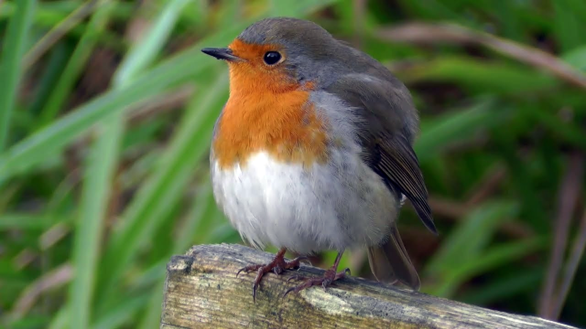

My name is Benoît Mayaux *a.k.a. Patapom*, I'm a French programmer interested in everything, especially the stuff that interests me.

I have specialized in rendering for many years now. I worked for these companies:

 * Heliogames / Dôki Denki (Lyon, FR), from 1998 to 2004 where I worked on *Winnie the Pooh* and *Peter Pan* Disney licences
 * Climax (Portsmouth, UK) in 2004 and 2005 where I worked on a custom engine
 * Widescreen Games (Lyon, FR) from 2006 to 2009 where I worked on a custom engine and tool suite

I have been an independent contractor from 2009 to present, during which I wrote the [Nuaj'](www.nuaj.net) cloud rendering package for the Unity 3D engine.

I also did some contracting for the following companies:

 * [Allegorithmics](https://www.allegorithmic.com/) where I worked on the integration of Substance into the Unity 3D engine
 * [Autodesk](https://www.autodesk.com/) (Montréal) where I worked on the *Flame* video suite
 * [Ubi Soft](https://www.ubisoft.com) (Montréal) where I helped porting my Nuaj' cloud system to some undisclosed project
 * [Arkane Studio](https://www.arkane-studios.com/uk/index.php) where I rewrote a good part of the lighting pipeline and provided the indirect lighting solution for the game *"Dishonored 2"*

 
I like photography, art, natural language processing, science, cooking, history, philosophy, politics, nature, watching birds and all sorts of animals.

My totem animal is the otter although I choose to be reincarnated as a Red Robin.

