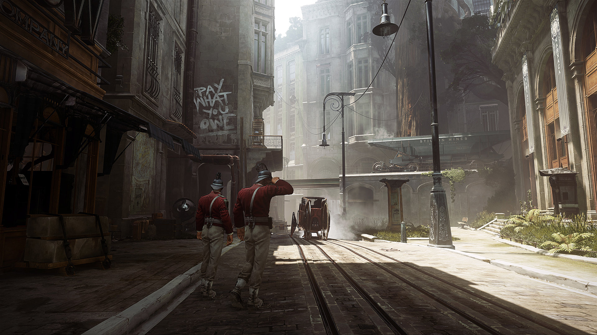
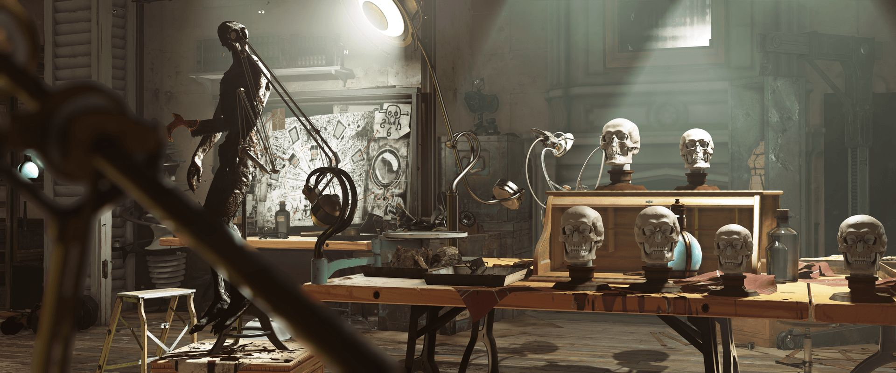
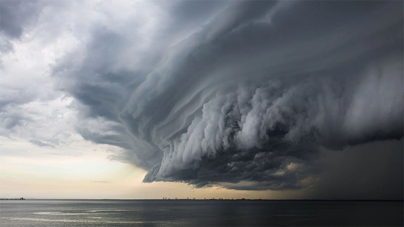
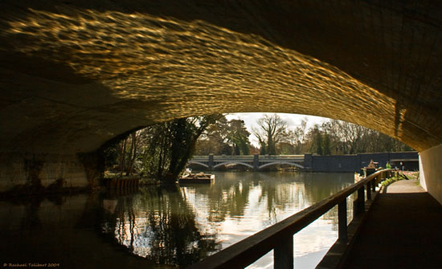

# Welcome to the PataBlog!

You will find mostly articles about math and rendering.

I specialize in lighting, from the microscopic [BRDF](BRDF) to the macroscopic interactive indirect lighting simulation in 3D scenes.

(images from the game *"Dishonored 2"*, [Arkane Studio](https://www.arkane-studios.com/uk/index.php))

I :heart: every light-related phenomenon, from emission to scattering, interaction and perception. The beautiful intricacies of matter playing with photons, often in mysterious ways, yielding the most jaw-dropping patterns and colors.

# Papers

* 2018, January ["Improved Ambient Occlusion (study notes)"](https://drive.google.com/file/d/1SyagcEVplIm2KkRD3WQYSO9O0Iyi1hfy/view?usp=sharing)

* 2018, March ["Horizon-Based Indirect Lighting"](https://drive.google.com/file/d/1fmceYuM5J2s8puNHZ9o4OF3YjqzIvmRR/view?usp=sharing)
